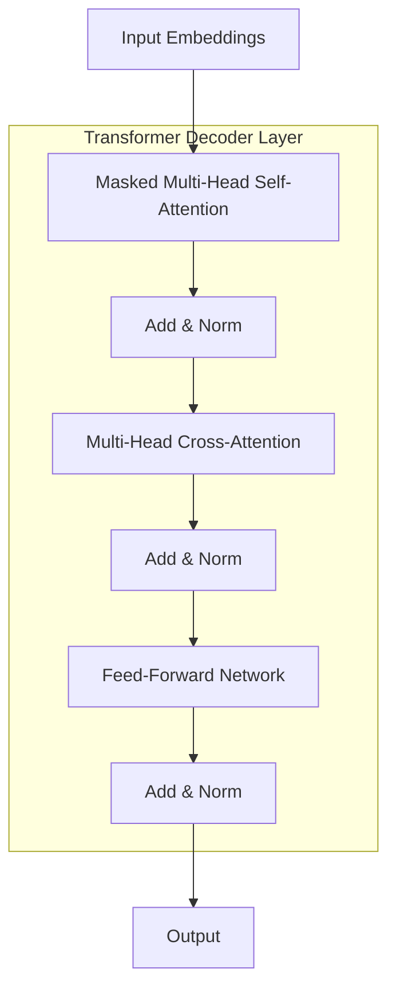

# 大语言模型原理基础与前沿 解码策略

## 1. 背景介绍

### 1.1 大语言模型的兴起

近年来,自然语言处理(NLP)领域取得了长足的进步,很大程度上归功于大型神经网络语言模型的出现。传统的NLP系统通常依赖于手工设计的特征和规则,难以捕捉语言的复杂性和多样性。而大型神经网络模型能够从海量语料中自动学习语言的统计规律,并对各种NLP任务产生强大的表现能力。

大语言模型(Large Language Model,LLM)是一类基于自注意力机制(Self-Attention)和Transformer架构训练的庞大神经网络模型。它们在通用文本语料上进行无监督预训练,学习捕获语言的上下文语义和长程依赖关系。经过大规模预训练后,这些模型可以对下游NLP任务(如文本生成、问答、机器翻译等)进行微调,从而显著提升性能。

### 1.2 大语言模型的关键技术

大语言模型的核心技术可归纳为以下几个方面:

1. **自注意力机制(Self-Attention)**:通过计算序列中每个位置与其他位置的相关性,捕获长程依赖关系,是Transformer模型的核心组件。
2. **位置编码(Positional Encoding)**:为序列中的每个位置赋予独特的位置信息,使模型能够捕捉词序信息。
3. **多头注意力(Multi-Head Attention)**:将注意力分成多个子空间,分别关注输入的不同子空间表示,最后将它们融合。
4. **层归一化(Layer Normalization)**:加速训练收敛,提高模型性能。
5. **残差连接(Residual Connection)**:通过跨层连接,有效缓解了梯度消失/爆炸问题。

凭借上述技术创新,大语言模型展现出了强大的语言理解和生成能力,在诸多NLP任务上取得了人类水平的表现,推动了人工智能的发展。

## 2. 核心概念与联系

### 2.1 自回归语言模型

大语言模型的核心是自回归语言模型(Autoregressive Language Model),它旨在学习语言序列的联合概率分布:

$$P(x_1, x_2, ..., x_n) = \prod_{t=1}^{n}P(x_t|x_1, ..., x_{t-1})$$

其中$x_t$表示序列的第t个token。自回归语言模型通过最大化训练语料库上的对数似然,来学习该联合概率分布的参数。

在生成任务中,自回归模型需要根据之前生成的tokens,预测当前token的概率分布,并从中采样得到下一个token。这个过程被称为解码(Decoding),是大语言模型生成过程的核心环节。

### 2.2 生成策略

解码策略决定了模型如何从预测的概率分布中选择下一个token。常见的解码策略包括:

1. **贪婪搜索(Greedy Search)**: 始终选择概率最大的token。
2. **Beam Search**: 在每个时间步,保留概率最大的k个候选序列(beam),剪枝其余候选项。
3. **Top-k采样(Top-k Sampling)**: 从概率分布的前k个token中随机采样。
4. **温度采样(Temperature Sampling)**: 将概率分布的logits除以一个温度系数,使其更加平坦或更加尖锐。
5. **nucleus采样(Nucleus Sampling)**: 从概率分布的前p%的tokens中随机采样,也称为top-p采样。

不同的解码策略在生成质量、多样性、计算效率等方面有不同的权衡。选择合适的策略对于发挥大语言模型的最大潜力至关重要。

### 2.3 生成质量评估

评估生成质量是大语言模型研究的一个重要课题。常用的评估指标包括:

1. **困惑度(Perplexity)**: 衡量模型对语料库的概率建模能力。
2. **BLEU分数**: 通过比较生成文本与参考文本的n-gram重叠程度来评估质量。
3. **ROUGE分数**: 基于n-gram、最长公共子序列等方法,评估生成文本与参考文本的相似性。
4. **BERTScore**: 使用预训练的BERT模型,计算生成文本与参考文本的语义相似度。

除了自动评估指标,人工评估也是评判生成质量的重要手段。通过设计人工评分任务,可以更全面地评估生成文本的多个维度,如语义一致性、连贯性、多样性等。

## 3. 核心算法原理具体操作步骤

### 3.1 Transformer解码器

Transformer解码器是大语言模型生成过程的核心组件。它由多个相同的解码器层堆叠而成,每一层包含以下子层:

1. **掩码多头自注意力(Masked Multi-Head Self-Attention)**:计算当前位置与之前位置token的注意力权重,掩码确保不会关注未来的token。
2. **多头交叉注意力(Multi-Head Cross-Attention)**:计算当前token与输入序列的注意力权重,用于seq2seq任务。
3. **前馈神经网络(Feed-Forward Network)**:对每个位置的表示进行非线性变换。

解码器层通过残差连接和层归一化,将各子层的输出融合,形成新的序列表示。

在生成过程中,解码器逐个预测token。对于第t个时间步,解码器根据前t-1个token的表示,计算第t个token的概率分布。然后根据选定的解码策略,从该分布中采样得到第t个token。重复该过程,直至生成终止(如遇到结束符)。

### 3.2 Beam Search

Beam Search是一种常用的解码策略,旨在找到概率最大的前k个候选序列。具体操作步骤如下:

1. 初始化beam,包含起始符`<bos>`。
2. 对于beam中的每个候选序列,计算下一个token的概率分布。
3. 对所有候选序列的概率分布进行拼接,选出概率最大的k个序列,构成新的beam。
4. 重复步骤2-3,直到所有序列都包含终止符`<eos>`或达到最大长度。
5. 从beam中选择概率最大的序列作为输出。

Beam Search通过并行搜索多个候选序列,提高了找到高质量序列的概率。但也存在一些缺陷,如无法充分利用并行计算资源、无法处理太长的序列等。

### 3.3 Top-k和Nucleus采样

Top-k和Nucleus采样是两种常用的随机采样解码策略,旨在提高生成序列的多样性。

**Top-k采样**的步骤如下:

1. 对于当前时间步,计算下一个token的概率分布。
2. 将概率分布按降序排列,只保留前k个token的概率,其余token概率设为0。
3. 从修剪后的概率分布中采样一个token。

**Nucleus采样**的步骤类似:

1. 计算下一个token的概率分布。
2. 将概率按降序排列,只保留累积概率达到p的前缀token的概率,其余token概率设为0。
3. 从修剪后的概率分布中采样一个token。

这两种策略通过忽略概率较小的token,增加了生成序列的多样性和创新性。但也可能引入不合理的token,降低生成质量。因此,需要权衡多样性和质量,选择合适的k或p值。

## 4. 数学模型和公式详细讲解举例说明

### 4.1 自注意力机制

自注意力机制是Transformer模型的核心,它允许模型直接捕获输入序列中任意两个位置之间的关系。对于长度为n的序列$\boldsymbol{x} = (x_1, x_2, ..., x_n)$,自注意力的计算过程如下:

1. 将输入序列$\boldsymbol{x}$线性映射到查询(Query)、键(Key)和值(Value)向量:

$$\begin{aligned}
\boldsymbol{Q} &= \boldsymbol{x}\boldsymbol{W}^Q \\
\boldsymbol{K} &= \boldsymbol{x}\boldsymbol{W}^K \\
\boldsymbol{V} &= \boldsymbol{x}\boldsymbol{W}^V
\end{aligned}$$

其中$\boldsymbol{W}^Q, \boldsymbol{W}^K, \boldsymbol{W}^V$是可学习的权重矩阵。

2. 计算查询与所有键的点积,获得注意力分数:

$$\text{Attention}(\boldsymbol{Q}, \boldsymbol{K}, \boldsymbol{V}) = \text{softmax}\left(\frac{\boldsymbol{Q}\boldsymbol{K}^\top}{\sqrt{d_k}}\right)\boldsymbol{V}$$

其中$d_k$是缩放因子,用于防止点积过大导致梯度消失。

3. 注意力分数反映了每个位置对其他位置的重要性。通过加权求和值向量,获得该位置的表示。

自注意力机制赋予了模型强大的长程依赖建模能力,是Transformer模型取得巨大成功的关键所在。

### 4.2 多头注意力

为了从不同的子空间捕捉序列的不同特征,Transformer引入了多头注意力机制。具体来说,查询/键/值向量首先通过线性变换分别投影到$h$个子空间:

$$\begin{aligned}
\boldsymbol{Q}^i &= \boldsymbol{x}\boldsymbol{W}_i^Q \\
\boldsymbol{K}^i &= \boldsymbol{x}\boldsymbol{W}_i^K \\
\boldsymbol{V}^i &= \boldsymbol{x}\boldsymbol{W}_i^V
\end{aligned}$$

其中$i=1,...,h$,表示第$i$个头(head)。

然后在每个子空间内计算自注意力,获得该子空间的表示$\boldsymbol{Z}^i$:

$$\boldsymbol{Z}^i = \text{Attention}(\boldsymbol{Q}^i, \boldsymbol{K}^i, \boldsymbol{V}^i)$$

最后,将所有子空间的表示拼接起来,并通过线性变换获得最终的多头注意力表示:

$$\text{MultiHead}(\boldsymbol{Q}, \boldsymbol{K}, \boldsymbol{V}) = \text{Concat}(\boldsymbol{Z}^1, ..., \boldsymbol{Z}^h)\boldsymbol{W}^O$$

其中$\boldsymbol{W}^O$是可学习的线性变换权重。

多头注意力机制允许模型关注序列的不同位置和不同子空间表示,从而提高了模型的表达能力。

### 4.3 位置编码

由于Transformer模型中没有循环或卷积结构,因此需要一种显式的方法来注入序列的位置信息。位置编码就是为此目的而引入的一种技术。

对于长度为n的序列,位置编码是一个n×d的矩阵,其中每一行对应一个位置的d维向量。这些向量按如下公式计算:

$$\begin{aligned}
\text{PE}_{(pos, 2i)} &= \sin\left(\frac{pos}{10000^{\frac{2i}{d}}}\right) \\
\text{PE}_{(pos, 2i+1)} &= \cos\left(\frac{pos}{10000^{\frac{2i}{d}}}\right)
\end{aligned}$$

其中$pos$是序列位置的索引,从0开始;$i$是维度的索引,从0到$d/2-1$。

位置编码矩阵与输入序列的嵌入相加,从而将位置信息融入到模型的初始表示中。由于位置编码是预先计算好的常量,因此不会增加太多的计算开销。

位置编码的设计使得不同位置的向量在向量空间中是正交的,从而能够很好地编码位置信息。同时,由于使用了三角函数,位置编码也具有一定的周期性,有助于模型学习周期性的位置模式。

## 5. 项目实践:代码实例和详细解释说明

为了更好地理解大语言模型的原理和实现细节,我们将通过一个简单的Python示例,演示如何构建一个基于Transformer的语言模型,并使用不同的解码策略进