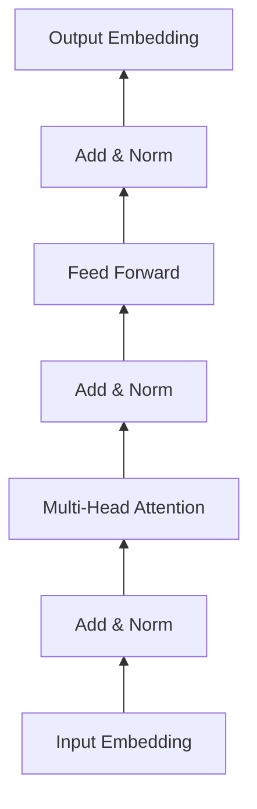

# 大语言模型原理基础与前沿 预训练和微调Transformer带来的新启示

## 1.背景介绍

### 1.1 大语言模型的兴起
近年来,随着深度学习技术的快速发展,自然语言处理(NLP)领域取得了突破性的进展。其中,大语言模型(Large Language Model,LLM)作为NLP的核心技术之一,受到了学术界和工业界的广泛关注。LLM通过在海量语料上进行无监督预训练,可以学习到丰富的语言知识和通用语言表示,并在下游任务上表现出色。

### 1.2 Transformer架构的重要性
Transformer架构的提出是LLM发展的重要里程碑。Transformer摒弃了此前主流的循环神经网络(RNN)架构,转而采用了完全基于注意力机制(Attention)的结构。这使得模型能够更好地捕捉长距离依赖,并实现高效的并行计算。基于Transformer的语言模型如BERT、GPT等,在多项NLP任务上取得了state-of-the-art的表现。

### 1.3 预训练和微调范式
预训练和微调(Pre-training and Fine-tuning)是当前LLM的主流范式。通过在大规模无标注语料上进行预训练,LLM可以学习到通用的语言表示。然后,在特定的下游任务上,通过微调预训练模型,可以快速适应新的任务,并取得优异的性能。这种范式大大降低了任务特定数据的要求,提高了模型的泛化能力。

## 2.核心概念与联系

### 2.1 语言模型
语言模型是对语言概率分布的建模。给定一个单词序列$w_1, w_2, ..., w_n$,语言模型的目标是估计该序列出现的概率:

$$P(w_1, w_2, ..., w_n) = \prod_{i=1}^n P(w_i|w_1, ..., w_{i-1})$$

传统的语言模型如n-gram模型,利用马尔可夫假设,将序列概率分解为一系列条件概率的乘积。而神经语言模型则使用神经网络来建模这些条件概率。

### 2.2 Transformer架构
Transformer是一种基于自注意力机制的神经网络架构。与RNN不同,Transformer抛弃了循环结构,转而使用自注意力机制来捕捉序列中的依赖关系。Transformer的核心组件包括:

- 多头自注意力(Multi-head Self-attention):通过计算序列中不同位置之间的注意力权重,捕捉长距离依赖。
- 前馈神经网络(Feed-forward Network):对自注意力的输出进行非线性变换。
- 残差连接(Residual Connection)和层归一化(Layer Normalization):促进梯度流动和训练稳定性。

Transformer通过堆叠多个编码器(Encoder)和解码器(Decoder)层,构建出强大的序列到序列模型。下图展示了Transformer的整体架构:



### 2.3 预训练任务
预训练是在大规模无标注语料上训练语言模型的过程。常见的预训练任务包括:

- 语言模型:预测下一个单词,如GPT系列模型。
- 去噪自编码:随机遮挡部分输入,预测被遮挡的单词,如BERT。
- 自回归:预测序列的下一个单词,同时也预测被遮挡的单词,如XLNet。

通过合适的预训练任务,LLM可以学习到语言的通用表示和知识。

### 2.4 微调
微调是在预训练的基础上,针对特定任务进行训练的过程。通过在任务特定的标注数据上微调预训练模型,可以快速适应新的任务,并取得优异的性能。常见的微调任务包括:

- 文本分类:情感分析、主题分类等。
- 序列标注:命名实体识别、词性标注等。
- 问答:基于给定文档回答问题。
- 文本生成:摘要生成、对话生成等。

微调通常只需要较小的任务特定数据集,并且训练时间较短,展现出预训练语言模型强大的迁移学习能力。

## 3.核心算法原理具体操作步骤

### 3.1 Transformer的自注意力机制

Transformer的核心是自注意力机制,它允许模型在处理序列时,考虑序列中不同位置之间的依赖关系。自注意力的计算过程如下:

1. 将输入序列$X \in \mathbb{R}^{n \times d}$通过三个线性变换,得到查询矩阵$Q$、键矩阵$K$和值矩阵$V$:

$$Q = XW_Q, K = XW_K, V = XW_V$$

其中$W_Q, W_K, W_V \in \mathbb{R}^{d \times d_k}$是可学习的参数矩阵。

2. 计算查询矩阵和键矩阵的点积,得到注意力分数矩阵$A$:

$$A = \text{softmax}(\frac{QK^T}{\sqrt{d_k}})$$

3. 将注意力分数矩阵与值矩阵相乘,得到自注意力的输出$Z$:

$$Z = AV$$

多头自注意力机制将上述过程独立执行h次,然后将结果拼接起来,并通过另一个线性变换得到最终的输出。

### 3.2 预训练算法流程

以BERT为例,其预训练算法流程如下:

1. 构建输入:将文本序列进行词元化(Tokenization),添加特殊标记[CLS]和[SEP],以及位置编码。

2. 随机遮挡:以一定概率(如15%)随机遮挡部分词元,用[MASK]标记替换。

3. Transformer编码:将输入序列传入Transformer的多层编码器,得到每个位置的隐藏状态。

4. 预测遮挡词元:使用[MASK]位置的隐藏状态,通过一个线性变换和softmax函数,预测被遮挡的词元。

5. 计算损失:使用预测结果和真实标签计算交叉熵损失,并进行梯度反向传播和参数更新。

重复以上步骤,直到模型收敛或达到预设的训练轮数。

### 3.3 微调算法流程

以文本分类任务为例,微调算法流程如下:

1. 加载预训练模型:加载预训练的LLM如BERT,并根据任务需要调整模型结构,如添加分类头。

2. 准备任务数据:将任务特定的标注数据进行预处理,如词元化、添加特殊标记等。

3. 微调训练:将任务数据输入微调后的模型,计算损失并进行梯度反向传播和参数更新。通常使用较小的学习率和较少的训练轮数。

4. 评估和推理:在测试集上评估微调后的模型性能,并用于实际的推理任务。

微调过程通常需要较少的计算资源和训练时间,但可以显著提高模型在特定任务上的性能。

## 4.数学模型和公式详细讲解举例说明

### 4.1 Transformer的数学表示

Transformer的前向传播过程可以用以下数学公式表示:

对于第$l$层Transformer编码器,输入为$X^{(l)} \in \mathbb{R}^{n \times d}$,输出为$X^{(l+1)} \in \mathbb{R}^{n \times d}$。

1. 自注意力子层:

$$
\begin{aligned}
Q^{(l)} &= X^{(l)}W_Q^{(l)} \\
K^{(l)} &= X^{(l)}W_K^{(l)} \\
V^{(l)} &= X^{(l)}W_V^{(l)} \\
A^{(l)} &= \text{softmax}(\frac{Q^{(l)}(K^{(l)})^T}{\sqrt{d_k}}) \\
Z^{(l)} &= A^{(l)}V^{(l)}
\end{aligned}
$$

2. 前馈子层:

$$
\begin{aligned}
F^{(l)} &= \text{ReLU}(Z^{(l)}W_1^{(l)} + b_1^{(l)}) \\
X^{(l+1)} &= F^{(l)}W_2^{(l)} + b_2^{(l)}
\end{aligned}
$$

其中$W_Q^{(l)}, W_K^{(l)}, W_V^{(l)} \in \mathbb{R}^{d \times d_k}, W_1^{(l)} \in \mathbb{R}^{d \times d_{ff}}, W_2^{(l)} \in \mathbb{R}^{d_{ff} \times d}$为可学习的参数矩阵,$b_1^{(l)} \in \mathbb{R}^{d_{ff}}, b_2^{(l)} \in \mathbb{R}^d$为可学习的偏置项。

### 4.2 预训练目标函数

以BERT的遮挡语言模型(Masked Language Model, MLM)为例,其预训练目标是最大化被遮挡词元的对数似然概率:

$$\mathcal{L}_{\text{MLM}} = -\sum_{i \in \mathcal{M}} \log P(w_i | \hat{w}_{\backslash i})$$

其中$\mathcal{M}$是被遮挡词元的位置集合,$w_i$是第$i$个位置的真实词元,$\hat{w}_{\backslash i}$表示除第$i$个位置外的所有词元。

BERT还引入了下一句预测(Next Sentence Prediction, NSP)任务,用于捕捉句子级别的关系。NSP的目标是最大化正确分类下一句的对数似然概率:

$$\mathcal{L}_{\text{NSP}} = -\log P(y | s_1, s_2)$$

其中$y \in \{0, 1\}$表示$s_2$是否是$s_1$的下一句,$s_1$和$s_2$是输入的句子对。

最终的预训练目标是MLM和NSP的联合目标:

$$\mathcal{L} = \mathcal{L}_{\text{MLM}} + \mathcal{L}_{\text{NSP}}$$

通过最小化该目标函数,BERT可以学习到语言的通用表示和知识。

### 4.3 微调的损失函数

微调阶段的损失函数取决于具体的下游任务。以文本分类为例,常用的损失函数是交叉熵损失:

$$\mathcal{L}_{\text{CE}} = -\sum_{i=1}^N \sum_{c=1}^C y_{i,c} \log \hat{y}_{i,c}$$

其中$N$是样本数量,$C$是类别数量,$y_{i,c}$是第$i$个样本属于类别$c$的真实标签,$\hat{y}_{i,c}$是模型预测的概率。

通过最小化交叉熵损失,微调后的模型可以在特定任务上取得优异的性能。

## 5.项目实践：代码实例和详细解释说明

下面是使用PyTorch实现BERT预训练和微调的简要代码示例:

```python
import torch
import torch.nn as nn
from transformers import BertModel, BertTokenizer

# 加载预训练的BERT模型和分词器
model = BertModel.from_pretrained('bert-base-uncased')
tokenizer = BertTokenizer.from_pretrained('bert-base-uncased')

# 准备预训练数据
texts = [...]  # 大规模无标注语料
inputs = tokenizer(texts, return_tensors='pt', max_length=512, truncation=True, padding='max_length')

# 预训练
model.train()
optimizer = torch.optim.Adam(model.parameters(), lr=1e-4)
for epoch in range(num_epochs):
    for batch in dataloader:
        input_ids = batch['input_ids'].to(device)
        attention_mask = batch['attention_mask'].to(device)
        
        outputs = model(input_ids, attention_mask=attention_mask)
        loss = compute_loss(outputs)  # 根据预训练任务计算损失
        
        optimizer.zero_grad()
        loss.backward()
        optimizer.step()

# 微调
class ClassificationHead(nn.Module):
    def __init__(self, hidden_size, num_classes):
        super().__init__()
        self.linear = nn.Linear(hidden_size, num_classes)
    
    def forward(self, pooled_output):
        return self.linear(pooled_output)

model.classifier = ClassificationHead(model.config.hidden_size, num_classes)
model.train()
optimizer = torch.optim.Adam(model.parameters(), lr=1e-5)
for epoch in range(num_epochs):
    for batch in dataloader:
        input_ids = batch['input_ids'].to(device)
        attention_mask = batch['attention_mask'].to(device)
        labels = batch['labels'].to(device