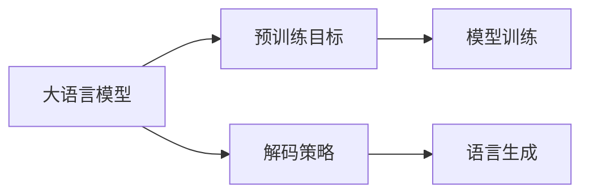

## 1.背景介绍

随着人工智能的飞速发展，语言模型成为了自然语言处理（NLP）领域的重要组成部分。大语言模型，顾名思义，是在大量文本数据上训练的模型，目的是理解和生成人类语言。这种模型的出现，对于自然语言处理的研究和应用有着深远的影响。

## 2.核心概念与联系

大语言模型的主要目标是利用预训练目标和解码策略，来生成人类语言。预训练目标是指模型在训练过程中需要达到的目标，而解码策略则是模型如何从预训练的模型中生成语言。



## 3.核心算法原理具体操作步骤

大语言模型的核心算法主要包括预训练和解码两个部分。预训练部分主要是通过大量的文本数据，训练模型理解和生成语言的能力。解码部分则是通过模型生成语言。

预训练的步骤主要包括以下几个部分：

1. 数据准备：收集大量的文本数据，这些数据将用于训练模型。
2. 模型设计：设计一个合适的模型结构，这个模型需要能够处理大量的文本数据，并且能够生成语言。
3. 模型训练：使用数据和模型进行训练，训练的过程中需要不断优化模型的参数，使模型能够更好的理解和生成语言。

解码的步骤主要包括以下几个部分：

1. 输入处理：将需要生成语言的输入进行处理，使其能够被模型接受。
2. 模型解码：模型根据输入生成语言，这个过程需要考虑模型的输出和输入之间的关系。
3. 输出处理：将模型生成的语言进行处理，使其能够被人类理解。

## 4.数学模型和公式详细讲解举例说明

大语言模型的数学模型主要包括两个部分：模型的预训练和模型的解码。

预训练的数学模型主要是通过最大化对数似然函数来训练模型：

$$
\theta^* = \arg\max_{\theta} \sum_{i=1}^{N} \log P(x_i | x_{<i}; \theta)
$$

其中，$x_i$ 是输入的文本数据，$x_{<i}$ 是$x_i$之前的文本数据，$\theta$ 是模型的参数。

解码的数学模型主要是通过最大化后验概率来生成语言：

$$
y^* = \arg\max_{y} P(y | x; \theta^*)
$$

其中，$y$ 是模型生成的语言，$x$ 是输入的文本数据，$\theta^*$ 是预训练得到的模型参数。

## 5.项目实践：代码实例和详细解释说明

在实际的项目实践中，我们可以使用开源的大语言模型，如GPT-3，来进行预训练和解码。以下是一个简单的代码示例：

```python
from transformers import GPT3LMHeadModel, GPT3Tokenizer

tokenizer = GPT3Tokenizer.from_pretrained('gpt3')
model = GPT3LMHeadModel.from_pretrained('gpt3')

inputs = tokenizer.encode("Translate this text to French:", return_tensors='pt')
outputs = model.generate(inputs, max_length=50, num_return_sequences=5)

for output in outputs:
    print(tokenizer.decode(output))
```

这个代码示例首先加载了GPT-3的模型和词汇表，然后将输入的文本转换为模型可以接受的格式，接着使用模型生成语言，最后将模型生成的语言转换为人类可以理解的格式。

## 6.实际应用场景

大语言模型在很多实际应用场景中都有着广泛的应用，例如：

1. 机器翻译：大语言模型可以理解和生成不同语言的文本，因此可以用于机器翻译。
2. 文本生成：大语言模型可以根据输入的文本生成相关的文本，因此可以用于文章写作、诗歌创作等。
3. 智能问答：大语言模型可以理解人类的问题，并生成相关的答案，因此可以用于构建智能问答系统。

## 7.工具和资源推荐

在大语言模型的研究和应用中，以下工具和资源可能会有所帮助：

1. [Hugging Face Transformers](https://huggingface.co/transformers/)：一个提供了多种预训练模型（包括GPT-3）的开源库。
2. [OpenAI API](https://beta.openai.com/)：OpenAI提供的API，可以直接使用GPT-3进行预训练和解码。
3. [Arxiv](https://arxiv.org/)：一个提供了大量人工智能和自然语言处理相关论文的网站，可以用于了解最新的研究进展。

## 8.总结：未来发展趋势与挑战

大语言模型在自然语言处理领域的应用前景广阔，但同时也面临着一些挑战，例如模型的可解释性、数据的隐私问题、生成文本的真实性和准确性等。未来，我们需要继续研究和探索，以解决这些问题，进一步提高大语言模型的能力。

## 9.附录：常见问题与解答

1. Q: 大语言模型的预训练需要多少数据？
   A: 这主要取决于模型的复杂性和任务的难度。一般来说，更复杂的模型和更难的任务需要更多的数据。

2. Q: 大语言模型的解码是如何工作的？
   A: 大语言模型的解码主要是通过最大化后验概率来生成语言。模型会考虑所有可能的输出，选择后验概率最大的输出作为生成的语言。

3. Q: 大语言模型可以用于哪些应用？
   A: 大语言模型可以用于很多应用，例如机器翻译、文本生成、智能问答等。

作者：禅与计算机程序设计艺术 / Zen and the Art of Computer Programming