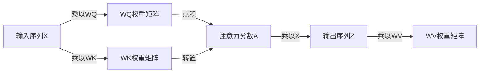

## 1.背景介绍

在过去的几年中，大型语言模型（Large Language Models，简称LLMs）已经发展成为自然语言处理（Natural Language Processing，简称NLP）领域的一种重要技术。从GPT-3到BERT，这些模型已经在各种任务中取得了显著的性能提升。然而，随着模型规模的增长，如何高效地扩展Transformer的推理成为了一个重要的挑战。

## 2.核心概念与联系

在深入讨论如何扩展Transformer推理之前，我们首先需要理解一些核心概念。

### 2.1 大型语言模型

大型语言模型是一种基于深度学习的模型，它们被训练来理解和生成人类语言。这些模型通常使用大量的文本数据进行训练，例如整个互联网的文本。最著名的大型语言模型包括OpenAI的GPT-3和Google的BERT。

### 2.2 Transformer模型

Transformer是一种特殊的深度学习模型，它在NLP领域取得了巨大的成功。Transformer模型的关键特性是它的自注意力（Self-Attention）机制，这使得模型能够捕获输入序列中的长距离依赖关系。

## 3.核心算法原理具体操作步骤

为了高效地扩展Transformer的推理，我们需要对Transformer的工作原理有深入的理解。以下是Transformer的基本工作流程：

1. 输入：Transformer模型接收一系列的输入标记，每个标记都被转换为一个向量。

2. 自注意力：模型计算每个输入标记与其他所有标记的关系，这是通过计算每个标记的“注意力分数”来完成的。

3. 编码：注意力分数被用于对输入标记进行加权求和，生成一个新的向量序列，这个过程被称为“编码”。

4. 解码：编码的向量序列被送入解码器，解码器生成一个输出序列。

5. 输出：输出序列被转换为最终的预测结果。

为了提高推理效率，我们可以采用一些策略，例如并行化计算、优化矩阵乘法操作、使用更高效的存储和计算设备等。

## 4.数学模型和公式详细讲解举例说明

在Transformer模型中，自注意力机制的计算是一个重要的步骤。这个过程可以被表示为一个数学模型。

假设我们有一个输入序列 $X = [x_1, x_2, ..., x_n]$，其中每个 $x_i$ 都是一个向量。自注意力机制首先计算每个输入标记 $x_i$ 与其他所有标记的注意力分数。这个过程可以用下面的公式表示：

$$
A = softmax(XW_Q (XW_K)^T)
$$

其中，$W_Q$ 和 $W_K$ 是查询和键的权重矩阵，$softmax$ 是softmax函数，用于将注意力分数归一化为概率分布。

然后，注意力分数 $A$ 被用于对输入标记进行加权求和，生成一个新的向量序列 $Z$：

$$
Z = AXW_V
$$

其中，$W_V$ 是值的权重矩阵。

这个过程可以用Mermaid流程图表示如下：



## 5.项目实践：代码实例和详细解释说明

在Python中，我们可以用以下代码实现一个简单的Transformer模型：

```python
import torch
import torch.nn as nn
import torch.nn.functional as F

class Transformer(nn.Module):
    def __init__(self, input_dim, output_dim, hidden_dim, n_heads):
        super(Transformer, self).__init__()
        self.input_dim = input_dim
        self.output_dim = output_dim
        self.hidden_dim = hidden_dim
        self.n_heads = n_heads

        self.encoder = nn.TransformerEncoder(
            nn.TransformerEncoderLayer(d_model=self.input_dim, nhead=self.n_heads, dim_feedforward=self.hidden_dim),
            num_layers=1
        )
        self.decoder = nn.Linear(self.input_dim, self.output_dim)

    def forward(self, x):
        x = self.encoder(x)
        x = self.decoder(x)
        return x
```

在这个例子中，我们首先定义了一个Transformer模型，它包含一个编码器和一个解码器。编码器使用了PyTorch的`nn.TransformerEncoder`，它是一个基于自注意力的编码器。解码器是一个简单的线性层，用于将编码的向量序列转换为最终的预测结果。

## 6.实际应用场景

大型语言模型和Transformer在许多实际应用中都发挥了重要的作用。以下是一些例子：

- 机器翻译：Transformer模型在机器翻译任务中取得了显著的性能提升。例如，Google的神经机器翻译系统就是基于Transformer的。

- 文本生成：大型语言模型如GPT-3被用于生成各种类型的文本，包括新闻文章、故事、诗歌等。

- 情感分析：大型语言模型可以理解并生成人类语言，因此它们可以用于情感分析，例如判断一段文本的情绪倾向。

- 问答系统：大型语言模型可以理解复杂的查询，并生成详细的答案，因此它们被广泛用于构建问答系统。

## 7.工具和资源推荐

以下是一些有用的工具和资源，可以帮助你深入理解和使用大型语言模型和Transformer：

- PyTorch：一个强大的深度学习框架，提供了许多预训练的大型语言模型和Transformer的实现。

- Hugging Face Transformers：一个提供大量预训练模型的库，包括BERT、GPT-3等。

- TensorFlow：另一个强大的深度学习框架，也提供了许多预训练的大型语言模型和Transformer的实现。

- Attention is All You Need：这是Transformer模型的原始论文，详细介绍了Transformer的设计和工作原理。

## 8.总结：未来发展趋势与挑战

大型语言模型和Transformer已经在NLP领域取得了显著的成果，但仍然面临一些挑战。首先，随着模型规模的增长，如何高效地扩展Transformer的推理成为了一个重要的问题。此外，如何理解和解释这些模型的行为也是一个重要的研究方向。最后，如何确保这些模型的使用符合道德和法律规定，也是我们需要考虑的问题。

尽管有这些挑战，我们相信大型语言模型和Transformer在未来将继续发挥重要的作用，并带来更多的创新和突破。

## 9.附录：常见问题与解答

Q: Transformer模型的自注意力机制是如何工作的？

A: 自注意力机制通过计算每个输入标记与其他所有标记的关系来工作。这个过程是通过计算每个标记的“注意力分数”来完成的，然后这些分数被用于对输入标记进行加权求和，生成一个新的向量序列。

Q: 如何提高Transformer的推理效率？

A: 为了提高推理效率，我们可以采用一些策略，例如并行化计算、优化矩阵乘法操作、使用更高效的存储和计算设备等。

Q: 大型语言模型有哪些应用？

A: 大型语言模型在许多实际应用中都发挥了重要的作用，例如机器翻译、文本生成、情感分析和问答系统。

作者：禅与计算机程序设计艺术 / Zen and the Art of Computer Programming