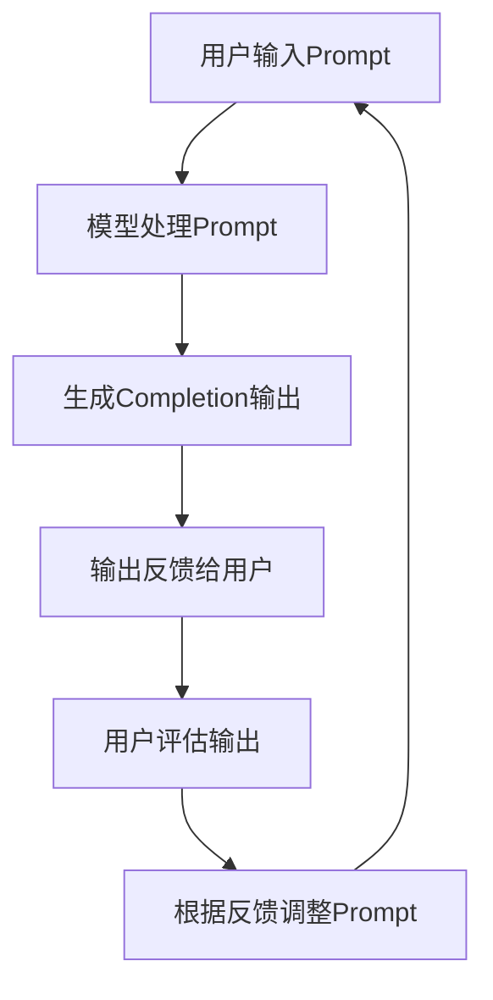

# 大语言模型应用指南：Completion交互格式

## 1.背景介绍

### 1.1 大语言模型的兴起

近年来,大型语言模型(Large Language Models,LLMs)在自然语言处理领域取得了令人瞩目的进展。这些模型通过在海量文本数据上进行预训练,学习了丰富的语言知识和上下文信息,从而能够生成流畅、连贯的自然语言输出。

代表性的大语言模型包括GPT-3、PaLM、ChatGPT等,它们展现出了惊人的语言生成能力,可以用于多种自然语言处理任务,如文本生成、问答系统、机器翻译等。这些模型的出现,为人工智能系统与人类进行自然交互提供了新的可能性。

### 1.2 Completion交互模式

在大语言模型的应用中,Completion交互模式是一种常见的人机交互方式。所谓Completion,即是指用户输入一个文本提示(Prompt),模型根据提示生成相应的文本补全(Completion)输出。

这种交互模式具有以下优势:

1. **自然交互**:用户可以使用自然语言来与模型交互,无需学习特定的命令或语法。
2. **开放性**:Completion输出的形式多样,可以是对话、文本生成、代码生成等,使用场景广泛。
3. **定制性**:通过精心设计Prompt,可以指导模型生成所需的特定输出。

因此,Completion交互模式为大语言模型在实际应用中提供了极大的便利,成为了一种常用的人机交互范式。

## 2.核心概念与联系 

### 2.1 Prompt工程

在Completion交互中,Prompt(提示)是指导模型生成所需输出的关键。合理设计Prompt,对于获得高质量的输出至关重要,这就产生了Prompt工程的概念。

Prompt工程包括以下几个核心要素:

1. **Task Instruction**:明确指出需要模型执行的任务类型,如问答、文本生成、代码生成等。
2. **Context**:提供足够的上下文信息,使模型能够理解并生成与上下文相关的输出。
3. **Output Specification**:明确期望的输出格式和要求,如长度、风格、语气等。
4. **Few-shot Examples**:给出少量的示例输入输出对,指导模型学习任务模式。

通过合理组合这些要素,可以构建高质量的Prompt,从而获得所需的Completion输出。Prompt工程是Completion交互中的关键技术。

### 2.2 Prompt和Completion的交互过程

Prompt和Completion的交互过程可以用以下流程图描述:



具体步骤如下:

1. 用户输入一个Prompt,表达所需执行的任务。
2. 模型分析并理解Prompt,结合预训练知识生成Completion输出。
3. 输出反馈给用户,用户评估输出质量。
4. 根据评估结果,用户可以调整Prompt,重新输入。
5. 重复上述过程,直到获得满意的输出。

这种交互模式强调了人机协作的重要性。通过反复调整Prompt,用户可以不断指导模型生成更加符合需求的输出。

## 3.核心算法原理具体操作步骤

大语言模型在生成Completion输出时,核心算法原理是基于自回归(Auto-Regressive)语言模型。自回归模型的工作方式是,给定一个文本序列的前缀,模型会预测下一个最可能出现的词。具体操作步骤如下:

1. **输入编码**:将Prompt文本序列编码为一系列token(词元)向量。
2. **前向传播**:将编码后的token序列输入到自回归模型,模型会基于当前token预测下一个token的概率分布。
3. **Token采样**:根据预测的概率分布,采样得到下一个token。常用的采样方法有贪婪搜索(Greedy Search)、顶端采样(Top-k Sampling)、核采样(Nucleus Sampling)等。
4. **序列生成**:重复步骤2和3,不断预测并采样下一个token,直到达到终止条件(如生成的序列达到指定长度),从而生成完整的Completion输出序列。
5. **输出解码**:将生成的token序列解码为自然语言文本输出。

需要注意的是,在采样过程中,通常会引入一些随机性,使得每次运行可能会得到不同的输出,增加了输出的多样性。同时,也可以通过调整采样策略和参数,来控制输出的质量和特征。

## 4.数学模型和公式详细讲解举例说明

自回归语言模型的核心是基于概率模型,通过最大化训练数据的条件概率来学习模型参数。设$X = (x_1, x_2, ..., x_n)$为一个长度为$n$的token序列,自回归模型的目标是最大化该序列的条件概率:

$$P(X) = \prod_{t=1}^{n}P(x_t|x_1, x_2, ..., x_{t-1})$$

其中,$P(x_t|x_1, x_2, ..., x_{t-1})$表示在给定前$t-1$个token的情况下,预测第$t$个token的概率。

为了计算该条件概率,自回归模型通常采用基于Transformer的序列到序列(Seq2Seq)架构。Transformer的核心是多头自注意力(Multi-Head Self-Attention)机制,它能够捕获序列中token之间的长程依赖关系。

对于一个长度为$n$的输入序列$X$,自注意力机制首先将每个token$x_i$映射为一个查询向量$q_i$、键向量$k_i$和值向量$v_i$:

$$q_i = X_iW^Q, k_i = X_iW^K, v_i = X_iW^V$$

其中,$W^Q, W^K, W^V$分别是查询、键和值的线性变换矩阵。

然后,计算每个token$x_i$与其他token的注意力权重:

$$\text{Attention}(q_i, k_j, v_j) = \text{softmax}(\frac{q_i^Tk_j}{\sqrt{d_k}})v_j$$

其中,$d_k$是缩放因子,用于防止点积过大导致梯度消失。

通过对所有token的注意力权重求和,可以得到$x_i$的注意力表示:

$$\text{Attention}(X_i) = \sum_{j=1}^n\text{Attention}(q_i, k_j, v_j)$$

多头自注意力机制是将多个注意力头的结果拼接在一起,从而捕获更丰富的依赖关系。

基于自注意力机制,Transformer可以建模输入序列中token之间的长程依赖,从而更好地预测下一个token的概率分布。通过最大化训练数据的条件概率,模型可以学习到有效的参数,用于生成高质量的Completion输出。

## 5.项目实践:代码实例和详细解释说明

以下是一个使用Python和Hugging Face Transformers库实现Completion交互的示例代码:

```python
from transformers import AutoTokenizer, AutoModelForCausalLM

# 加载预训练模型和tokenizer
tokenizer = AutoTokenizer.from_pretrained("microsoft/DialoGPT-large")
model = AutoModelForCausalLM.from_pretrained("microsoft/DialoGPT-large")

# 定义Prompt
prompt = "Human: What is the capital of France?\nAssistant:"

# 对Prompt进行编码
input_ids = tokenizer.encode(prompt, return_tensors="pt")

# 生成Completion输出
output = model.generate(input_ids, max_length=100, do_sample=True, top_k=50, top_p=0.95, num_return_sequences=1)

# 解码输出
completion = tokenizer.decode(output[0], skip_special_tokens=True)
print(completion)
```

上述代码使用了微软的DialoGPT对话模型,实现了一个简单的问答系统。具体步骤如下:

1. 导入必要的库和模型。
2. 定义Prompt,这里是一个问答场景的Prompt。
3. 使用tokenizer将Prompt编码为token序列。
4. 调用`model.generate()`函数生成Completion输出,其中`max_length`指定了最大输出长度,`do_sample=True`表示使用采样策略生成,`top_k`和`top_p`控制采样的质量。
5. 使用tokenizer将生成的token序列解码为自然语言文本。

运行上述代码,输出结果可能如下:

```
Human: What is the capital of France?
Assistant: The capital of France is Paris.
```

可以看到,模型根据问答场景的Prompt,成功生成了正确的答案。

通过修改Prompt和调整生成参数,可以指导模型生成不同类型的Completion输出,如文本生成、代码生成等。这展示了Completion交互模式在实际应用中的强大功能和灵活性。

## 6.实际应用场景

Completion交互模式的应用场景非常广泛,包括但不限于:

1. **对话系统**:通过设计合理的Prompt,模型可以生成自然、流畅的对话响应,实现人机对话交互。
2. **问答系统**:模型可以根据问题的Prompt生成相应的答案,构建智能问答系统。
3. **文本生成**:给定一个起始Prompt,模型可以生成各种风格的文本内容,如新闻报道、小说故事、营销文案等。
4. **代码生成**:将代码片段作为Prompt输入,模型可以生成相应的代码补全或代码解释。
5. **机器翻译**:将源语言文本作为Prompt,模型可以生成目标语言的翻译结果。
6. **数据增强**:通过生成相关的Prompt-Completion对,可以扩充训练数据,提高模型的泛化能力。

除了上述场景外,Completion交互模式还可以应用于教育辅助、写作助手、智能客服等多个领域,为人工智能系统与人类进行自然交互提供了有力支持。

## 7.工具和资源推荐

为了更好地利用Completion交互模式,以下是一些推荐的工具和资源:

1. **Hugging Face Transformers**:一个集成了多种预训练语言模型的开源库,提供了方便的API进行模型加载、微调和推理。
2. **OpenAI API**:OpenAI提供了基于GPT-3的强大语言模型API,可以方便地集成到应用程序中。
3. **Anthropic API**:Anthropic公司提供了基于PaLM模型的API,支持多种自然语言处理任务。
4. **Google AI Platform**:Google云平台提供了多种预训练语言模型服务,如PaLM、LaMBDA等。
5. **Prompt工程资源**:一些优秀的Prompt工程教程和示例,如Anthropic的Constitutional AI、OpenAI的Prompt Library等。
6. **语料库**:用于训练或微调语言模型的高质量语料库,如书籍、维基百科、新闻文本等。

利用这些工具和资源,开发者可以更高效地构建基于Completion交互的应用系统,并探索更多的应用场景。

## 8.总结:未来发展趋势与挑战

大语言模型和Completion交互模式正在推动着人工智能系统与人类进行自然交互的新范式。未来,这一领域还将面临以下发展趋势和挑战:

1. **模型能力提升**:持续提高语言模型的规模和性能,以生成更加准确、流畅、多样的Completion输出。
2. **Prompt工程发展**:深入研究Prompt工程技术,设计更加高效、可控的Prompt,指导模型生成所需的特定输出。
3. **安全性和可靠性**:解决模型输出中可能存在的偏差、不当内容等问题,提高模型的安全性和可靠性。
4. **人机协作优化**:优化Completion交互流程,增强人机协作体验,实现更自然、高效的交互方式。
5. **应用场景拓展**:探索Completion交互在更多领域的应用,如医疗、法律、教育等,发挥其潜力。
6. **隐私和伦理考量**:关注模型训练数据和应用场景中的隐私和伦理问题,确保技术的负责任使用。

总的来说,大语言模型和Completion交互模式为人工智能系统带来了巨大的发展机遇,但也面临着诸多挑战需要解决。通过持续的研