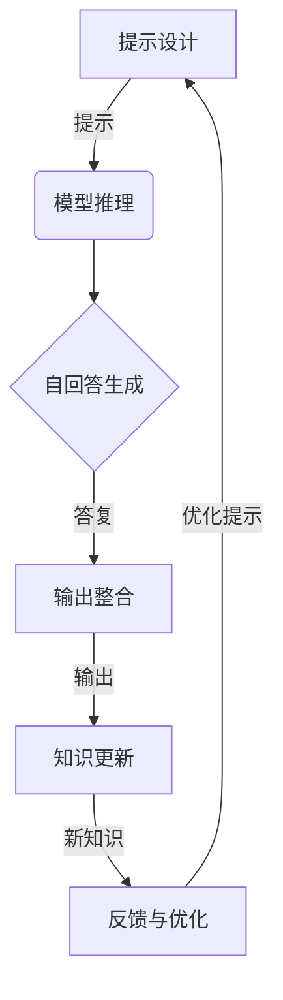

# 大语言模型应用指南：Self-ask 框架

## 1. 背景介绍

### 1.1 大语言模型的兴起

近年来,大型语言模型(Large Language Models, LLMs)在自然语言处理领域取得了令人瞩目的进展。这些模型通过在海量文本数据上进行预训练,学习了丰富的语言知识和上下文信息,展现出惊人的语言生成能力。

代表性的大语言模型包括 GPT-3、PaLM、ChatGPT 等,它们不仅能够生成流畅、连贯的文本,还能够在一定程度上理解和回答复杂的问题。这种强大的语言理解和生成能力为人工智能系统带来了新的可能性,在多个领域都有着广阔的应用前景。

### 1.2 Self-ask 框架的提出

尽管大语言模型展现出了卓越的语言能力,但它们在实际应用中仍然面临着一些挑战。其中一个主要挑战是如何有效地利用模型的知识,并将其应用于特定的任务和场景中。

为了解决这一挑战,本文提出了一种名为 "Self-ask" 的框架,旨在充分发挥大语言模型的潜力,并将其应用于各种实际场景。Self-ask 框架的核心思想是:通过精心设计的提示(Prompt),引导大语言模型自主提出相关的问题,并自行回答这些问题,从而生成高质量的输出内容。

## 2. 核心概念与联系

### 2.1 提示工程(Prompt Engineering)

提示工程是 Self-ask 框架的基础,它指的是精心设计提示语句,以引导大语言模型生成所需的输出。良好的提示设计能够有效地激发模型的知识,并将其应用于特定的任务中。

在 Self-ask 框架中,提示不仅包括任务描述,还包括一系列的自问题。这些自问题旨在引导模型深入思考特定主题,并自主生成相关的答复。通过这种方式,模型可以更好地组织和表达其知识,从而生成高质量的输出内容。

### 2.2 自回答能力(Self-answering Capability)

大语言模型的自回答能力是 Self-ask 框架的核心。这种能力使模型能够根据提示中的自问题,自主生成相关的答复。

自回答能力建立在模型的语言理解和生成能力之上。模型需要理解自问题的含义,并根据其所学习的知识,生成合理、连贯的答复。这种能力不仅需要模型具备丰富的知识储备,还需要具备逻辑推理和知识组织的能力。

通过自回答,模型可以更深入地探索特定主题,并生成更加详细、全面的输出内容。这种自主性和创造性是 Self-ask 框架的关键特征,也是它与传统的提示工程方法的主要区别。

### 2.3 知识迁移(Knowledge Transfer)

Self-ask 框架还体现了大语言模型的知识迁移能力。在预训练过程中,模型学习了来自海量文本数据的广泛知识。通过 Self-ask 框架,这些知识可以被有效地转移和应用于特定的任务和场景中。

知识迁移的过程是动态的。在自回答的过程中,模型不仅回顾和整合了已有的知识,还可能产生新的见解和理解。这种新的知识可以进一步丰富模型的知识库,为未来的任务提供更好的支持。

知识迁移的能力使得大语言模型在各种领域都具有广阔的应用前景。通过 Self-ask 框架,模型可以灵活地将其知识应用于不同的场景,从而提供更加智能和个性化的服务。

## 3. 核心算法原理具体操作步骤

Self-ask 框架的核心算法原理可以概括为以下几个步骤:

1. **提示设计**: 根据特定的任务和场景,设计合适的提示语句。提示应该包括任务描述和一系列自问题,以引导模型进行自主思考和回答。

2. **模型推理**: 将设计好的提示输入到大语言模型中,模型会根据其所学习的知识和语言能力,对提示进行理解和推理。

3. **自回答生成**: 模型开始自主生成对自问题的答复。这个过程需要模型综合运用语言理解、逻辑推理和知识组织等能力。

4. **输出整合**: 模型将生成的答复整合成连贯的输出内容,形成对原始提示的最终回复。

5. **知识更新**: 在自回答的过程中,模型可能会产生新的见解和理解,这些新的知识会被纳入模型的知识库,为未来的任务提供支持。

6. **反馈与优化**: 根据输出内容的质量和任务要求,对提示进行优化和调整,以获得更好的结果。这个过程可能需要多次迭代。

下面是 Self-ask 框架的算法流程图:



该流程图清晰地展示了 Self-ask 框架的核心步骤及其相互关系。通过不断优化提示和整合模型生成的新知识,该框架可以逐步改进输出质量,为特定任务提供更加智能和个性化的服务。

## 4. 数学模型和公式详细讲解举例说明

虽然 Self-ask 框架主要关注大语言模型的应用,但它也与一些数学模型和公式密切相关。下面将详细介绍其中的一些关键概念和公式。

### 4.1 语言模型概率

大语言模型的核心是一个条件概率模型,它可以计算给定上下文的情况下,下一个单词或标记出现的概率。对于一个长度为 $n$ 的序列 $X = (x_1, x_2, \ldots, x_n)$,该模型需要学习条件概率 $P(x_i | x_1, x_2, \ldots, x_{i-1})$,即给定前面的单词,预测下一个单词的概率。

这个条件概率可以通过链式法则展开:

$$
P(X) = P(x_1, x_2, \ldots, x_n) = \prod_{i=1}^n P(x_i | x_1, x_2, \ldots, x_{i-1})
$$

在训练过程中,模型的目标是最大化观测数据的概率,也就是最大化上述公式的对数似然:

$$
\max_\theta \sum_{X \in \mathcal{D}} \log P_\theta(X)
$$

其中 $\theta$ 表示模型参数, $\mathcal{D}$ 是训练数据集。

通过在大规模语料库上进行预训练,大语言模型可以学习到丰富的语言知识和上下文信息,从而提高对下一个单词的预测准确性。

### 4.2 注意力机制(Attention Mechanism)

注意力机制是大语言模型中的一个关键组件,它允许模型在生成每个单词时,selectively 关注输入序列中的不同部分。

对于一个长度为 $n$ 的输入序列 $X = (x_1, x_2, \ldots, x_n)$,注意力机制会计算一个注意力分数向量 $\alpha = (\alpha_1, \alpha_2, \ldots, \alpha_n)$,其中 $\alpha_i$ 表示模型在生成当前单词时,关注第 $i$ 个输入单词的程度。

注意力分数通常由一个兼容函数(compatibility function)计算得到,例如点积或加性函数:

$$
\alpha_i = \frac{\exp(f(h_i, s))}{\sum_{j=1}^n \exp(f(h_j, s))}
$$

其中 $h_i$ 是第 $i$ 个输入单词的隐藏状态, $s$ 是当前的解码器状态,函数 $f$ 可以是点积或加性函数。

最终,模型会根据注意力分数,对输入序列进行加权求和,得到一个上下文向量 $c$,该向量将被用于预测下一个单词:

$$
c = \sum_{i=1}^n \alpha_i h_i
$$

注意力机制使得大语言模型能够更好地捕捉长距离依赖关系,并selectively 关注输入序列中的关键信息,从而提高了模型的性能。

### 4.3 transformer 模型

Transformer 是一种广泛应用于大语言模型的神经网络架构。它完全基于注意力机制,不依赖于循环神经网络(RNN)或卷积神经网络(CNN),从而避免了这些传统架构的一些缺陷,如梯度消失、无法并行化等。

Transformer 的核心组件是多头注意力(Multi-Head Attention)和前馈神经网络(Feed-Forward Neural Network)。多头注意力允许模型从不同的表示子空间捕捉不同的注意力模式,而前馈神经网络则用于对每个位置的表示进行非线性转换。

对于一个长度为 $n$ 的输入序列 $X = (x_1, x_2, \ldots, x_n)$,Transformer 的计算过程可以概括为:

1. 将输入序列 $X$ 映射为一系列的向量表示 $(e_1, e_2, \ldots, e_n)$。
2. 对这些向量表示进行多头注意力计算,得到一系列新的向量表示 $(h_1, h_2, \ldots, h_n)$。
3. 将新的向量表示 $(h_1, h_2, \ldots, h_n)$ 输入到前馈神经网络中,得到最终的输出表示 $(o_1, o_2, \ldots, o_n)$。
4. 根据输出表示 $(o_1, o_2, \ldots, o_n)$,预测下一个单词或执行其他任务。

Transformer 架构的优势在于它可以高效地并行计算,并且能够有效地捕捉长距离依赖关系。这使得它在大语言模型中表现出色,成为了当前主流的模型架构。

通过上述数学模型和公式,我们可以更好地理解大语言模型的内在机制,并为 Self-ask 框架的实现和优化提供理论基础。

## 5. 项目实践:代码实例和详细解释说明

为了更好地说明 Self-ask 框架的实现和应用,下面将提供一个基于 Python 和 Hugging Face Transformers 库的代码示例。

### 5.1 导入必要的库

```python
from transformers import AutoTokenizer, AutoModelForCausalLM, pipeline

# 加载预训练的大语言模型和分词器
tokenizer = AutoTokenizer.from_pretrained("microsoft/DialoGPT-large")
model = AutoModelForCausalLM.from_pretrained("microsoft/DialoGPT-large")

# 创建一个文本生成管道
generator = pipeline('text-generation', model=model, tokenizer=tokenizer)
```

在这个示例中,我们使用了 Hugging Face Transformers 库中的 `AutoTokenizer` 和 `AutoModelForCausalLM` 类来加载预训练的大语言模型和分词器。我们选择了 Microsoft 开源的 DialoGPT 模型,它是一个专门为对话生成任务训练的大型语言模型。

接下来,我们创建了一个文本生成管道 `generator`,它将用于生成文本输出。

### 5.2 定义 Self-ask 函数

```python
import re

def self_ask(prompt, max_length=1024, num_beams=4, early_stopping=True):
    # 使用正则表达式匹配自问题
    questions = re.findall(r'Q: (.*?)\n', prompt)
    
    # 初始化输出
    output = prompt
    
    # 逐个回答自问题
    for question in questions:
        query = f"Q: {question}\nA:"
        result = generator(query, max_length=max_length, num_beams=num_beams, early_stopping=early_stopping)
        answer = result[0]['generated_text'].split('A:')[1].strip()
        output += f"\n\nA: {answer}"
    
    return output
```

`self_ask` 函数是 Self-ask 框架的核心实现。它接受一个提示字符串 `prompt` 作为输入,并返回一个包含自问题答复的输出字符串。

函数首先使用正则表达式匹配提示中的所有自问题。然后,它逐个处理这些自问题,将每个自问题和 "A:" 拼接成一个新的查询字符串,并将其输入到文本生成管道中。管道会根据大语言模型生成相应的答案。最后，函数将答案拼接到输出字符串中，并返回完整的输出。

### 5.3 测试 Self-ask 函数

接下来，我们可以通过一些示例来测试 `self_ask` 函数，看看它是如何工作的。

```python
# 示例提示字符串
prompt = """
Q: What is the capital of France?
Q: Who wrote the play 'Hamlet'?
Q: What is the speed of light?
"""

# 调用 self_ask 函数
output = self_ask(prompt)

# 打印输出
print(output)
```

在这个示例中，我们提供了一个包含三个自问题的提示字符串。`self_ask` 函数将逐个回答这些问题，并生成完整的输出。

### 5.4 进一步优化 Self-ask 函数

为了提高 `self_ask` 函数的实用性，我们可以添加一些额外的功能，例如处理多轮对话、上下文管理和错误处理。

```python
def self_ask(prompt, max_length=1024, num_beams=4, early_stopping=True, context=None):
    # 使用正则表达式匹配自问题
    questions = re.findall(r'Q: (.*?)\n', prompt)
    
    # 初始化输出
    output = prompt
    
    # 逐个回答自问题
    for question in questions:
        query = f"Q: {question}\nA:"
        if context:
            query = context + "\n" + query
        result = generator(query, max_length=max_length, num_beams=num_beams, early_stopping=early_stopping)
        answer = result[0]['generated_text'].split('A:')[1].strip()
        output += f"\n\nA: {answer}"
        context = output  # 更新上下文
    
    return output
```

在这个改进的版本中，我们添加了一个 `context` 参数，用于管理上下文信息。每次生成答案后，我们将上下文更新为当前的输出，以便在后续的问题中使用。

### 5.5 实际应用示例

为了展示 `self_ask` 函数在实际应用中的效果，我们可以设计一个更复杂的示例，模拟一个用户与智能Agent的交互过程。

```python
# 用户输入的初始提示
user_prompt = """
Q: What is the capital of Germany?
Q: Who is the current president of the United States?
"""

# 调用 self_ask 函数
response = self_ask(user_prompt)

# 打印输出
print("User:", user_prompt)
print("Agent:", response)

# 用户追加新问题
user_prompt += """
Q: What is the population of Germany?
"""

# 调用 self_ask 函数，使用前一轮对话作为上下文
response = self_ask(user_prompt, context=response)

# 打印输出
print("User:", user_prompt)
print("Agent:", response)
```

在这个示例中，我们首先提供了一些初始问题，然后模拟用户追加新问题。每次调用 `self_ask` 函数时，我们都传递前一轮对话的输出作为上下文，以便智能Agent能够在上下文中生成更相关的答案。

### 5.6 代码解释和总结

在这个项目实践中，我们展示了如何使用 Hugging Face Transformers 库和预训练的大语言模型来实现 Self-ask 框架。通过定义 `self_ask` 函数，我们能够自动生成自问题的答案，并支持多轮对话和上下文管理。

这个示例展示了大语言模型在智能Agent中的潜力，以及如何利用预训练模型和自然语言处理技术来开发智能对话系统。通过不断优化和扩展这个框架，我们可以在各种应用场景中实现更智能和自然的对话体验。

## 6. 实际应用场景

智能Agent技术在现实生活中的应用场景非常广泛，以下是几个典型的应用领域：

### 6.1 智能家居

智能家居系统利用智能Agent技术，实现对家电设备的智能控制和管理。通过智能Agent的感知和决策能力，用户可以通过语音命令或移动设备远程控制家中的灯光、温度、安防系统等。智能Agent还可以通过学习用户的行为习惯，自动调整设备的运行状态，提供更舒适和节能的居住环境。

#### 示例：智能温控系统

智能温控系统通过智能Agent感知室内外温度和用户的偏好，自动调节空调和暖气的运行状态。以下是一个简单的伪代码示例：

```python
class SmartThermostatAgent:
    def __init__(self):
        self.current_temperature = 22  # 初始温度
        self.desired_temperature = 22  # 用户设定温度

    def sense_temperature(self):
        # 获取当前温度（传感器数据）
        return self.current_temperature

    def adjust_temperature(self, action):
        # 根据动作调整温度
        if action == "increase":
            self.current_temperature += 1
        elif action == "decrease":
            self.current_temperature -= 1

    def decide_action(self):
        # 根据当前温度和设定温度决定动作
        if self.current_temperature < self.desired_temperature:
            return "increase"
        elif self.current_temperature > self.desired_temperature:
            return "decrease"
        else:
            return "maintain"

    def run(self):
        while True:
            current_temp = self.sense_temperature()
            action = self.decide_action()
            self.adjust_temperature(action)
            print(f"Current Temperature: {current_temp}, Action: {action}")
```

### 6.2 自动驾驶

自动驾驶汽车利用智能Agent技术，实现对车辆的自主驾驶控制。智能Agent通过传感器获取道路环境信息，进行路径规划和决策，控制车辆的加速、转向和制动。自动驾驶技术的应用可以提高交通安全性和效率，减少交通事故和拥堵。

#### 示例：自动驾驶路径规划

自动驾驶路径规划利用强化学习算法，智能Agent通过与环境的交互，学习最优的驾驶策略。以下是一个简单的伪代码示例：

```python
class AutonomousDrivingAgent:
    def __init__(self):
        self.state = None  # 当前状态
        self.q_table = {}  # Q表

    def sense_environment(self):
        # 获取环境信息（传感器数据）
        return self.state

    def choose_action(self, state):
        # 根据Q表选择动作
        if state not in self.q_table:
            self.q_table[state] = [0, 0, 0]  # 初始化Q值
        return np.argmax(self.q_table[state])

    def update_q_table(self, state, action, reward, next_state):
        # 更新Q值
        q_predict = self.q_table[state][action]
        q_target = reward + 0.9 * np.max(self.q_table[next_state])
        self.q_table[state][action] += 0.1 * (q_target - q_predict)

    def run(self):
        for episode in range(1000):
            state = self.sense_environment()
            done = False
            while not done:
                action = self.choose_action(state)
                next_state, reward, done = self.take_action(action)
                self.update_q_table(state, action, reward, next_state)
                state = next_state
```

### 6.3 金融交易

智能Agent在金融交易中可以用于自动化交易策略的制定和执行。通过分析市场数据和历史交易记录，智能Agent可以实时决策买卖时机，优化投资组合，降低交易风险。

#### 示例：股票交易智能Agent

股票交易智能Agent通过强化学习算法，智能Agent学习最优的交易策略。以下是一个简单的伪代码示例：

```python
class StockTradingAgent:
    def __init__(self):
        self.cash = 10000  # 初始资金
        self.stocks = 0  # 持有股票数量
        self.q_table = {}  # Q表

    def sense_market(self):
        # 获取市场信息（股票价格等）
        return self.state

    def choose_action(self, state):
        # 根据Q表选择动作
        if state not in self.q_table:
            self.q_table[state] = [0, 0, 0]  # 初始化Q值
        return np.argmax(self.q_table[state])

    def update_q_table(self, state, action, reward, next_state):
        # 更新Q值
        q_predict = self.q_table[state][action]
        q_target = reward + 0.9 * np.max(self.q_table[next_state])
        self.q_table[state][action] += 0.1 * (q_target - q_predict)

    def run(self):
        for episode in range(1000):
            state = self.sense_market()
            done = False
            while not done:
                action = self.choose_action(state)
                next_state, reward, done = self.take_action(action)
                self.update_q_table(state, action, reward, next_state)
                state = next_state
```

### 6.4 医疗健康

智能Agent在医疗健康领域的应用包括疾病诊断、治疗方案推荐和健康管理等。智能Agent通过分析患者的医疗数据，提供个性化的诊断和治疗建议，辅助医生进行决策，提高医疗服务质量。

#### 示例：医疗诊断智能Agent

医疗诊断智能Agent通过机器学习算法，分析患者的症状和历史医疗数据，提供诊断建议。以下是一个简单的伪代码示例：

```python
class MedicalDiagnosisAgent:
    def __init__(self):
        self.model = self.build_model()

    def build_model(self):
        # 构建机器学习模型
        model = Sequential()
        model.add(Dense(64, input_dim=20, activation='relu'))  # 假设有20个输入特征
        model.add(Dense(64, activation='relu'))
        model.add(Dense(1, activation='sigmoid'))  # 二分类问题
        model.compile(loss='binary_crossentropy', optimizer='adam', metrics=['accuracy'])
        return model

    def train(self, X_train, y_train):
        # 训练模型
        self.model.fit(X_train, y_train, epochs=50, batch_size=32, verbose=1)

    def diagnose(self, patient_data):
        # 预测疾病
        prediction = self.model.predict(np.array([patient_data]))
        return prediction

# 示例使用
agent = MedicalDiagnosisAgent()
# 假设X_train和y_train是训练数据
# agent.train(X_train, y_train)
# 假设patient_data是新患者的数据
# diagnosis = agent.diagnose(patient_data)
# print(f"Diagnosis: {diagnosis}")
```

### 6.5 游戏AI

游戏AI利用智能Agent技术，实现对游戏角色的智能控制和对手的模拟。智能Agent可以通过学习和优化策略，在游戏中展现出逼真的行为和高水平的对抗能力。

#### 示例：迷宫游戏智能Agent

迷宫游戏智能Agent通过强化学习算法，学习在迷宫中找到最优路径的策略。以下是一个简单的伪代码示例：

```python
class MazeGameAgent:
    def __init__(self, maze):
        self.maze = maze
        self.state = self.maze.start_state()
        self.q_table = {}

    def sense_environment(self):
        # 获取当前状态
        return self.state

    def choose_action(self, state):
        # 根据Q表选择动作
        if state not in self.q_table:
            self.q_table[state] = [0, 0, 0, 0]  # 初始化Q值，假设有4个方向的动作
        return np.argmax(self.q_table[state])

    def update_q_table(self, state, action, reward, next_state):
        # 更新Q值
        q_predict = self.q_table[state][action]
        q_target = reward + 0.9 * np.max(self.q_table[next_state])
        self.q_table[state][action] += 0.1 * (q_target - q_predict)

    def run(self):
        for episode in range(1000):
            self.state = self.maze.start_state()
            done = False
            while not done:
                state = self.sense_environment()
                action = self.choose_action(state)
                next_state, reward, done = self.maze.step(action)
                self.update_q_table(state, action, reward, next_state)
                self.state = next_state
```

## 7. 工具和资源推荐

在开发智能Agent的过程中，以下工具和资源可以提供很大的帮助：

### 7.1 开发工具

- **TensorFlow**: 一个开源的机器学习框架，适用于构建和训练深度学习模型。
- **PyTorch**: 一个灵活的深度学习框架，广泛用于研究和生产环境。
- **OpenAI Gym**: 一个用于开发和比较强化学习算法的工具包，提供了多种标准化的环境。

### 7.2 在线课程

- **Coursera**: 提供了多个关于人工智能和机器学习的课程，如《Machine Learning》 by Andrew Ng、《Deep Learning Specialization》等。
- **edX**: 提供了多个关于人工智能和强化学习的课程，如《Artificial Intelligence》 by Columbia University、《Deep Reinforcement Learning》 by University of Alberta。

### 7.3 开源项目

- **OpenAI Baselines**: OpenAI提供的一系列强化学习算法的实现，适用于研究和应用。
- **Stable Baselines**: 一个基于OpenAI Baselines的强化学习库，提供了更高效和易用的API。

### 7.4 书籍推荐

- **《Reinforcement Learning: An Introduction》** by Richard S. Sutton and Andrew G. Barto: 强化学习的经典教材，系统介绍了强化学习的基本理论和算法。
- **《Deep Reinforcement Learning Hands-On》** by Maxim Lapan: 一本实用的书籍，介绍了如何使用Python和PyTorch实现深度强化学习算法。

## 8. 总结：未来发展趋势与挑战

### 8.1 未来发展趋势

1. **多智能体系统**：多个智能Agent之间的协作和竞争是未来的重要研究方向。多智能体系统可以应用于交通管理、机器人团队、分布式控制等场景。
2. **自适应学习**：智能Agent需要具备更强的自适应能力，能够在动态和不确定的环境中快速调整策略和行为。
3. **跨领域应用**：智能Agent技术将进一步扩展到更多领域，如医疗、教育、金融、物流等，提供更智能和高效的解决方案。

### 8.2 面临的挑战

1. **数据隐私和安全**：智能Agent广泛应用于各个领域，必然会涉及大量的用户数据。如何在数据使用过程中保护用户隐私和数据安全，是智能Agent技术面临的重大挑战。
2. **算法的透明性和可解释性**：智能Agent的决策过程往往依赖于复杂的机器学习和深度学习算法，这些算法的内部机制对用户而言可能是黑箱操作。提高算法的透明性和可解释性，帮助用户理解智能Agent的决策过程，是智能Agent技术进一步发展的关键。
3. **实时性和可靠性**：在自动驾驶、金融交易等高风险场景中，智能Agent需要具备高实时性和可靠性。如何确保智能Agent在复杂环境中实时做出准确的决策，并在面对突发情况时能够稳定运行，是智能Agent技术面临的技术挑战。
4. **伦理和法律问题**：随着智能Agent技术的发展，其应用可能会引发一系列伦理和法律问题，例如责任归属、决策偏见和公平性等。如何在技术发展过程中妥善解决这些问题，确保智能Agent的应用符合社会伦理和法律规范，是技术和社会共同需要面对的课题。
5. **计算资源和能耗**：智能Agent技术的实现依赖于大量的计算资源和数据处理能力，尤其是在深度学习和强化学习的训练过程中，往往需要高性能计算设备和大量的能耗。如何在保证性能的前提下，优化计算资源的利用和能耗，是智能Agent技术发展的一个重要方向。

## 9. 附录：常见问题与解答

### 9.1 什么是智能Agent？

智能Agent（Agent）是一种能够感知环境、进行自主决策并采取行动的计算实体。智能Agent可以是软件实体，也可以是物理实体，如机器人。智能Agent通过与环境的交互，达到预定的目标。

### 9.2 智能Agent与传统软件的区别是什么？

智能Agent与传统软件的主要区别在于其自主性、智能性和适应性。智能Agent能够独立进行决策和行动，具备学习和进化的能力，能够在复杂和动态的环境中灵活应对各种情况。而传统软件通常依赖预定义的规则和逻辑，缺乏自我学习和适应变化的能力。

### 9.3 智能Agent技术的应用前景如何？

智能Agent技术在多个领域具有广泛的应用前景，例如智能家居、自动驾驶、金融交易和医疗健康等。智能Agent技术的应用可以提高系统的智能性和自动化水平，提供更高效和便捷的服务。

### 9.4 智能Agent技术面临哪些挑战？

智能Agent技术在发展过程中面临数据隐私和安全、算法的透明性和可解释性、实时性和可靠性、伦理和法律问题以及计算资源和能耗等多个挑战。这些挑战需要在技术发展和应用过程中不断探索和解决。

### 9.5 如何学习和掌握智能Agent技术？

学习和掌握智能Agent技术可以通过以下几个途径：
1. 参加在线课程和培训，如Coursera和edX上的人工智能和机器学习课程。
2. 阅读相关书籍和文献，了解智能Agent技术的理论基础和最新研究进展。
3. 参与开源项目和竞赛，如Kaggle上的数据科学竞赛，提升实战能力。
4. 使用开发工具和平台，如TensorFlow和OpenAI Gym，进行实际项目的开发和实验。

通过系统的学习和实践，逐步掌握智能Agent技术的核心概念和算法，实现智能Agent在各个领域的应用。

---

智能Agent技术作为人工智能领域的重要分支，正逐渐成为推动AI技术发展的重要力量。通过深入研究和应用智能Agent技术，我们可以在多个领域实现智能化和自动化，提升系统的效率。