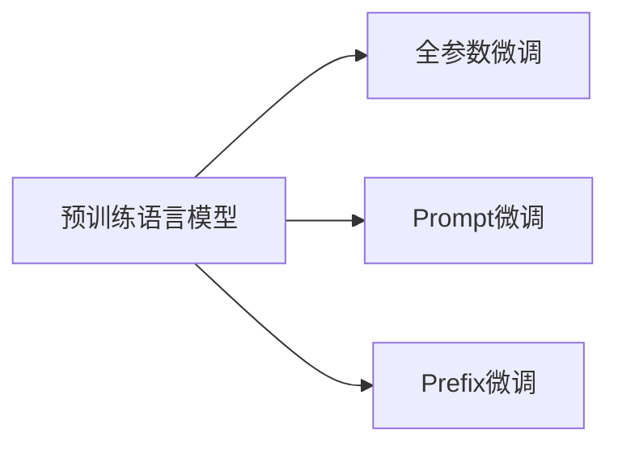

# 大语言模型应用指南：三类微调方法

## 1. 背景介绍
### 1.1 大语言模型的兴起
近年来,随着深度学习技术的飞速发展,以 Transformer 为代表的大规模语言模型(Large Language Model,LLM)在自然语言处理(NLP)领域取得了突破性的进展。从 GPT、BERT 到 GPT-3、PaLM 等,这些预训练的语言模型展现出了惊人的语言理解和生成能力,在机器翻译、问答系统、文本摘要等诸多任务上取得了超越人类的表现。

### 1.2 大语言模型面临的挑战
尽管大语言模型展现出了强大的性能,但它们在实际应用中仍然面临着诸多挑战:

1. 领域适应性:预训练的语言模型虽然具有广泛的语言知识,但对于特定领域的任务,其表现往往不尽如人意。如何将大语言模型迁移到特定领域,提升其在垂直领域的性能,是一个亟待解决的问题。

2. 数据隐私与安全:大语言模型的训练需要海量的文本数据,这些数据可能包含敏感的个人信息。如何在保护数据隐私的同时,充分利用大语言模型的能力,是一个值得关注的议题。

3. 计算资源消耗:训练大语言模型需要庞大的计算资源,动辄数百上千的 GPU,这对于许多组织和个人来说是难以承受的。如何在有限的计算资源下,高效地利用大语言模型,是一个亟需解决的现实问题。

### 1.3 微调:解决大语言模型应用难题的利器
微调(Fine-tuning)是解决上述挑战的重要手段。通过在特定任务的数据上对预训练的大语言模型进行二次训练,可以使模型快速适应新的领域和任务,在保留其强大语言能力的同时,大幅提升在垂直领域的性能。与从头训练模型相比,微调不仅可以显著减少所需的数据量和计算资源,还能缩短训练时间,加速模型的落地应用。

本文将重点介绍三类主要的大语言模型微调方法:全参数微调、Prompt 微调和 Prefix 微调,并结合具体的算法原理、数学模型、代码实例等,深入探讨它们的优缺点和实际应用,为大语言模型在垂直领域的落地提供指导和参考。

## 2. 核心概念与联系
### 2.1 预训练语言模型
预训练语言模型是指在大规模无标注文本数据上训练的语言模型,通过自监督学习的方式,习得语言的通用表示和知识。主流的预训练模型包括 GPT 系列、BERT 系列等。它们通常采用 Transformer 编码器或解码器结构,具有强大的语言理解和生成能力。

### 2.2 微调
微调是指在预训练语言模型的基础上,使用下游任务的有标注数据,对模型进行二次训练,使其适应特定任务。微调可以分为全参数微调、Prompt 微调、Prefix 微调等不同形式。

### 2.3 全参数微调
全参数微调(Full Fine-tuning)是最常见的微调方式,即在下游任务数据上对预训练模型的所有参数进行训练,使模型完全适应新任务。这种方法虽然简单直接,但需要较多的任务数据和计算资源。

### 2.4 Prompt 微调
Prompt 微调通过向输入文本中添加 Prompt(提示)信息,引导预训练模型执行特定任务。这种方法可以在较少的数据上取得不错的效果,但对 Prompt 设计有较高要求。常见的 Prompt 微调方法包括 PET、iPET 等。

### 2.5 Prefix 微调 
Prefix 微调通过向预训练模型的每一层添加可学习的 Prefix 向量,在冻结预训练参数的情况下,只优化 Prefix 参数,从而实现参数高效的微调。这种方法可以在保留预训练知识的同时,显著减少微调参数量。

### 2.6 概念联系
下图展示了预训练语言模型与三类微调方法之间的关系:

预训练语言模型是微调的基础,不同的微调方法在此基础上进行改进,以实现更高效、更精准的模型适应。

## 3. 核心算法原理与具体操作步骤
### 3.1 全参数微调
#### 3.1.1 算法原理
全参数微调的核心思想是在预训练模型的