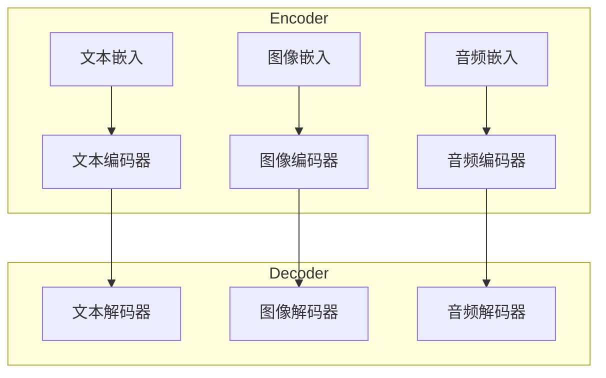

# 大语言模型应用指南：什么是多模态

## 1.背景介绍

### 1.1 人工智能的发展历程

人工智能(Artificial Intelligence, AI)是当代科技发展的前沿领域,自20世纪50年代问世以来,已经经历了几个重要的发展阶段。早期的人工智能系统主要集中在特定的任务上,如机器人控制、游戏对弈等,这些系统通常采用符号主义方法,利用规则和逻辑推理来解决问题。

随着计算能力和数据量的不断增长,机器学习(Machine Learning)技术开始崛起,使人工智能系统能够从海量数据中自动学习模式和规律。在机器学习的基础上,深度学习(Deep Learning)技术应运而生,通过构建深层神经网络模型,能够自动从原始数据中提取出多层次的抽象特征表示,显著提高了人工智能系统在诸多领域的性能表现。

### 1.2 大语言模型的兴起

近年来,以Transformer为代表的大型神经网络语言模型取得了突破性进展,在自然语言处理(Natural Language Processing, NLP)任务上展现出了惊人的能力。这些大语言模型通过在海量文本数据上进行预训练,学习到了丰富的语义和语法知识,能够生成流畅、连贯的文本内容。

GPT(Generative Pre-trained Transformer)是其中最具代表性的大语言模型之一,它由OpenAI公司于2018年提出。GPT及其后续版本GPT-2、GPT-3凭借庞大的参数量和创新的训练方法,在文本生成、问答、文本摘要等多个NLP任务上取得了领先的表现。

除了GPT系列,还有谷歌的BERT(Bidirectional Encoder Representations from Transformers)、微软的MT-NLG(Multitask Trained Neural Language Generation)等知名大语言模型,它们极大地推动了自然语言处理技术的发展。

### 1.3 大语言模型的局限性

尽管大语言模型取得了令人瞩目的成就,但它们也存在一些明显的局限性:

1. **单一模态**: 现有的大语言模型主要专注于处理文本数据,难以直接处理图像、视频、音频等其他模态的数据。
2. **缺乏常识推理能力**: 大语言模型虽然掌握了丰富的语言知识,但缺乏对真实世界的理解和推理能力,容易产生不合理或者矛盾的输出。
3. **缺乏交互能力**: 大部分大语言模型都是单向的文本生成模型,无法与人类进行自然的对话交互。
4. **缺乏可解释性**: 大语言模型的内部运作机制是一个"黑箱",很难解释其预测结果的原因和过程。

为了克服这些局限性,研究人员开始探索多模态大语言模型(Multimodal Large Language Models),试图将不同模态的信息融合到统一的模型框架中,从而拓展大语言模型的能力边界。

## 2.核心概念与联系

### 2.1 什么是多模态

在人工智能领域,模态(Modality)指的是信息的呈现形式或传感器类型。常见的模态包括:

- **文本**(Text): 以文字形式呈现的语言信息。
- **图像**(Image): 通过摄像头、扫描仪等设备获取的视觉信息。
- **视频**(Video): 一系列按时间顺序排列的动态图像。
- **音频**(Audio): 通过麦克风等设备获取的声音信息。
- **点云**(Point Cloud): 通过激光雷达等设备获取的三维空间点集信息。

多模态(Multimodal)是指同时涉及多种模态信息的任务或系统。例如,一个多模态对话系统需要同时处理用户的语音输入和相关的图像或视频信息。

在现实世界中,信息通常是多模态的,人类能够自然地融合并理解来自不同感官的多模态输入。因此,构建能够像人一样处理多模态信息的人工智能系统,是实现通用人工智能(Artificial General Intelligence, AGI)的重要一步。

### 2.2 多模态大语言模型

多模态大语言模型(Multimodal Large Language Model)旨在将不同模态的信息融合到统一的大型语言模型框架中,实现跨模态的表示学习和推理能力。

与单一模态的大语言模型相比,多模态大语言模型需要解决以下关键问题:

1. **多模态融合**:如何有效地将不同模态的信息融合到统一的表示空间中?
2. **模态对齐**:如何建立不同模态之间的语义对应关系?
3. **模态无关性**:如何使模型具有良好的模态无关性,能够灵活地处理任意组合的多模态输入?
4. **计算效率**:如何在保证性能的同时,控制多模态模型的计算复杂度和内存占用?

多模态大语言模型通常采用Transformer等注意力机制作为核心架构,并在此基础上引入多模态融合模块、对齐模块等创新组件,实现跨模态的表示学习和推理能力。

### 2.3 多模态大语言模型的优势

相比单一模态的大语言模型,多模态大语言模型具有以下优势:

1. **更全面的信息表示能力**:能够同时捕获和融合来自不同模态的丰富信息,更好地理解和表达真实世界的多模态现象。
2. **更强的推理和决策能力**:通过综合利用多模态信息,能够做出更准确、更合理的推理和决策。
3. **更广阔的应用前景**:多模态大语言模型可以应用于视觉问答、多模态对话、多模态内容生成等多个前沿领域,推动人工智能技术的发展。

然而,多模态大语言模型也面临着诸多挑战,如模态融合的困难、训练数据的稀缺、计算资源的消耗等,这些都需要研究人员进一步探索和创新。

## 3.核心算法原理具体操作步骤 

### 3.1 Transformer编码器-解码器架构

多模态大语言模型通常采用Transformer的编码器-解码器(Encoder-Decoder)架构作为基础框架。如下图所示:

编码器(Encoder)的作用是将不同模态的输入(如文本、图像、音频等)映射到统一的向量空间中,得到模态无关的语义表示。解码器(Decoder)则根据编码器的输出和任务目标,生成相应模态的输出(如文本生成、图像生成等)。

### 3.2 多模态融合策略

为了实现不同模态信息的有效融合,多模态大语言模型采用了多种融合策略,包括:

1. **早期融合**(Early Fusion):在输入层将不同模态的特征直接拼接,送入后续的编码器模块进行融合。
2. **晚期融合**(Late Fusion):分别对每一个模态进行独立编码,然后在较高层次将不同模态的表示进行融合。
3. **交互式融合**(Interactive Fusion):在编码器的每一层都引入跨模态的注意力机制,实现不同模态之间的交互和融合。

不同的融合策略各有优缺点,需要根据具体任务和数据特点进行选择和设计。

### 3.3 模态对齐机制

由于不同模态的输入数据具有不同的时间、空间和语义结构,因此需要设计模态对齐机制,建立模态之间的对应关系。常见的模态对齐方法包括:

1. **注意力对齐**:利用自注意力机制,自动学习不同模态之间的相关性,实现软对齐。
2. **对象级对齐**:在图像或视频中检测出关键对象,将其与文本中的实体词进行显式对齐。
3. **时空对齐**:利用时间戳或空间坐标信息,将不同模态的输入在时间或空间维度上进行对齐。

模态对齐机制能够增强模型对跨模态信息的理解能力,提高多模态表示的质量。

### 3.4 预训练-微调范式

与大语言模型类似,多模态大语言模型也普遍采用预训练-微调(Pre-training and Fine-tuning)的范式进行模型训练:

1. **预训练阶段**:在大规模的多模态数据集(如图文对、视频字幕等)上进行自监督预训练,学习通用的多模态表示。
2. **微调阶段**:将预训练模型在特定的下游任务数据集上进行微调,使模型适应具体的任务需求。

预训练阶段的目标是获取丰富的多模态知识,而微调阶段则是将这些知识迁移并特化到具体的应用场景中。这种分阶段训练范式能够充分利用大规模数据的优势,显著提高多模态模型的性能表现。

## 4.数学模型和公式详细讲解举例说明

### 4.1 Transformer自注意力机制

Transformer模型中的自注意力(Self-Attention)机制是实现多模态融合和对齐的关键。自注意力机制能够自动捕获输入序列中任意两个位置之间的长程依赖关系,从而学习更加丰富和精确的表示。

给定一个输入序列 $\boldsymbol{X} = (x_1, x_2, \dots, x_n)$,其中 $x_i \in \mathbb{R}^{d_\text{model}}$ 表示第 $i$ 个位置的输入向量,自注意力机制的计算过程如下:

1. 将输入序列 $\boldsymbol{X}$ 分别线性映射到查询(Query)、键(Key)和值(Value)空间:

$$
\begin{aligned}
\boldsymbol{Q} &= \boldsymbol{X} \boldsymbol{W}^Q \\
\boldsymbol{K} &= \boldsymbol{X} \boldsymbol{W}^K \\
\boldsymbol{V} &= \boldsymbol{X} \boldsymbol{W}^V
\end{aligned}
$$

其中 $\boldsymbol{W}^Q, \boldsymbol{W}^K, \boldsymbol{W}^V \in \mathbb{R}^{d_\text{model} \times d_k}$ 为可学习的线性映射参数。

2. 计算查询 $\boldsymbol{Q}$ 与所有键 $\boldsymbol{K}$ 之间的点积,得到注意力分数矩阵:

$$
\boldsymbol{A} = \text{softmax}\left(\frac{\boldsymbol{Q}\boldsymbol{K}^\top}{\sqrt{d_k}}\right)
$$

其中 $\sqrt{d_k}$ 是一个缩放因子,用于防止内积值过大导致梯度饱和。

3. 将注意力分数矩阵 $\boldsymbol{A}$ 与值 $\boldsymbol{V}$ 相乘,得到加权后的值向量作为自注意力的输出:

$$
\text{Attention}(\boldsymbol{Q}, \boldsymbol{K}, \boldsymbol{V}) = \boldsymbol{A}\boldsymbol{V}
$$

自注意力机制能够自动学习输入序列中不同位置之间的相关性,并据此对序列进行加权编码,生成更加丰富和精确的表示向量。在多模态大语言模型中,自注意力机制被广泛应用于不同模态之间的融合和对齐操作。

### 4.2 Vision Transformer

Vision Transformer(ViT)是将Transformer编码器直接应用于图像数据的一种方法,它为多模态大语言模型处理视觉信息提供了有力支持。

给定一个输入图像 $\boldsymbol{I} \in \mathbb{R}^{H \times W \times C}$,ViT首先将其分割为一个个图像patch(图像块),并将每个patch映射为一个向量:

$$
\boldsymbol{x}_p = \boldsymbol{E}_\text{patch}(\boldsymbol{I}_{p}) + \boldsymbol{E}_\text{pos}(p)