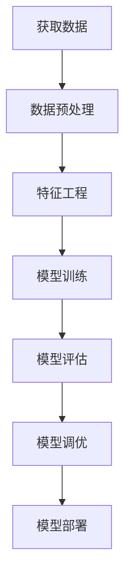
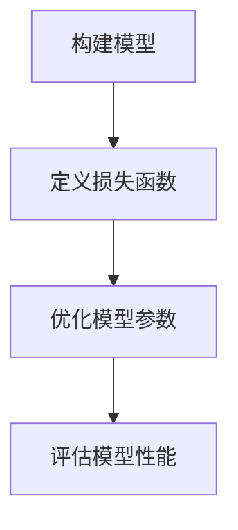

# 大语言模型应用指南：什么是机器学习

## 1. 背景介绍

### 1.1 人工智能的兴起

人工智能(Artificial Intelligence, AI)是当代科技发展的一个重要领域,旨在使机器能够模仿人类的认知功能,如学习、推理、感知和行为适应等。随着计算能力的不断提高和大数据时代的到来,人工智能技术得到了前所未有的发展,已广泛应用于语音识别、图像处理、自然语言处理、专家系统等诸多领域,极大地提高了工作效率,优化了人类的生活方式。

### 1.2 机器学习在人工智能中的地位

在人工智能的多个分支中,机器学习(Machine Learning)是最为关键的一个技术支柱。机器学习赋予了计算机在没有明确程序的情况下,通过数据自主学习获取知识的能力。通过机器学习算法对大量数据进行训练,计算机可以发现数据中蕴含的规律,并对新的数据做出预测和决策。

机器学习已经渗透到人工智能的方方面面,是实现人工智能的核心驱动力。无论是计算机视觉、自然语言处理、推荐系统还是机器人控制等领域,都离不开机器学习技术的支撑。

## 2. 核心概念与联系

### 2.1 什么是机器学习

机器学习是一门研究如何构建能从数据中自动分析获得规律,并利用规律对未知数据进行预测的计算机算法理论。其核心思想是:利用算法构建能对数据进行泛化的数学模型,使计算机可以不断学习,获取新的知识。

机器学习算法可以分为三大类:

1. **监督学习**(Supervised Learning)
2. **无监督学习**(Unsupervised Learning) 
3. **强化学习**(Reinforcement Learning)

### 2.2 监督学习

监督学习是机器学习中最常见和最成熟的一种范式。在监督学习中,算法通过学习大量带有标签的训练数据,建立输入与输出之间的映射关系模型,再对新的未知数据进行预测和分类。

典型的监督学习任务包括:

- **分类**(Classification):根据输入数据对其进行分类,如垃圾邮件分类、图像识别等。
- **回归**(Regression):根据输入数据预测一个连续的数值输出,如房价预测、销量预测等。

常用的监督学习算法有:线性回归、逻辑回归、决策树、支持向量机、神经网络等。

### 2.3 无监督学习  

无监督学习不需要人工标注的训练数据,算法能够自动从未标记的原始数据中发现内在的模式和规律。无监督学习主要用于数据的聚类和降维。

典型的无监督学习任务包括:

- **聚类**(Clustering):根据数据之间的相似性自动将数据划分为若干个簇,如客户分群、新闻分类等。
- **降维**(Dimensionality Reduction):将高维数据映射到低维空间,以提高后续任务的性能,如主成分分析(PCA)、t-SNE等。

常用的无监督学习算法有:K-Means、高斯混合模型、DBSCAN、自编码器等。

### 2.4 强化学习

强化学习是一种全新的机器学习范式,它通过与环境进行交互获取反馈,并根据反馈信号调整策略,最终学习获得最优策略。这种学习方式类似于人类通过不断尝试并根据奖惩调整行为的过程。

强化学习主要应用于决策序列问题,如机器人控制、游戏AI、自动驾驶等领域。常用的强化学习算法有:Q-Learning、Sarsa、策略梯度、深度Q网络等。

### 2.5 机器学习工作流程

尽管具体的机器学习算法有所不同,但是整个机器学习的工作流程大致如下:

1. **获取数据**: 收集待分析的原始数据,可能来源于各种传感器、日志文件、数据库等。
2. **数据预处理**: 对原始数据进行清洗、标准化、缺失值处理等,将数据转化为算法可以接受的格式。
3. **特征工程**: 从原始数据中提取有价值的特征,对特征进行选择和降维等操作。
4. **模型训练**: 选择合适的机器学习算法,使用训练数据训练模型参数。
5. **模型评估**: 在保留的测试数据集上评估模型的性能,如准确率、召回率等指标。  
6. **模型调优**: 根据模型评估结果,通过调整算法超参数、特征等方式提升模型性能。
7. **模型部署**: 将训练好的模型集成到实际的系统或产品中,应用于解决实际问题。

## 3. 核心算法原理具体操作步骤

机器学习算法的核心思想是基于训练数据学习一个能够对未知数据进行泛化的模型。不同的算法对应不同的模型形式和学习策略,但都遵循以下基本步骤:

### 3.1 构建模型

首先需要根据学习任务的特点,选择一个合适的模型形式,如线性模型、决策树、神经网络等。模型由一些可学习的参数构成,这些参数控制着模型的行为,需要通过训练数据进行学习。

例如,在线性回归任务中,我们构建的模型是:

$$y = w_1x_1 + w_2x_2 + \cdots + w_nx_n + b$$

其中$w_i$和$b$就是需要学习的参数。

### 3.2 定义损失函数

为了判断模型的好坏,我们需要定义一个损失函数(Loss Function)或目标函数,用于衡量模型的预测输出与真实值之间的差异。损失函数越小,模型就越精确。

常用的损失函数有:

- 均方误差(Mean Squared Error): $\text{MSE} = \frac{1}{n}\sum_{i=1}^{n}(y_i - \hat{y}_i)^2$
- 交叉熵(Cross Entropy): $\text{CE} = -\frac{1}{n}\sum_{i=1}^{n}[y_i\log\hat{y}_i + (1-y_i)\log(1-\hat{y}_i)]$

其中$y_i$是真实值,$\hat{y}_i$是模型预测值。

### 3.3 优化模型参数

机器学习算法的目标是找到一组最优参数,使得损失函数的值最小。这通常通过一种优化算法来实现,如梯度下降(Gradient Descent)。

梯度下降的基本思路是:沿着损失函数对参数的梯度的反方向,以一定的学习率不断更新参数值,直到损失函数收敛到一个最小值。

$$\theta_{t+1} = \theta_t - \eta \frac{\partial L}{\partial \theta_t}$$

其中$\theta$是模型参数,$L$是损失函数,$\eta$是学习率。

对于复杂的非凸优化问题,还可以使用一些更高级的优化算法,如L-BFGS、Adam等。

### 3.4 评估模型性能

在训练过程中,我们会将数据分为训练集和测试集。训练集用于模型训练,测试集用于评估最终模型在未知数据上的泛化能力。

常用的模型评估指标有:

- 分类任务:准确率(Accuracy)、精确率(Precision)、召回率(Recall)、F1分数等
- 回归任务:均方根误差(RMSE)、平均绝对误差(MAE)等

如果测试集上的性能不理想,则需要返回前面的步骤,通过调整模型形式、特征、超参数等方式进一步优化模型。

## 4. 数学模型和公式详细讲解举例说明

机器学习算法大多建立在数学基础之上,利用数学模型对数据进行建模和分析。以下我们以线性回归和逻辑回归为例,具体讲解其中的数学原理。

### 4.1 线性回归

线性回归是最基础和常用的一种监督学习算法,旨在学习出输入变量$\mathbf{x}$和输出变量$y$之间的线性关系:

$$y = w_1x_1 + w_2x_2 + \cdots + w_nx_n + b$$

其中$\mathbf{w} = (w_1, w_2, \cdots, w_n)$是模型参数,也叫权重或系数;$b$是偏置项。

我们的目标是基于已知的训练数据集$\{(\mathbf{x}^{(i)}, y^{(i)})\}_{i=1}^{m}$,学习得到最优参数$\mathbf{w}^*, b^*$,使得对于任意一个新的输入$\mathbf{x}^{(new)}$,模型都能给出较为准确的预测输出$\hat{y}^{(new)}$。

通常我们采用最小二乘法,将均方误差(MSE)作为损失函数:

$$J(\mathbf{w}, b) = \frac{1}{2m}\sum_{i=1}^{m}(y^{(i)} - (w_1x_1^{(i)} + \cdots + w_nx_n^{(i)} + b))^2$$

其中$m$是训练样本的个数。我们需要找到$\mathbf{w}^*, b^*$使得$J(\mathbf{w}^*, b^*)$最小。

通过对$J$求偏导并令其等于0,可以得到$\mathbf{w}^*, b^*$的解析解。也可以使用梯度下降法进行迭代求解:

$$
\begin{align*}
w_j &\leftarrow w_j - \alpha \frac{1}{m} \sum_{i=1}^{m} (y^{(i)} - \hat{y}^{(i)})x_j^{(i)} \\
b &\leftarrow b - \alpha \frac{1}{m} \sum_{i=1}^{m} (y^{(i)} - \hat{y}^{(i)})
\end{align*}
$$

其中$\alpha$是学习率。

线性回归的优点是简单高效,但也有局限性,即只能学习线性模型,对于非线性问题效果不佳。

### 4.2 逻辑回归

逻辑回归(Logistic Regression)是一种广泛使用的分类算法,可以用于二分类问题。其基本思想是:利用线性回归模型作为分类器的分数函数,然后通过逻辑sigmoid函数将其值映射到(0,1)区间,作为样本属于正类的概率估计。

对于二分类问题,我们定义$y \in \{0, 1\}$,其中$y=1$表示正类,$y=0$表示负类。逻辑回归模型为:

$$h_\theta(x) = g(\theta^Tx) = \frac{1}{1 + e^{-\theta^Tx}}$$

其中$x$是输入特征向量,$\theta$是模型参数,称为权重向量;$g(z)=\frac{1}{1+e^{-z}}$是sigmoid函数,将线性分数$\theta^Tx$映射到(0,1)区间。

我们的目标是基于训练数据集$\{(x^{(i)}, y^{(i)})\}$,学习得到最优参数$\theta^*$,使得对于任意新输入$x^{(new)}$,模型都能给出正确的二分类预测$\hat{y}^{(new)}$。

通常采用最大似然估计的方法,将对数似然函数作为目标函数:

$$J(\theta) = -\frac{1}{m}\sum_{i=1}^{m}[y^{(i)}\log h_\theta(x^{(i)}) + (1-y^{(i)})\log(1-h_\theta(x^{(i)}))]$$

我们需要找到$\theta^*$使得$J(\theta^*)$最大。这相当于最小化$J$的相反数,即最小化交叉熵损失函数:

$$\text{CE}(\theta) = -\frac{1}{m}\sum_{i=1}^{m}[y^{(i)}\log h_\theta(x^{(i)}) + (1-y^{(i)})\log(1-h_\theta(x^{(i)}))]$$

同样可以使用梯度下降法对$\theta$进行