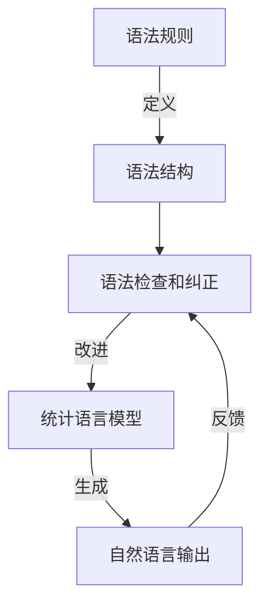

# 大语言模型应用指南：使用更清晰的语法

## 1.背景介绍

随着人工智能和自然语言处理技术的不断进步,大型语言模型(Large Language Models, LLMs)已经成为各大科技公司和研究机构的热门研究领域。这些模型通过在海量文本数据上进行训练,能够生成看似人类写作的自然语言输出,在机器翻译、问答系统、文本摘要和内容生成等领域发挥着越来越重要的作用。

然而,尽管大型语言模型在生成流畅、通顺的语言方面表现出色,但它们生成的语言并不总是清晰、准确和符合语法规范。为了提高生成语言的质量和可读性,我们需要采用更清晰的语法规则和语法检查机制,以确保生成的文本更加准确、简洁和易于理解。

### 1.1 大型语言模型的挑战

尽管大型语言模型在生成自然语言方面取得了长足进步,但它们仍然面临一些挑战:

1. **语法错误**: 由于训练数据中存在语法错误,模型可能会学习并复制这些错误,导致生成的语言存在语法缺陷。

2. **歧义和不一致**: 模型可能会生成含有歧义或内部不一致的语句,影响语义的清晰度和可读性。

3. **冗长和啰嗦**: 模型倾向于生成冗长的语句,缺乏简洁性和精炼度。

4. **上下文不当**: 生成的语言可能与上下文不相符,导致语义不连贯或逻辑错误。

### 1.2 清晰语法的重要性

采用更清晰的语法规则和语法检查机制,可以帮助解决上述挑战,提高生成语言的质量和可读性。清晰的语法不仅有助于提高文本的可理解性,还可以确保生成的内容符合语言规范,减少歧义和错误。这对于自动生成的内容尤为重要,因为它们需要与人类读者进行有效沟通。

通过引入语法检查和纠正机制,我们可以在生成语言的同时,实时检测和纠正语法错误、歧义和不一致性。这将有助于提高生成语言的准确性和可读性,从而增强人机交互的质量和效率。

## 2.核心概念与联系

为了更好地理解和应用清晰的语法规则,我们需要了解一些核心概念及它们之间的联系。

### 2.1 语法规则

语法规则是一种形式化的规则系统,用于描述一种语言的结构和组成部分之间的关系。它们定义了单词、短语和句子的正确排列方式,以及它们在语言中的功能和用法。

语法规则通常分为以下几个层次:

1. **词法规则**: 定义单词的构成,如何将字符序列识别为有效的单词。

2. **句法规则**: 定义如何将单词组合成短语和句子的有效结构。

3. **语义规则**: 确保生成的语句具有正确的含义和逻辑一致性。

4. **语用规则**: 确保生成的语言适合特定的上下文和交流目的。

通过遵循这些规则,我们可以生成符合语言规范的正确语句。然而,由于自然语言的复杂性和例外情况的存在,纯粹依赖规则并不总是可行的。因此,我们需要结合统计模型和机器学习技术来处理语言的不确定性和模糊性。

### 2.2 统计语言模型

统计语言模型是一种基于概率的模型,用于预测给定上下文中下一个单词或序列的可能性。它们通过分析大量语料库数据,学习单词之间的共现模式和语法结构,从而能够生成看似自然的语言。

统计语言模型可以捕捉语言的统计规律,但并不直接编码语法规则。相反,它们依赖于从训练数据中学习到的模式,这些模式可能包含错误和不一致性。因此,统计语言模型虽然能够生成流畅的语言,但并不能保证生成的语言符合语法规范。

### 2.3 语法检查和纠正

语法检查和纠正是一种技术,用于自动检测和纠正生成语言中的语法错误、歧义和不一致性。它通常涉及以下步骤:

1. **标注化**: 将文本分解为单词、短语和句子等语法单元。

2. **解析**: 根据语法规则分析语句的结构和组成部分之间的关系。

3. **错误检测**: 识别语句中违反语法规则的部分。

4. **错误纠正**: 根据语法规则和上下文信息,提出可能的纠正建议。

5. **重新生成**: 将纠正后的语句重新组合成连贯的文本。

语法检查和纠正可以作为统计语言模型的补充,帮助提高生成语言的准确性和可读性。它们可以与语言模型紧密集成,在生成语言的同时实时检查和纠正语法错误。

### 2.4 核心概念关系

上述核心概念之间存在密切的联系,如下图所示:

1. 语法规则定义了语言的正确结构和组成部分之间的关系。

2. 语法结构是根据语法规则构建的,用于表示语句的组成和层次关系。

3. 语法检查和纠正利用语法规则和语法结构,检测和纠正生成语言中的错误和不一致性。

4. 统计语言模型基于训练数据学习语言的统计规律,用于生成自然语言输出。

5. 语法检查和纠正可以对统计语言模型生成的输出进行改进,提高其准确性和可读性。

6. 改进后的语言输出可以反馈到语法检查和纠正模块,用于进一步优化和训练。

通过将语法规则、语法结构、语法检查和纠正以及统计语言模型有机结合,我们可以生成更清晰、准确和符合语法规范的自然语言输出。

## 3.核心算法原理具体操作步骤

在实现语法检查和纠正功能时,我们需要遵循一些核心算法原理和具体操作步骤。下面将详细介绍这些步骤。

### 3.1 标注化

标注化是将文本分解为单词、短语和句子等语法单元的过程。这是语法分析和错误检测的基础步骤。常见的标注化算法包括:

1. **分词算法**: 将文本序列分割成单词序列。可以使用基于规则的方法(如正则表达式)或基于统计的方法(如最大熵模型、条件随机场等)。

2. **词性标注算法**: 为每个单词分配相应的词性标记(如名词、动词、形容词等)。常用算法包括隐马尔可夫模型(HMM)、最大熵模型和双向长短期记忆网络(Bi-LSTM)等。

3. **命名实体识别算法**: 识别文本中的命名实体(如人名、地名、组织名等)。常用算法包括条件随机场(CRF)、最大熵模型和神经网络模型等。

4. **句子边界检测算法**: 确定句子的起止位置。可以使用基于规则的方法(如标点符号规则)或基于机器学习的方法(如最大熵模型、条件随机场等)。

标注化的质量直接影响后续的语法分析和错误检测的准确性。因此,选择合适的算法并进行充分的训练和调优是非常重要的。

### 3.2 语法分析

语法分析是根据语法规则分析语句的结构和组成部分之间的关系。常见的语法分析算法包括:

1. **上下文无关文法(CFG)分析**: 使用上下文无关文法规则对句子进行递归下降分析或移进-规约分析。这种方法简单高效,但无法处理某些复杂的语法现象。

2. **依存语法分析**: 构建句子中单词之间的依存关系树,表示单词之间的修饰和被修饰关系。常用算法包括基于转移的依存分析和基于图的依存分析。

3. **约束语法分析**: 结合语法规则和统计信息进行分析,可以更好地处理歧义和不确定性。常用算法包括概率上下文无关文法(PCFG)和约束上下文无关文法(CCFG)。

4. **神经网络语法分析**: 使用神经网络模型(如递归神经网络、图神经网络等)直接学习句子的语法结构,无需显式定义语法规则。

语法分析的结果通常以语法树或依存关系树的形式表示,为后续的错误检测和纠正提供了基础。不同的语法分析算法在准确性、效率和适用范围上各有优缺点,需要根据具体应用场景进行选择和调优。

### 3.3 错误检测

错误检测是识别语句中违反语法规则的部分。常见的错误检测算法包括:

1. **基于规则的错误检测**: 根据预定义的语法规则和模式,检测语句中是否存在违反这些规则的情况。这种方法简单高效,但需要手动定义规则,覆盖面有限。

2. **基于统计的错误检测**: 使用机器学习模型(如最大熵模型、支持向量机等)根据特征向量判断语句是否存在错误。这种方法可以自动学习错误模式,但需要大量标注数据进行训练。

3. **基于语言模型的错误检测**: 利用统计语言模型计算语句的概率,如果概率较低,则认为可能存在错误。这种方法可以捕捉语言的统计规律,但无法直接检测语法错误。

4. **基于语法分析的错误检测**: 根据语法分析的结果(如语法树或依存关系树),检测是否存在违反语法规则的情况。这种方法可以直接检测语法错误,但需要高质量的语法分析结果。

错误检测算法的选择取决于具体应用场景和数据特征。在实际应用中,通常会结合多种算法,以提高错误检测的准确性和覆盖面。

### 3.4 错误纠正

错误纠正是根据语法规则和上下文信息,提出可能的纠正建议。常见的错误纠正算法包括:

1. **基于规则的错误纠正**: 根据预定义的纠正规则和模式,对检测到的错误进行纠正。这种方法简单高效,但需要手动定义规则,覆盖面有限。

2. **基于统计的错误纠正**: 使用机器学习模型(如序列标注模型、序列到序列模型等)直接学习错误和纠正之间的映射关系。这种方法可以自动学习纠正模式,但需要大量标注数据进行训练。

3. **基于语言模型的错误纠正**: 生成多个候选纠正结果,选择概率最高的作为最终结果。这种方法可以利用语言模型的知识,但可能会产生语法正确但语义不当的结果。

4. **基于语法分析的错误纠正**: 根据语法分析的结果和语法规则,对检测到的错误进行纠正。这种方法可以保证纠正后的结果符合语法规则,但需要高质量的语法分析结果。

错误纠正算法的选择需要考虑准确性、效率和可解释性等因素。在实际应用中,通常会结合多种算法,并根据具体场景进行调优和优化。

### 3.5 重新生成

重新生成是将纠正后的语句重新组合成连贯的文本。这个过程通常包括以下步骤:

1. **结构调整**: 根据纠正后的语法结构,调整语句的词序和短语位置。

2. **词形还原**: 将标注化过程中分解的词形(如时态、数量等)还原为原始形式。

3. **大小写处理**: 根据上下文和规则,调整单词的大小写形式。

4. **标点符号处理**: 插入或调整标点符号,确保符合语法和语义要求。

5. **连接处理**: 将单个语句连接成段落或更长的文本,保持语义连