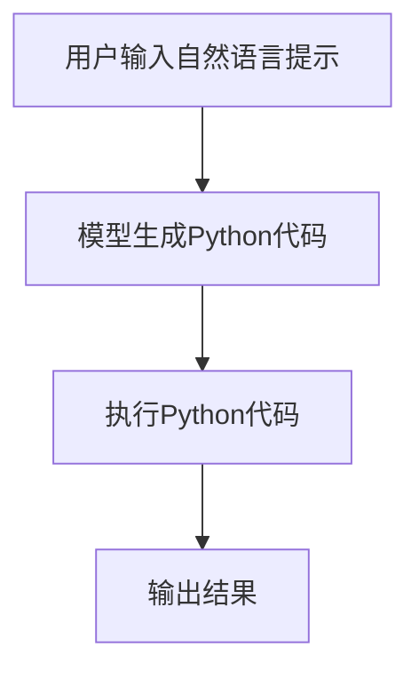

# 大语言模型应用指南：执行Python代码

## 1.背景介绍

随着人工智能技术的不断发展,大型语言模型(Large Language Models, LLMs)已经成为当前最引人注目的技术之一。这些模型通过在海量文本数据上进行训练,能够生成看似人类写作的自然语言输出。而最近,一种新兴的应用场景引起了广泛关注:利用大型语言模型直接执行编程任务,包括生成、解释和运行代码。

虽然传统的编程范式需要开发人员手动编写每一行代码,但借助大型语言模型的强大能力,我们现在可以使用自然语言指令来完成编程任务。这种新颖的交互方式不仅提高了开发效率,而且为非专业程序员提供了一种更加友好的编程体验。

本文将探讨如何利用大型语言模型执行Python代码,包括模型的工作原理、实现细节以及实际应用案例。我们将深入剖析这项令人兴奋的新技术,并展望其未来发展方向。

## 2.核心概念与联系

### 2.1 大型语言模型

大型语言模型是一种基于深度学习的自然语言处理(NLP)模型,通过在大量文本数据上进行训练,能够生成看似人类写作的自然语言输出。这些模型通常采用transformer架构,具有数十亿甚至上百亿个参数,能够捕捉语言的复杂模式和语义关系。

一些著名的大型语言模型包括:

- GPT(Generative Pre-trained Transformer)系列模型,由OpenAI开发
- BERT(Bidirectional Encoder Representations from Transformers),由Google开发
- T5(Text-to-Text Transfer Transformer),由Google开发
- PanGu系列模型,由华为云开发

这些模型在自然语言生成、机器翻译、问答系统等领域表现出色,并且正在不断推进人工智能的发展。

### 2.2 执行Python代码

Python是一种广泛使用的通用编程语言,以其简洁、易读和跨平台特性而著称。在传统的编程范式中,开发人员需要手动编写每一行Python代码,并通过编译器或解释器执行。

然而,借助大型语言模型的强大能力,我们现在可以使用自然语言指令来完成Python编程任务。用户只需输入一个描述性的提示,模型就能够生成相应的Python代码,并直接执行该代码。这种新颖的交互方式极大地提高了开发效率,为非专业程序员提供了一种更加友好的编程体验。

### 2.3 核心联系

大型语言模型和执行Python代码之间的关键联系在于,模型通过在大量代码和自然语言描述上进行训练,学习了将自然语言映射到编程语言的能力。当用户输入一个自然语言提示时,模型会根据其训练数据生成最可能的Python代码,并将其执行以产生预期的输出。

这种新颖的交互方式打破了传统编程的界限,为人工智能在软件开发领域的应用开辟了新的可能性。通过利用大型语言模型的强大能力,我们可以更高效地完成编程任务,并为非专业程序员提供更加友好的编码体验。

## 3.核心算法原理具体操作步骤

利用大型语言模型执行Python代码的核心算法原理可以概括为以下几个步骤:



### 3.1 用户输入自然语言提示

第一步是用户输入一个自然语言提示,描述他们想要完成的编程任务。这个提示可以是一个简单的指令,如"编写一个打印'Hello, World!'的Python程序",也可以是一个更加复杂的需求描述,如"编写一个Python函数,接受一个字符串列表作为输入,并返回列表中最长的字符串"。

### 3.2 模型生成Python代码

接收到用户的自然语言提示后,大型语言模型会根据其训练数据生成相应的Python代码。这个过程涉及模型的自然语言理解和代码生成能力。

模型首先需要理解用户提示中的语义,包括任务目标、输入输出要求等。然后,它会搜索其训练数据中与该任务相关的代码片段,并组合、修改这些代码片段以生成新的Python代码。

在生成代码的过程中,模型会考虑代码的语法正确性、可读性和效率等因素,以确保生成的代码能够正确执行并满足用户需求。

### 3.3 执行Python代码

一旦模型生成了Python代码,下一步就是执行这段代码。这通常需要一个专门的代码执行环境,如Python解释器或Jupyter Notebook等。

在执行代码之前,可能需要对代码进行一些预处理,如导入必要的库、定义输入变量等。然后,代码执行环境会按照代码的逻辑依次执行每一条语句,直到完成整个程序。

### 3.4 输出结果

最后一步是将执行结果呈现给用户。根据程序的不同,输出结果可能是一个简单的文本或数值,也可能是一个复杂的数据结构或可视化图形。

在某些情况下,输出结果可能会作为新的自然语言提示反馈给模型,以启动一个新的代码生成和执行循环,实现更加复杂的交互式编程体验。

通过上述步骤,大型语言模型能够根据用户的自然语言提示生成和执行Python代码,从而实现无需手动编码即可完成编程任务的目标。这种新颖的交互方式极大地提高了开发效率,为非专业程序员提供了一种更加友好的编程体验。

## 4.数学模型和公式详细讲解举例说明

虽然利用大型语言模型执行Python代码主要依赖于模型的自然语言理解和代码生成能力,但是在模型训练和优化过程中,也涉及了一些数学模型和公式。本节将详细介绍其中的一些核心概念和方法。

### 4.1 transformer架构

大多数大型语言模型都采用了transformer架构,这是一种基于自注意力机制(Self-Attention)的序列到序列(Seq2Seq)模型。transformer架构的核心思想是通过自注意力机制捕捉输入序列中不同位置之间的依赖关系,从而更好地建模序列数据。

transformer模型的数学表示可以概括为以下公式:

$$Y = \text{Transformer}(X)$$

其中,$$X$$表示输入序列,$$Y$$表示输出序列。transformer模型的目标是学习一个映射函数,将输入序列$$X$$转换为期望的输出序列$$Y$$。

自注意力机制是transformer架构的核心组件,它的数学表示如下:

$$\text{Attention}(Q, K, V) = \text{softmax}\left(\frac{QK^T}{\sqrt{d_k}}\right)V$$

其中,$$Q$$、$$K$$和$$V$$分别表示查询(Query)、键(Key)和值(Value)向量,$$d_k$$是缩放因子。自注意力机制通过计算查询向量与所有键向量的相似性得分,并根据这些得分对值向量进行加权求和,从而捕捉输入序列中不同位置之间的依赖关系。

在大型语言模型中,transformer架构通常会堆叠多个编码器(Encoder)和解码器(Decoder)层,以增强模型的表示能力。每一层都包含多头自注意力(Multi-Head Attention)和前馈神经网络(Feed-Forward Neural Network)等组件。

### 4.2 掩码语言模型(Masked Language Model)

掩码语言模型(Masked Language Model, MLM)是训练大型语言模型的一种常用方法,它的目标是根据上下文预测被掩码(masked)的单词。

在MLM中,模型会随机将输入序列中的一些单词替换为特殊的掩码标记(如[MASK])。模型的任务是根据剩余的上下文,预测被掩码单词的正确标签。这种方式可以促使模型学习捕捉单词之间的语义关系和依赖性。

MLM的数学表示可以写为:

$$\hat{y}_i = \text{softmax}(W_o h_i + b_o)$$

其中,$$\hat{y}_i$$表示第$$i$$个被掩码单词的预测概率分布,$$h_i$$是该位置的隐藏状态向量,$$W_o$$和$$b_o$$分别是输出层的权重矩阵和偏置向量。

在训练过程中,模型会最小化被掩码单词的交叉熵损失,以学习更好地预测被掩码单词。这种训练方式使得模型能够在看到部分上下文的情况下,生成合理的单词或短语,从而提高了模型的自然语言生成能力。

### 4.3 序列到序列模型(Seq2Seq)

序列到序列(Sequence-to-Sequence, Seq2Seq)模型是一种广泛应用于机器翻译、文本摘要和代码生成等任务的模型架构。它的核心思想是将输入序列编码为一个固定长度的向量表示,然后再将该向量解码为目标输出序列。

Seq2Seq模型通常由两个主要组件组成:编码器(Encoder)和解码器(Decoder)。编码器负责将输入序列编码为一个固定长度的向量表示,而解码器则根据该向量表示生成目标输出序列。

编码器和解码器的数学表示如下:

$$h_t = f(x_t, h_{t-1})$$
$$y_t = g(h_t, y_{t-1}, c)$$

其中,$$h_t$$表示编码器在时间步$$t$$的隐藏状态,$$f$$是编码器的递归函数;$$y_t$$表示解码器在时间步$$t$$的输出,$$g$$是解码器的递归函数,$$c$$是编码器的最终隐藏状态向量。

在代码生成任务中,Seq2Seq模型的输入序列是自然语言提示,而输出序列则是相应的代码。模型需要学习将自然语言映射到编程语言的能力,以生成正确的代码。

通过上述数学模型和公式,大型语言模型能够更好地捕捉语言的复杂模式和语义关系,从而提高自然语言理解和代码生成的能力,为执行Python代码提供了坚实的理论基础。

## 5.项目实践:代码实例和详细解释说明

为了更好地理解如何利用大型语言模型执行Python代码,我们将通过一个实际的代码示例来进行详细说明。在本节中,我们将使用OpenAI的GPT-3模型,并利用Anthropic的Constitutional AI平台进行代码生成和执行。

### 5.1 问题描述

假设我们需要编写一个Python函数,接受一个字符串列表作为输入,并返回列表中最长的字符串。这个函数应该能够处理空列表的情况,并对列表中的字符串长度进行比较。

我们将使用自然语言提示来描述这个需求,并让GPT-3模型生成相应的Python代码。

### 5.2 自然语言提示

```
Write a Python function that takes a list of strings as input and returns the longest string in the list. The function should handle the case where the input list is empty and compare the lengths of the strings in the list.
```

### 5.3 模型生成的Python代码

```python
def find_longest_string(string_list):
    if not string_list:
        return ""
    
    longest_string = ""
    for string in string_list:
        if len(string) > len(longest_string):
            longest_string = string
    
    return longest_string
```

### 5.4 代码解释

让我们逐步解释这段代码的工作原理:

1. 函数`find_longest_string`接受一个字符串列表`string_list`作为输入参数。

2. 首先,函数检查输入列表是否为空。如果是空列表,则直接返回空字符串`""`。这是为了处理空列表的特殊情况。

   ```python
   if not string_list:
       return ""
   ```

3. 接下来,函数初始化一个空字符串`longest_string`,用于存储当前发现的最长字符串。

   ```python
   longest_string = ""
   ```

4. 函数使用`for`循环遍历输入列表`string_list`中的每个字符串`string`。

   ```python
   for string in string_list:
   ```

5. 对于每个字符串`string`,函数比较其长度`len(string)`与当前最长字符串的长度`len(longest_string)`。如果`string`