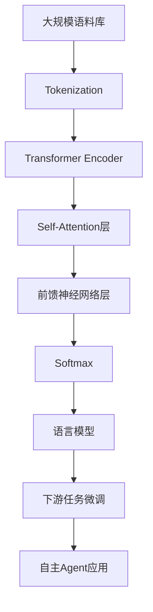

# 大语言模型应用指南：自主Agent系统

## 1. 背景介绍
### 1.1 大语言模型的发展历程
### 1.2 自主Agent系统的兴起
### 1.3 大语言模型在自主Agent中的应用前景

## 2. 核心概念与联系
### 2.1 大语言模型
#### 2.1.1 定义与特点
#### 2.1.2 训练方法
#### 2.1.3 常见的大语言模型
### 2.2 自主Agent系统
#### 2.2.1 定义与特点 
#### 2.2.2 关键组成部分
#### 2.2.3 与传统系统的区别
### 2.3 大语言模型与自主Agent的关系
#### 2.3.1 大语言模型在自主Agent中的作用
#### 2.3.2 自主Agent对大语言模型的要求
#### 2.3.3 两者结合的优势

## 3. 核心算法原理与具体操作步骤
### 3.1 基于Transformer的大语言模型
#### 3.1.1 Transformer结构
#### 3.1.2 Self-Attention机制
#### 3.1.3 位置编码
### 3.2 预训练与微调
#### 3.2.1 无监督预训练
#### 3.2.2 有监督微调
#### 3.2.3 RLHF强化学习
### 3.3 提示工程
#### 3.3.1 Few-shot Learning
#### 3.3.2 提示模板设计
#### 3.3.3 思维链



## 4. 数学模型和公式详细讲解举例说明
### 4.1 Transformer的数学描述
#### 4.1.1 Self-Attention计算
$$Attention(Q,K,V) = softmax(\frac{QK^T}{\sqrt{d_k}})V$$
其中，$Q$是查询矩阵，$K$是键矩阵，$V$是值矩阵，$d_k$是$K$的维度。

#### 4.1.2 多头注意力机制
$$MultiHead(Q,K,V) = Concat(head_1,...,head_h)W^O$$
$$head_i = Attention(QW_i^Q, KW_i^K, VW_i^V)$$
其中，$W_i^Q, W_i^K, W_i^V, W^O$是可学习的参数矩阵。

#### 4.1.3 前馈神经网络
$$FFN(x) = max(0, xW_1 + b_1)W_2 + b_2$$
其中，$W_1, b_1, W_2, b_2$是可学习的参数。

### 4.2 语言模型的概率计算
给定上下文$x_1,...,x_t$，下一个词$x_{t+1}$的概率为：
$$P(x_{t+1}|x_1,...,x_t) = \frac{exp(e_{x_{t+1}})}{\sum_{x'}exp(e_{x'})}$$
其中，$e_{x'}$是词$x'$的嵌入向量。

## 5. 项目实践：代码实例和详细解释说明
### 5.1 使用Hugging Face的Transformers库
```python
from transformers import AutoTokenizer, AutoModelForCausalLM

tokenizer = AutoTokenizer.from_pretrained("gpt2")
model = AutoModelForCausalLM.from_pretrained("gpt2")

prompt = "The quick brown fox"
input_ids = tokenizer.encode(prompt, return_tensors='pt')

output = model.generate(input_ids, max_length=50, num_return_sequences=5, no_repeat_ngram_size=2, early_stopping=True)

for i in range(5):
    print(f"Generated text {i+1}: {tokenizer.decode(output[i], skip_special_tokens=True)}")
```

上述代码使用了预训练的GPT-2模型，输入一个提示文本，然后生成5个不同的续写文本。其中使用了`no_repeat_ngram_size`参数避免重复生成相同的n-gram，`early_stopping`参数在生成结束标记时提前停止生成。

### 5.2 使用OpenAI的GPT-3 API
```python
import openai

openai.api_key = "your_api_key"

prompt = "Translate the following English text to French: 'The quick brown fox jumps over the lazy dog.'"

response = openai.Completion.create(
    engine="text-davinci-002",
    prompt=prompt,
    max_tokens=60,
    n=1,
    stop=None,
    temperature=0.5,
)

print(response.choices[0].text)
```

上述代码使用OpenAI的GPT-3 API，输入一个英文到法语的翻译提示，然后返回生成的法语翻译结果。其中`temperature`参数控制生成文本的随机性，值越大生成的文本越随机。

## 6. 实际应用场景
### 6.1 智能客服
- 使用大语言模型生成回答，提高客服效率和质量
- 7x24小时无休服务，降低人力成本

### 6.2 内容创作
- 根据主题和关键词自动生成文章、脚本等内容
- 个性化内容定制，提高用户参与度

### 6.3 代码生成
- 根据自然语言描述生成代码，提高开发效率
- 自动生成代码注释和文档，方便维护

### 6.4 智能搜索
- 理解用户意图，提供更精准的搜索结果
- 支持多轮对话交互，引导用户表达需求

## 7. 工具和资源推荐
### 7.1 开源模型和工具
- GPT-Neo, GPT-J, BLOOM等开源的大语言模型
- Hugging Face的Transformers库
- EleutherAI的GPT-NeoX工具包

### 7.2 商业API和服务
- OpenAI的GPT-3 API
- Google的PaLM API
- Microsoft的Azure OpenAI服务

### 7.3 相关论文和教程
- Attention Is All You Need
- Language Models are Few-Shot Learners
- The Illustrated GPT-2
- The Illustrated BERT

## 8. 总结：未来发展趋势与挑战
### 8.1 大语言模型的发展趋势
- 模型规模不断增大，性能持续提升
- 训练和推理效率不断优化
- 多语言、多模态模型成为主流

### 8.2 自主Agent系统的发展趋势
- 更加开放和通用的系统架构
- 多Agent协作，构建复杂系统
- 安全性和可解释性成为关键

### 8.3 面临的挑战
- 计算资源和数据的瓶颈
- 模型鲁棒性和泛化能力有待提高
- 伦理和隐私问题亟待解决

## 9. 附录：常见问题与解答
### 9.1 大语言模型会取代人类吗？
大语言模型在许多任务上已经达到或超越人类水平，但它们只是工具，需要人类去设计、开发和应用。人类在创造力、同理心、决策等方面还有巨大优势。人机协作将是未来的主流。

### 9.2 如何高效地训练大语言模型？ 
训练大语言模型需要巨大的计算资源和数据。可以采用以下策略：
- 使用更大的批次大小和学习率
- 采用混合精度训练
- 使用梯度检查点、张量并行等优化技术
- 在更多领域数据上进行预训练

### 9.3 大语言模型会侵犯隐私和版权吗？
大语言模型从海量公开数据中学习，可能包含了一些敏感信息。同时生成的内容也可能侵犯版权。需要在数据收集、模型训练和应用部署等环节采取必要的脱敏和过滤措施，并遵循相关法律法规。

### 9.4 大语言模型会产生虚假信息吗？
大语言模型只是统计工具，并不能分辨真伪。它们生成的内容可能是虚假或有偏见的。在应用中需要谨慎甄别，可以结合知识图谱等技术对生成内容进行校验。

作者：禅与计算机程序设计艺术 / Zen and the Art of Computer Programming