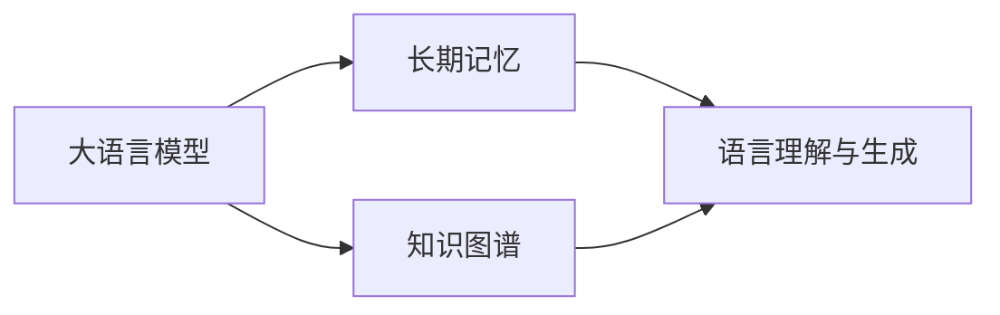

# 大语言模型应用指南：长期记忆

## 1.背景介绍
### 1.1 大语言模型的发展历程
#### 1.1.1 早期的语言模型
#### 1.1.2 Transformer的出现
#### 1.1.3 预训练语言模型的崛起
### 1.2 大语言模型的应用现状
#### 1.2.1 自然语言处理领域的应用
#### 1.2.2 知识图谱构建
#### 1.2.3 智能对话系统
### 1.3 大语言模型面临的挑战
#### 1.3.1 模型的可解释性
#### 1.3.2 模型的鲁棒性
#### 1.3.3 长期记忆能力的缺失

## 2.核心概念与联系
### 2.1 大语言模型
#### 2.1.1 定义与特点
#### 2.1.2 训练方法
#### 2.1.3 评估指标
### 2.2 长期记忆
#### 2.2.1 定义与特点  
#### 2.2.2 在语言模型中的重要性
#### 2.2.3 与短期记忆的区别
### 2.3 知识图谱
#### 2.3.1 定义与特点
#### 2.3.2 构建方法
#### 2.3.3 在大语言模型中的应用



## 3.核心算法原理具体操作步骤
### 3.1 基于注意力机制的长期记忆
#### 3.1.1 注意力机制原理
#### 3.1.2 自注意力机制
#### 3.1.3 多头注意力机制
### 3.2 基于外部知识库的长期记忆
#### 3.2.1 知识库的构建
#### 3.2.2 知识表示学习
#### 3.2.3 知识融合方法
### 3.3 基于动态记忆网络的长期记忆
#### 3.3.1 动态记忆网络原理
#### 3.3.2 读写操作
#### 3.3.3 存储与更新机制

## 4.数学模型和公式详细讲解举例说明
### 4.1 Transformer模型
#### 4.1.1 编码器
$Encoder(x)=Attention(Q,K,V)$
其中，$Q=x W^Q, K=x W^K, V=x W^V$
#### 4.1.2 解码器
$Decoder(y)=Attention(Q',K',V')$  
其中，$Q'=y W^{Q'}, K'=y W^{K'}, V'=y W^{V'}$
#### 4.1.3 多头注意力
$$MultiHead(Q,K,V)=Concat(head_1,...,head_h)W^O$$
$$head_i=Attention(QW_i^Q,KW_i^K,VW_i^V)$$
### 4.2 知识图谱嵌入
#### 4.2.1 TransE
$f_r(h,t)=\Vert h+r-t \Vert$
#### 4.2.2 TransR
$f_r(h,t)=\Vert M_rh+r-M_rt \Vert$
#### 4.2.3 TransD
$f_r(h,t)=\Vert (w_r^{\top}w_h+I)h+(w_r^{\top}r_p)-
(w_r^{\top}w_t+I)t \Vert$
### 4.3 动态记忆网络
#### 4.3.1 读操作
$r_t=Attention(q_t,M_{t-1})$
#### 4.3.2 写操作  
$\tilde{M_t}=Update(M_{t-1},c_t,q_t)$
$M_t=Erase(\tilde{M_t},e_t)+Add(\tilde{M_t},a_t)$

## 5.项目实践：代码实例和详细解释说明
### 5.1 使用Hugging Face的Transformers库实现GPT模型
```python
from transformers import GPT2LMHeadModel, GPT2Tokenizer

model = GPT2LMHeadModel.from_pretrained('gpt2')
tokenizer = GPT2Tokenizer.from_pretrained('gpt2')

input_text = "The quick brown fox"
input_ids = tokenizer.encode(input_text, return_tensors='pt')

output = model.generate(input_ids, max_length=50, num_return_sequences=1)
print(tokenizer.decode(output[0], skip_special_tokens=True))
```
### 5.2 使用PyTorch实现Transformer模型
```python
import torch
import torch.nn as nn

class Transformer(nn.Module):
    def __init__(self, d_model, nhead, num_layers):
        super().__init__()
        self.encoder = nn.TransformerEncoder(
            nn.TransformerEncoderLayer(d_model, nhead),
            num_layers
        )
        self.decoder = nn.TransformerDecoder(
            nn.TransformerDecoderLayer(d_model, nhead),
            num_layers
        )
        
    def forward(self, src, tgt):
        memory = self.encoder(src)
        output = self.decoder(tgt, memory)
        return output
```
### 5.3 使用OpenKE实现知识图谱嵌入
```python
from openke.config import Trainer, Tester
from openke.module.model import TransE
from openke.module.loss import MarginLoss
from openke.module.strategy import NegativeSampling

# 定义超参数
batch_size = 100
hidden_dim = 50
margin = 1.0
learning_rate = 0.01
epochs = 1000

# 定义数据集路径
train_dataloader = "./data/train2id.txt"
test_dataloader = "./data/test2id.txt"

# 定义模型、损失函数和负采样策略
transe = TransE(ent_tot, rel_tot, hidden_dim)
model = NegativeSampling(
    model = transe, 
    loss = MarginLoss(margin),
    batch_size = batch_size
)

# 训练模型
trainer = Trainer(model = model, data_loader = train_dataloader, 
                  train_times = epochs, alpha = learning_rate)
trainer.run()

# 测试模型
tester = Tester(model = transe, data_loader = test_dataloader, use_gpu = True)
tester.run_link_prediction(type_constrain = False)
```

## 6.实际应用场景
### 6.1 智能客服
#### 6.1.1 客户意图识别
#### 6.1.2 问题自动应答
#### 6.1.3 多轮对话管理
### 6.2 个性化推荐
#### 6.2.1 用户画像构建
#### 6.2.2 商品知识图谱
#### 6.2.3 推荐算法优化
### 6.3 智能写作
#### 6.3.1 文本生成
#### 6.3.2 文本摘要
#### 6.3.3 机器翻译

## 7.工具和资源推荐
### 7.1 开源工具包
#### 7.1.1 Hugging Face Transformers
#### 7.1.2 OpenKE
#### 7.1.3 DeepPavlov
### 7.2 预训练模型
#### 7.2.1 BERT
#### 7.2.2 GPT系列
#### 7.2.3 T5
### 7.3 知识图谱数据集
#### 7.3.1 Freebase
#### 7.3.2 WordNet
#### 7.3.3 NELL

## 8.总结：未来发展趋势与挑战
### 8.1 模型效率与性能的提升
#### 8.1.1 模型压缩
#### 8.1.2 模型并行
#### 8.1.3 计算优化
### 8.2 多模态语言模型
#### 8.2.1 文本-图像语言模型
#### 8.2.2 文本-视频语言模型
#### 8.2.3 语音-文本语言模型
### 8.3 长期记忆与推理能力
#### 8.3.1 因果推理
#### 8.3.2 常识推理
#### 8.3.3 多跳推理

## 9.附录：常见问题与解答
### 9.1 如何选择合适的预训练模型？
### 9.2 如何处理低资源语言的建模问题？
### 9.3 如何避免语言模型生成有害内容？
### 9.4 知识图谱如何与语言模型结合？
### 9.5 动态记忆网络能否处理超长文本？

作者：禅与计算机程序设计艺术 / Zen and the Art of Computer Programming