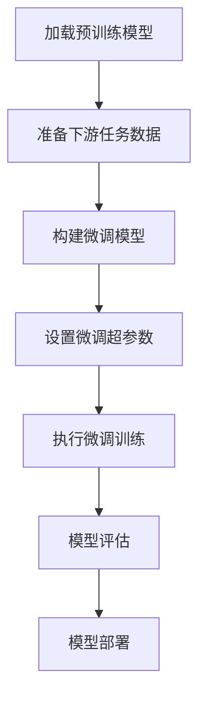

# 大语言模型应用指南：高效微调总结

## 1. 背景介绍

### 1.1 大语言模型的兴起

近年来,大型语言模型(Large Language Models, LLMs)凭借其强大的自然语言处理能力,在各种自然语言处理任务中取得了卓越的表现,引起了广泛关注。这些模型通过在海量文本数据上进行预训练,学习到了丰富的语言知识和上下文表示,为下游任务奠定了坚实的基础。

典型的大语言模型包括GPT(Generative Pre-trained Transformer)、BERT(Bidirectional Encoder Representations from Transformers)、XLNet、RoBERTa等,它们在机器翻译、文本生成、问答系统、情感分析等领域展现出了优异的性能。

### 1.2 微调的必要性

尽管大语言模型具有强大的语言理解和生成能力,但直接将其应用于特定的下游任务通常会存在一定的性能差距。这是因为预训练阶段所使用的数据与下游任务的数据分布存在差异,导致模型在特定领域的表现不尽如人意。

为了解决这一问题,研究人员提出了"微调"(Fine-tuning)的方法,即在大语言模型的基础上,利用与下游任务相关的数据进行进一步的训练,使模型更好地适应特定任务的需求。微调过程通常只需要对模型的部分参数进行调整,从而避免了从头开始训练的巨大计算开销。

## 2. 核心概念与联系

### 2.1 迁移学习

微调是一种迁移学习(Transfer Learning)的方法,旨在将在源域(预训练阶段)学习到的知识迁移到目标域(下游任务)。迁移学习的核心思想是利用已有的知识作为起点,避免从零开始训练,从而提高模型的训练效率和性能。

在自然语言处理领域,大语言模型通过在海量文本数据上预训练,学习到了丰富的语言知识和上下文表示能力。这些知识可以作为"初始化"参数,为下游任务提供有益的启发和先验知识。

### 2.2 微调策略

微调过程中,需要根据具体任务的特点和需求,选择合适的微调策略。常见的微调策略包括:

1. **全模型微调(Full Model Fine-tuning)**: 对整个大语言模型的所有参数进行微调,适用于具有足够训练数据的情况。
2. **部分微调(Partial Fine-tuning)**: 只对模型的部分层或部分参数进行微调,可以减少计算开销,适用于训练数据有限的情况。
3. **层级微调(Layer-wise Fine-tuning)**: 对模型的不同层采用不同的学习率进行微调,可以更好地捕捉不同层的特征。
4. **discriminative微调(Discriminative Fine-tuning)**: 在微调过程中,同时对模型的预测头(prediction head)和主干网络(backbone)进行训练,以提高模型的判别能力。

选择合适的微调策略对于提高模型性能至关重要。不同的任务和数据集可能需要采用不同的策略,需要进行充分的实验和调优。

## 3. 核心算法原理具体操作步骤

微调大语言模型的核心算法原理可以概括为以下几个步骤:



### 3.1 加载预训练模型

首先,需要加载预先训练好的大语言模型,如BERT、GPT等。这些模型通常以参数文件的形式提供,可以直接加载到内存中。

### 3.2 准备下游任务数据

接下来,需要准备用于微调的下游任务数据。这些数据通常需要进行预处理,如分词、标注等,以满足模型的输入格式要求。同时,也需要将数据划分为训练集、验证集和测试集。

### 3.3 构建微调模型

根据下游任务的特点,构建适当的微调模型架构。这通常包括在预训练模型的基础上添加任务特定的输出层,如分类头、生成头等。同时,也需要决定是对整个模型进行微调,还是只微调部分层。

### 3.4 设置微调超参数

微调过程中需要设置一些关键的超参数,如学习率、批量大小、训练轮数等。合理的超参数设置对模型性能有着重要影响。通常需要进行大量的实验和调优,以找到最佳的超参数组合。

### 3.5 执行微调训练

利用准备好的下游任务数据,执行微调训练过程。在训练过程中,模型会根据任务目标和损失函数,不断调整参数,以最小化损失。

### 3.6 模型评估

在验证集上评估微调后的模型性能,确保模型达到预期的效果。常用的评估指标包括准确率、F1分数、困惑度等,具体取决于任务类型。

### 3.7 模型部署

如果模型性能满足要求,就可以将其部署到实际的生产环境中,用于服务实际的应用场景。

## 4. 数学模型和公式详细讲解举例说明

在微调大语言模型的过程中,通常会涉及到一些数学模型和公式,用于描述模型的结构、损失函数等。以下是一些常见的数学模型和公式:

### 4.1 Transformer模型

大多数大语言模型都采用了Transformer的结构,其核心是自注意力(Self-Attention)机制。自注意力机制可以捕捉输入序列中任意两个位置之间的关系,从而更好地建模长距离依赖。

自注意力的计算过程可以表示为:

$$\begin{aligned}
\text{Attention}(Q, K, V) &= \text{softmax}\left(\frac{QK^T}{\sqrt{d_k}}\right)V \\
\text{MultiHead}(Q, K, V) &= \text{Concat}(\text{head}_1, \ldots, \text{head}_h)W^O\\
\text{where}\ \text{head}_i &= \text{Attention}(QW_i^Q, KW_i^K, VW_i^V)
\end{aligned}$$

其中,$Q$、$K$、$V$分别表示查询(Query)、键(Key)和值(Value)。$d_k$是缩放因子,用于防止点积的值过大导致softmax函数的梯度较小。MultiHead表示使用多个注意力头(head)并行计算,从而捕捉不同的关系。

### 4.2 交叉熵损失函数

在微调过程中,常用的损失函数是交叉熵损失函数(Cross-Entropy Loss),它可以衡量模型预测的概率分布与真实标签之间的差异。

对于一个样本,交叉熵损失函数可以表示为:

$$\mathcal{L}(y, \hat{y}) = -\sum_{i=1}^{C}y_i\log(\hat{y}_i)$$

其中,$y$是真实标签的一热编码向量,$\hat{y}$是模型预测的概率分布向量,$C$是类别数。

对于整个训练集,损失函数是所有样本损失的平均:

$$J = \frac{1}{N}\sum_{i=1}^{N}\mathcal{L}(y^{(i)}, \hat{y}^{(i)})$$

其中,$N$是训练集的样本数量。

在训练过程中,目标是最小化损失函数$J$,从而使模型的预测结果尽可能接近真实标签。

## 5. 项目实践: 代码实例和详细解释说明

为了更好地理解微调大语言模型的过程,我们将通过一个实际的代码示例来进行说明。在这个示例中,我们将使用HuggingFace的Transformers库,对BERT模型进行微调,以完成一个文本分类任务。

### 5.1 导入所需库

```python
import torch
from transformers import BertTokenizer, BertForSequenceClassification
from transformers import Trainer, TrainingArguments
from datasets import load_dataset
```

我们导入了PyTorch、Transformers库和datasets库,用于加载预训练模型、处理数据和进行训练。

### 5.2 加载数据集

```python
dataset = load_dataset("imdb")
```

我们使用datasets库加载IMDB电影评论数据集,这是一个常用的文本分类基准数据集。

### 5.3 数据预处理

```python
tokenizer = BertTokenizer.from_pretrained('bert-base-uncased')

def preprocess_function(examples):
    return tokenizer(examples['text'], truncation=True, padding='max_length', max_length=512)

encoded_dataset = dataset.map(preprocess_function, batched=True)
```

我们使用BERT的tokenizer对数据进行分词和编码,将文本转换为模型可以接受的输入格式。同时,我们对输入进行了截断和填充,以确保输入长度一致。

### 5.4 构建微调模型

```python
model = BertForSequenceClassification.from_pretrained('bert-base-uncased', num_labels=2)
```

我们加载预训练的BERT模型,并在其基础上添加一个用于二分类任务的输出层。

### 5.5 设置训练参数

```python
training_args = TrainingArguments(
    output_dir='./results',
    num_train_epochs=3,
    per_device_train_batch_size=16,
    per_device_eval_batch_size=64,
    warmup_steps=500,
    weight_decay=0.01,
    logging_dir='./logs',
    logging_steps=10,
)
```

我们设置了一些关键的训练超参数,如训练轮数、批量大小、学习率warmup步数、权重衰减系数等。这些参数对模型的性能有着重要影响,需要进行调优。

### 5.6 执行微调训练

```python
trainer = Trainer(
    model=model,
    args=training_args,
    train_dataset=encoded_dataset['train'],
    eval_dataset=encoded_dataset['test'],
)

trainer.train()
```

我们使用Trainer类来执行微调训练过程。在训练过程中,模型会根据交叉熵损失函数不断调整参数,以最小化损失。

### 5.7 模型评估

```python
eval_result = trainer.evaluate()
print(f"Evaluation result: {eval_result}")
```

在训练结束后,我们在测试集上评估模型的性能,并打印出评估结果。

通过这个示例,我们可以更好地理解微调大语言模型的具体过程,包括数据预处理、模型构建、训练参数设置、训练执行和模型评估等步骤。

## 6. 实际应用场景

微调大语言模型在自然语言处理领域有着广泛的应用场景,包括但不限于:

### 6.1 文本分类

通过微调大语言模型,可以构建出性能优异的文本分类系统,如新闻分类、垃圾邮件检测、情感分析等。微调后的模型能够更好地捕捉文本的语义信息,从而提高分类准确率。

### 6.2 机器翻译

在机器翻译任务中,可以将大语言模型作为编码器或解码器,并通过微调来适应特定的语言对和领域。这种方法已经在谷歌、Facebook等公司的机器翻译系统中得到了广泛应用。

### 6.3 问答系统

微调后的大语言模型可以用于构建问答系统,回答各种领域的问题。这些模型能够理解问题的语义,并从海量的文本数据中检索相关的答案。

### 6.4 文本生成

微调后的大语言模型还可以用于各种文本生成任务,如新闻自动撰写、故事创作、对话生成等。这些模型能够生成流畅、连贯的自然语言文本,为人工智能写作提供了有力支持。

### 6.5 其他应用

除了上述场景,微调大语言模型还可以应用于命名实体识别、关系抽取、事件抽取、文本摘要等多种自然语言处理任务,展现出了广阔的应用前景。

## 7. 工具和资源推荐

在微调大语言模型的过程中,我们可以借助一些优秀的工具和资源,以提高效率和性能。

### 7.1 HuggingFace Transformers

HuggingFace Transformers是一个非常流行的开源库,提供了各种预训练的大语言模型和微调工具。它支持PyTorch和TensorFlow两种框架,并提供了丰富的示例和教程,是微调大语言模型的首选工具。

### 7.2 Allen