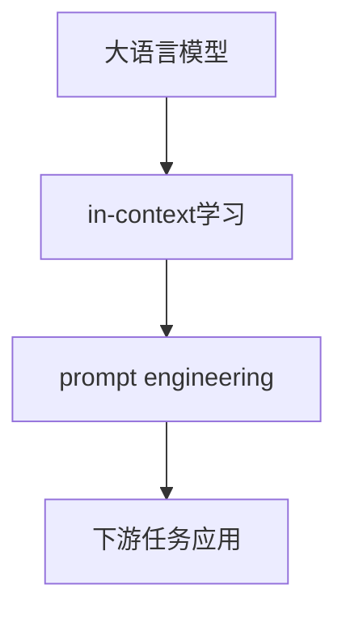

# 大语言模型的in-context学习原理与代码实例讲解

## 1. 背景介绍
### 1.1 大语言模型的发展历程
#### 1.1.1 早期的语言模型
#### 1.1.2 Transformer的出现
#### 1.1.3 预训练语言模型的崛起

### 1.2 in-context学习的提出
#### 1.2.1 GPT-3的few-shot能力
#### 1.2.2 in-context学习的定义
#### 1.2.3 in-context学习的优势

## 2. 核心概念与联系
### 2.1 大语言模型
#### 2.1.1 定义与特点  
#### 2.1.2 主流的大语言模型
#### 2.1.3 大语言模型的训练方法

### 2.2 in-context学习
#### 2.2.1 定义与特点
#### 2.2.2 与传统监督学习的区别
#### 2.2.3 in-context学习的关键要素

### 2.3 prompt engineering
#### 2.3.1 定义与作用
#### 2.3.2 prompt的类型与设计原则 
#### 2.3.3 prompt engineering的挑战



## 3. 核心算法原理与具体操作步骤
### 3.1 基于注意力机制的Transformer架构
#### 3.1.1 self-attention
#### 3.1.2 multi-head attention
#### 3.1.3 前馈神经网络

### 3.2 预训练-微调范式
#### 3.2.1 无监督预训练
#### 3.2.2 有监督微调
#### 3.2.3 预训练-微调的优势与局限

### 3.3 in-context学习的实现步骤
#### 3.3.1 构建prompt
#### 3.3.2 few-shot示例选择
#### 3.3.3 推理生成目标输出

## 4. 数学模型与公式详解
### 4.1 Transformer的数学表示
#### 4.1.1 输入表示
$$X = [x_1, x_2, ..., x_n]$$
#### 4.1.2 self-attention计算
$$Attention(Q,K,V) = softmax(\frac{QK^T}{\sqrt{d_k}})V$$
#### 4.1.3 前馈网络
$$FFN(x) = max(0, xW_1 + b_1)W_2 + b_2$$

### 4.2 语言模型的目标函数
#### 4.2.1 最大似然估计
$$\mathcal{L}(\theta) = -\sum_{i=1}^{n} log P(x_i|x_{<i};\theta)$$
#### 4.2.2 交叉熵损失
$$\mathcal{L}(\theta) = -\frac{1}{n}\sum_{i=1}^{n}\sum_{j=1}^{|V|}y_{ij}log(\hat{y}_{ij})$$

### 4.3 in-context学习的数学表示  
#### 4.3.1 few-shot prompt构建
$$P = [p_1, p_2, ..., p_k, q]$$
#### 4.3.2 目标输出生成
$$\hat{y} = argmax_{y}P(y|P;\theta)$$

## 5. 项目实践：代码实例与详解
### 5.1 使用PyTorch实现Transformer
#### 5.1.1 定义模型结构
```python
class Transformer(nn.Module):
    def __init__(self, d_model, nhead, num_layers):
        super().__init__()
        self.encoder = TransformerEncoder(d_model, nhead, num_layers) 
        self.decoder = TransformerDecoder(d_model, nhead, num_layers)
```
#### 5.1.2 定义前向传播
```python
def forward(self, src, tgt, src_mask=None, tgt_mask=None):
    memory = self.encoder(src, src_mask)
    output = self.decoder(tgt, memory, tgt_mask, None)
    return output
```

### 5.2 使用Hugging Face实现in-context学习
#### 5.2.1 加载预训练模型
```python
from transformers import GPT2LMHeadModel, GPT2Tokenizer

model = GPT2LMHeadModel.from_pretrained('gpt2')
tokenizer = GPT2Tokenizer.from_pretrained('gpt2')
```
#### 5.2.2 构建few-shot prompt
```python
prompt = "Question: What is the capital of France?\nAnswer: Paris\n\nQuestion: What is the capital of Germany?\nAnswer: Berlin\n\nQuestion: What is the capital of Spain?\nAnswer:"

input_ids = tokenizer.encode(prompt, return_tensors='pt')
```
#### 5.2.3 生成目标输出
```python
output = model.generate(input_ids, max_length=100, num_return_sequences=1)
print(tokenizer.decode(output[0], skip_special_tokens=True))
```

## 6. 实际应用场景
### 6.1 自然语言处理
#### 6.1.1 文本分类
#### 6.1.2 命名实体识别
#### 6.1.3 机器翻译

### 6.2 问答系统
#### 6.2.1 开放域问答
#### 6.2.2 知识库问答
#### 6.2.3 常识推理

### 6.3 代码生成
#### 6.3.1 代码补全
#### 6.3.2 代码翻译
#### 6.3.3 代码优化

## 7. 工具与资源推荐
### 7.1 开源工具包
#### 7.1.1 Hugging Face Transformers
#### 7.1.2 OpenAI GPT-3 API
#### 7.1.3 Google T5

### 7.2 预训练模型
#### 7.2.1 BERT
#### 7.2.2 GPT-2/GPT-3
#### 7.2.3 T5

### 7.3 相关论文与教程
#### 7.3.1 "Attention Is All You Need"
#### 7.3.2 "Language Models are Few-Shot Learners" 
#### 7.3.3 "Prompt Engineering: The Ultimate Guide"

## 8. 总结：未来发展趋势与挑战
### 8.1 大语言模型的发展趋势
#### 8.1.1 模型规模的持续增长
#### 8.1.2 多模态语言模型的兴起
#### 8.1.3 语言模型的通用化

### 8.2 in-context学习的发展方向
#### 8.2.1 更高效的prompt设计方法
#### 8.2.2 更鲁棒的few-shot学习算法
#### 8.2.3 结合外部知识增强in-context学习

### 8.3 面临的挑战
#### 8.3.1 计算资源的限制
#### 8.3.2 数据隐私与安全问题
#### 8.3.3 模型的可解释性与可控性

## 9. 附录：常见问题与解答 
### 9.1 in-context学习需要多少few-shot样本？
### 9.2 prompt engineering有哪些常用技巧？
### 9.3 如何评估in-context学习的性能？

大语言模型与in-context学习是自然语言处理领域的重要发展方向。基于Transformer架构的大规模预训练语言模型展现出了强大的语言理解与生成能力，尤其是GPT-3等模型在few-shot设置下表现出色，引发了对in-context学习的广泛关注。

in-context学习利用自然语言prompt来引导语言模型执行特定任务，通过在prompt中提供少量示例，模型可以在无需微调的情况下快速适应新任务。这种新颖的学习范式突破了传统监督学习的限制，大大提高了语言模型的泛化能力与应用灵活性。

本文深入探讨了大语言模型的工作原理，详细阐述了in-context学习的核心思想与实现方法。我们从数学模型与代码实例的角度，讲解了如何利用prompt engineering技术构建高质量的few-shot prompt，并介绍了in-context学习在自然语言处理、问答系统、代码生成等领域的应用。

展望未来，大语言模型的规模还将不断增长，多模态语言模型与通用语言模型的研究也将持续深入。同时，如何设计更高效的prompt以及提高in-context学习的鲁棒性，将成为重要的探索方向。此外，我们还需要关注模型训练带来的计算资源挑战，以及潜在的数据隐私与安全问题。

总的来说，大语言模型与in-context学习正在推动自然语言处理技术的革新，为构建更加智能、高效、灵活的语言应用系统提供了新的思路。相信通过研究者的不断努力，这一领域必将取得更加瞩目的突破，为人工智能的发展做出重要贡献。

作者：禅与计算机程序设计艺术 / Zen and the Art of Computer Programming