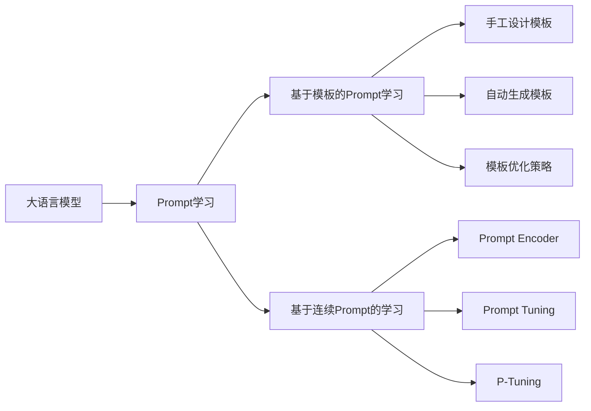

# 大语言模型的prompt学习原理与代码实例讲解

## 1. 背景介绍
### 1.1 大语言模型的发展历程
#### 1.1.1 早期的语言模型
#### 1.1.2 Transformer的出现
#### 1.1.3 预训练模型的崛起
### 1.2 Prompt的提出与意义
#### 1.2.1 Prompt的定义
#### 1.2.2 Prompt在大语言模型中的作用
#### 1.2.3 Prompt的研究价值

## 2. 核心概念与联系
### 2.1 大语言模型
#### 2.1.1 定义与特点
#### 2.1.2 常见的大语言模型
#### 2.1.3 大语言模型的应用场景
### 2.2 Prompt
#### 2.2.1 Prompt的类型
#### 2.2.2 Prompt的设计原则
#### 2.2.3 Prompt与大语言模型的关系
### 2.3 Prompt学习
#### 2.3.1 Prompt学习的定义
#### 2.3.2 Prompt学习的优势
#### 2.3.3 Prompt学习的挑战

## 3. 核心算法原理具体操作步骤
### 3.1 基于模板的Prompt学习
#### 3.1.1 手工设计模板
#### 3.1.2 自动生成模板
#### 3.1.3 模板优化策略
### 3.2 基于连续Prompt的学习
#### 3.2.1 Prompt Encoder
#### 3.2.2 Prompt Tuning
#### 3.2.3 P-Tuning
### 3.3 Prompt学习的训练过程
#### 3.3.1 预训练阶段
#### 3.3.2 微调阶段
#### 3.3.3 推理阶段

## 4. 数学模型和公式详细讲解举例说明
### 4.1 语言模型的数学表示
#### 4.1.1 概率语言模型
#### 4.1.2 神经网络语言模型
#### 4.1.3 Transformer语言模型
### 4.2 Prompt学习的数学建模
#### 4.2.1 基于模板的Prompt学习
#### 4.2.2 基于连续Prompt的学习
#### 4.2.3 Prompt学习的目标函数
### 4.3 公式推导与例子说明
#### 4.3.1 交叉熵损失函数
#### 4.3.2 梯度计算与反向传播
#### 4.3.3 具体例子演示

## 5. 项目实践：代码实例和详细解释说明
### 5.1 环境准备
#### 5.1.1 硬件要求
#### 5.1.2 软件依赖
#### 5.1.3 数据集准备
### 5.2 基于PyTorch实现Prompt学习
#### 5.2.1 模型定义
#### 5.2.2 数据处理
#### 5.2.3 训练与评估
### 5.3 代码解读与说明
#### 5.3.1 关键模块解析
#### 5.3.2 超参数设置
#### 5.3.3 训练技巧与优化

## 6. 实际应用场景
### 6.1 文本分类
#### 6.1.1 情感分析
#### 6.1.2 主题分类
#### 6.1.3 意图识别
### 6.2 问答系统
#### 6.2.1 阅读理解
#### 6.2.2 知识问答
#### 6.2.3 对话系统
### 6.3 文本生成
#### 6.3.1 摘要生成
#### 6.3.2 故事生成
#### 6.3.3 诗歌创作

## 7. 工具和资源推荐
### 7.1 开源工具包
#### 7.1.1 Hugging Face Transformers
#### 7.1.2 OpenPrompt
#### 7.1.3 PromptSource
### 7.2 预训练模型
#### 7.2.1 BERT
#### 7.2.2 GPT系列
#### 7.2.3 T5
### 7.3 学习资源
#### 7.3.1 论文与综述
#### 7.3.2 教程与博客
#### 7.3.3 视频课程

## 8. 总结：未来发展趋势与挑战
### 8.1 Prompt学习的优势与局限
#### 8.1.1 优势总结
#### 8.1.2 局限与不足
#### 8.1.3 改进方向
### 8.2 未来研究方向
#### 8.2.1 Prompt的自动生成与优化
#### 8.2.2 跨任务与跨领域的Prompt学习
#### 8.2.3 Prompt学习的可解释性
### 8.3 挑战与机遇
#### 8.3.1 数据质量与多样性
#### 8.3.2 计算资源与效率
#### 8.3.3 伦理与安全考量

## 9. 附录：常见问题与解答
### 9.1 Prompt学习与传统微调的区别
### 9.2 如何设计一个有效的Prompt
### 9.3 Prompt学习对模型参数量的影响
### 9.4 Prompt学习能否应用于其他模态
### 9.5 Prompt学习的few-shot能力如何
### 9.6 Prompt学习是否需要重新预训练模型



大语言模型的发展为自然语言处理领域带来了革命性的变化。从早期的统计语言模型，到Transformer的出现，再到预训练模型的崛起，大语言模型展现出了强大的语言理解和生成能力。然而，如何更好地利用大语言模型的知识，并将其应用于下游任务，仍然是一个挑战。

Prompt学习作为一种新兴的范式，为解决这一问题提供了新的思路。通过设计合适的Prompt，我们可以引导大语言模型生成符合特定任务要求的输出。Prompt学习不仅可以提高模型在下游任务上的表现，还能够实现少样本学习，降低标注数据的需求。

Prompt学习主要分为两大类：基于模板的Prompt学习和基于连续Prompt的学习。基于模板的方法通过手工设计或自动生成模板，将任务输入转化为适合大语言模型的格式。这种方法简单直观，但模板的质量对性能影响较大。基于连续Prompt的学习则将Prompt表示为连续的向量，通过梯度优化来学习最优的Prompt表示。这种方法更加灵活，能够自适应地调整Prompt以适应不同的任务。

在实践中，Prompt学习已经在文本分类、问答系统、文本生成等任务上取得了显著的效果。以文本分类为例，我们可以将分类标签转化为自然语言描述，构建形如"这篇文章的主题是[MASK]"的Prompt，然后利用大语言模型预测[MASK]位置的词，从而得到文本的类别。

下面是一个基于PyTorch实现的Prompt学习的代码示例：

```python
import torch
from transformers import BertTokenizer, BertForMaskedLM

# 加载预训练的BERT模型和tokenizer
model = BertForMaskedLM.from_pretrained('bert-base-uncased')
tokenizer = BertTokenizer.from_pretrained('bert-base-uncased')

# 定义Prompt模板
template = "The topic of this article is [MASK]."

# 定义分类标签
labels = ["politics", "sports", "technology", "entertainment"]

# 对测试样本进行预测
text = "The president delivered a speech at the conference."
input_ids = tokenizer.encode(template.replace("[MASK]", tokenizer.mask_token), return_tensors='pt')
mask_pos = torch.where(input_ids == tokenizer.mask_token_id)[1]
output = model(input_ids)
logits = output.logits[0, mask_pos, :]
probs = logits.softmax(dim=-1)
pred_label = labels[probs.argmax().item()]

print(f"The predicted topic is: {pred_label}")
```

在这个例子中，我们首先加载了预训练的BERT模型和对应的tokenizer。然后定义了一个包含[MASK]标记的Prompt模板，以及一组分类标签。给定一个测试样本，我们将其与Prompt模板拼接，并将[MASK]替换为特殊的mask token。接着，我们将构造好的输入传入BERT模型，获取[MASK]位置的输出logits。对logits进行softmax归一化，得到每个标签的概率分布，取概率最大的标签作为预测结果。

这只是一个简单的示例，实际应用中还需要考虑更多细节，如数据预处理、批次化训练、超参数调优等。此外，我们还可以探索更高级的Prompt学习技术，如自动生成模板、连续Prompt优化等，以进一步提升模型性能。

Prompt学习作为一个新兴的研究方向，还有许多未解决的问题和挑战。如何设计更加有效和鲁棒的Prompt，如何将Prompt学习扩展到更广泛的任务和领域，如何提高Prompt学习的可解释性和可控性，都是值得深入探索的问题。此外，Prompt学习对数据质量和多样性的要求较高，如何在有限的标注数据下实现高效的学习，也是一个亟待解决的难题。

尽管存在挑战，但Prompt学习为大语言模型的应用开辟了新的可能性。通过巧妙地设计Prompt，我们可以充分挖掘大语言模型中蕴含的知识，实现更加智能和灵活的自然语言处理系统。相信随着研究的深入，Prompt学习将在更多领域发挥重要作用，推动自然语言处理技术的进一步发展。

作者：禅与计算机程序设计艺术 / Zen and the Art of Computer Programming