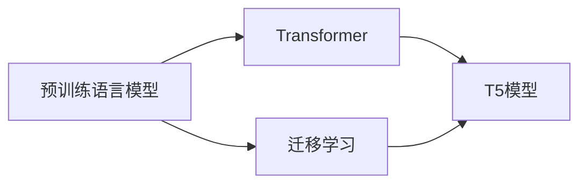

# 如何使用T5进行自动文本标注?

## 1.背景介绍

在自然语言处理(NLP)领域,文本标注是一项基础而关键的任务。它为下游的NLP任务如文本分类、情感分析、命名实体识别等提供了必要的训练数据。传统的文本标注方法主要依赖人工,费时费力且成本高昂。近年来,随着预训练语言模型的发展,利用预训练模型进行自动文本标注成为了一个新的研究热点。

T5(Text-to-Text Transfer Transformer)是谷歌在2020年提出的一个强大的预训练语言模型。它采用Transformer的编码器-解码器架构,在大规模无监督语料上进行预训练,可以通过fine-tuning的方式应用于各种NLP任务。T5最大的特点是将所有NLP任务统一为文本到文本的格式,使得模型具有很好的通用性和迁移能力。本文将详细介绍如何利用T5模型进行自动文本标注,为NLP研究者和工程师提供实用的指导。

## 2.核心概念与联系

### 2.1 预训练语言模型 

预训练语言模型(Pre-trained Language Model)是指在大规模无标注语料上进行无监督预训练得到的语言模型。这些模型通过自监督学习的方式,在海量文本数据中学习到了丰富的语言知识和通用语义表示。代表性的预训练语言模型有BERT、GPT、XLNet、RoBERTa等。

### 2.2 迁移学习

迁移学习(Transfer Learning)是指将一个模型在源任务上学到的知识迁移应用到目标任务中,从而提高目标任务的性能,尤其是在目标任务标注数据不足的情况下。预训练语言模型通过在大规模语料上学习通用语言知识,可以很好地应用迁移学习,实现下游任务的快速适配。

### 2.3 Transformer 

Transformer是一种基于自注意力机制(Self-Attention)的序列建模架构。不同于传统的RNN和CNN,Transformer完全依赖注意力机制来学习序列间的依赖关系。它的特点是计算并行度高、长程依赖建模能力强,已成为当前NLP领域的主流模型架构。

### 2.4 T5模型

T5是基于Transformer的预训练语言模型,采用编码器-解码器架构。它的预训练任务包括:
- 掩码语言建模(Masked Language Modeling,MLM)
- 去噪自编码(Denoising Auto-Encoding,DAE) 
- 文本摘要 
- 问答 
- 机器翻译

通过多任务学习,T5可以学习到语言的通用表示。在fine-tuning时,所有任务被统一转化为文本到文本的序列生成问题。输入格式为:

```
任务前缀: 输入文本
```

输出格式为目标文本序列。这种统一的输入输出接口,使得T5可以非常方便地应用于不同的NLP任务。

### 核心概念关系图


## 3.核心算法原理具体操作步骤

利用T5进行自动文本标注的核心步骤如下:

### 步骤1:数据准备

收集待标注的文本数据,并将其划分为训练集、验证集和测试集。为了提高标注质量,训练数据中需要包含一定比例的人工标注样本。

### 步骤2:任务转化

将文本标注任务转化为T5的文本到文本生成任务。具体地,构造如下形式的输入:

```
文本标注: 待标注文本
```

输出为标注后的文本序列,不同标签之间用特殊符号(如"|")隔开。例如:

```
[公司]|微软|发布了|[产品]|Office 2021|,其中包括|[应用]|Word|、|[应用]|Excel|等
```

### 步骤3:模型fine-tuning

在T5预训练模型的基础上,使用转化后的标注数据进行fine-tuning。具体步骤为:

1. 加载预训练的T5模型和tokenizer
2. 将输入文本和标签进行tokenize,并转化为模型需要的输入格式
3. 使用适当的优化器(如AdamW)和学习率调度策略(如linear decay with warmup)进行训练
4. 监控验证集性能,选择最优模型进行后续预测

### 步骤4:模型推理与后处理

使用fine-tune后的模型对新的待标注文本进行推理预测。将生成的标签序列进行后处理,提取出实际的标签span。可以使用一些启发式规则,如过滤掉长度过短的标签、合并相邻的同类标签等,提高标注的准确性。

### 步骤5:人工校验与迭代优化

对模型标注的结果进行人工抽查和校验,对错误标注进行纠正。将校验后的数据加入到训练集中,迭代fine-tuning模型,不断提升标注质量。

## 4.数学模型和公式详细讲解举例说明

T5的本质是一个条件语言模型,对给定的输入序列 $X=(x_1,x_2,...,x_n)$,预测输出序列 $Y=(y_1,y_2,...,y_m)$ 的概率。用数学公式表示为:

$$P(Y|X) = \prod_{i=1}^m P(y_i|y_{<i},X)$$

其中, $y_{<i}$ 表示在位置 $i$ 之前的输出序列。

T5的编码器和解码器都由多层Transformer块组成。Transformer的核心是自注意力机制和前馈神经网络。

对于编码器的第 $l$ 层,输入为 $H^{l-1}=(h_1^{l-1},...,h_n^{l-1})$,输出为 $H^l=(h_1^l,...,h_n^l)$。自注意力机制计算公式为:

$$\text{Attention}(Q,K,V) = \text{softmax}(\frac{QK^T}{\sqrt{d_k}})V$$

其中, $Q,K,V$ 分别为查询矩阵、键矩阵和值矩阵,通过线性变换得到:

$$Q = H^{l-1}W_q, K = H^{l-1}W_k, V = H^{l-1}W_v$$

$d_k$ 为键向量的维度。

自注意力的输出经过残差连接和层归一化后,再通过前馈神经网络(FFN):

$$\text{FFN}(x) = \max(0, xW_1 + b_1)W_2 + b_2$$

解码器的计算与编码器类似,但在自注意力时需要引入掩码矩阵,防止解码器看到未来的位置。此外,解码器还需要与编码器的输出进行交叉注意力计算。

在预训练阶段,T5通过最大化似然概率来学习模型参数:

$$L(\theta) = -\sum_{i=1}^N \log P(Y_i|X_i;\theta)$$

其中, $N$ 为训练样本数量, $\theta$ 为模型参数。

在fine-tuning阶段,模型参数在标注数据上进行微调,损失函数与预训练阶段一致。预测时,通过beam search或greedy decoding生成标签序列。

## 5.项目实践:代码实例和详细解释说明

下面给出使用PyTorch和Hugging Face的Transformers库进行T5文本标注的示例代码。

```python
from transformers import T5Tokenizer, T5ForConditionalGeneration, AdamW

# 加载预训练模型和tokenizer
model = T5ForConditionalGeneration.from_pretrained('t5-base')
tokenizer = T5Tokenizer.from_pretrained('t5-base')

# 准备fine-tuning数据
train_texts = [...]  # 训练集文本
train_labels = [...]  # 训练集标签
val_texts = [...]  # 验证集文本
val_labels = [...]  # 验证集标签

# 定义数据转换函数
def convert_example(text, labels):
    input_text = f"文本标注: {text}"
    target_text = "|".join([f"[{label}]" for label in labels])
    return input_text, target_text

# 对数据进行转换
train_data = [convert_example(text, labels) for text, labels in zip(train_texts, train_labels)]
val_data = [convert_example(text, labels) for text, labels in zip(val_texts, val_labels)]

# 定义数据加载器
train_dataset = [(tokenizer.encode(input_text), tokenizer.encode(target_text)) 
                 for input_text, target_text in train_data]
val_dataset = [(tokenizer.encode(input_text), tokenizer.encode(target_text))
               for input_text, target_text in val_data]

# 定义优化器和学习率调度器
optimizer = AdamW(model.parameters(), lr=3e-4)
scheduler = get_linear_schedule_with_warmup(optimizer, num_warmup_steps=0, num_training_steps=len(train_dataset))

# 开始训练
model.train()
for epoch in range(num_epochs):
    for batch in train_dataloader:
        input_ids, target_ids = batch
        outputs = model(input_ids=input_ids, labels=target_ids)
        loss = outputs.loss
        loss.backward()
        optimizer.step()
        scheduler.step()
        optimizer.zero_grad()
    
    # 在验证集上评估
    model.eval()
    val_loss = 0
    for batch in val_dataloader:
        with torch.no_grad():
            input_ids, target_ids = batch
            outputs = model(input_ids=input_ids, labels=target_ids)
            val_loss += outputs.loss.item()
    val_loss /= len(val_dataloader)
    print(f"Epoch {epoch}, Val Loss: {val_loss:.4f}")
    model.train()

# 保存fine-tune后的模型    
model.save_pretrained("./t5_ner_model")

# 使用模型进行推理
def inference(text):
    input_ids = tokenizer.encode(f"文本标注: {text}", return_tensors='pt')
    outputs = model.generate(input_ids)
    output_text = tokenizer.decode(outputs[0], skip_special_tokens=True)
    labels = output_text.split("|")
    return labels

# 对新文本进行标注
new_text = "微软发布了Office 2021,其中包括Word、Excel等应用"
labels = inference(new_text)
print(labels)  
# 输出: ['[公司]微软', '[产品]Office 2021', '[应用]Word', '[应用]Excel']
```

以上代码展示了使用T5进行文本标注的完整流程,包括:

1. 加载预训练模型
2. 准备和转换fine-tuning数据
3. 定义优化器和学习率调度器
4. 进行fine-tuning训练和验证
5. 保存fine-tune后的模型
6. 使用模型进行推理预测

## 6.实际应用场景

T5自动文本标注可以应用于多种实际场景,包括:

### 6.1 命名实体识别

识别文本中的人名、地名、机构名、日期等命名实体,是信息抽取和知识图谱构建的基础。T5可以快速构建高质量的命名实体识别模型。

### 6.2 关键词提取

从文本中自动提取关键词,可用于文本摘要、索引、推荐等任务。将关键词提取转化为文本标注问题,T5可以有效捕捉文本中的关键信息。

### 6.3 情感分析

对文本的情感极性(积极、消极、中性)进行判断,在舆情分析、用户评论分析等场景有广泛应用。T5可以对文本情感进行细粒度的标注。

### 6.4 语义角色标注

标注文本中的语义角色,如施事、受事、时间、地点等,对自然语言理解至关重要。T5可以学习语义角色之间的依赖关系,实现精准的语义标注。

### 6.5 数据增强

利用T5生成更多样的标注数据,可以缓解标注数据稀缺的问题。T5可以根据少量样本生成大量相似的标注文本,扩充训练数据。

## 7.工具和资源推荐

### 7.1 编程工具

- PyTorch: 流行的深度学习框架,支持动态计算图和灵活的模型定义 
- TensorFlow: Google开发的端到端机器学习平台,提供了丰富的工具和资源
- Hugging Face Transformers: 最全面的预训练语言模型库,集成了T5等SOTA模型

### 7.2 预训练模型

- T5: Google提出的文本到文本预训练模型,在多个NLP任务上取得SOTA效果
- BERT: 双向Transformer预训练模型,可以生成强大的文本表示
- RoBERTa: 优化BERT训练过程,提高下游任务性能
- XLNet: