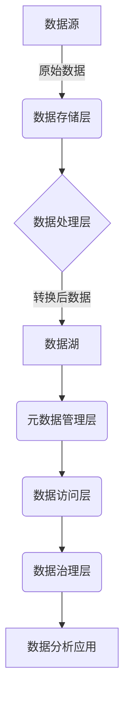

# 如何提升数据湖的查询性能？

## 1. 背景介绍

随着大数据时代的到来,越来越多的企业和组织开始采用数据湖作为存储和管理海量数据的解决方案。数据湖可以存储各种格式的数据,包括结构化数据、半结构化数据和非结构化数据,为数据分析和商业智能提供了丰富的数据源。然而,由于数据湖中存储了大量的数据,如何高效地查询和分析这些数据成为了一个重大挑战。

数据湖查询性能的优化对于确保数据分析的高效性和及时性至关重要。低效的查询性能会导致数据分析任务的延迟,影响业务决策的及时性,甚至可能错失商机。因此,提升数据湖的查询性能成为了数据湖管理和优化的一个重要方面。

## 2. 核心概念与联系

### 2.1 数据湖架构

为了更好地理解如何提升数据湖的查询性能,我们首先需要了解数据湖的基本架构。典型的数据湖架构包括以下几个关键组件:

1. **数据存储层**: 通常使用分布式文件系统(如HDFS)或对象存储(如AWS S3)来存储原始数据。
2. **数据处理层**: 使用大数据处理框架(如Apache Spark或Apache Hive)对原始数据进行转换、清洗和加载等处理。
3. **元数据管理层**: 使用元数据管理工具(如Apache Atlas)来管理数据湖中的元数据,包括数据的来源、格式、schema等信息。
4. **数据访问层**: 提供统一的数据访问接口,允许用户或应用程序通过SQL、API或其他方式查询和分析数据湖中的数据。
5. **数据治理层**: 确保数据的安全性、合规性和质量,包括访问控制、数据审计、数据血缘等功能。



### 2.2 查询性能影响因素

影响数据湖查询性能的主要因素包括:

1. **数据量**: 数据湖中存储的数据量越大,查询所需的计算资源和时间就越多。
2. **数据格式**: 不同的数据格式(如Parquet、ORC、Avro等)对查询性能的影响不同。
3. **数据分区**: 合理的数据分区策略可以减少需要扫描的数据量,提高查询效率。
4. **查询复杂度**: 复杂的查询涉及更多的计算和数据shuffling,性能开销更大。
5. **硬件资源**: 集群的CPU、内存、网络和存储资源直接影响查询性能。
6. **并发查询**: 过多的并发查询会导致资源争用,降低整体性能。

## 3. 核心算法原理具体操作步骤

提升数据湖查询性能的核心算法和原理主要包括以下几个方面:

### 3.1 数据压缩和编码

数据压缩和编码是优化数据湖查询性能的一个重要手段。常用的数据压缩格式包括Snappy、Gzip和Bzip2等,而常用的数据编码格式包括Parquet、ORC和Avro等。这些格式不仅可以减小数据的存储空间,更重要的是可以提高查询性能。

以列式存储格式Parquet为例,它采用了多种优化技术来提升查询效率:

1. **列式存储**: 按列存储数据,查询只需读取所需列的数据,避免全表扫描。
2. **数据编码**: 使用高效的编码算法(如RLE、字典编码等)压缩数据,减小存储空间并提高读取速度。
3. **数据类型专用编码**: 为不同的数据类型(如整数、浮点数等)使用专门的编码方式,进一步优化存储和读取效率。
4. **块存储**: 将数据分割成多个row group,每个row group包含多个列数据块,查询只需读取相关的数据块。
5. **元数据缓存**: 缓存元数据信息(如数据块位置、编码方式等),加快查询计划的生成。

### 3.2 数据分区

合理的数据分区策略可以极大地提高查询性能。分区的主要作用是减少需要扫描的数据量,从而降低I/O开销和计算开销。常见的分区策略包括:

1. **基于时间分区**: 按照时间字段(如年、月、日等)对数据进行分区,适用于时序数据。
2. **基于地理位置分区**: 按照地理位置字段(如国家、州、城市等)对数据进行分区,适用于地理数据。
3. **基于业务维度分区**: 按照业务维度字段(如产品类型、客户类型等)对数据进行分区,适用于特定业务场景。

分区的实现方式通常是在数据处理层对原始数据进行转换和分区,然后将分区数据存储到数据湖中。查询时,只需扫描相关的数据分区,从而大幅减少扫描数据量。

### 3.3 查询优化

除了数据层面的优化,查询优化器也可以通过多种算法和技术来提升查询性能,包括:

1. **查询重写**: 将用户提交的SQL查询转换为更高效的执行计划,如谓词下推、投影剪裁、常量折叠等。
2. **代价模型**: 根据数据统计信息和硬件资源,估算不同执行计划的代价,选择最优的执行计划。
3. **自适应查询执行**: 在查询执行过程中动态调整执行计划,以适应实际的数据分布和资源情况。
4. **向量化执行**: 利用现代CPU的SIMD指令集,以批量方式处理数据,提高CPU利用率。
5. **代码生成**: 将查询计划翻译为高度优化的本地代码,避免解释执行的开销。

### 3.4 资源管理和调度

合理地管理和调度集群资源也是提升查询性能的关键环节。主要包括以下几个方面:

1. **资源隔离**: 通过资源池、队列等机制,为不同的工作负载分配独立的资源,避免相互影响。
2. **弹性资源分配**: 根据工作负载的变化动态调整分配的资源,实现资源的按需分配。
3. **本地化调度**: 尽量将任务调度到存储相关数据的节点上,减少数据传输开销。
4. **工作重试和容错**: 在发生故障时自动重试或容错,避免查询失败。
5. **查询监控和诊断**: 监控查询执行情况,诊断性能瓶颈,为优化提供依据。

## 4. 数学模型和公式详细讲解举例说明

在数据湖查询性能优化中,也涉及一些数学模型和公式,用于估算查询代价、评估执行计划等。下面将详细讲解其中的一些核心模型和公式。

### 4.1 代价模型

代价模型是查询优化器选择最优执行计划的关键。常见的代价模型包括基于规则的代价模型和基于代价公式的代价模型。

**基于代价公式的代价模型**更加精确和通用,它通过估算每个操作的代价,然后将它们相加得到整个执行计划的总代价。操作的代价通常包括以下几个部分:

1. **CPU代价**:  $Cost_{CPU} = CPU_V \times Rows$
   - $CPU_V$是每行数据的CPU代价常量
   - $Rows$是该操作的输出行数

2. **I/O代价**:  $Cost_{IO} = IO_V \times Bytes$
   - $IO_V$是每字节数据的I/O代价常量
   - $Bytes$是该操作读取的数据量(字节)

3. **网络代价**:  $Cost_{Net} = Net_V \times Bytes$
   - $Net_V$是每字节数据的网络传输代价常量
   - $Bytes$是该操作传输的数据量(字节)

4. **内存代价**:  $Cost_{Mem} = Mem_V \times Size$
   - $Mem_V$是每字节内存的代价常量
   - $Size$是该操作使用的内存大小(字节)

总代价为各部分代价之和:

$$Cost_{Total} = Cost_{CPU} + Cost_{IO} + Cost_{Net} + Cost_{Mem}$$

代价常量的值通常由查询优化器根据硬件配置、数据统计信息等因素估算得到。优化器会评估不同执行计划的总代价,选择代价最小的执行计划。

### 4.2 数据局部性模型

数据局部性是影响查询性能的一个重要因素。如果查询任务可以就近读取所需数据,就可以避免大量的数据传输开销。

为了量化数据局部性,我们可以定义**数据传输代价**:

$$Cost_{Transfer}(n_1, n_2) = \sum_{b \in Blocks(n_1, n_2)}  Size(b) \times Distance(n_1, n_2)$$

其中:

- $n_1$和$n_2$分别表示两个节点
- $Blocks(n_1, n_2)$是需要从$n_1$传输到$n_2$的数据块集合
- $Size(b)$是数据块$b$的大小
- $Distance(n_1, n_2)$是$n_1$和$n_2$之间的网络距离代价函数

通过估算不同执行计划的数据传输代价,优化器可以选择具有最小数据传输开销的执行计划。

### 4.3 并发控制模型

在数据湖环境中,通常会有多个查询同时运行,它们会竞争共享的资源(如CPU、内存、网络等)。过多的并发查询会导致资源争用,降低整体性能。因此,需要通过并发控制模型来限制并发度。

**多级队列调度**是一种常见的并发控制模型。它将查询划分为不同的优先级队列,根据队列的优先级动态调度资源。可以使用以下公式估算每个队列的资源分配:

$$Allocation_i = \frac{Shares_i}{\sum_{j=1}^{n}Shares_j} \times TotalResource$$

其中:

- $i$表示队列编号
- $Shares_i$是队列$i$的资源份额
- $n$是队列总数
- $TotalResource$是集群的总资源量

通过调整每个队列的资源份额,可以控制不同优先级查询的资源占用,从而平衡查询性能和资源利用率。

以上是数据湖查询性能优化中一些核心的数学模型和公式,在实际应用中还有更多的模型和算法,需要根据具体情况进行选择和调优。

## 5. 项目实践: 代码实例和详细解释说明

为了更好地理解如何优化数据湖的查询性能,我们将通过一个实际的项目案例来进行说明。在这个案例中,我们将使用Apache Spark和Apache Hive来构建一个数据湖,并针对不同的场景进行查询性能优化。

### 5.1 环境准备

我们将在本地环境中搭建一个小型的Hadoop集群,包括HDFS、YARN和Spark。具体步骤如下:

1. 下载并解压Hadoop和Spark的二进制包。
2. 配置Hadoop和Spark的环境变量。
3. 启动HDFS和YARN服务。
4. 启动Spark集群。

```bash
# 启动HDFS
$HADOOP_HOME/sbin/start-dfs.sh

# 启动YARN
$HADOOP_HOME/sbin/start-yarn.sh

# 启动Spark集群
$SPARK_HOME/sbin/start-all.sh
```

### 5.2 数据准备

我们将使用一个开源的电商数据集作为示例数据,该数据集包含了订单、产品、客户等信息。我们首先需要将数据上传到HDFS中:

```bash
# 创建HDFS目录
hdfs dfs -mkdir -p /user/data/ecommerce

# 上传数据到HDFS
hdfs dfs -put ecommerce_data/* /user/data/ecommerce
```

### 5.3 创建Hive表

接下来,我们将在Hive中创建表,并加载HDFS上的数据。我们将为orders表添加分区,以提高查询性能。

```sql
-- 创建orders表
CREATE EXTERNAL TABLE orders (
    order_id BIGINT,
    order_date STRING,
    order_customer_id BIGINT,