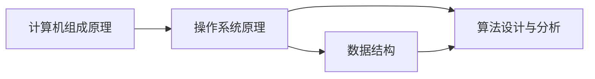

# 如何深刻理解计算机原理，具备良好的数据结构和算法基础

## 1. 背景介绍
### 1.1 计算机原理的重要性
计算机原理是计算机科学的基石，深刻理解计算机原理对于成为一名优秀的程序员、软件架构师或技术领导者至关重要。只有掌握了计算机的工作原理，才能更好地设计出高效、可靠、易维护的软件系统。

### 1.2 数据结构和算法的意义
数据结构和算法是计算机科学的核心，它们是设计和实现高效程序的基础。良好的数据结构和算法功底可以帮助我们更好地理解问题，找到最优解决方案，并写出高质量的代码。

### 1.3 学习计算机原理和算法的挑战
然而，计算机原理和算法的学习过程并非一帆风顺。许多概念抽象难懂，数学推导复杂晦涩，加之缺乏实践经验，很容易让初学者望而却步。因此，如何深入浅出地学习这些知识，并将其应用到实际编程中去，是每个计算机学习者必须面对的课题。

## 2. 核心概念与联系
### 2.1 计算机组成原理
- 冯·诺依曼体系结构
- 运算器、控制器、存储器、输入输出设备
- 指令集架构(ISA)
- 高速缓存、流水线、分支预测等性能优化技术

### 2.2 操作系统原理
- 进程与线程
- 并发、同步与互斥
- 内存管理与虚拟内存
- 文件系统
- 输入输出系统

### 2.3 数据结构
- 线性表：数组、链表、栈、队列
- 树与图：二叉树、平衡树、并查集、最小生成树
- 散列表
- 堆
- 字符串匹配

### 2.4 算法设计与分析
- 复杂度分析：时间复杂度、空间复杂度
- 排序算法：冒泡、选择、插入、归并、快排、堆排、计数、基数
- 查找算法：顺序查找、二分查找、散列查找
- 动态规划
- 贪心算法 
- 回溯算法
- 分治算法

### 2.5 核心概念之间的联系



理解计算机组成原理是学习操作系统的基础，而操作系统原理又是数据结构和算法实现的基石。数据结构为算法提供了数据的逻辑结构和存储方式，算法则在这些数据结构之上完成特定的计算任务。它们相辅相成，缺一不可。

## 3. 核心算法原理具体操作步骤
### 3.1 递归
1. 找出递归终止条件
2. 给出递归终止时的处理办法 
3. 提取重复的子问题
4. 在原问题中调用子问题的解

### 3.2 分治
1. 划分：将问题划分为若干规模较小的子问题
2. 求解：递归地求解每个子问题
3. 合并：将子问题的解合并为原问题的解

### 3.3 动态规划
1. 刻画最优解的结构特征
2. 递归地定义最优解的值
3. 自底向上计算最优解的值
4. 利用计算出的信息构造最优解

### 3.4 贪心
1. 建立数学模型来描述问题
2. 把求解的问题分成若干个子问题
3. 对每一子问题求解，得到子问题的局部最优解
4. 把子问题的解局部最优解合成原来解问题的一个解

### 3.5 回溯
1. 针对所给问题，定义问题的解空间
2. 确定易于搜索的解空间结构
3. 以深度优先的方式搜索解空间，并在搜索过程中用剪枝函数避免无效搜索

## 4. 数学模型和公式详细讲解举例说明
### 4.1 主定理 Master Theorem
对于递归式 $T(n) = aT(n/b) + f(n)$，其中 $a \geq 1$, $b > 1$, $f(n)$ 是渐进正函数，有以下结论：

1. 若 $f(n) = O(n^{\log_b a - \epsilon})$，则 $T(n) = \Theta(n^{\log_b a})$。
2. 若 $f(n) = \Theta(n^{\log_b a})$，则 $T(n) = \Theta(n^{\log_b a}\lg n)$。
3. 若 $f(n) = \Omega(n^{\log_b a + \epsilon})$，且对某个常数 $c < 1$ 和所有足够大的 $n$ 有 $af(n/b) \leq cf(n)$，则 $T(n) = \Theta(f(n))$。

例如，对于归并排序的递归式：

$$T(n) = 2T(n/2) + \Theta(n)$$

其中 $a=2$, $b=2$, $f(n)=\Theta(n)$，根据主定理情况2，可得 $T(n) = \Theta(n \lg n)$。

### 4.2 动态规划
考虑经典的01背包问题：有 $n$ 个物品，每个物品的重量为 $w_i$，价值为 $v_i$，背包的容量为 $W$，如何选择物品使得在不超过背包容量的情况下价值最大？

定义状态 $dp[i][j]$ 表示前 $i$ 个物品中选择若干个，放入容量为 $j$ 的背包中所能获得的最大价值。状态转移方程为：

$$dp[i][j] = \max(dp[i-1][j], dp[i-1][j-w_i] + v_i)$$

其中 $dp[i-1][j]$ 表示不选择第 $i$ 个物品，$dp[i-1][j-w_i] + v_i$ 表示选择第 $i$ 个物品。初始条件为 $dp[0][j]=0$。最终答案为 $dp[n][W]$。

## 5. 项目实践：代码实例和详细解释说明
以下是用C++实现的快速排序算法：

```cpp
void quickSort(vector<int>& arr, int left, int right) {
    if (left >= right) return;
    int i = left, j = right, base = arr[left];
    while (i < j) {
        while (i < j && arr[j] >= base) j--;
        while (i < j && arr[i] <= base) i++;
        if (i < j) swap(arr[i], arr[j]);
    }
    swap(arr[left], arr[i]);
    quickSort(arr, left, i - 1);
    quickSort(arr, i + 1, right);
}
```

该函数接受三个参数：待排序数组`arr`，排序区间的左右端点`left`和`right`。

首先判断左右端点，如果左端点大于等于右端点，说明区间内元素个数小于等于1，已经有序，直接返回。

否则，进行以下操作：

1. 选择基准元素`base`，这里选择区间的第一个元素。
2. 定义两个指针`i`和`j`，初始时分别指向区间的左右端点。
3. 移动右指针`j`，直到找到一个小于`base`的元素，停止。
4. 移动左指针`i`，直到找到一个大于`base`的元素，停止。
5. 如果`i`和`j`没有相遇，交换`arr[i]`和`arr[j]`。
6. 重复步骤3-5，直到`i`和`j`相遇。
7. 将基准元素`base`与`arr[i]`交换，这样基准元素左边的元素都小于等于它，右边的元素都大于等于它。
8. 递归地对基准元素左边和右边的子区间进行快速排序。

快速排序的平均时间复杂度为$O(n\log n)$，最坏情况下的时间复杂度为$O(n^2)$，空间复杂度为$O(\log n)$。

## 6. 实际应用场景
### 6.1 LRU缓存
LRU (Least Recently Used) 缓存淘汰算法常用于操作系统的页面置换、数据库的缓存系统、CPU的缓存等。

LRU算法的思想是，当缓存空间不足时，淘汰最近最少使用的数据。可以使用哈希表和双向链表来实现，哈希表存储数据的键值对，链表按照访问顺序存储键，最近访问的数据在链表头部，最久未访问的数据在链表尾部。当访问一个数据时：

- 如果数据在缓存中，将其移动到链表头部。
- 如果数据不在缓存中，在链表头部插入该数据，如果缓存空间不足，淘汰链表尾部的数据。

### 6.2 TopK问题
在搜索引擎、推荐系统、网络流量监控等场景中，经常需要找出Top K个最大或最小的元素。可以使用堆或快速选择算法来解决。

以找出Top K个最大元素为例，使用小顶堆，堆的大小为K：

1. 将前K个元素插入堆中。
2. 遍历剩余元素，如果当前元素大于堆顶元素，将堆顶元素删除，当前元素插入堆中。
3. 遍历结束后，堆中的元素就是Top K个最大的元素。

### 6.3 A*寻路算法
A*寻路算法常用于游戏、导航等场景中，用于在网格地图中找出从起点到终点的最优路径。

A*算法是对Dijkstra算法的改进，引入了启发函数h(n)来估计从节点n到目标节点的距离，优先搜索最有可能到达目标的节点。

定义节点n的估价函数为f(n) = g(n) + h(n)，其中g(n)为从起点到节点n的实际代价，h(n)为节点n到目标的估计代价。算法过程为：

1. 将起点加入开放列表，计算f(起点)。
2. 从开放列表中取出f值最小的节点n，加入关闭列表。
3. 如果节点n为目标节点，则找到了最优路径，算法结束。
4. 否则，遍历节点n的所有邻居节点m：
   - 如果m在关闭列表中，跳过。
   - 如果m不在开放列表中，将其加入开放列表，计算f(m)，并将n设为m的父节点。
   - 如果m已经在开放列表中，比较经由n到达m的g值和原来的g值，如果前者更小，则更新g(m)和f(m)，并将n设为m的父节点。
5. 重复步骤2-4，直到找到目标节点或开放列表为空。

## 7. 工具和资源推荐
### 7.1 在线教程和课程
- [MIT 6.006 Introduction to Algorithms](https://ocw.mit.edu/courses/6-006-introduction-to-algorithms-fall-2011/)
- [Coursera Algorithms Specialization](https://www.coursera.org/specializations/algorithms)
- [LeetCode](https://leetcode.com/)：在线编程题库
- [VisuAlgo](https://visualgo.net/en)：数据结构和算法可视化学习工具

### 7.2 书籍
- 《算法导论》(Introduction to Algorithms)
- 《算法》(Algorithms)
- 《计算机程序设计艺术》(The Art of Computer Programming)
- 《编程珠玑》(Programming Pearls)
- 《数据结构与算法分析》(Data Structures and Algorithm Analysis)

### 7.3 竞赛平台
- [Codeforces](https://codeforces.com/)
- [TopCoder](https://www.topcoder.com/)
- [AtCoder](https://atcoder.jp/)

## 8. 总结：未来发展趋势与挑战
### 8.1 算法的重要性日益凸显
在大数据、人工智能、云计算等技术飞速发展的今天，算法已经成为推动科技进步的核心动力。从搜索引擎、推荐系统到自动驾驶、智能医疗，高效的算法是支撑这些应用的基石。未来，算法的重要性还将进一步提升。

### 8.2 算法与新兴技术的结合
算法研究正在与深度学习、强化学习、知识图谱、区块链等新兴技术深度融合，催生出一批具有重大应用前景的交叉方向，如联邦学习、图神经网络、可解释机器学习等。这些方向有望突