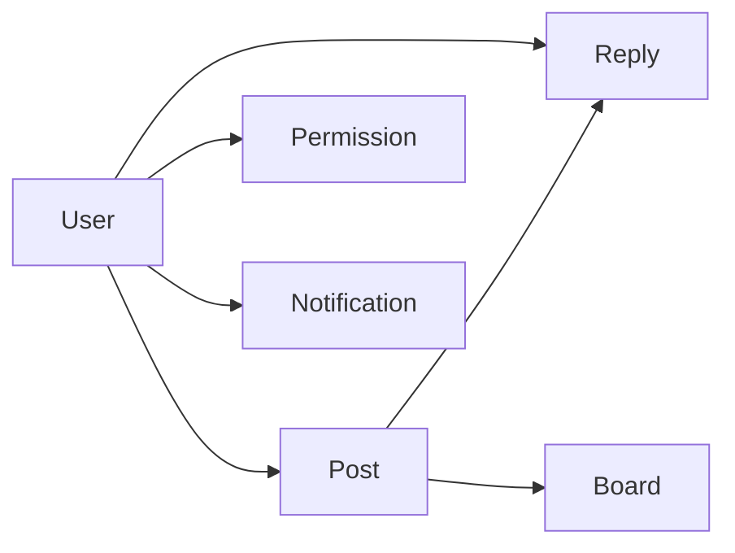

# 学生交流论坛系统详细设计与具体代码实现

## 1.背景介绍

在现代教育领域,学生之间的交流与互动对于促进学习和个人成长至关重要。为了满足学生交流的需求,开发一个功能完善、易于使用的学生交流论坛系统成为了当务之急。本文将详细阐述学生交流论坛系统的设计思路,并提供具体的代码实现,以期为相关领域的研究与实践提供参考。

### 1.1 学生交流的重要性

学生交流在教育过程中扮演着不可或缺的角色,主要体现在以下几个方面:

#### 1.1.1 促进知识共享

通过交流,学生可以分享彼此的学习心得、经验和资源,从而实现知识的传播和共享。这种知识共享不仅有助于个人学习,也能够促进整个学习社区的进步。

#### 1.1.2 培养协作能力

在交流过程中,学生需要与他人合作,共同完成任务或解决问题。这种协作过程能够培养学生的团队意识和沟通能力,为未来的职业发展奠定基础。

#### 1.1.3 提高学习动机

通过与他人的交流和互动,学生能够获得学习的动力和激励。看到其他学生的进步和成就,能够激发学生的学习热情,从而提高学习效率。

### 1.2 学生交流论坛系统的必要性

传统的学生交流方式,如面对面交流或电子邮件往来,存在一定的局限性。因此,开发一个专门的学生交流论坛系统具有以下必要性:

#### 1.2.1 打破时空限制

论坛系统允许学生在任何时间、任何地点进行交流,突破了传统交流方式的时空限制。无论是在课堂上还是课后,学生都可以通过论坛系统进行讨论和互动。

#### 1.2.2 提供丰富的交流功能

论坛系统提供了丰富的交流功能,如发帖、回复、私信等,满足学生多样化的交流需求。学生可以根据自己的兴趣和需要,选择不同的交流方式。

#### 1.2.3 促进资源整合

论坛系统可以成为学生共享资源的平台。学生可以在论坛上上传学习资料、分享学习心得,实现资源的整合和利用。这种资源整合不仅能够提高学习效率,也能够促进知识的传播和创新。

## 2.核心概念与联系

在设计学生交流论坛系统时,需要了解一些核心概念及其之间的联系。

### 2.1 用户(User)

用户是论坛系统的核心,包括学生、教师和管理员。每个用户都有自己的账号和个人信息,可以在论坛上进行各种交流活动。

### 2.2 帖子(Post)

帖子是论坛上的基本交流单位,由用户发布。一个帖子通常包含标题、正文、作者、发布时间等信息。用户可以对帖子进行回复、点赞等操作。

### 2.3 回复(Reply)

回复是用户对帖子的响应,可以是对帖子内容的评论、补充或提问。回复与帖子之间形成了树状的关系结构。

### 2.4 版块(Board)

版块是论坛的子版块,用于对帖子进行分类。不同的版块可以针对不同的主题或学科,方便用户进行浏览和查找。

### 2.5 权限(Permission)

权限是用户在论坛上的操作权限,包括发帖、回复、管理等。不同的用户角色(如学生、教师、管理员)拥有不同的权限。

### 2.6 通知(Notification)

通知是系统向用户发送的提醒信息,如有新回复、新私信等。通知可以帮助用户及时了解论坛的动态。

以下是这些核心概念之间的关系图:

## 3.核心算法原理具体操作步骤

在学生交流论坛系统中,有几个核心算法需要实现,包括帖子排序、用户推荐和敏感词过滤等。下面以帖子排序算法为例,详细介绍其原理和操作步骤。

### 3.1 帖子排序算法

帖子排序算法的目的是根据帖子的热度和时间,对帖子进行排序,使得热门帖子和最新帖子能够优先显示。常见的帖子排序算法包括热度排序和时间排序。

#### 3.1.1 热度排序

热度排序根据帖子的热度值对帖子进行排序。热度值可以根据帖子的浏览量、回复数、点赞数等因素计算得出。

具体步骤如下:

1. 对每个帖子,计算其热度值。热度值的计算公式可以根据实际需求设计,例如:

$$
热度值 = 浏览量 \times 0.3 + 回复数 \times 0.5 + 点赞数 \times 0.2
$$

2. 根据热度值,对帖子进行降序排序。
3. 将排序后的帖子列表返回给前端显示。

#### 3.1.2 时间排序

时间排序根据帖子的发布时间对帖子进行排序,最新发布的帖子会显示在最前面。

具体步骤如下:

1. 对每个帖子,获取其发布时间。
2. 根据发布时间,对帖子进行降序排序。
3. 将排序后的帖子列表返回给前端显示。

### 3.2 用户推荐算法

用户推荐算法的目的是根据用户的兴趣和行为,向其推荐感兴趣的帖子或用户。常见的用户推荐算法包括协同过滤和基于内容的推荐。

#### 3.2.1 协同过滤

协同过滤根据用户之间的相似性,推荐用户可能感兴趣的内容。具体步骤如下:

1. 构建用户-帖子矩阵,矩阵中的元素表示用户对帖子的评分或交互行为(如浏览、点赞等)。
2. 计算用户之间的相似度,常用的相似度计算方法包括皮尔逊相关系数和余弦相似度。
3. 根据用户相似度,为目标用户推荐相似用户喜欢的帖子。

#### 3.2.2 基于内容的推荐

基于内容的推荐根据用户过去喜欢的帖子内容,推荐与之相似的帖子。具体步骤如下:

1. 对帖子内容进行特征提取,如提取关键词、主题等。
2. 构建用户的兴趣模型,根据用户过去喜欢的帖子内容,生成用户的兴趣向量。
3. 计算帖子与用户兴趣向量之间的相似度,推荐相似度高的帖子给用户。

### 3.3 敏感词过滤算法

敏感词过滤算法的目的是对用户发布的内容进行审核,过滤掉其中的敏感词汇。常见的敏感词过滤算法包括基于关键词匹配和基于机器学习的方法。

#### 3.3.1 基于关键词匹配

基于关键词匹配的方法维护一个敏感词库,将用户发布的内容与敏感词库进行匹配,如果匹配成功,则将该内容标记为敏感内容。

具体步骤如下:

1. 构建敏感词库,将敏感词汇存储在一个列表或字典中。
2. 对用户发布的内容进行分词,将内容切分为一个个单词或短语。
3. 将分词结果与敏感词库进行匹配,如果匹配成功,则将该内容标记为敏感内容。

#### 3.3.2 基于机器学习的方法

基于机器学习的方法通过训练一个分类模型,将用户发布的内容自动分类为正常内容或敏感内容。

具体步骤如下:

1. 准备训练数据,将一部分用户发布的内容人工标注为正常内容或敏感内容。
2. 对训练数据进行特征提取,如提取文本的 TF-IDF 特征。
3. 使用机器学习算法(如朴素贝叶斯、支持向量机等)训练分类模型。
4. 对新的用户发布内容,使用训练好的分类模型进行预测,判断其是否为敏感内容。

## 4.数学模型和公式详细讲解举例说明

在学生交流论坛系统中,有一些数学模型和公式被用于实现核心算法。下面以协同过滤算法中的相似度计算为例,详细讲解其中涉及的数学模型和公式。

### 4.1 皮尔逊相关系数

皮尔逊相关系数是一种常用的相似度计算方法,用于衡量两个用户之间的相似程度。假设有两个用户 $u$ 和 $v$,他们对一组帖子的评分分别为 $R_u$ 和 $R_v$,则他们之间的皮尔逊相关系数可以表示为:

$$
sim(u,v) = \frac{\sum_{i \in I_{uv}}(R_{u,i} - \bar{R_u})(R_{v,i} - \bar{R_v})}{\sqrt{\sum_{i \in I_{uv}}(R_{u,i} - \bar{R_u})^2} \sqrt{\sum_{i \in I_{uv}}(R_{v,i} - \bar{R_v})^2}}
$$

其中,$I_{uv}$ 表示用户 $u$ 和 $v$ 共同评分的帖子集合,$\bar{R_u}$ 和 $\bar{R_v}$ 分别表示用户 $u$ 和 $v$ 的平均评分。

举例说明:

假设用户 $u$ 对帖子 $[1,2,3,4,5]$ 的评分为 $[3,4,2,5,1]$,用户 $v$ 对帖子 $[1,2,4,5]$ 的评分为 $[4,5,3,2]$。

首先,计算 $\bar{R_u}$ 和 $\bar{R_v}$:

$$
\bar{R_u} = \frac{3+4+2+5+1}{5} = 3
$$
$$
\bar{R_v} = \frac{4+5+3+2}{4} = 3.5
$$

然后,计算分子部分:

$$
\sum_{i \in I_{uv}}(R_{u,i} - \bar{R_u})(R_{v,i} - \bar{R_v}) = (3-3)(4-3.5) + (4-3)(5-3.5) + (5-3)(3-3.5) + (1-3)(2-3.5) = 0.5 + 1.5 - 1 - 3 = -2
$$

最后,计算分母部分:

$$
\sqrt{\sum_{i \in I_{uv}}(R_{u,i} - \bar{R_u})^2} = \sqrt{(3-3)^2 + (4-3)^2 + (5-3)^2 + (1-3)^2} = \sqrt{1 + 1 + 4 + 4} = \sqrt{10}
$$
$$
\sqrt{\sum_{i \in I_{uv}}(R_{v,i} - \bar{R_v})^2} = \sqrt{(4-3.5)^2 + (5-3.5)^2 + (3-3.5)^2 + (2-3.5)^2} = \sqrt{0.25 + 2.25 + 0.25 + 2.25} = \sqrt{5}
$$

因此,用户 $u$ 和 $v$ 之间的皮尔逊相关系数为:

$$
sim(u,v) = \frac{-2}{\sqrt{10} \sqrt{5}} \approx -0.4472
$$

### 4.2 余弦相似度

余弦相似度是另一种常用的相似度计算方法,它将用户看作是高维空间中的向量,通过计算两个向量之间的夹角余弦值来衡量相似度。假设用户 $u$ 和 $v$ 对 $n$ 个帖子的评分向量分别为 $R_u$ 和 $R_v$,则他们之间的余弦相似度可以表示为:

$$
sim(u,v) = \frac{R_u \cdot R_v}{\|R_u\| \|R_v\|} = \frac{\sum_{i=1}^n R_{u,i} R_{v,i}}{\sqrt{\sum_{i=1}^n R_{u,i}^2} \sqrt{\sum_{i=1}^n R_{v,i