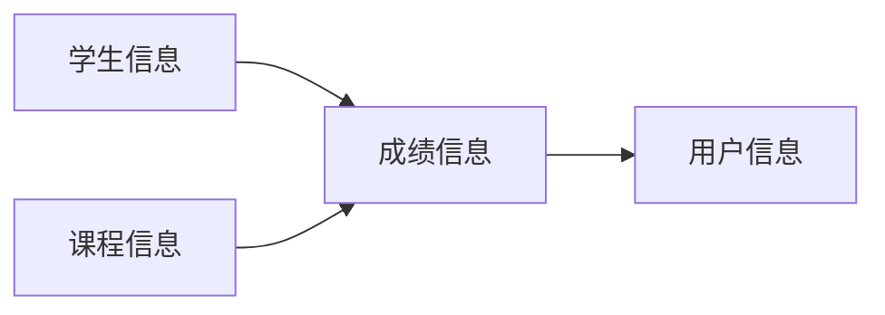
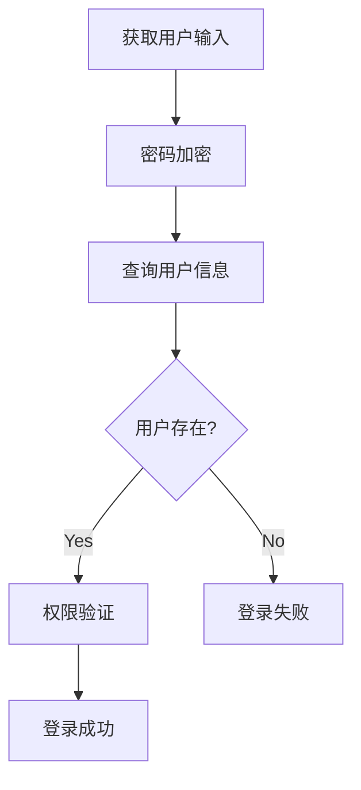
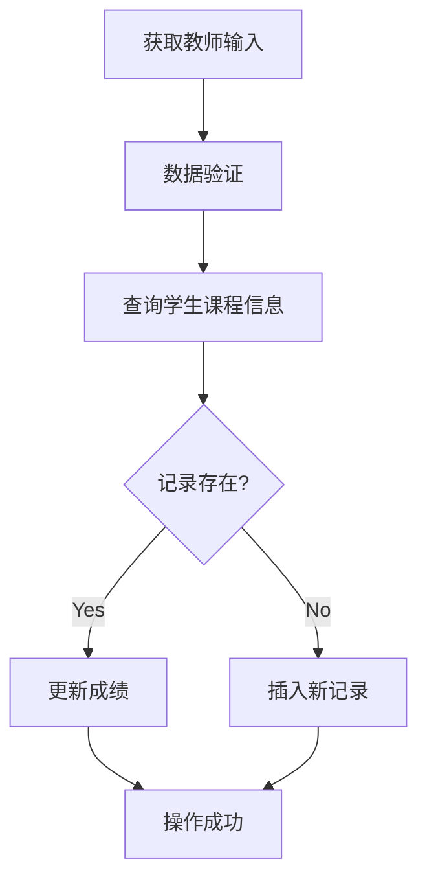
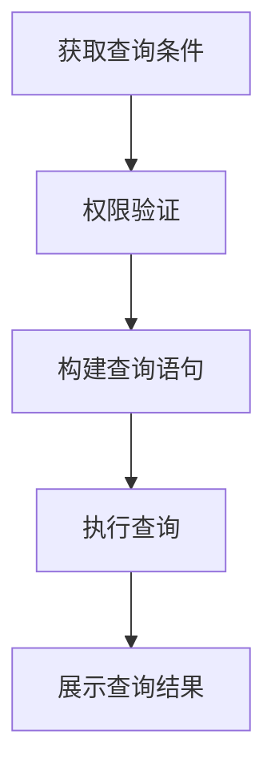
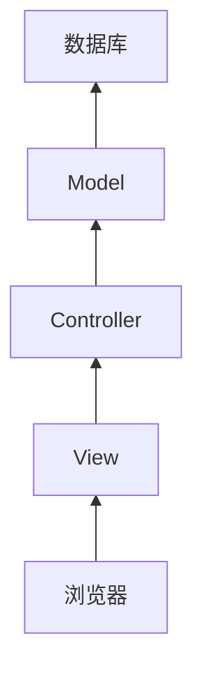

# 学生成绩查询系统详细设计与具体代码实现

## 1. 背景介绍

### 1.1 学生成绩管理系统的重要性

在教育领域中,学生成绩管理系统扮演着至关重要的角色。它不仅为教师提供了高效管理学生成绩的工具,还能为学生及家长提供及时、准确的成绩反馈。一个优秀的学生成绩管理系统可以极大地提高教学质量,促进师生之间的沟通和协作。

### 1.2 传统管理方式的缺陷

传统的纸质成绩单和手工管理方式存在诸多弊端,例如:

- 工作量大,效率低下
- 数据易丢失或被篡改
- 查询和统计分析困难
- 无法实现实时在线查询

这些问题的存在极大地阻碍了教育信息化的发展,因此亟需一种高效、安全、可靠的学生成绩管理系统。

### 1.3 学生成绩查询系统的作用

学生成绩查询系统作为学生成绩管理系统的重要组成部分,能够为教师、学生和家长提供以下主要功能:

- 教师可以高效录入、管理学生成绩
- 学生可以随时查询自己的历史成绩
- 家长可以及时了解孩子的学习情况
- 系统可自动生成成绩报表和统计分析

通过该系统,教育信息可以高效流转,教学质量得以全面提升。

## 2. 核心概念与联系

### 2.1 系统用户角色

学生成绩查询系统主要包括三种用户角色:

1. **教师** - 负责录入和管理学生成绩
2. **学生** - 可查询个人历史成绩
3. **家长** - 可查询子女的学习成绩

每种角色都有不同的权限和功能,系统需对不同用户身份进行严格的权限控制。

### 2.2 核心数据模型

系统的核心数据模型包括以下几个主要部分:

1. **学生信息** - 包括学号、姓名、班级等基本信息
2. **课程信息** - 包括课程名称、课程编号等信息 
3. **成绩信息** - 包括学生学号、课程编号、分数等信息
4. **用户信息** - 包括用户名、密码、角色等认证信息

这些数据模型之间存在着紧密的关联关系,是整个系统的数据基础。



### 2.3 系统功能模块

学生成绩查询系统通常包括以下几个核心功能模块:

1. **用户认证模块** - 负责用户登录、注册、权限控制
2. **成绩管理模块** - 教师使用,录入、修改、删除学生成绩
3. **成绩查询模块** - 学生和家长使用,查询个人或子女成绩
4. **统计分析模块** - 生成学生成绩报表和统计数据
5. **系统管理模块** - 管理员使用,维护系统参数和数据

每个模块承担不同的职责,但又相互协作,共同构建了完整的系统功能。

## 3. 核心算法原理具体操作步骤  

### 3.1 用户认证算法

用户认证是系统的关键安全防线,其核心算法通常包括以下几个步骤:

1. **获取用户输入** - 获取用户提交的用户名和密码
2. **密码加密** - 使用安全散列算法(如SHA-256)对密码进行单向加密
3. **查询用户信息** - 在用户信息表中查找与输入用户名和加密密码匹配的记录
4. **权限验证** - 验证用户的角色权限,确定可访问的系统功能
5. **登录成功或失败** - 根据查询结果,确定是否允许用户登录系统



该算法确保了系统只有合法用户才能访问,且每个用户只能执行其权限范围内的操作,有效防止了未经授权的访问。

### 3.2 成绩录入算法

教师录入学生成绩是系统的核心功能之一,其算法步骤如下:

1. **获取教师输入** - 获取教师提交的学生学号、课程编号和分数
2. **数据验证** - 验证输入数据的完整性和合法性
3. **查询学生课程信息** - 在学生和课程信息表中查找匹配的记录
4. **插入或更新成绩** - 如果该学生课程的成绩不存在,则插入新记录;否则更新已有记录
5. **操作成功或失败** - 根据上一步的执行结果,返回成功或失败信息



该算法保证了成绩数据的完整性和准确性,同时也对教师的操作权限进行了限制,只有授权教师才能修改相关课程的成绩。

### 3.3 成绩查询算法

学生和家长查询成绩是系统的另一核心功能,算法步骤如下:

1. **获取查询条件** - 获取用户输入的查询条件(学号、课程等)
2. **权限验证** - 验证用户是否有相应的查询权限
3. **构建查询语句** - 根据查询条件,构建相应的数据库查询语句
4. **执行查询** - 在数据库中执行查询语句,获取结果集
5. **展示查询结果** - 将查询结果集格式化并展示给用户



该算法确保了只有合法用户才能查询相应的成绩信息,并对查询结果进行了格式化处理,以便用户更好地查看和理解。

## 4. 数学模型和公式详细讲解举例说明

在学生成绩查询系统中,数学模型和公式主要应用于统计分析模块,用于生成各种成绩报表和统计数据。以下是一些常见的数学模型和公式:

### 4.1 平均分计算

计算某个学生在某门课程的平均分,公式如下:

$$\overline{x} = \frac{\sum_{i=1}^{n}x_i}{n}$$

其中:
- $\overline{x}$ 表示平均分
- $x_i$ 表示第 i 次考试的分数
- n 表示考试次数

例如,一名学生在某门课程的5次考试分数分别为80、75、85、90、78,则其平均分为:

$$\overline{x} = \frac{80 + 75 + 85 + 90 + 78}{5} = 81.6$$

### 4.2 标准差计算

计算某个学生在某门课程的成绩标准差,公式如下:

$$s = \sqrt{\frac{\sum_{i=1}^{n}(x_i - \overline{x})^2}{n-1}}$$

其中:
- s 表示标准差
- $x_i$ 表示第 i 次考试的分数
- $\overline{x}$ 表示平均分
- n 表示考试次数

例如,计算上述5次考试成绩的标准差:

$$s = \sqrt{\frac{(80-81.6)^2 + (75-81.6)^2 + (85-81.6)^2 + (90-81.6)^2 + (78-81.6)^2}{5-1}} \approx 5.45$$

标准差反映了成绩的离散程度,值越大说明成绩波动越大。

### 4.3 成绩等级划分

根据学生的平均分,可以将成绩划分为不同的等级,例如:

$$
\text{等级} = 
\begin{cases}
A & \text{if } \overline{x} \geq 90\\
B & \text{if } 80 \leq \overline{x} < 90\\
C & \text{if } 70 \leq \overline{x} < 80\\
D & \text{if } 60 \leq \overline{x} < 70\\
E & \text{if } \overline{x} < 60
\end{cases}
$$

这种划分方式能够直观地反映出学生的学习水平。

通过以上数学模型和公式,系统可以为教师和学生提供更加全面和深入的成绩分析,帮助发现问题、改进教学。

## 5. 项目实践: 代码实例和详细解释说明

为了更好地理解学生成绩查询系统的实现,我们将使用 Python 语言和 Flask Web 框架开发一个简单的示例系统。

### 5.1 系统架构

我们将采用经典的三层架构模式:

1. **表现层(View)** - 负责接收用户请求,展示数据
2. **业务逻辑层(Controller)** - 处理业务逻辑,调用数据访问层
3. **数据访问层(Model)** - 负责与数据库进行交互



### 5.2 数据模型定义

我们首先定义系统所需的数据模型,使用 Flask-SQLAlchemy 扩展与数据库进行交互:

```python
from flask_sqlalchemy import SQLAlchemy

db = SQLAlchemy()

class Student(db.Model):
    id = db.Column(db.Integer, primary_key=True)
    name = db.Column(db.String(50), nullable=False)
    grades = db.relationship('Grade', backref='student', lazy='dynamic')

class Course(db.Model):
    id = db.Column(db.Integer, primary_key=True)
    name = db.Column(db.String(50), nullable=False)
    grades = db.relationship('Grade', backref='course', lazy='dynamic')

class Grade(db.Model):
    id = db.Column(db.Integer, primary_key=True)
    student_id = db.Column(db.Integer, db.ForeignKey('student.id'), nullable=False)
    course_id = db.Column(db.Integer, db.ForeignKey('course.id'), nullable=False)
    score = db.Column(db.Integer, nullable=False)
```

这些模型分别对应学生、课程和成绩信息,通过外键建立了相互关联。

### 5.3 视图函数

接下来,我们定义一些视图函数,用于处理用户请求:

```python
from flask import render_template, request, redirect, url_for
from .models import Student, Course, Grade

@app.route('/')
def index():
    return render_template('index.html')

@app.route('/grades', methods=['GET', 'POST'])
def grades():
    if request.method == 'POST':
        student_id = request.form['student_id']
        course_id = request.form['course_id']
        score = request.form['score']
        grade = Grade(student_id=student_id, course_id=course_id, score=score)
        db.session.add(grade)
        db.session.commit()
        return redirect(url_for('grades'))
    students = Student.query.all()
    courses = Course.query.all()
    grades = Grade.query.all()
    return render_template('grades.html', students=students, courses=courses, grades=grades)
```

这里我们定义了两个视图函数:

1. `index` 函数渲染系统主页
2. `grades` 函数用于教师录入学生成绩,同时也展示了所有学生的成绩信息

### 5.4 模板文件

对应的模板文件 `grades.html` 如下:

```html



<h1>学生成绩管理</h1>
<form method="post">
    <label>学生:</label>
    <select name="student_id">
        
        <option value="{{ student.id }}">{{ student.name }}</option>
        
    </select>
    <label>课程:</label>
    <select name="course_id">
        
        <option value="{{ course.id }}">{{ course.name }}</option>
        
    </select>
    <label>分数:</label>
    <input type="number" name="score" min="0" max="100" required>
    <input type="submit" value="提交">
</form>
<table>
    <tr>
        <th>学生</th>
        <th>课程</th>
        <th>分