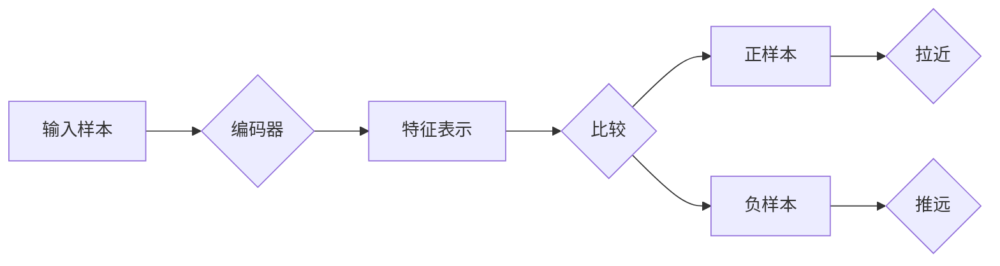

## 1.背景介绍

对比学习（Contrastive Learning）是一种无监督学习的方法，它通过比较不同的样本来学习数据的内部结构和特征。对比学习在图像识别、自然语言处理等领域都有广泛的应用，且在近年来的研究中，取得了显著的效果。

## 2.核心概念与联系

对比学习的核心概念是通过比较正样本（相似的样本）和负样本（不相似的样本）来学习特征的表示。在对比学习中，我们希望模型能够把正样本拉近，而把负样本推远。



## 3.核心算法原理具体操作步骤

对比学习的核心算法可以分为以下几个步骤：

1. 从数据集中随机选择一个样本，然后生成该样本的正样本和负样本。正样本通常是通过数据增强（如旋转、缩放等）生成的，而负样本则是从其他样本中随机选择的。

2. 将样本、正样本和负样本通过编码器（通常是一个深度神经网络）得到它们的特征表示。

3. 计算正样本和负样本的特征表示与原样本的特征表示之间的距离。我们希望正样本的距离小于负样本的距离。

4. 通过反向传播和梯度下降等优化算法，更新编码器的参数，使得正样本的距离变小，负样本的距离变大。

## 4.数学模型和公式详细讲解举例说明

对比学习的数学模型可以用以下的公式来表示：

假设我们有一个样本 $x$，其正样本为 $x^+$，负样本为 $x^-$，通过编码器 $f$ 我们可以得到它们的特征表示 $f(x)$、$f(x^+)$ 和 $f(x^-)$。我们的目标是最小化以下的损失函数：

$$
L = D(f(x), f(x^+)) - D(f(x), f(x^-))
$$

其中，$D$ 是一个距离函数，如欧氏距离或余弦距离。我们希望正样本的距离小于负样本的距离，所以要最小化这个损失函数。

## 5.项目实践：代码实例和详细解释说明

以下是一个使用 PyTorch 实现对比学习的简单示例：

```python
import torch
import torch.nn as nn
import torch.optim as optim

# 定义编码器
class Encoder(nn.Module):
    def __init__(self):
        super(Encoder, self).__init__()
        self.conv = nn.Conv2d(3, 64, 3, stride=1, padding=1)
        self.relu = nn.ReLU()
        self.pool = nn.MaxPool2d(2, 2)

    def forward(self, x):
        x = self.conv(x)
        x = self.relu(x)
        x = self.pool(x)
        return x

# 定义对比学习的损失函数
class ContrastiveLoss(nn.Module):
    def __init__(self, margin=1.0):
        super(ContrastiveLoss, self).__init__()
        self.margin = margin

    def forward(self, output1, output2, label):
        euclidean_distance = F.pairwise_distance(output1, output2)
        loss_contrastive = torch.mean((1-label) * torch.pow(euclidean_distance, 2) +
                                      (label) * torch.pow(torch.clamp(self.margin - euclidean_distance, min=0.0), 2))


        return loss_contrastive

# 训练模型
def train(model, data_loader, optimizer, epoch, device):
    model.train()
    for batch_idx, (data, target) in enumerate(data_loader):
        data, target = data.to(device), target.to(device)
        optimizer.zero_grad()
        output = model(data)
        loss = ContrastiveLoss()(output, target)
        loss.backward()
        optimizer.step()
```

## 6.实际应用场景

对比学习在许多领域都有广泛的应用，如：

- 图像识别：对比学习可以学习到图像的内部结构和特征，从而提高图像识别的准确性。

- 自然语言处理：对比学习可以用于学习语言的语义和语法结构，从而提高语言模型的性能。

- 强化学习：对比学习可以用于学习状态和动作的表示，从而提高强化学习的效率。

## 7.工具和资源推荐

对于对比学习的实现，以下是一些推荐的工具和资源：

- PyTorch：一个广泛使用的深度学习框架，有丰富的 API 和良好的社区支持。

- TensorFlow：Google 开发的开源机器学习框架，支持多种平台，有丰富的 API 和文档。

- DeepMind：Google 的子公司，专注于深度学习和强化学习的研究，有许多高质量的论文和代码。

## 8.总结：未来发展趋势与挑战

对比学习作为一种有效的无监督学习方法，已经在图像识别、自然语言处理等领域取得了显著的效果。然而，对比学习仍然面临许多挑战，如如何选择和生成负样本、如何定义和计算样本之间的距离等。随着研究的深入，我们期待对比学习能够在更多的领域和应用中发挥作用。

## 9.附录：常见问题与解答

Q: 对比学习和其他无监督学习方法有什么区别？

A: 对比学习的主要区别在于它是通过比较正样本和负样本来学习特征的表示，而不是直接从单个样本中学习。

Q: 对比学习适用于哪些类型的数据？

A: 对比学习适用于任何类型的数据，只要能够定义样本之间的相似性和差异性。例如，对比学习可以应用于图像、文本、音频等数据。

Q: 对比学习的主要挑战是什么？

A: 对比学习的主要挑战包括如何选择和生成负样本、如何定义和计算样本之间的距离等。

作者：禅与计算机程序设计艺术 / Zen and the Art of Computer Programming