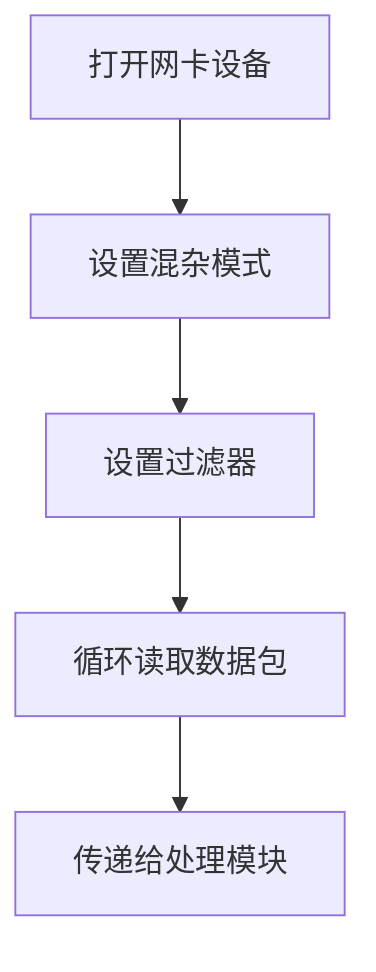
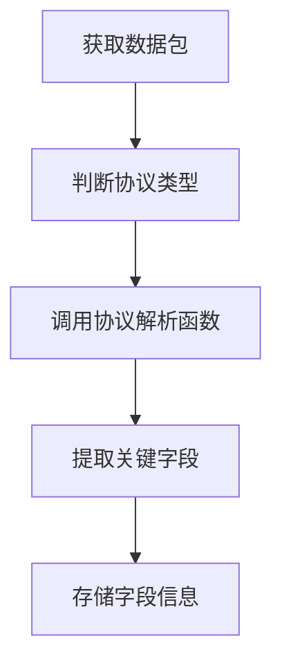
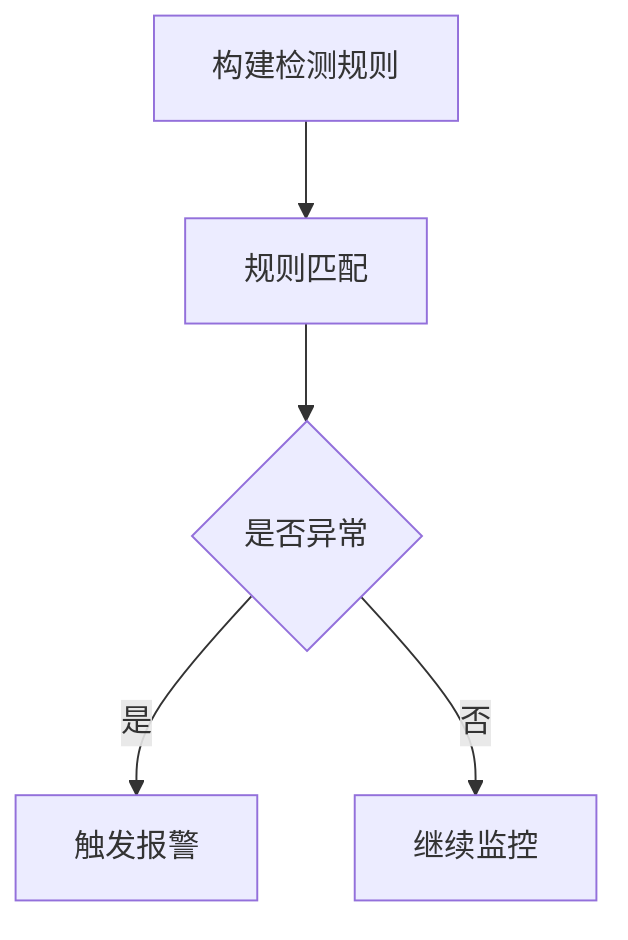

# 局域网监听软件系统详细设计与具体代码实现

## 1.背景介绍

在当今网络环境中,网络安全和数据保护是一个日益重要的问题。随着网络攻击手段的不断升级,有必要开发出更加强大和高效的网络监控工具,以便及时发现和防御潜在的安全威胁。局域网监听软件系统就是这样一种工具,它可以实时监控局域网内的网络流量,捕获和分析数据包,帮助管理员及时发现异常活动并采取相应的防御措施。

本文将详细介绍局域网监听软件系统的设计和实现过程,包括系统的核心概念、算法原理、数学模型、代码实现、实际应用场景等内容。通过本文,读者可以全面了解局域网监听软件的工作原理,掌握其设计和开发的关键技术,为网络安全防护提供有力的技术支持。

### 1.1 局域网监听的重要性

### 1.2 现有监听工具的局限性  

### 1.3 本文研究的意义和目标

## 2.核心概念与联系

在深入探讨局域网监听软件的设计和实现之前,有必要先介绍一些核心概念,为后续内容的理解打下基础。

### 2.1 数据包捕获

数据包捕获是局域网监听软件的核心功能之一。它通过将网卡置于混杂模式,可以捕获经过该网卡的所有数据包,而不仅限于发送给本机的数据包。


### 2.2 数据包分析

捕获到的数据包需要进行进一步的分析和处理,以提取有用的信息。这通常包括解析数据包的各个协议层,提取源IP、目的IP、端口号等关键字段。


### 2.3 异常检测

通过分析数据包的内容和模式,局域网监听软件可以检测出潜在的安全威胁,如端口扫描、蠕虫病毒、DOS攻击等。这需要基于已知的攻击特征和行为模型进行匹配。

### 2.4 报警处理

一旦发现异常活动,局域网监听软件需要及时发出报警,并采取相应的防御措施,如记录日志、阻断连接等。报警处理模块是系统的重要组成部分。

### 2.5 可视化界面

为了方便管理员使用和监控,局域网监听软件通常需要提供一个直观的可视化界面,展示实时的网络流量信息、异常报警等内容。

## 3.核心算法原理具体操作步骤  

局域网监听软件的核心算法主要包括数据包捕获、协议分析和异常检测三个部分。

### 3.1 数据包捕获算法

数据包捕获算法的主要步骤如下:

1. 打开网卡设备,获取网卡句柄
2. 将网卡置于混杂模式,以便捕获所有经过该网卡的数据包
3. 设置数据包捕获过滤器,以过滤掉不需要的数据包
4. 循环读取捕获到的数据包,并将其传递给后续的处理模块



### 3.2 协议分析算法

协议分析算法的主要步骤如下:

1. 根据数据包的协议类型,调用相应的协议解析函数
2. 解析数据包的各个协议层,提取关键字段信息
3. 将提取的信息存储在适当的数据结构中,以备后续处理



### 3.3 异常检测算法

异常检测算法的主要步骤如下:

1. 基于已知的攻击特征和行为模型,构建异常检测规则
2. 对捕获到的数据包进行规则匹配,检测是否存在异常活动
3. 如果发现异常,则触发相应的报警处理机制



## 4.数学模型和公式详细讲解举例说明

在局域网监听软件的设计和实现中,有一些数学模型和公式可以帮助我们更好地理解和优化系统的性能。

### 4.1 数据包捕获模型

假设网卡的最大吞吐量为 $R_{max}$,当前网络流量的平均速率为 $\lambda$,数据包的平均长度为 $L$,则数据包被丢弃的概率 $P_{drop}$ 可以用下式表示:

$$P_{drop} = 1 - \rho^N \frac{1-\rho}{1-\rho^{N+1}}$$

其中,

- $\rho = \lambda L / R_{max}$ 为网卡的利用率
- $N$ 为网卡接收缓冲区的大小(以数据包为单位)

从上式可以看出,当网络流量较小时,数据包被丢弃的概率很低;但当流量逐渐增大,接近网卡的最大吞吐量时,丢包率会急剧上升。因此,在设计局域网监听软件时,需要根据实际情况选择合适的网卡,并优化数据包处理效率,以降低丢包率。

### 4.2 协议分析模型

假设一个数据包包含 $n$ 个协议层,每个协议层的解析时间为 $t_1, t_2, \cdots, t_n$,则整个数据包的解析时间 $T$ 可以表示为:

$$T = \sum_{i=1}^{n} t_i$$

我们的目标是最小化协议分析的总时间 $T$,以提高系统的实时性能。一种可能的优化方法是并行处理不同的协议层,从而减少总的解析时间。

### 4.3 异常检测模型

在异常检测中,我们需要构建一个模型来判断某个网络活动是否属于正常行为。一种常见的方法是使用基于统计的异常检测模型。

假设我们观察到的网络活动可以用一个 $d$ 维的特征向量 $\mathbf{x} = (x_1, x_2, \cdots, x_d)$ 来表示,我们可以估计出正常活动的概率密度函数 $p(\mathbf{x})$。对于任意一个新的观测值 $\mathbf{x}_0$,如果 $p(\mathbf{x}_0)$ 较小,则可以认为它是一个异常活动。

常见的概率密度估计方法包括高斯混合模型(GMM)、核密度估计(KDE)等。具体来说,如果使用 GMM,则正常活动的概率密度函数可以表示为:

$$p(\mathbf{x}) = \sum_{k=1}^{K} \pi_k \mathcal{N}(\mathbf{x}|\boldsymbol{\mu}_k, \boldsymbol{\Sigma}_k)$$

其中,

- $K$ 是混合成分的个数
- $\pi_k$ 是第 $k$ 个成分的混合系数,满足 $\sum_{k=1}^{K} \pi_k = 1$
- $\mathcal{N}(\mathbf{x}|\boldsymbol{\mu}_k, \boldsymbol{\Sigma}_k)$ 是第 $k$ 个成分的高斯密度函数,其均值向量为 $\boldsymbol{\mu}_k$,协方差矩阵为 $\boldsymbol{\Sigma}_k$

通过估计 GMM 的参数 $\{\pi_k, \boldsymbol{\mu}_k, \boldsymbol{\Sigma}_k\}_{k=1}^{K}$,我们就可以得到正常活动的概率密度模型,从而判断新的观测值是否属于异常。

## 5.项目实践:代码实例和详细解释说明

在上一部分,我们介绍了局域网监听软件的核心算法原理。现在,我们将通过一些代码示例,来具体说明如何实现这些算法。

### 5.1 数据包捕获实现

我们使用 Python 中的 `scapy` 库来实现数据包捕获功能。下面是一个简单的示例:

```python
from scapy.all import *

# 设置网卡为混杂模式
def set_promisc(iface):
    os.system(f"ifconfig {iface} promisc")

# 数据包捕获回调函数
def packet_callback(pkt):
    # 处理捕获到的数据包
    print(f"Captured packet: {pkt.summary()}")

# 主函数
def main():
    iface = "eth0"  # 网卡接口名称
    set_promisc(iface)

    # 开始捕获数据包
    print(f"Starting packet capture on interface {iface}...")
    sniff(iface=iface, prn=packet_callback, store=0)

if __name__ == "__main__":
    main()
```

在上面的代码中,我们首先使用 `set_promisc` 函数将网卡置于混杂模式,然后调用 `sniff` 函数开始捕获数据包。每当捕获到一个数据包,就会执行 `packet_callback` 函数,在这里我们只是简单地打印出数据包的摘要信息。

### 5.2 协议分析实现

我们继续使用 `scapy` 库来实现协议分析功能。下面是一个解析 TCP 数据包的示例:

```python
from scapy.all import *

def analyze_tcp_packet(pkt):
    # 检查是否为 TCP 数据包
    if pkt.haslayer(TCP):
        tcp_pkt = pkt[TCP]

        # 提取关键字段
        src_ip = pkt[IP].src
        dst_ip = pkt[IP].dst
        src_port = tcp_pkt.sport
        dst_port = tcp_pkt.dport
        seq_num = tcp_pkt.seq
        ack_num = tcp_pkt.ack
        flags = tcp_pkt.flags

        # 打印关键字段信息
        print(f"Source IP: {src_ip}, Dest IP: {dst_ip}")
        print(f"Source Port: {src_port}, Dest Port: {dst_port}")
        print(f"Sequence Number: {seq_num}, Ack Number: {ack_num}")
        print(f"TCP Flags: {flags}")

# 数据包捕获回调函数
def packet_callback(pkt):
    analyze_tcp_packet(pkt)

# 主函数
def main():
    iface = "eth0"  # 网卡接口名称
    print(f"Starting packet capture on interface {iface}...")
    sniff(iface=iface, prn=packet_callback, store=0)

if __name__ == "__main__":
    main()
```

在上面的代码中,我们定义了 `analyze_tcp_packet` 函数来解析 TCP 数据包。该函数首先检查数据包是否包含 TCP 层,如果是,则提取源IP、目的IP、源端口、目的端口、序列号、确认号和标志位等关键字段,并将它们打印出来。在 `packet_callback` 函数中,我们对每个捕获到的数据包调用 `analyze_tcp_packet` 函数进行协议分析。

### 5.3 异常检测实现

下面是一个使用高斯混合模型(GMM)进行异常检测的示例:

```python
import numpy as np
from sklearn.mixture import GaussianMixture

# 定义特征提取函数
def extract_features(pkt):
    # 从数据包中提取特征,返回特征向量
    # ...

# 训练高斯混合模型
def train_gmm(X_train):
    gmm = GaussianMixture(n_components=5, covariance_type='full')
    gmm.fit(X_train)
    return gmm

# 异常检测函数
def detect_anomaly(gmm, X_test, threshold):
    scores = gmm.score_samples(X_test)
    anomalies = np.where(scores < threshold)[0]
    return anomalies

# 数据包捕获回调函数
def packet_callback(pkt):
    # 提取特征向量
    X = extract_features(pkt)

    # 使用训练好的 GMM 进行异常检测
    anomaly = detect_anomaly(gmm, X, threshold)

    if anomaly:
        print(f"Detected anomaly in packet: {pkt.summary()}")
    else: