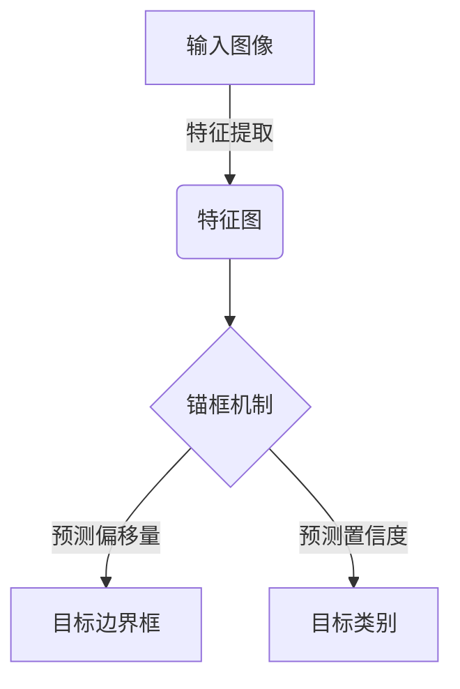
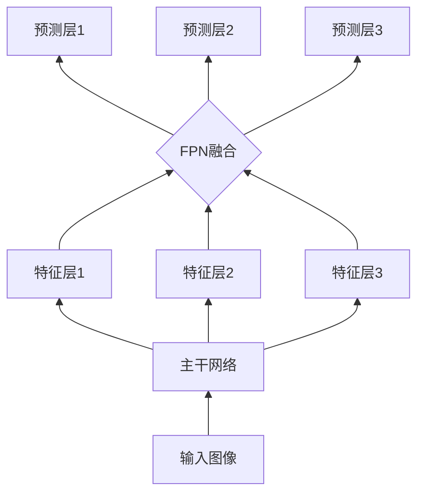
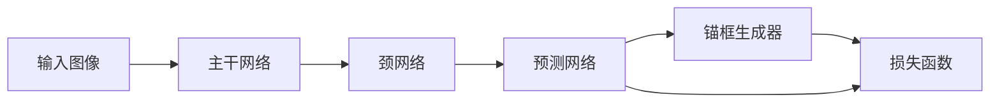

# 工业级应用:YOLOv8在工业领域的实践

## 1.背景介绍

### 1.1 计算机视觉在工业领域的重要性

在当今工业自动化和智能制造的大潮流中,计算机视觉技术扮演着至关重要的角色。它赋予机器以"视觉"能力,使其能够感知和理解周围环境,为实现智能化决策和控制奠定基础。工业视觉系统广泛应用于质量检测、缺陷识别、物体定位和跟踪、机器人导航等诸多场景,显著提高了生产效率、产品质量和运营安全性。

### 1.2 目标检测在工业视觉中的作用  

目标检测是计算机视觉的核心任务之一,旨在自动定位和识别图像或视频流中感兴趣的目标物体。在工业环境下,准确高效的目标检测对于自动化生产线的运行至关重要。例如,在电子制造业中,需要检测印刷电路板上的元器件是否存在缺陷或错位;在食品加工领域,需要检测产品是否符合规格标准;在物流仓储中,需要识别和跟踪货物的位置等。

### 1.3 YOLOv8简介

YOLOv8是一种先进的单阶段目标检测算法,由著名的AI研究员Joseph Redmon等人开发。它在准确度和速度方面取得了卓越的性能,被广泛应用于各种视觉任务中。YOLOv8的核心思想是将目标检测任务建模为一个回归问题,直接从图像像素预测目标边界框和类别概率,避免了传统方法中复杂的候选区域生成和分类过程。

## 2.核心概念与联系

### 2.1 单阶段目标检测

传统的目标检测方法通常采用两阶段策略:首先生成大量候选目标区域,然后对每个候选区域进行分类。这种方式计算量大、速度慢,难以满足实时性要求。单阶段目标检测算法则将候选区域生成和分类统一到同一个神经网络中完成,降低了计算复杂度,显著提高了检测速度。

### 2.2 锚框机制

YOLOv8采用了锚框(Anchor Box)机制,通过预先设置一组具有不同形状和比例的参考框,使神经网络能够学习预测目标边界框相对于锚框的偏移量,从而实现对不同形状目标的检测。这种方式避免了滑动窗口和区域提议的传统方法,降低了计算开销。



### 2.3 特征金字塔网络

为了同时检测不同尺度的目标,YOLOv8采用了特征金字塔网络(FPN)结构。它利用自上而下和自下而上的特征融合,融合了多尺度特征信息,增强了网络对不同大小目标的检测能力。



### 2.4 注意力机制  

YOLOv8引入了注意力机制,使网络能够自适应地关注图像中最重要的区域,从而提高检测精度。具体来说,它采用了空间注意力模块(SAM)和通道注意力模块(CAM),分别从空间和通道两个维度增强了特征的表达能力。

## 3.核心算法原理具体操作步骤

### 3.1 网络结构

YOLOv8的网络结构可分为五个主要部分:主干网络(Backbone)、颈网络(Neck)、预测网络(Head)、锚框生成器和损失函数计算。

1. **主干网络**负责从输入图像中提取特征,通常采用经典的卷积神经网络如ResNet、EfficientNet等。
2. **颈网络**融合来自主干网络的不同尺度特征,构建特征金字塔。
3. **预测网络**在特征金字塔的每一层预测目标边界框、置信度和类别概率。
4. **锚框生成器**根据预设的锚框配置,为每个特征点生成一组锚框。
5. **损失函数**衡量预测结果与真实值之间的差异,用于网络参数的优化。



### 3.2 前向传播过程

1. **特征提取**:输入图像经过主干网络,提取出多尺度特征图。
2. **特征融合**:颈网络将主干网络输出的特征图进行上采样、下采样和融合,构建特征金字塔。
3. **锚框生成**:在每个特征层上,锚框生成器为每个特征点生成一组预设形状和比例的锚框。
4. **目标预测**:预测网络对每个锚框进行目标边界框、置信度和类别概率的预测。

### 3.3 损失函数与反向传播

YOLOv8的损失函数是目标函数、分类损失和置信度损失的加权和。在训练过程中,通过反向传播算法计算损失函数相对于网络参数的梯度,并使用优化算法如SGD、Adam等更新网络参数,最小化损失函数值。

$$
\begin{aligned}
\mathcal{L} &= \lambda_\text{coord} \sum_{i=0}^{S^2}\sum_{j=0}^{B} \mathbb{1}_{ij}^\text{obj} \Big[ (x_i - \hat{x}_i)^2 + (y_i - \hat{y}_i)^2 \\
&\quad\quad\quad\quad\quad\quad\quad\quad\quad + ({\sqrt{w_i} - \sqrt{\hat{w}_i}})^2 + ({\sqrt{h_i} - \sqrt{\hat{h}_i}})^2 \Big] \\
&+ \lambda_\text{noobj} \sum_{i=0}^{S^2}\sum_{j=0}^{B} \mathbb{1}_{ij}^\text{noobj} \Big[ (\hat{C}_i)^2 \Big] \\
&+ \lambda_\text{class} \sum_{i=0}^{S^2} \mathbb{1}_i^\text{obj} \sum_{c \in \text{classes}} \Big[ p_i(c) - \hat{p}_i(c) \Big]^2
\end{aligned}
$$

其中:
- $\lambda_\text{coord}$、$\lambda_\text{noobj}$、$\lambda_\text{class}$ 分别是目标框损失、无目标框损失和分类损失的权重系数。
- $(x, y, w, h)$ 表示预测的边界框中心坐标、宽度和高度。
- $\hat{C}_i$ 表示无目标框的置信度预测值。
- $p_i(c)$ 表示第 $i$ 个锚框预测为类别 $c$ 的概率。

## 4.数学模型和公式详细讲解举例说明

### 4.1 目标边界框回归

在YOLOv8中,目标边界框的预测被建模为一个回归问题。具体来说,对于每个锚框,网络需要预测四个偏移量值 $(t_x, t_y, t_w, t_h)$,将锚框转换为最终的预测边界框:

$$
\begin{aligned}
b_x &= p_w t_x + c_x \\
b_y &= p_h t_y + c_y \\
b_w &= p_w e^{t_w} \\
b_h &= p_h e^{t_h}
\end{aligned}
$$

其中 $(c_x, c_y)$ 是锚框的中心坐标, $(p_w, p_h)$ 是锚框的宽度和高度。这种参数化方式能够更好地处理不同大小和比例的目标。

### 4.2 目标分类

除了预测目标边界框,YOLOv8还需要为每个锚框预测一个置信度得分,表示该锚框含有目标的可能性。同时,还需要预测每个类别的条件概率,即该锚框包含特定目标类别的概率。

对于含有目标的锚框,置信度得分应当接近1;对于不含目标的锚框,置信度得分应当接近0。类别概率则是一个0到1之间的数值,反映了目标属于每个类别的可能性。

在训练过程中,通过交叉熵损失函数优化置信度得分和类别概率的预测值,使其逐步逼近真实标注值。

### 4.3 非极大值抑制

由于存在锚框的重叠,同一目标可能被多个锚框检测到。为了消除这种冗余,YOLOv8采用了非极大值抑制(NMS)算法对检测结果进行后处理。

NMS算法的基本思路是:

1. 根据置信度得分对所有预测边界框进行排序
2. 从置信度最高的边界框开始,移除与之重叠程度超过阈值的其他边界框
3. 重复上述过程,直到所有边界框都被处理

通过NMS,可以获得最终的、不重叠的目标检测结果。

## 5.项目实践:代码实例和详细解释说明  

### 5.1 环境配置

在开始实践之前,我们需要配置Python开发环境并安装必要的库。以下是基本步骤:

1. 安装Python 3.7+版本
2. 安装PyTorch 1.7+
3. 安装官方YOLOv8库:`pip install ultralytics`

```python
import cv2
import torch
from ultralytics import YOLO
```

### 5.2 模型加载

加载预训练的YOLOv8模型非常简单,只需一行代码:

```python
model = YOLO("yolov8n.pt")  # 加载模型
```

ultralytics库提供了多种预训练模型,如yolov8n(小型)、yolov8s(中型)、yolov8m(大型)等,可根据需求选择。也可以加载自己训练的自定义模型权重文件。

### 5.3 目标检测

对图像或视频进行目标检测,只需调用`model.predict`方法:

```python
results = model.predict(source="image.jpg", save=True)  # 批量预测
```

`source`参数可以是图像路径、视频路径或相机流。`save`参数控制是否保存检测结果。

### 5.4 结果可视化

`results`变量包含了检测到的所有目标的信息,可以对结果进行可视化:

```python
for result in results:
    boxes = result.boxes  # 边界框坐标
    for box in boxes:
        x1, y1, x2, y2 = box.xyxy
        conf = box.conf   # 置信度
        cls = box.cls     # 类别
        # 在图像上绘制边界框和标签
```

### 5.5 模型微调

如果现有模型在特定场景下表现不佳,可以使用自己的数据集对模型进行微调(Transfer Learning),提高检测精度:

```python
model = YOLO("yolov8n.pt")  # 加载预训练模型
model.train(data="coco128.yaml", epochs=50, imgsz=640)  # 模型微调
```

`data`参数指定训练数据集的配置文件,`epochs`是训练轮数,`imgsz`是输入图像尺寸。完成后,可以保存微调后的模型权重。

通过上述代码示例,你应该对如何使用YOLOv8进行目标检测任务有了基本的了解。接下来,我们将探讨YOLOv8在工业领域的一些具体应用场景。

## 6.实际应用场景

### 6.1 电子制造业

在电子制造业中,YOLOv8可以用于自动光学检测(AOI),识别印刷电路板(PCB)上的元器件是否存在错位、缺陷或者其他异常情况。这种应用对于确保产品质量和降低人工检测成本至关重要。

<图像示例>

### 6.2 食品加工 

在食品生产线上,YOLOv8可以检测产品是否符合规格标准,识别出异形、残次或受污染的食品。这不仅可以保证食品安全,还能提高生产效率,减少浪