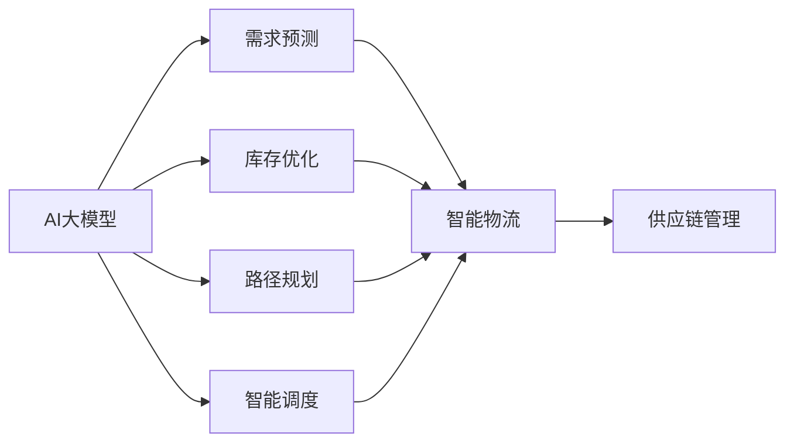

# 应用AI大模型来优化智能物流与供应链管理

## 1. 背景介绍
### 1.1 智能物流与供应链管理的重要性
在当今高度互联和全球化的商业环境中,高效的物流和供应链管理对企业的竞争力和盈利能力至关重要。智能物流和供应链管理通过利用先进技术如人工智能(AI)、大数据分析、物联网(IoT)等,可以显著提升运营效率,降低成本,改善客户体验。

### 1.2 AI大模型的崛起 
近年来,随着深度学习算法的突破和计算能力的飞跃,AI大模型(Large Language Models)得到了长足发展。这些大模型在自然语言处理(NLP)、计算机视觉、语音识别等领域取得了令人瞩目的成就。它们强大的学习能力和广泛的知识覆盖,为智能物流和供应链管理带来了新的机遇。

### 1.3 AI大模型在物流供应链领域的应用前景
AI大模型在需求预测、库存优化、路径规划、智能调度等方面具有广阔的应用前景。通过挖掘和学习海量的历史数据,大模型可以准确预测未来需求,优化库存水平,提高供应链的敏捷性。同时,大模型强大的优化和推理能力,可以智能规划运输路线,降低物流成本。将AI大模型与IoT、区块链等技术相结合,有望打造更加智能、高效、透明的现代化供应链体系。

## 2. 核心概念与联系
### 2.1 AI大模型
- 定义:由海量数据和深度神经网络训练而成,具有强大学习和生成能力的AI模型
- 代表模型:GPT-3、BERT、RoBERTa等
- 特点:参数量巨大(数十亿到上万亿)、知识覆盖广泛、具备迁移学习能力

### 2.2 智能物流
- 定义:利用AI、IoT、自动化等技术,实现物流活动的智能化、网络化和可视化管理
- 关键环节:运输、仓储、配送、信息流等
- 目标:提高物流效率,降低成本,改善客户体验

### 2.3 供应链管理
- 定义:对产品或服务从原材料到最终用户的端到端流程进行计划、执行和控制
- 核心要素:需求管理、采购、生产、库存管理、物流配送等  
- 目标:实现供应链的高效协同,快速响应市场变化

### 2.4 AI大模型与智能物流供应链管理的关系

## 3. 核心算法原理与操作步骤
### 3.1 需求预测
#### 3.1.1 时间序列预测模型
- 原理:利用历史销售数据,建立时间序列模型,预测未来一段时间内的需求量
- 常用模型:ARIMA、Prophet、LSTNet等
- 步骤:
  1. 数据预处理:清洗异常值,处理缺失数据,时间序列平稳化等
  2. 特征工程:构建滞后特征,引入外部因素(促销、节假日等)
  3. 模型训练:划分训练集和测试集,调整超参数,进行训练
  4. 模型评估:使用MAE、RMSE等指标评估预测精度
  5. 模型应用:使用训练好的模型对未来需求进行预测

#### 3.1.2 基于AI大模型的需求预测
- 原理:利用AI大模型强大的特征提取和建模能力,端到端地学习需求预测任务
- 步骤:
  1. 数据准备:收集历史销售记录、库存数据、外部因素等,构建训练数据集
  2. 模型微调:在预训练的AI大模型上,使用任务特定的数据进行微调
  3. 模型推理:输入当前状态和外部因素,使用微调后的模型生成需求预测结果
  4. 模型更新:定期使用新数据对模型进行增量训练,适应需求模式的变化

### 3.2 库存优化
#### 3.2.1 经济订货批量(EOQ)模型
- 原理:在考虑订货成本和存储成本的情况下,确定最优的订货批量,使总成本最小化
- 公式:
  $EOQ = \sqrt{\frac{2DS}{H}}$
  - $D$:年需求量
  - $S$:单次订货成本
  - $H$:单位商品的年存储成本
- 步骤:
  1. 确定年需求量、单次订货成本和单位商品年存储成本
  2. 代入公式计算EOQ
  3. 根据EOQ制定订货计划

#### 3.2.2 基于强化学习的库存优化
- 原理:将库存优化看作一个序贯决策问题,通过强化学习算法(如DQN、PPO等)学习最优策略
- 步骤:
  1. 定义状态空间、动作空间和奖励函数
     - 状态:当前库存量、需求预测等
     - 动作:订货量决策
     - 奖励:基于成本和服务水平的综合考量
  2. 构建强化学习模型,如DQN、PPO等
  3. 在仿真环境中进行训练,学习最优订货策略
  4. 将训练好的策略应用于实际库存管理中

### 3.3 路径规划
#### 3.3.1 传统优化算法
- 常用算法:
  - 遗传算法(GA):模拟生物进化过程,通过选择、交叉、变异等操作寻找最优解
  - 蚁群算法(ACO):模拟蚂蚁寻找食物的行为,通过信息素更新机制寻找最优路径
  - 禁忌搜索(TS):在局部搜索的基础上,引入禁忌表避免重复搜索,跳出局部最优
- 步骤(以遗传算法为例):
  1. 编码:将路径表示为染色体,如城市序列编码
  2. 初始化种群:随机生成一定数量的初始解
  3. 适应度评估:计算每个个体的路径长度作为适应度值
  4. 选择、交叉、变异:根据适应度选择优良个体,通过交叉变异产生新解
  5. 终止条件判断:达到最大迭代次数或满足最优解条件则终止,否则返回步骤3

#### 3.3.2 基于AI大模型的路径规划
- 原理:将路径规划问题转化为序列生成任务,利用AI大模型的生成能力学习最优路径
- 步骤:
  1. 数据准备:收集历史配送数据,包括客户位置、订单信息、路径等
  2. 问题建模:将路径规划问题转化为起点到终点的序列生成问题
  3. 模型微调:在预训练的AI大模型上,使用任务特定的数据进行微调
  4. 解码生成:输入起点和终点,使用微调后的模型生成最优路径序列
  5. 后处理优化:对生成的路径进行进一步优化,如交叉变异等

### 3.4 智能调度
#### 3.4.1 启发式调度算法
- 常用算法:
  - 最早截止时间优先(EDD):按任务截止时间升序排序,优先处理紧急任务
  - 最短加工时间优先(SPT):按任务加工时间升序排序,优先处理耗时短的任务
  - 关键比率(CR):考虑任务紧急程度和加工时间,优先处理CR值小的任务
- 步骤(以EDD为例):
  1. 收集任务信息,包括截止时间、加工时间等
  2. 按照截止时间升序对任务进行排序
  3. 按排序后的顺序依次调度任务
  4. 更新任务状态和资源占用情况

#### 3.4.2 基于AI大模型的智能调度
- 原理:将调度问题建模为序列决策问题,利用AI大模型的决策能力学习最优调度策略
- 步骤:
  1. 数据准备:收集历史调度数据,包括任务属性、资源状态、调度决策等
  2. 问题建模:将调度问题转化为序贯决策问题,定义状态、动作和奖励
  3. 模型微调:在预训练的AI大模型上,使用任务特定的数据进行微调
  4. 在线决策:输入当前系统状态,使用微调后的模型生成调度决策
  5. 执行调度:根据生成的调度决策分配任务和资源

## 4. 数学模型和公式详解
### 4.1 需求预测模型
#### 4.1.1 ARIMA模型
ARIMA(Auto-Regressive Integrated Moving Average)模型是一种经典的时间序列预测方法。其一般形式为ARIMA(p,d,q),其中:
- p:自回归项的阶数
- d:差分的阶数
- q:移动平均项的阶数

ARIMA模型可表示为:

$\phi(B)(1-B)^dX_t = \theta(B)\varepsilon_t$

其中:
- $\phi(B) = 1 - \phi_1B - \phi_2B^2 - \cdots - \phi_pB^p$是自回归多项式
- $\theta(B) = 1 + \theta_1B + \theta_2B^2 + \cdots + \theta_qB^q$是移动平均多项式
- $B$是滞后算子,满足$BX_t=X_{t-1}$
- $\varepsilon_t$是白噪声序列

示例:对于ARIMA(1,1,1)模型,其差分方程为:

$(1-\phi_1B)(1-B)X_t = (1+\theta_1B)\varepsilon_t$

展开得:

$X_t = (1+\phi_1)X_{t-1} - \phi_1X_{t-2} + \varepsilon_t + \theta_1\varepsilon_{t-1}$

### 4.2 库存优化模型
#### 4.2.1 经济订货批量(EOQ)模型
EOQ模型的目标是确定最优订货批量$Q^*$,使得总成本最小化。总成本包括订货成本和存储成本两部分。

假设:
- $D$:年需求量
- $S$:单次订货成本
- $H$:单位商品的年存储成本
- $Q$:订货批量

则总成本函数为:

$TC(Q) = \frac{DS}{Q} + \frac{HQ}{2}$

对$Q$求导并令其等于0,得到最优订货批量:

$Q^* = \sqrt{\frac{2DS}{H}}$

代入$Q^*$可得最小总成本:

$TC(Q^*) = \sqrt{2DSH}$

### 4.3 路径规划模型
#### 4.3.1 旅行商问题(TSP)模型
TSP是一个经典的组合优化问题,目标是找到一条访问所有城市的最短路径。

假设有$n$个城市,城市$i$和城市$j$之间的距离为$d_{ij}$,决策变量$x_{ij}$表示从城市$i$到城市$j$的行程是否被选择。TSP可建模为如下的整数规划问题:

目标函数:
$min \sum_{i=1}^n \sum_{j=1}^n d_{ij}x_{ij}$

约束条件:
$\sum_{i=1}^n x_{ij} = 1, \forall j = 1,2,\cdots,n$
$\sum_{j=1}^n x_{ij} = 1, \forall i = 1,2,\cdots,n$
$\sum_{i\in S}\sum_{j\in S}x_{ij} \leq |S|-1, \forall S \subset \{1,2,\cdots,n\}, 2 \leq |S| \leq n-1$
$x_{ij} \in \{0,1\}, \forall i,j = 1,2,\cdots,n$

其中,前两个约束保证每个城市只被访问一次,第三个约束消除子回路。

### 4.4 智能调度模型
#### 4.4.1 工件调度问题模型
工件调度问题是在满足工序约束和资源约束的情况下,确定各工件在机器上加工的最优顺序,使某个目标函数最优。

常见的目标函数有:
- 最大完工时间(Makespan):$C_{max} = max_{1 \leq j \leq n}\{C_j\}$
- 总流