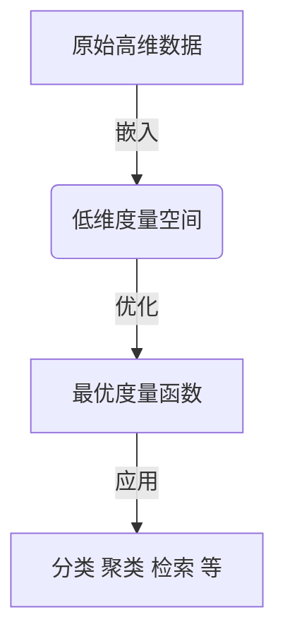

# 度量学习原理与代码实战案例讲解

## 1.背景介绍

### 1.1 什么是度量学习？

度量学习(Metric Learning)是机器学习领域的一个重要分支,旨在自动学习一个有效的相似性度量,使得在该度量空间中,相似的样本彼此靠近,而不相似的样本相距较远。度量学习广泛应用于计算机视觉、自然语言处理、推荐系统等诸多领域,是解决相似性计算和样本匹配问题的有力工具。

### 1.2 度量学习的意义

在现实世界中,数据通常存在于高维空间,样本之间的相似性难以直接计算。传统的欧几里得距离或余弦相似度等度量方法,往往无法很好地反映样本之间的内在关联。度量学习旨在学习一个有效的相似性度量函数,使得在该度量空间中,相似的样本聚集在一起,而不相似的样本相距较远,从而为后续的分类、聚类等任务提供有价值的输入。

### 1.3 度量学习的挑战

尽管度量学习在理论和应用上都取得了长足的进展,但仍面临着一些挑战:

1. 高维数据带来的"维数灾难"问题
2. 样本标注的困难和成本高昂
3. 度量函数的可解释性和可理解性
4. 度量函数的泛化能力和鲁棒性

## 2.核心概念与联系

### 2.1 相似性度量

相似性度量是度量学习的核心概念,用于量化样本之间的相似程度。常见的相似性度量包括欧几里得距离、马哈拉诺比斯距离、内积相似度等。度量学习的目标是学习一个有效的度量函数,使得在该度量空间中,相似的样本彼此靠近,而不相似的样本相距较远。

### 2.2 约束条件

度量学习通常依赖于一些约束条件,这些约束条件反映了样本之间的相似性或不相似性关系。常见的约束条件包括:

1. 同类约束(Must-Link Constraints):同类样本之间的距离应当尽可能小
2. 异类约束(Cannot-Link Constraints):异类样本之间的距离应当尽可能大

基于这些约束条件,度量学习算法试图学习一个最优的度量函数,使得满足约束条件的样本对在新的度量空间中尽可能分开。

### 2.3 度量空间与嵌入

度量学习的一个关键步骤是将原始高维数据嵌入到一个低维的度量空间中,在该空间中进行相似性计算。常见的嵌入方法包括线性嵌入(如主成分分析PCA)和非线性嵌入(如等度量映射Isomap)。嵌入不仅降低了数据的维度,还可以捕捉数据的内在结构,提高度量函数的有效性。

### 2.4 度量学习与其他机器学习任务的联系

度量学习与其他机器学习任务存在密切联系:

1. 分类:度量学习可以为分类任务提供有效的相似性度量,从而提高分类性能。
2. 聚类:度量学习可以学习一个有效的相似性度量,使得在该度量空间中,相似的样本聚集在一起,为聚类任务提供有价值的输入。
3. 检索:在信息检索、推荐系统等领域,度量学习可以学习一个有效的相似性度量,提高检索和推荐的准确性。
4. 迁移学习:度量学习可以帮助学习一个通用的相似性度量,从而促进知识在不同领域之间的迁移和共享。

## 3.核心算法原理具体操作步骤

度量学习算法通常分为两个主要步骤:

1. 嵌入:将原始高维数据嵌入到一个低维的度量空间中。
2. 优化:基于约束条件,优化度量函数的参数,使得满足约束条件的样本对在新的度量空间中尽可能分开。

### 3.1 嵌入方法

常见的嵌入方法包括线性嵌入和非线性嵌入。

#### 3.1.1 线性嵌入

线性嵌入方法通过线性变换将原始高维数据映射到低维空间,常见的线性嵌入方法包括:

1. 主成分分析(PCA):通过最大化数据的方差,将数据映射到一个低维子空间。
2. 线性判别分析(LDA):通过最大化类内散度与类间散度的比值,将数据映射到一个低维子空间。

线性嵌入方法计算简单,但无法很好地捕捉数据的非线性结构。

#### 3.1.2 非线性嵌入

非线性嵌入方法通过非线性变换将数据映射到低维空间,常见的非线性嵌入方法包括:

1. 等度量映射(Isomap):基于数据的局部线性结构,构建一个近似的低维嵌入。
2. 局部线性嵌入(LLE):通过保留数据的局部线性结构,将数据映射到低维空间。
3. t-SNE:通过最小化相似样本对之间的KL散度和不相似样本对之间的欧几里得距离,将数据映射到低维空间。

非线性嵌入方法可以更好地捕捉数据的内在结构,但计算复杂度较高。

### 3.2 优化算法

优化算法的目标是学习一个最优的度量函数,使得满足约束条件的样本对在新的度量空间中尽可能分开。常见的优化算法包括:

#### 3.2.1 大边缘最近邻分类器(LMNN)

LMNN算法试图学习一个欧几里得度量,使得每个样本与同类样本的距离小于与异类样本的距离,并且最大化这个差距(称为边缘)。LMNN算法的优化目标是:

$$\min_M \sum_{i,j} \eta_{ij} D_M(x_i, x_j) + \frac{C}{2}\|M\|_F^2$$

其中$D_M(x_i, x_j) = (x_i - x_j)^T M (x_i - x_j)$是基于度量矩阵$M$的马哈拉诺比斯距离,$\eta_{ij}$是样本对$(x_i, x_j)$的权重,用于强调难以区分的样本对,$C$是正则化系数。

#### 3.2.2 信息理论度量学习(ITML)

ITML算法试图学习一个满足约束条件的欧几里得度量,并且与给定的先验度量尽可能接近。ITML算法的优化目标是:

$$\min_M D_{ld}(M, M_0) + \gamma \sum_{ij} \xi_{ij}$$
$$s.t. \quad D_M(x_i, x_j) \leq u_{ij}, \forall (x_i, x_j) \in S$$
$$\quad D_M(x_i, x_j) \geq l_{ij}, \forall (x_i, x_j) \in D$$

其中$D_{ld}(M, M_0)$是$M$与先验度量$M_0$之间的对数行列式散度,$\gamma$是正则化系数,$\xi_{ij}$是松弛变量,用于处理无法完全满足约束条件的情况,$S$和$D$分别表示相似样本对集合和不相似样本对集合。

#### 3.2.3 结构化度量学习(SEML)

SEML算法试图学习一个满足结构化约束条件的马哈拉诺比斯距离。SEML算法的优化目标是:

$$\min_M \sum_{ij} \eta_{ij} D_M(x_i, x_j) + \frac{C}{2}\|M\|_F^2$$
$$s.t. \quad D_M(x_i, x_j) \leq D_M(x_i, x_k) + \epsilon_{ijk}, \forall (i, j, k) \in \mathcal{T}$$

其中$\mathcal{T}$是结构化三元组约束集合,表示样本$x_i$与$x_j$更相似,而与$x_k$不太相似。

这些优化算法通过求解凸优化问题或半定半正矩阵优化问题,学习一个最优的度量函数。



## 4.数学模型和公式详细讲解举例说明

### 4.1 马哈拉诺比斯距离

马哈拉诺比斯距离是度量学习中常用的一种距离度量,它是欧几里得距离的推广形式。给定两个样本$x_i$和$x_j$,以及一个半正定矩阵$M$,马哈拉诺比斯距离定义为:

$$D_M(x_i, x_j) = \sqrt{(x_i - x_j)^T M (x_i - x_j)}$$

当$M$是单位矩阵时,马哈拉诺比斯距离就退化为标准的欧几里得距离。通过学习一个合适的$M$矩阵,我们可以获得一个更有效的相似性度量。

### 4.2 对数行列式散度

对数行列式散度(Logdet Divergence)是一种测量两个半正定矩阵之间差异的方法,常用于度量学习算法中。给定两个半正定矩阵$M_1$和$M_2$,对数行列式散度定义为:

$$D_{ld}(M_1, M_2) = \mathrm{tr}(M_1 M_2^{-1}) - \log\det(M_1 M_2^{-1}) - n$$

其中$\mathrm{tr}(\cdot)$表示矩阵的迹,$ \log\det(\cdot)$表示矩阵的对数行列式值,$n$是矩阵的维度。

对数行列式散度具有以下性质:

1. 非负性:$D_{ld}(M_1, M_2) \geq 0$
2. 对称性:$D_{ld}(M_1, M_2) = D_{ld}(M_2, M_1)$
3. 当$M_1 = M_2$时,$ D_{ld}(M_1, M_2) = 0$

这些性质使得对数行列式散度成为度量学习算法中一种常用的正则化项。

### 4.3 示例:LMNN算法

我们以LMNN算法为例,详细说明其数学模型和优化过程。

LMNN算法的优化目标是:

$$\min_M \sum_{i,j} \eta_{ij} D_M(x_i, x_j) + \frac{C}{2}\|M\|_F^2$$
$$s.t. \quad D_M(x_i, x_j) \leq D_M(x_i, x_k) + 1, \forall (i, j, k) \in \mathcal{T}$$

其中$\mathcal{T}$是三元组约束集合,表示样本$x_i$与$x_j$更相似,而与$x_k$不太相似。$\eta_{ij}$是样本对$(x_i, x_j)$的权重,用于强调难以区分的样本对,$C$是正则化系数。

我们可以将上述优化问题等价转化为半正定规划问题:

$$\min_M \mathrm{tr}(M\Phi) + \frac{C}{2}\|M\|_F^2$$
$$s.t. \quad \mathrm{tr}(M(x_i - x_j)(x_i - x_j)^T) \leq 1, \forall (i, j, k) \in \mathcal{T}$$
$$\quad M \succeq 0$$

其中$\Phi$是一个半正定矩阵,编码了样本对之间的约束条件。通过求解这个半正定规划问题,我们可以获得最优的度量矩阵$M$。

以下是一个简单的示例,说明LMNN算法如何学习一个有效的度量:

```python
import numpy as np
from metric_learn import lmnn

# 生成示例数据
X = np.random.rand(100, 2)
y = np.concatenate([np.zeros(50), np.ones(50)])

# 构建约束集合
constraints = np.zeros((100, 100), dtype=np.bool)
constraints[:50, :50] = 1
constraints[50:, 50:] = 1

# 训练LMNN模型
lmnn_model = lmnn.LMNNMetricLearner(k=5, regularizer=0.1)
lmnn_model.fit(X, constraints)

# 可视化学习到的度量空间
import matplotlib.pyplot as plt
plt.figure(figsize=(8, 6))
plt.