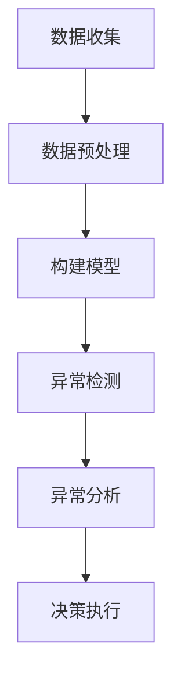

# 异常检测 原理与代码实例讲解

## 1.背景介绍

在现实世界中,异常事件的发生是无法完全避免的。无论是在金融、制造、医疗还是其他领域,异常数据的存在都可能导致严重的后果。因此,及时发现和处理异常情况对于确保系统的正常运行至关重要。异常检测(Anomaly Detection)作为一种广泛应用的机器学习技术,旨在从大量数据中识别出与预期模式显著不同的异常数据点或事件。

异常检测在多个领域发挥着重要作用,例如:

- **网络安全**: 检测入侵行为、垃圾邮件和恶意软件活动。
- **金融**: 发现欺诈交易、信用卡盗刷等异常。
- **制造业**: 监测生产线异常,确保产品质量。
- **医疗保健**: 发现疾病症状、医疗保险欺诈等异常情况。

随着数据量的快速增长,传统的基于规则的异常检测方法已经无法满足实际需求。机器学习算法通过从历史数据中自动学习数据模式,能够更加准确、高效地检测异常情况,因此受到了广泛关注。

### Mermaid 流程图:异常检测概览



## 2.核心概念与联系

### 2.1 异常的定义

异常(Anomaly)是指偏离了数据集中大多数实例的"正常"行为模式的数据点。异常通常是稀有的,与大多数数据点存在显著差异。异常检测的目标是从大量数据中识别出这些"异常值"。

### 2.2 异常检测的类型

根据异常的性质和所采用的技术,异常检测可分为以下几种类型:

1. **监督异常检测**(Supervised Anomaly Detection)
2. **半监督异常检测**(Semi-Supervised Anomaly Detection) 
3. **无监督异常检测**(Unsupervised Anomaly Detection)

#### 2.2.1 监督异常检测

在监督异常检测中,我们拥有已标记的训练数据,其中包含正常实例和异常实例的标签。监督算法通过学习这些已标记数据,构建分类模型来区分正常和异常数据。常用的监督异常检测算法包括逻辑回归、支持向量机等。

#### 2.2.2 半监督异常检测

在半监督异常检测中,训练数据只包含正常实例的标签,而异常实例是未标记的。算法需要同时学习正常数据的模式,并检测与该模式显著偏离的异常数据点。常见的半监督算法有一类模型(One-Class Model)、自编码器(Autoencoder)等。

#### 2.2.3 无监督异常检测  

无监督异常检测不需要任何标记数据,算法完全基于对数据本身的探索和分析来检测异常。常用的无监督算法包括聚类分析、近邻方法、统计建模等。由于无需人工标注,无监督方法在实践中应用更为广泛。

### 2.3 异常检测的评估指标

评估异常检测算法的性能通常使用以下几种指标:

- **精确率**(Precision): 正确检测为异常的实例占所有检测为异常的实例的比例。
- **召回率**(Recall): 正确检测为异常的实例占所有真实异常实例的比例。 
- **F1分数**: 精确率和召回率的调和平均值。
- **ROC曲线和AUC**: 绘制真阳性率与假阳性率的曲线,曲线下面积越大,性能越好。
- **代价矩阵**(Cost Matrix): 考虑将异常分类为正常和将正常分类为异常的不同代价。

## 3.核心算法原理具体操作步骤

异常检测算法根据其工作原理可分为以下几类:

### 3.1 基于统计的异常检测算法

#### 3.1.1 单变量高斯模型

单变量高斯模型假设数据服从高斯(正态)分布,通过估计数据的均值和方差,判断一个观测值是否属于异常。如果一个观测值与均值的差值超过一定倍数的标准差,则被判定为异常。

算法步骤:

1. 计算数据的均值$\mu$和标准差$\sigma$。
2. 对于新的观测值$x$,计算$\frac{|x-\mu|}{\sigma}$。
3. 如果该值大于设定的阈值(通常为2或3),则判定为异常。

#### 3.1.2 多元高斯模型

多元高斯模型假设数据服从多元正态分布,通过估计数据的均值向量和协方差矩阵,判断一个观测向量是否属于异常。

算法步骤:

1. 计算数据的均值向量$\mu$和协方差矩阵$\Sigma$。
2. 对于新的观测向量$x$,计算马氏距离:

$$
D(x)=\sqrt{(x-\mu)^T\Sigma^{-1}(x-\mu)}
$$

3. 如果该距离大于设定的阈值,则判定为异常。

### 3.2 基于邻近度的异常检测算法

#### 3.2.1 k-近邻算法(k-NN)

k-NN算法的思路是:如果一个数据点到其k个最近邻居的平均距离较大,则可能是异常点。

算法步骤:

1. 选择一个合适的k值和距离度量(如欧氏距离)。
2. 对于每个数据点$x$,计算它到数据集中所有其他点的距离,选取最近的k个邻居。
3. 计算$x$到这k个邻居的平均距离$d(x)$。
4. 如果$d(x)$大于设定的阈值,则判定$x$为异常点。

#### 3.2.2 局部异常系数(LOF)

LOF算法通过比较数据点与其邻域内其他数据点的密度来判断是否为异常。密度较小的数据点被认为是异常点。

算法步骤:

1. 计算每个数据点到其k个最近邻居的平均距离,作为该点的可达密度。
2. 计算每个点的局部可达密度偏差,即该点的密度与k个最近邻居的平均密度的比值。
3. LOF值是该点局部可达密度偏差的反值。
4. 如果一个点的LOF值大于设定的阈值,则判定为异常点。

### 3.3 基于聚类的异常检测算法

#### 3.3.1 k-means聚类

k-means算法将数据划分为k个聚类,异常点通常位于离所有聚类中心较远的区域。

算法步骤:

1. 使用k-means算法对数据进行聚类。
2. 对于每个数据点,计算其到最近聚类中心的距离。
3. 如果该距离大于设定的阈值,则判定为异常点。

#### 3.3.2 高斯混合模型(GMM)

GMM假设数据由多个高斯分布的混合生成,异常点属于较小概率密度的分布。

算法步骤:

1. 使用GMM对数据进行建模,估计每个高斯分布的参数。
2. 对于新的观测值,计算其在每个高斯分布下的概率密度。
3. 如果最大概率密度小于设定的阈值,则判定为异常。

### 3.4 基于神经网络的异常检测算法

#### 3.4.1 自编码器(Autoencoder)

自编码器是一种无监督神经网络模型,通过重建输入数据来学习数据的内在特征表示。对于正常数据,重建误差较小;对于异常数据,重建误差较大。

算法步骤:

1. 使用正常数据训练自编码器模型。
2. 对于新的观测数据,输入到训练好的自编码器,得到重建数据。
3. 计算原始数据与重建数据之间的重建误差。
4. 如果重建误差大于设定的阈值,则判定为异常。

#### 3.4.2 生成对抗网络(GAN)

GAN由生成器和判别器两部分组成。生成器学习生成与真实数据相似的样本,判别器判断样本是真实还是生成的。对于正常数据,生成器能较好地重建;对于异常数据,重建质量较差。

算法步骤:

1. 使用正常数据训练生成对抗网络模型。
2. 对于新的观测数据,输入到生成器,得到重建数据。
3. 计算原始数据与重建数据之间的重建误差或判别器判定的分数。
4. 如果重建误差或判别分数异常,则判定为异常。

## 4.数学模型和公式详细讲解举例说明

在异常检测中,常用的数学模型和公式包括:

### 4.1 高斯分布

高斯分布(正态分布)是最常用的连续概率分布之一,广泛应用于统计建模和异常检测。单变量高斯分布的概率密度函数为:

$$
f(x|\mu,\sigma^2) = \frac{1}{\sqrt{2\pi\sigma^2}}e^{-\frac{(x-\mu)^2}{2\sigma^2}}
$$

其中$\mu$是均值,$\sigma^2$是方差。

对于多元高斯分布,概率密度函数为:

$$
f(x|\mu,\Sigma) = \frac{1}{(2\pi)^{\frac{n}{2}}|\Sigma|^{\frac{1}{2}}}e^{-\frac{1}{2}(x-\mu)^T\Sigma^{-1}(x-\mu)}
$$

其中$\mu$是均值向量,$\Sigma$是协方差矩阵,$n$是变量个数。

在异常检测中,如果一个观测值$x$的概率密度$f(x)$较小,则可能是异常点。

### 4.2 马氏距离

马氏距离(Mahalanobis Distance)是一种基于相关性的距离度量,常用于异常检测中判断观测值与均值向量的偏离程度。马氏距离的计算公式为:

$$
D(x) = \sqrt{(x-\mu)^T\Sigma^{-1}(x-\mu)}
$$

其中$x$是观测向量,$\mu$是均值向量,$\Sigma$是协方差矩阵。

马氏距离考虑了变量之间的相关性,对异常值更加敏感。如果一个观测值的马氏距离较大,则可能是异常点。

### 4.3 核函数

在许多异常检测算法中,需要将数据映射到高维空间,以便更好地区分正常数据和异常数据。核函数(Kernel Function)提供了一种有效的方法,避免了显式计算高维映射。

常用的核函数包括:

- 线性核: $K(x,y) = x^Ty$
- 多项式核: $K(x,y) = (\gamma x^Ty + c)^d$  
- 高斯核(RBF核): $K(x,y) = \exp(-\gamma||x-y||^2)$

其中$\gamma,c,d$是核函数的参数。

通过使用核函数,许多线性算法可以推广到非线性情况,从而提高异常检测的性能。

### 4.4 异常分数

在无监督异常检测中,常常需要为每个数据点计算一个异常分数(Anomaly Score),用于判断其是否为异常。异常分数越高,越可能是异常点。

不同的算法采用不同的异常分数计算方式,例如:

- 基于统计模型的算法,异常分数可以是观测值的概率密度。
- 基于距离的算法,异常分数可以是到k个最近邻居的平均距离。
- 基于密度的算法,异常分数可以是局部异常系数LOF。
- 基于重建的算法,异常分数可以是重建误差或判别器分数。

通过设置异常分数的阈值,可以将数据点划分为正常和异常两类。

## 5.项目实践:代码实例和详细解释说明

以下是使用Python中scikit-learn库实现的几种常见异常检测算法的代码示例:

### 5.1 单变量高斯模型

```python
from sklearn.covariance import EllipticEnvelope

# 初始化模型
model = EllipticEnvelope(contamination=0.01)

# 训练模型
model.fit(X_train)

# 异常检测
anomaly_scores = model.decision_function(X_test)
y_pred =