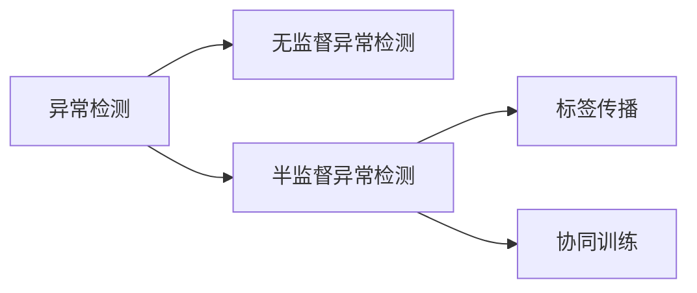

# 异常检测中的半监督学习方法:标签传播与协同训练

## 1.背景介绍
异常检测是机器学习和数据挖掘领域的一个重要研究课题,在诸如金融欺诈检测、网络入侵检测、工业设备故障诊断等众多实际应用场景中发挥着至关重要的作用。传统的异常检测方法大多基于无监督学习,仅利用正常样本的数据分布信息来构建异常检测模型。然而在很多实际应用中,我们往往能够获得少量的已标记异常样本。如何有效利用这些宝贵的异常样本信息,将异常检测问题从无监督学习扩展到半监督学习,进而提升检测性能,是一个亟需解决的关键问题。

本文将重点介绍异常检测中的两类经典半监督学习方法:标签传播(Label Propagation)和协同训练(Co-Training)。通过系统阐述其基本原理、数学模型、算法流程以及代码实现,深入探讨如何将半监督学习思想引入异常检测,充分利用已标记样本信息,最终达到提升异常检测性能的目的。

## 2.核心概念与联系
在正式介绍标签传播和协同训练算法之前,我们首先需要明确几个核心概念:
- 无监督异常检测:仅利用正常样本的数据分布信息,通过构建正常样本的概率密度模型或者划分正常区域的边界,实现对未知样本正常/异常的判别。
- 半监督学习:介于无监督学习和监督学习之间,在大量未标记样本的同时,存在少量已标记样本。半监督学习通过利用已标记样本提供的先验知识,指导对未标记样本的学习,从而提升整体学习性能。
- 标签传播:基于图的半监督学习算法,通过构建样本之间的相似性图,在图上迭代传播标签信息,使得相似样本获得相似的标签。
- 协同训练:基于多视图的半监督学习算法,通过将样本划分为两个视图,在每个视图上训练独立的分类器,并利用一个视图上置信度较高的预测结果去标记另一个视图上的未标记样本,循环迭代直至收敛。

下图展示了无监督异常检测、半监督异常检测、标签传播、协同训练之间的关系:



## 3.核心算法原理与具体操作步骤
### 3.1 标签传播
标签传播(Label Propagation)是一种基于图的半监督学习算法,核心思想是通过构建样本之间的相似性图,在图上迭代传播标签信息,使得相似样本获得相似的标签。标签传播算法的基本流程如下:

1. 构建样本相似性图。常见的方法有kNN图和全连接图。
2. 初始化样本标签矩阵。已标记样本的对应类别置1,其余置0。
3. 迭代传播标签信息,直至收敛。每次迭代中,每个节点从相邻节点吸收标签信息,并更新自身的标签。
4. 输出最终的标签矩阵,对应每个样本的类别。

在异常检测任务中,我们可以将标签传播算法应用于半监督场景下,具体操作步骤如下:

1. 构建异常样本与正常样本混合的相似性图。
2. 初始化样本标签向量。将已知的异常样本标签置为1,已知的正常样本标签置为-1,未知样本标签置为0。 
3. 迭代传播标签信息,使得相似样本获得相似的异常分数。
4. 输出最终的异常分数向量,根据设定的阈值判断未知样本的异常/正常属性。

### 3.2 协同训练
协同训练(Co-Training)是一种基于多视图的半监督学习算法,核心思想是通过将样本划分为两个视图,在每个视图上训练独立的分类器,并利用一个视图上置信度较高的预测结果去标记另一个视图上的未标记样本,循环迭代直至收敛。协同训练算法的基本流程如下:

1. 将样本划分为两个独立且互补的视图。
2. 在每个视图上利用已标记样本训练独立的分类器。
3. 每个分类器在对应视图上对未标记样本进行预测,选出置信度较高的样本赋予伪标签。
4. 将新标记的样本加入训练集,重新训练分类器。
5. 重复3-4步骤,直至未标记样本数量低于设定阈值或迭代次数达到上限。
6. 将两个视图的分类器进行组合,输出最终的分类结果。

在异常检测任务中,我们可以将协同训练算法应用于半监督场景下,具体操作步骤如下:

1. 将异常检测数据集划分为两个视图,例如统计特征和结构特征。
2. 在每个视图上利用已标记的异常样本和正常样本,训练独立的异常检测器(如OC-SVM、LOF等)。
3. 每个异常检测器在对应视图上对未标记样本进行预测,选出置信度较高的样本赋予伪标签(异常或正常)。
4. 将新标记的样本加入训练集,重新训练异常检测器。
5. 重复3-4步骤,直至满足终止条件。
6. 将两个视图的异常检测器进行组合,输出最终的异常分数。

## 4.数学模型和公式详细讲解举例说明
### 4.1 标签传播
假设有 $n$ 个样本 $\{x_1,\dots,x_l,x_{l+1},\dots,x_n\}$,前 $l$ 个样本有标签 $\{y_1,\dots,y_l\}$,后 $u=n-l$ 个样本未标记。标签传播算法的数学模型如下:

1. 构建样本相似性矩阵 $W\in \mathbb{R}^{n\times n}$,其中 $W_{ij}$ 表示样本 $x_i$ 和 $x_j$ 的相似度。相似度可以用高斯核函数计算:

$$
W_{ij} = \exp(-\frac{\|x_i-x_j\|^2}{2\sigma^2})
$$

2. 计算转移概率矩阵 $T$,即标签传播的转移矩阵:

$$
T = D^{-1}W
$$

其中 $D$ 为 $W$ 的对角矩阵,即 $D_{ii} = \sum_j W_{ij}$。

3. 初始化标签矩阵 $Y^{(0)}\in \mathbb{R}^{n\times c}$,其中 $c$ 为类别数。已标记样本的对应类别置1,其余置0。

4. 迭代传播标签信息,第 $t$ 次迭代的标签矩阵为:

$$
Y^{(t)} = \alpha TY^{(t-1)} + (1-\alpha)Y^{(0)}
$$

其中 $\alpha\in(0,1)$ 为超参数,控制标签传播的速度。

5. 迭代直至收敛,即 $Y^{(t)}\approx Y^{(t-1)}$。最终的标签矩阵 $Y^*$ 即为每个样本的类别概率分布。

在异常检测任务中,我们可以将异常样本标签设为1,正常样本标签设为0,未知样本标签初始化为0。经过标签传播后,未知样本的异常概率越大,越有可能是异常样本。

### 4.2 协同训练
假设有 $n$ 个样本 $\{x_1,\dots,x_l,x_{l+1},\dots,x_n\}$,每个样本有两个视图 $x_i=(x_i^{(1)},x_i^{(2)})$。前 $l$ 个样本有标签 $\{y_1,\dots,y_l\}$,后 $u=n-l$ 个样本未标记。协同训练算法的数学模型如下:

1. 在每个视图 $v\in\{1,2\}$ 上利用已标记样本训练分类器 $f^{(v)}$,得到参数 $\theta^{(v)}$。分类器可以是逻辑回归、SVM等。以逻辑回归为例,优化目标为:

$$
\min_{\theta^{(v)}} \sum_{i=1}^l \log(1+\exp(-y_i\theta^{(v)T}x_i^{(v)})) + \lambda\|\theta^{(v)}\|^2
$$

2. 每个分类器在对应视图上对未标记样本进行预测,得到伪标签:

$$
\hat{y}_i^{(v)} = \mathrm{sign}(f^{(v)}(x_i^{(v)}))
$$

3. 选择置信度较高的 $k$ 个样本,将其伪标签作为真实标签加入训练集。置信度可以用分类器输出的概率表示:

$$
\mathrm{conf}_i^{(v)} = |f^{(v)}(x_i^{(v)})|
$$

4. 重复2-3步骤,直至满足终止条件。

5. 将两个视图的分类器进行组合,得到最终的分类器:

$$
f(x) = \mathrm{sign}(f^{(1)}(x^{(1)}) + f^{(2)}(x^{(2)}))
$$

在异常检测任务中,我们可以将异常样本标签设为1,正常样本标签设为-1。两个视图的异常检测器可以选择OC-SVM、LOF等。每个异常检测器在对应视图上对未标记样本进行预测,选出置信度较高的样本赋予伪标签(异常或正常),加入训练集迭代优化。最终将两个视图的异常分数相加,得到样本的综合异常分数。

## 5.项目实践:代码实例和详细解释说明
下面给出标签传播和协同训练在异常检测任务中的Python代码实例。
### 5.1 标签传播
```python
import numpy as np
from sklearn.metrics.pairwise import rbf_kernel

class LabelPropagation:
    def __init__(self, alpha=0.5, max_iter=1000, tol=1e-3, sigma=1.0):
        self.alpha = alpha
        self.max_iter = max_iter
        self.tol = tol
        self.sigma = sigma
    
    def fit(self, X, y):
        # 构建相似性矩阵
        self.W = rbf_kernel(X, gamma=0.5/self.sigma**2)
        # 计算转移概率矩阵
        D = np.diag(np.sum(self.W, axis=1))
        self.T = np.dot(np.linalg.inv(D), self.W)
        
        # 初始化标签矩阵
        n_samples = X.shape[0]
        n_classes = 2
        self.Y = np.zeros((n_samples, n_classes))
        self.Y[y!=-1, 0] = 1
        self.Y[y==1, 1] = 1
        
        # 迭代传播标签
        for _ in range(self.max_iter):
            Y_prev = self.Y.copy()
            self.Y = self.alpha*np.dot(self.T, self.Y) + (1-self.alpha)*self.Y
            if np.linalg.norm(self.Y - Y_prev) < self.tol:
                break
    
    def predict(self, X):
        # 计算测试样本的异常分数
        W_test = rbf_kernel(X, self.X_, gamma=0.5/self.sigma**2)
        Y_test = np.dot(W_test, np.linalg.inv(np.diag(np.sum(self.W, axis=1))))
        Y_test = np.dot(Y_test, self.Y)
        return Y_test[:,1]
    
    def fit_predict(self, X, y):
        self.X_ = X
        self.fit(X, y)
        return self.predict(X)
```

代码解释:
- `__init__`方法初始化模型超参数,包括标签传播速率`alpha`、最大迭代次数`max_iter`、收敛阈值`tol`以及相似度计算的高斯核函数尺度`sigma`。
- `fit`方法训练标签传播模型,主要步骤包括:构建相似性矩阵、计算转移概率矩阵、初始化标签矩阵、迭代传播标签。其中标签矩阵第一列对应正常样本概率,第二列对应异常样本概率。
- `predict`方法预测测试样本的异常分数,通过计算测试样本与训练样本的相似度,并结合训练样本的标签传播结果,得到测试样本的异常概率。