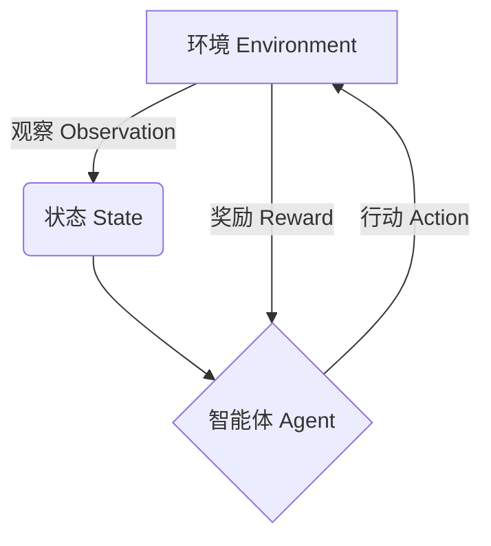

# 强化学习(Reinforcement Learning) - 原理与代码实例讲解

## 1. 背景介绍

### 1.1 什么是强化学习?

强化学习(Reinforcement Learning, RL)是机器学习的一个重要分支,它研究如何基于环境反馈来学习行为策略,以获得最大化的长期回报。与监督学习和无监督学习不同,强化学习没有给定的输入-输出样本对,而是通过与环境的交互来学习。

强化学习的核心思想是让智能体(Agent)与环境(Environment)进行互动,根据当前状态采取行动,然后获得奖励或惩罚的反馈。通过不断尝试和学习,智能体可以优化其策略,以获得最大的累积奖励。这种学习方式类似于人类和动物通过反复试错来获得经验并改善行为的过程。

### 1.2 强化学习的应用领域

强化学习在诸多领域展现出巨大的应用潜力,例如:

- 机器人控制和运动规划
- 游戏AI(AlphaGo、Dota等)
- 自动驾驶和无人机导航
- 资源管理和调度优化
- 网络路由和流量控制
- 自然语言处理和对话系统
- 金融投资组合管理
- ...

## 2. 核心概念与联系

强化学习涉及以下几个核心概念:



1. **环境(Environment)**: 指智能体所处的外部世界,它可以是物理环境或虚拟环境。环境会根据智能体的行为提供新的状态和奖励信号。

2. **状态(State)**: 描述环境当前的情况,是智能体观察到的环境信息。状态通常是一个向量,包含了环境的各种属性值。

3. **智能体(Agent)**: 指能够感知环境、采取行动并获得反馈的决策实体。智能体的目标是学习一个最优策略,以最大化长期累积奖励。

4. **行动(Action)**: 智能体根据当前状态采取的操作,用于影响环境的变化。

5. **奖励(Reward)**: 环境对智能体行为的反馈,可以是正值(奖励)或负值(惩罚)。奖励信号是强化学习的关键,它指导智能体朝着正确的方向优化策略。

6. **策略(Policy)**: 智能体在每个状态下选择行动的策略或规则。策略可以是确定性的(给定状态只有一个行动),也可以是随机的(给定状态有多个行动的概率分布)。

强化学习的目标是找到一个最优策略,使得在环境中采取该策略可以获得最大的长期累积奖励。

### 2.1 强化学习的主要特点

- **没有监督数据**:与监督学习不同,强化学习没有给定的正确输入-输出对,智能体需要通过与环境的交互来学习。
- **延迟奖励**:奖励可能是延迟的,智能体需要评估当前行为对未来的影响,而不仅仅是立即奖励。
- **序列决策**:智能体需要学习一系列行动,而不是单个行动,以最大化长期累积奖励。
- **探索与利用权衡**:智能体需要在探索新的行为和利用已学习的知识之间进行权衡。

## 3. 核心算法原理具体操作步骤

强化学习算法主要分为三大类:基于价值的方法、基于策略的方法和基于模型的方法。下面将介绍其中的两种经典算法:Q-Learning和策略梯度。

### 3.1 Q-Learning算法

Q-Learning是一种基于价值的强化学习算法,它尝试直接估计每个状态-行动对的价值函数Q(s,a),即在状态s下采取行动a之后可获得的最大期望累积奖励。

算法步骤如下:

1. 初始化Q(s,a)值,通常设为0或小的随机值。
2. 对于每个episode:
    - 初始化起始状态s
    - 对于每个时间步:
        - 根据当前策略选择行动a(例如ε-贪婪策略)
        - 执行行动a,观察奖励r和下一状态s'
        - 更新Q(s,a)值:
            $$Q(s,a) \leftarrow Q(s,a) + \alpha[r + \gamma \max_{a'}Q(s',a') - Q(s,a)]$$
            其中,α是学习率,γ是折扣因子。
        - 更新当前状态s=s'
3. 直到convergence或达到最大episode数

Q-Learning算法的关键在于使用时序差分(Temporal Difference, TD)目标来更新Q值,该目标结合了立即奖励r和估计的未来价值$\gamma \max_{a'}Q(s',a')$。通过不断更新,Q值将逐渐收敛到最优值。

在实际应用中,可以使用函数逼近器(如神经网络)来估计Q(s,a),这种方法称为深度Q网络(Deep Q-Network, DQN)。

### 3.2 策略梯度算法(REINFORCE)

策略梯度是一种基于策略的强化学习算法,它直接对策略函数进行参数化,并使用梯度上升法来最大化期望的累积奖励。

算法步骤如下:

1. 初始化策略参数θ
2. 对于每个episode:
    - 初始化起始状态s
    - 对于每个时间步:
        - 根据当前策略π(a|s;θ)采样行动a
        - 执行行动a,观察奖励r和下一状态s'
        - 存储轨迹(s,a,r)
    - 计算episode的累积奖励G
    - 对于每个时间步的(s,a,r):
        - 计算对数概率: $\log\pi(a|s;\theta)$
        - 更新策略参数:
            $$\theta \leftarrow \theta + \alpha\gamma^tG\nabla_\theta\log\pi(a|s;\theta)$$
            其中,α是学习率,γ是折扣因子,t是时间步。

策略梯度算法的关键在于使用累积奖励G来估计每个动作的价值,并沿着对数概率的梯度方向更新策略参数θ。这种方法直接优化策略函数,而不需要估计价值函数。

在实际应用中,可以使用神经网络来参数化策略π(a|s;θ),这种方法称为策略梯度方法。

## 4. 数学模型和公式详细讲解举例说明

### 4.1 马尔可夫决策过程(Markov Decision Process, MDP)

强化学习问题通常被形式化为马尔可夫决策过程(MDP),它是一个离散时间的随机控制过程,由以下5个要素组成:

- 状态集合S
- 行动集合A
- 转移概率 $P(s'|s,a)$,表示在状态s下执行行动a后,转移到状态s'的概率
- 奖励函数 $R(s,a,s')$,表示在状态s下执行行动a并转移到s'时获得的奖励
- 折扣因子γ,用于权衡即时奖励和未来奖励的重要性

在MDP中,智能体的目标是找到一个最优策略π*,使得在该策略下的期望累积奖励最大化:

$$\pi^* = \arg\max_\pi \mathbb{E}\left[\sum_{t=0}^\infty \gamma^tR(s_t,a_t,s_{t+1})\right]$$

其中,t表示时间步,γ∈[0,1]是折扣因子,用于权衡即时奖励和未来奖励的重要性。

### 4.2 贝尔曼方程(Bellman Equation)

贝尔曼方程是解决MDP问题的一种动态规划方法,它将价值函数分解为两部分:即时奖励和折扣后的下一状态的价值函数。

对于状态价值函数V(s),贝尔曼方程为:

$$V(s) = \mathbb{E}_{a\sim\pi(s)}\left[R(s,a) + \gamma\sum_{s'\in S}P(s'|s,a)V(s')\right]$$

对于行动价值函数Q(s,a),贝尔曼方程为:

$$Q(s,a) = \mathbb{E}_{s'\sim P(\cdot|s,a)}\left[R(s,a,s') + \gamma\max_{a'\in A}Q(s',a')\right]$$

这些方程揭示了价值函数与即时奖励和未来价值之间的递归关系。许多强化学习算法(如Q-Learning、Sarsa等)都是基于这些方程来估计价值函数或直接优化策略。

### 4.3 时序差分学习(Temporal Difference Learning)

时序差分学习是一种基于采样的增量式学习方法,它不需要完整的模型信息,可以通过与环境的交互来直接学习价值函数或策略。

时序差分目标是估计当前状态价值和下一状态价值之间的差异,并使用这个差异来更新价值函数或策略。例如,在Q-Learning算法中,时序差分目标为:

$$r + \gamma \max_{a'}Q(s',a') - Q(s,a)$$

通过不断最小化这个目标,Q值将逐渐收敛到最优值。

时序差分学习的优点是:
- 无需完整的环境模型,只需从经验中学习
- 可以在线学习,无需等待完整episode结束
- 计算效率高,适合大规模问题

### 4.4 策略梯度定理(Policy Gradient Theorem)

策略梯度定理为基于策略的强化学习算法提供了理论基础。它给出了优化策略参数的梯度方向,使期望累积奖励最大化。

对于参数化策略π(a|s;θ),期望累积奖励的梯度可以表示为:

$$\nabla_\theta J(\theta) = \mathbb{E}_{\pi_\theta}\left[\sum_{t=0}^\infty \nabla_\theta\log\pi_\theta(a_t|s_t)\left(\sum_{t'=t}^\infty\gamma^{t'-t}r_{t'}\right)\right]$$

其中,J(θ)是期望累积奖励,r是奖励,γ是折扣因子。

这个公式揭示了:为了最大化期望累积奖励,我们应该增加那些导致高奖励的行动的概率,减小那些导致低奖励的行动的概率。

策略梯度定理为许多强化学习算法(如REINFORCE、PPO等)提供了理论依据。

## 5. 项目实践:代码实例和详细解释说明

### 5.1 Q-Learning实例:小车游戏

我们将使用Python实现一个简单的Q-Learning示例:小车游戏。在这个游戏中,智能体需要控制一辆小车在一个网格世界中行驶,目标是到达终点而不撞墙。

```python
import numpy as np

# 定义环境
WORLD_SIZE = 5
A_POS = [0, 0]
A_PRIME_POS = [0, 0]
B_POS = [WORLD_SIZE - 1, WORLD_SIZE - 1]
OBSTACLE_POS = [2, 2]

# 定义行动
ACTIONS = ['U', 'D', 'L', 'R']  # 上下左右
ACTIONS_COORDS = [(-1, 0), (1, 0), (0, -1), (0, 1)]  # 行动对应的坐标偏移

# 初始化Q表
Q = np.zeros((WORLD_SIZE, WORLD_SIZE, len(ACTIONS)))

# 设置超参数
ALPHA = 0.1  # 学习率
GAMMA = 0.9  # 折扣因子
EPISODES = 1000  # 总训练回合数

# Q-Learning算法
for episode in range(EPISODES):
    # 初始化起始状态
    state = A_POS
    while state != B_POS:
        # 选择行动(ε-贪婪策略)
        if np.random.rand() < 0.1:
            action = np.random.choice(len(ACTIONS))
        else:
            action = np.argmax(Q[state[0], state[1], :])
        
        # 执行行动,获取下一状态和奖励
        next_state = [state[0] + ACTIONS_COORDS[action][0], state[1] + ACTIONS_COORDS[action][1]]
        if next_state == OBSTACLE_POS:
            reward = -10
            next_state = A_POS
        elif next_state == B_POS:
            reward = 10
        else:
            reward = -1
        
        # 更新Q值
        Q[state[0], state[1], action] += ALPHA * (reward + GAMMA * np.max(Q[next_state[0], next_state[1], :