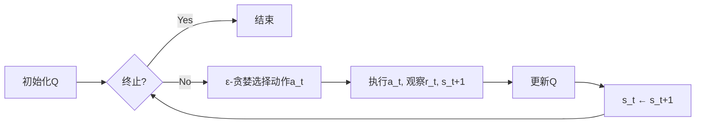
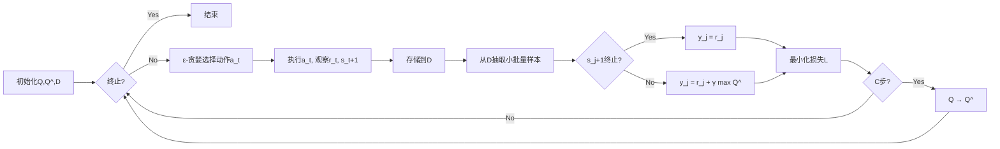

# 强化学习RL原理与代码实例讲解

## 1.背景介绍

### 1.1 强化学习的起源与发展
强化学习(Reinforcement Learning, RL)源于心理学中的行为主义理论,其核心思想是通过奖励和惩罚来影响主体的行为。20世纪50年代,Richard Bellman等人开始将强化学习的思想应用到控制论和运筹学领域。随后,强化学习逐渐发展成为一个独立的机器学习分支。

近年来,随着深度学习的兴起,深度强化学习(Deep Reinforcement Learning, DRL)得到了广泛关注。DeepMind公司开发的DQN算法在Atari游戏中取得了超越人类的成绩,标志着深度强化学习开始在复杂问题上崭露头角。此后,DRL在围棋(AlphaGo)、德州扑克(Libratus)、星际争霸(AlphaStar)等领域屡创佳绩,展现了强大的智能化潜力。

### 1.2 强化学习的定义与特点
强化学习是一种让智能体(agent)通过与环境的交互来学习最优决策的机器学习范式。与监督学习和非监督学习不同,强化学习的训练数据并非事先给定,而是agent通过与环境的交互过程中不断获得。同时,强化学习采用延迟奖赏(reward)的学习机制,通过最大化累积奖赏来优化决策策略。

强化学习的主要特点包括:
- 试错探索:agent需要在探索(exploration)和利用(exploitation)之间权衡,在尝试新动作的同时利用已有的经验。 
- 延迟奖赏:当前动作的效果可能在未来的状态中才能体现,需要考虑长期累积奖赏。
- 时序差分学习:通过当前的状态转移和奖赏来更新之前状态的价值评估。

### 1.3 强化学习的应用场景
强化学习在诸多领域展现出了巨大的应用潜力,主要包括:
- 游戏:Atari游戏、围棋、德州扑克、星际争霸等
- 机器人控制:机械臂操控、四足机器人运动规划、无人驾驶等  
- 推荐系统:电商推荐、新闻推荐、广告投放等
- 网络优化:数据中心冷却、流量调度等
- 智能电网:需求响应、能源管理等

## 2.核心概念与联系

### 2.1 马尔可夫决策过程(MDP)
马尔可夫决策过程是强化学习问题的标准形式化描述。一个MDP由状态集合S、动作集合A、状态转移概率P、奖赏函数R和折扣因子γ组成,记为(S, A, P, R, γ)。

- 状态S:描述智能体所处的环境
- 动作A:智能体可以采取的行动
- 状态转移概率P:描述在状态s下采取动作a后转移到状态s'的概率,即P(s'|s,a)
- 奖赏函数R:描述在状态s下采取动作a后环境给予的即时奖赏,即R(s,a) 
- 折扣因子γ:用于平衡即时奖赏和长期奖赏,取值在[0,1]之间

MDP的目标是寻找一个最优策略π:S→A,使得智能体在该策略下获得的累积期望奖赏最大化。

### 2.2 价值函数
价值函数用于评估状态或状态-动作对的长期累积奖赏,是强化学习算法的核心。

- 状态价值函数V(s):表示从状态s开始,遵循策略π所获得的累积期望奖赏。

$$V^\pi(s)=\mathbb{E}^\pi\left[\sum_{t=0}^{\infty} \gamma^t R(s_t,a_t)|s_0=s\right]$$

- 动作价值函数Q(s,a):表示在状态s下采取动作a,遵循策略π所获得的累积期望奖赏。

$$Q^\pi(s,a)=\mathbb{E}^\pi\left[\sum_{t=0}^{\infty} \gamma^t R(s_t,a_t)|s_0=s,a_0=a\right]$$

最优价值函数V*(s)和Q*(s,a)分别表示在最优策略下的状态价值和动作价值。

### 2.3 探索与利用
探索和利用是强化学习中的两个基本问题。探索是指尝试新的动作以发现潜在的高奖赏策略,利用是指基于当前已知采取能获得较高奖赏的动作。二者存在矛盾,需要平衡。常见的平衡方法有ε-贪婪、上置信界等。

### 2.4 策略梯度与价值估计  
策略梯度方法直接对策略函数π(a|s)进行参数化,并通过梯度上升来最大化目标函数J(θ),从而得到最优策略。REINFORCE是典型的策略梯度算法。

价值估计则是先学习价值函数,然后基于价值函数来得到(接近)最优策略。Q-learning是基于价值估计的经典算法,通过不断迭代更新动作价值函数直至收敛。 

### 2.5 模型与无模型学习
模型是指对环境的状态转移概率和奖赏函数的估计。基于模型的强化学习需要先学习环境模型,再利用模型进行规划以得到最优策略。

无模型学习则不需要显式地建模,直接通过与环境的交互来学习价值函数或策略。大部分强化学习算法,如Q-learning、SARSA、Policy Gradient等都是无模型学习。

## 3.核心算法原理与操作步骤

### 3.1 Q-learning算法

#### 3.1.1 算法原理
Q-learning是一种无模型、异策略的时序差分学习算法。其核心思想是通过不断更新状态-动作值函数Q(s,a)来逼近最优动作价值函数Q*(s,a)。Q-learning的更新公式为:

$$Q(s_t,a_t) \leftarrow Q(s_t,a_t)+\alpha\left[r_t+\gamma \max_a Q(s_{t+1},a)-Q(s_t,a_t)\right]$$

其中,α是学习率,r_t是t时刻获得的奖赏,γ是折扣因子。

#### 3.1.2 算法步骤

1. 初始化Q(s,a)
2. 重复:
   1. 根据ε-贪婪策略选择动作a_t
   2. 执行动作a_t,观察奖赏r_t和下一状态s_{t+1}
   3. 更新Q(s_t,a_t)
   4. s_t ← s_{t+1}
3. 直到终止

### 3.2 DQN算法

#### 3.2.1 算法原理
DQN(Deep Q-Network)将深度神经网络与Q-learning相结合,以拟合动作价值函数。DQN引入了两个关键技术:经验回放和目标网络,以解决样本相关性和非平稳分布问题。

- 经验回放:将(s_t, a_t, r_t, s_{t+1})的四元组存储到回放缓冲区D中,并从D中随机抽取小批量样本进行训练。
- 目标网络:每隔一定步数将当前值网络Q的参数复制给目标网络Q^,并使用Q^来计算TD目标。

DQN的损失函数定义为:

$$L(\theta)=\mathbb{E}_{(s,a,r,s')\sim D}\left[\left(r+\gamma \max_{a'} Q^(s',a';\theta^-)-Q(s,a;\theta)\right)^2\right]$$

其中,θ是值网络的参数,θ^-是目标网络的参数。

#### 3.2.2 算法步骤

1. 初始化值网络Q和目标网络Q^
2. 初始化回放缓冲区D
3. 重复:
   1. 根据ε-贪婪策略选择动作a_t
   2. 执行动作a_t,观察奖赏r_t和下一状态s_{t+1}
   3. 将(s_t, a_t, r_t, s_{t+1})存储到D中
   4. 从D中抽取小批量样本(s_j, a_j, r_j, s_{j+1})
   5. 计算TD目标y_j
      - 若s_{j+1}为终止状态,y_j = r_j
      - 否则,y_j = r_j + γ max_{a'} Q^(s_{j+1},a')
   6. 最小化损失L(θ)
   7. 每隔C步,将Q的参数复制给Q^
4. 直到收敛

## 4.数学模型和公式详解

### 4.1 马尔可夫决策过程

一个马尔可夫决策过程(S, A, P, R, γ)由以下元素组成:

- 状态空间S:有限状态集合,s∈S表示智能体所处的状态。
- 动作空间A:有限动作集合,a∈A表示智能体可采取的动作。
- 状态转移概率P:P(s'|s,a)表示在状态s下执行动作a后转移到状态s'的概率。
- 奖赏函数R:R(s,a)表示在状态s下执行动作a后环境给予的即时奖赏。
- 折扣因子γ:γ∈[0,1]用于平衡即时奖赏和未来奖赏。

MDP的目标是寻找一个最优策略π*:S→A,使得智能体遵循该策略所获得的期望累积奖赏最大化:

$$\pi^*=\arg\max_\pi \mathbb{E}^\pi\left[\sum_{t=0}^{\infty} \gamma^t R(s_t,a_t)\right]$$

其中,s_t和a_t分别表示t时刻的状态和动作。

### 4.2 贝尔曼方程

贝尔曼方程是动态规划的核心,描述了最优价值函数所满足的递归关系。

- 最优状态价值函数V*(s):

$$V^*(s)=\max_a \sum_{s'} P(s'|s,a)[R(s,a)+\gamma V^*(s')]$$

- 最优动作价值函数Q*(s,a):

$$Q^*(s,a)=\sum_{s'} P(s'|s,a)[R(s,a)+\gamma \max_{a'} Q^*(s',a')]$$

贝尔曼最优方程给出了状态价值和动作价值的最优性条件,为价值迭代和策略迭代等算法提供了理论基础。

### 4.3 时序差分学习

时序差分(TD)学习是强化学习的核心思想之一,通过引导价值函数的学习。TD误差定义为:

$$\delta_t=R_{t+1}+\gamma V(s_{t+1})-V(s_t)$$

其中,δ_t表示t时刻的TD误差,R_{t+1}是t+1时刻获得的奖赏,V(s_t)和V(s_{t+1})分别是t时刻和t+1时刻的状态价值估计。

TD学习通过最小化均方TD误差来更新价值函数:

$$V(s_t) \leftarrow V(s_t)+\alpha \delta_t$$

其中,α是学习率。相比蒙特卡洛方法,TD学习在每个时间步更新价值估计,因而更加高效。

### 4.4 策略梯度定理

策略梯度定理给出了最大化期望累积奖赏的梯度估计公式。令J(θ)为在参数化策略π_θ下的期望回报:

$$J(\theta)=\mathbb{E}_{\tau \sim p_\theta(\tau)}\left[\sum_{