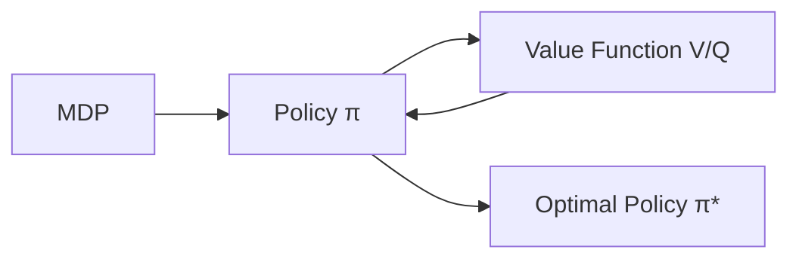

# 强化学习Reinforcement Learning中的策略迭代算法与实现细节

## 1.背景介绍
### 1.1 强化学习概述
强化学习(Reinforcement Learning, RL)是机器学习的一个重要分支,它研究如何让智能体(Agent)在与环境的交互中学习最优策略,以获得最大的累积奖励。与监督学习和非监督学习不同,强化学习并没有预先给定的标签数据,而是通过不断尝试与环境交互,根据反馈的奖励信号来调整策略,最终学习到最优策略。

### 1.2 强化学习的基本框架
强化学习的基本框架包括:
- 智能体(Agent):与环境交互并做出决策的主体
- 环境(Environment):智能体所处的环境,给予智能体观察值和奖励
- 状态(State):智能体所处的状态,通常是对环境的观察
- 动作(Action):智能体根据当前状态采取的行为决策
- 奖励(Reward):环境对智能体动作的即时反馈
- 策略(Policy):将状态映射为动作的函数,决定了智能体的行为模式

智能体与环境不断交互,在每个时间步(time step)t,智能体根据当前状态 $s_t$ 执行一个动作 $a_t$,环境接收动作并转移到新状态 $s_{t+1}$,同时给予智能体一个即时奖励 $r_t$。智能体的目标是最大化从当前时刻开始的累积期望奖励(expected cumulative reward)。

### 1.3 策略迭代算法
策略迭代(Policy Iteration)是强化学习中一类重要的算法,通过迭代地评估和改进策略,最终收敛到最优策略。策略迭代主要包括策略评估(Policy Evaluation)和策略改进(Policy Improvement)两个交替进行的步骤。

本文将详细介绍策略迭代算法的核心原理、数学模型、代码实现以及在实际中的应用,帮助读者深入理解和掌握这一强化学习的经典算法。

## 2.核心概念与联系
### 2.1 马尔可夫决策过程
马尔可夫决策过程(Markov Decision Process, MDP)为强化学习提供了理论基础。MDP由状态集合S、动作集合A、状态转移概率 $P(s'|s,a)$ 、奖励函数 $R(s,a)$ 以及折扣因子 $\gamma$ 组成。

在MDP中,环境的状态转移满足马尔可夫性质,即下一状态 $s'$ 只取决于当前状态s和采取的动作a,与之前的历史状态和动作无关:

$$P(s_{t+1}=s'|s_t,a_t,s_{t-1},a_{t-1},...) = P(s_{t+1}=s'|s_t,a_t)$$

### 2.2 值函数
值函数(Value Function)用于评估在某个状态下执行某个策略的好坏。常见的值函数有状态值函数(State Value Function)和动作值函数(Action Value Function)。

状态值函数 $V^{\pi}(s)$ 表示从状态s开始,执行策略 $\pi$ 得到的期望回报:

$$V^{\pi}(s) = \mathbb{E}_{\pi}[\sum_{k=0}^{\infty} \gamma^k r_{t+k} | s_t=s]$$

动作值函数 $Q^{\pi}(s,a)$ 表示在状态s下采取动作a,然后继续执行策略 $\pi$ 得到的期望回报:

$$Q^{\pi}(s,a) = \mathbb{E}_{\pi}[\sum_{k=0}^{\infty} \gamma^k r_{t+k} | s_t=s, a_t=a]$$

值函数满足贝尔曼方程(Bellman Equation),刻画了当前状态的值与下一状态值之间的递归关系:

$$V^{\pi}(s) = \sum_a \pi(a|s) \sum_{s'} P(s'|s,a) [R(s,a) + \gamma V^{\pi}(s')]$$

$$Q^{\pi}(s,a) = \sum_{s'} P(s'|s,a) [R(s,a) + \gamma \sum_{a'} \pi(a'|s') Q^{\pi}(s',a')]$$

### 2.3 最优值函数与最优策略
最优状态值函数 $V^*(s)$ 和最优动作值函数 $Q^*(s,a)$ 分别表示在状态s下以及在状态s采取动作a后能获得的最大期望回报:

$$V^*(s) = \max_{\pi} V^{\pi}(s)$$

$$Q^*(s,a) = \max_{\pi} Q^{\pi}(s,a)$$

最优策略 $\pi^*$ 定义为在每个状态下选择使 $Q^*(s,a)$ 最大化的动作:

$$\pi^*(s) = \arg\max_a Q^*(s,a)$$

下图展示了MDP、策略、值函数之间的关系:



## 3.核心算法原理具体操作步骤
策略迭代算法交替执行策略评估和策略改进,直到策略收敛。

### 3.1 策略评估 
策略评估的目的是计算在给定MDP和策略 $\pi$ 下,每个状态的值函数 $V^{\pi}(s)$。

根据贝尔曼方程,状态值函数可以迭代计算:

$$V_{k+1}(s) = \sum_a \pi(a|s) \sum_{s'} P(s'|s,a) [R(s,a) + \gamma V_k(s')]$$

其中 $V_k(s)$ 表示第k次迭代得到的状态值函数。重复迭代直到值函数收敛,即 $\max_s |V_{k+1}(s) - V_k(s)| < \theta$,其中 $\theta$ 为设定的阈值。

### 3.2 策略改进
在完成策略评估后,我们基于更新后的值函数来改进策略。对每个状态,选择使得Q值最大的动作作为新的策略:

$$\pi'(s) = \arg\max_a \sum_{s'} P(s'|s,a) [R(s,a) + \gamma V^{\pi}(s')]$$

如果 $\pi'=\pi$,说明策略已经收敛到最优,算法终止;否则,令 $\pi=\pi'$,返回策略评估步骤,继续迭代。

### 3.3 完整的策略迭代算法
```
初始化策略 π 为任意策略
repeat:
    策略评估:
        初始化 V(s)=0, ∀s∈S
        repeat:
            ∀s∈S:
                V(s) = ∑π(a|s) ∑P(s'|s,a) [R(s,a) + γV(s')]
        until V收敛
    策略改进:
        ∀s∈S:
            π'(s) = argmax_a ∑P(s'|s,a) [R(s,a) + γV(s')]
        if π'=π:
            break
        else:
            π=π'
until 收敛
```

## 4.数学模型和公式详细讲解举例说明
下面我们以一个简单的网格世界环境为例,详细说明策略迭代中的数学模型和计算过程。

考虑一个3x4的网格世界,每个格子表示一个状态。智能体可以执行上下左右四个动作,但动作执行有10%的概率失败。每个格子的即时奖励如下图所示,折扣因子 $\gamma=0.9$。我们的目标是找到最优策略,使得智能体获得最大的累积奖励。

```
+---+---+---+---+
| 0 | 0 | 0 |+1 |
+---+---+---+---+
| 0 | 0 | 0 |-1 |  
+---+---+---+---+
| 0 | 0 | 0 | 0 |
+---+---+---+---+
```

我们用 $(i,j)$ 表示位于第i行第j列的状态,动作用字符 `^`(上),`v`(下),`<`(左),`>`(右)表示。

初始化策略 $\pi_0$ 为在每个状态均匀随机选择动作:

$$\pi_0(a|s) = 0.25, \forall s\in S, a\in \{^,v,<,>\}$$

**策略评估:**

初始化各状态的值函数为0:

$$V_0(s)=0, \forall s\in S$$

根据贝尔曼方程迭代计算值函数,直到收敛。以状态(1,1)为例:

$$
\begin{aligned}
V_1(1,1) &= \sum_a \pi_0(a|(1,1)) \sum_{s'} P(s'|(1,1),a) [R((1,1),a) + \gamma V_0(s')] \\
         &= 0.25 \times [0.9 \times (0 + 0.9V_0(0,1)) + 0.1 \times (0 + 0.9V_0(2,1))] \\
         &+ 0.25 \times [0.9 \times (0 + 0.9V_0(2,1)) + 0.1 \times (0 + 0.9V_0(0,1))] \\  
         &+ 0.25 \times [0.9 \times (0 + 0.9V_0(1,0)) + 0.1 \times (0 + 0.9V_0(1,2))] \\
         &+ 0.25 \times [0.9 \times (0 + 0.9V_0(1,2)) + 0.1 \times (0 + 0.9V_0(1,0))] \\
         &= 0
\end{aligned}
$$

类似地计算其他状态的值函数,重复迭代直到值函数收敛。假设我们得到收敛后的值函数 $V^{\pi_0}$。

**策略改进:**

对每个状态,计算采取每个动作后的Q值,选择Q值最大的动作作为新策略 $\pi_1$。仍以状态(1,1)为例:

$$
\begin{aligned}
Q(s, \uparrow) &= 0.9 \times (0 + 0.9V^{\pi_0}(0,1)) + 0.1 \times (0 + 0.9V^{\pi_0}(2,1)) \\
Q(s, \downarrow) &= 0.9 \times (0 + 0.9V^{\pi_0}(2,1)) + 0.1 \times (0 + 0.9V^{\pi_0}(0,1)) \\
Q(s, \leftarrow) &= 0.9 \times (0 + 0.9V^{\pi_0}(1,0)) + 0.1 \times (0 + 0.9V^{\pi_0}(1,2)) \\ 
Q(s, \rightarrow) &= 0.9 \times (0 + 0.9V^{\pi_0}(1,2)) + 0.1 \times (0 + 0.9V^{\pi_0}(1,0))
\end{aligned}
$$

比较四个动作的Q值,选择Q值最大的动作作为 $\pi_1(1,1)$。类似地计算其他状态的新策略。

若 $\pi_1 \neq \pi_0$,则令 $\pi_0=\pi_1$,返回策略评估步骤继续迭代,直到策略收敛。

## 5.项目实践：代码实例和详细解释说明

下面我们用Python实现策略迭代算法,以上述网格世界为例。

首先定义MDP类,包含状态转移概率和奖励函数:

```python
class GridWorld:
    def __init__(self):
        self.states = [(i, j) for i in range(3) for j in range(4)]
        self.actions = ['^', 'v', '<', '>']
        self.rewards = {(0, 3): 1, (1, 3): -1}
        
    def transition_prob(self, state, action, next_state):
        if action == '^' and next_state[0] == state[0]-1:
            return 0.9
        elif action == 'v' and next_state[0] == state[0]+1:
            return 0.9
        elif action == '<' and next_state[1] == state[1]-1:
            return 0.9
        elif action == '>' and next_state[1] == state[1]+1:
            return 0.9
        elif next_state == state:
            return 0.1
        else:
            return 0
        
    def reward(self, state):
        return self.rewards.get(state, 0)
```

然后实现策略评估和策略改进函数:

```python
def policy_evaluation(policy, V, gamma=0.9, theta=1e-6):
    while True:
        delta = 0
        for s in mdp.states:
            v = V[s]
            V[s] = sum(policy[s][a] * sum(mdp.transition_prob(s, a, s_) * (mdp.reward(s) + gamma * V[s_]) 
                                           for s_ in mdp.states) 
                       