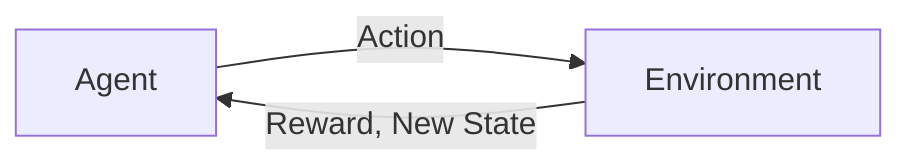

## 1.背景介绍

在过去的几年里，强化学习(Reinforcement Learning, RL)在各种领域都取得了显著的进展，包括游戏、机器人技术、自动驾驶等。而在金融领域，强化学习的应用也日益受到关注。金融市场的复杂性、动态性和不确定性使得强化学习成为一个理想的工具，用于解决金融市场中的一些关键问题，如资产定价、投资组合优化、风险管理等。

## 2.核心概念与联系

强化学习是机器学习的一个重要分支，它的核心思想是通过与环境的交互进行学习，以达到最大化累积奖励的目标。在强化学习中，有两个核心概念：Agent（智能体）和Environment（环境）。Agent通过执行Action（行动）与Environment交互，Environment会根据Agent的Action给出Reward（奖励）和新的State（状态）。Agent的目标就是找到一种Policy（策略），使得从任意初始状态出发，通过执行一系列的Action，可以获得最大的累积Reward。

在金融领域，我们可以将投资者视为Agent，金融市场视为Environment，投资决策视为Action，投资回报视为Reward，市场状态（如股票价格、宏观经济指标等）视为State。通过强化学习，投资者（Agent）可以学习到一个最优的投资策略（Policy），以实现最大化的投资回报（Reward）。



## 3.核心算法原理具体操作步骤

强化学习的核心算法包括价值迭代(Value Iteration)、策略迭代(Policy Iteration)、Q-learning、Deep Q Network(DQN)、Policy Gradient、Actor-Critic等。这里以Q-learning为例，介绍其具体的操作步骤：

1. 初始化Q值表或Q值函数为任意值，通常为0。
2. 对每一次Episode（一系列的Action和State），执行以下步骤：
   1. 选择并执行一个Action，根据ε-greedy策略或其他策略，从当前状态State选择一个Action。
   2. 接收即时奖励Reward和新的状态State'。
   3. 更新Q值：$Q(State, Action) \leftarrow Q(State, Action) + α [Reward + γ max_{Action'} Q(State', Action') - Q(State, Action)]$
   4. 更新当前状态为新的状态State'。
3. 重复步骤2，直到满足停止条件（如达到最大Episode数、达到最大步数、Q值收敛等）。

## 4.数学模型和公式详细讲解举例说明

强化学习的数学模型基于马尔可夫决策过程(Markov Decision Process, MDP)，MDP由五元组$(S, A, P, R, γ)$定义，其中：

- $S$是状态空间。
- $A$是行动空间。
- $P$是状态转移概率，$P_{ss'}^a = P[S_{t+1} = s' | S_t = s, A_t = a]$。
- $R$是奖励函数，$R_s^a = E[R_{t+1} | S_t = s, A_t = a]$。
- $γ$是折扣因子，取值范围为[0, 1]。

在强化学习中，我们定义价值函数$V(s)$和动作价值函数$Q(s, a)$如下：

- 状态价值函数：$V(s) = E[∑_{i=0}^{∞} γ^i R_{t+i+1} | S_t = s]$
- 动作价值函数：$Q(s, a) = E[∑_{i=0}^{∞} γ^i R_{t+i+1} | S_t = s, A_t = a]$

其中，$E$表示期望，$R_{t+i+1}$表示在时间$t+i+1$的奖励，$γ^i$是折扣因子的$i$次方。

在Q-learning算法中，我们通过以下公式来更新Q值：

$$Q(s, a) \leftarrow Q(s, a) + α [r + γ max_{a'} Q(s', a') - Q(s, a)]$$

其中，$α$是学习率，$r$是即时奖励，$s'$是新的状态，$a'$是在新的状态$s'$下的最优动作。

## 5.项目实践：代码实例和详细解释说明

这里我们使用Python和强化学习库Gym来演示如何使用Q-learning算法进行股票交易。我们将使用Gym库中的`StockTrading-v0`环境，该环境模拟了一个简单的股票市场，我们的目标是通过买卖股票来最大化总资产。

首先，我们需要安装必要的库：

```python
pip install gym numpy
```

然后，我们可以定义Q-learning算法：

```python
import numpy as np

class QLearning:
    def __init__(self, states, actions, alpha=0.5, gamma=0.9, epsilon=0.1):
        self.states = states
        self.actions = actions
        self.alpha = alpha
        self.gamma = gamma
        self.epsilon = epsilon
        self.Q = np.zeros((states, actions))

    def choose_action(self, state):
        if np.random.uniform() < self.epsilon:
            action = np.random.choice(self.actions)
        else:
            action = np.argmax(self.Q[state, :])
        return action

    def learn(self, state, action, reward, next_state):
        predict = self.Q[state, action]
        target = reward + self.gamma * np.max(self.Q[next_state, :])
        self.Q[state, action] = self.Q[state, action] + self.alpha * (target - predict)
```

接下来，我们可以使用Q-learning算法来进行股票交易：

```python
import gym

env = gym.make('StockTrading-v0')
agent = QLearning(env.observation_space.n, env.action_space.n)

for episode in range(1000):
    state = env.reset()
    total_reward = 0
    while True:
        action = agent.choose_action(state)
        next_state, reward, done, _ = env.step(action)
        agent.learn(state, action, reward, next_state)
        state = next_state
        total_reward += reward
        if done:
            break
    print(f'Episode {episode}, Total Reward: {total_reward}')
```

在这个代码示例中，我们首先创建了一个强化学习的环境和一个Q-learning智能体，然后在每一个Episode中，智能体根据当前状态选择一个行动，然后执行这个行动并接收奖励和新的状态，然后根据奖励和新的状态来更新Q值。这个过程一直重复，直到达到停止条件。

## 6.实际应用场景

强化学习在金融领域的应用场景非常广泛，主要包括以下几个方面：

1. 资产定价：强化学习可以用来估计未来的资产价格，以帮助投资者做出更好的投资决策。
2. 投资组合优化：强化学习可以用来寻找最优的投资组合，以最大化投资回报和最小化投资风险。
3. 高频交易：在高频交易中，强化学习可以用来快速做出交易决策，以抓住市场的瞬间机会。
4. 风险管理：强化学习可以用来评估和管理投资风险，以防止过度风险导致的大额损失。

## 7.工具和资源推荐

以下是一些学习和使用强化学习的工具和资源：

1. 强化学习教程和课程：Coursera的"Reinforcement Learning Specialization"、Udacity的"Deep Reinforcement Learning Nanodegree"等。
2. 强化学习书籍：Sutton和Barto的"Reinforcement Learning: An Introduction"、François-Lavet等人的"An Introduction to Deep Reinforcement Learning"等。
3. 强化学习库：OpenAI的Gym和Baselines、Google的Dopamine、DeepMind的Acme等。
4. 强化学习论文：arXiv的cs.LG分类、Google Scholar的Reinforcement Learning分类等。

## 8.总结：未来发展趋势与挑战

强化学习在金融领域的应用前景广阔，但也面临着一些挑战，主要包括以下几个方面：

1. 数据问题：金融市场的数据是非静态的、非平稳的，这对强化学习算法的稳定性和泛化性提出了高要求。
2. 延迟奖励问题：在金融市场中，行动的结果往往需要一段时间才能体现，这就导致了强化学习中的延迟奖励问题。
3. 噪声问题：金融市场的数据噪声大，这对强化学习算法的鲁棒性提出了高要求。
4. 解释性问题：强化学习算法往往缺乏解释性，这在金融领域是一个重要的问题，因为投资者和监管机构都希望能够理解模型的决策过程。

尽管存在这些挑战，但随着强化学习技术的不断进步，我相信强化学习在金融领域的应用将会越来越广泛，也将会带来越来越大的价值。

## 9.附录：常见问题与解答

1. 强化学习和监督学习有什么区别？  
   监督学习是从标记的训练数据中学习一个映射函数，而强化学习是通过与环境的交互进行学习，以达到最大化累积奖励的目标。

2. 如何选择强化学习的奖励函数？  
   奖励函数的选择需要根据具体的任务来定，一般来说，奖励函数应该能够反映出任务的目标。

3. 强化学习的学习过程是怎样的？  
   强化学习的学习过程是通过试错的方式进行的，智能体通过执行行动与环境交互，然后根据环境的反馈（奖励和新的状态）来更新自己的知识。

4. 强化学习能否用于非马尔可夫决策过程？  
   强化学习的标准模型是基于马尔可夫决策过程的，但也有一些强化学习算法可以处理非马尔可夫决策过程，如记忆网络、递归神经网络等。

作者：禅与计算机程序设计艺术 / Zen and the Art of Computer Programming