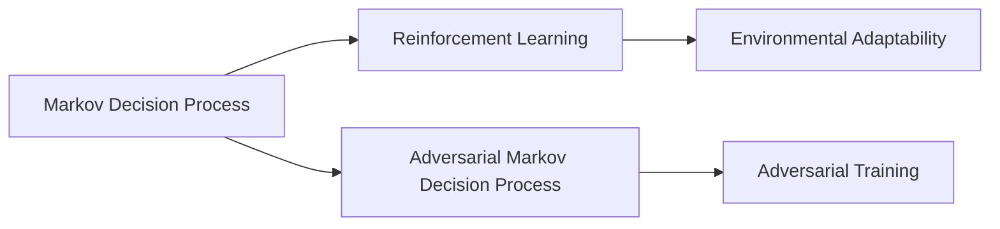

# 强化学习Reinforcement Learning对抗性训练与环境适应性

## 1.背景介绍
### 1.1 强化学习的发展历程
### 1.2 强化学习面临的挑战
### 1.3 对抗性训练与环境适应性的重要性

强化学习(Reinforcement Learning, RL)作为人工智能的一个重要分支,在近年来取得了长足的发展。从DeepMind的DQN在Atari游戏中超越人类,到AlphaGo战胜世界围棋冠军,再到OpenAI Five在Dota 2中击败职业选手,强化学习展现出了巨大的潜力。

然而,强化学习算法在实际应用中仍然面临着诸多挑战。其中最为关键的两点是:

1. 对抗性的环境。在现实世界中,智能体往往需要面对具有对抗性的环境或对手。传统的强化学习算法很容易在这种情况下失效。

2. 环境的变化。现实环境往往是动态变化的,智能体需要具备快速适应环境变化的能力。如何提高强化学习算法的泛化能力和鲁棒性,是一个亟待解决的问题。

因此,对抗性训练和环境适应性已经成为强化学习领域的研究热点。通过引入对抗性训练,可以提高智能体应对对抗环境的能力;而通过提高算法的适应性,则可以使智能体更好地应对环境的变化。这两个方向的研究,对于推动强化学习在实际场景中的应用具有重要意义。

## 2.核心概念与联系
### 2.1 马尔可夫决策过程(MDP)
### 2.2 对抗性马尔可夫决策过程(AMDP) 
### 2.3 对抗性训练与环境适应性的关系

在深入探讨对抗性训练和环境适应性之前,我们首先需要了解强化学习的理论基础——马尔可夫决策过程(Markov Decision Process, MDP)。MDP可以用一个五元组$(S,A,P,R,\gamma)$来表示:

- $S$:状态空间
- $A$:动作空间  
- $P$:状态转移概率矩阵,$P(s'|s,a)$表示在状态$s$下执行动作$a$后转移到状态$s'$的概率
- $R$:奖励函数,$R(s,a)$表示在状态$s$下执行动作$a$获得的即时奖励
- $\gamma$:折扣因子,用于平衡即时奖励和长期奖励

MDP为描述序贯决策问题提供了一个通用的数学框架。强化学习的目标就是在MDP框架下,通过与环境的交互来学习一个最优策略$\pi^*$,使得期望累积奖励最大化:

$$\pi^* = \arg\max_{\pi} \mathbb{E}\left[\sum_{t=0}^{\infty} \gamma^t R(s_t,a_t)\right]$$

然而,经典的MDP并不能很好地刻画对抗性环境。为此,研究者提出了对抗性马尔可夫决策过程(Adversarial MDP, AMDP)的概念。与MDP不同的是,AMDP引入了一个对抗者(adversary)的概念,用于主动干扰环境以使智能体的决策变得更加困难。AMDP的目标是在最坏情况下(worst-case)找到最优策略:

$$\pi^* = \arg\max_{\pi} \min_{P \in \mathcal{P}} \mathbb{E}\left[\sum_{t=0}^{\infty} \gamma^t R(s_t,a_t)\right]$$

其中,$\mathcal{P}$表示所有可能的环境转移概率的集合。

对抗性训练的核心思想就是通过模拟这种对抗过程,使得智能体能够在对抗环境中稳健地进行决策。而环境适应性则强调算法能够快速适应环境的变化,这通常需要元学习(meta-learning)等技术的支持。这两个方向相辅相成,共同推动了强化学习在非静态环境中的应用。



## 3.核心算法原理具体操作步骤
### 3.1 对抗性训练算法
#### 3.1.1 对抗性策略梯度算法
#### 3.1.2 对抗性Q学习算法
#### 3.1.3 对抗性Actor-Critic算法
### 3.2 环境适应性算法  
#### 3.2.1 基于梯度的元学习算法
#### 3.2.2 基于模型的元学习算法
#### 3.2.3 基于度量的元学习算法

对抗性训练和环境适应性涉及到多种算法,这里我们重点介绍几种代表性的方法。

对抗性训练算法通常是在传统强化学习算法的基础上进行改进。以对抗性策略梯度算法为例,其核心思想是引入一个对抗者策略$\mu$来扰动环境动力学,使得智能体策略$\pi$的性能下降。训练过程交替进行以下两个步骤:

1. 固定对抗者策略$\mu$,通过策略梯度方法更新智能体策略$\pi$以最大化期望奖励:
$$\theta \leftarrow \theta + \alpha \nabla_{\theta} J(\theta, \mu)$$

2. 固定智能体策略$\pi$,通过梯度下降更新对抗者策略$\mu$以最小化智能体的期望奖励:
$$\phi \leftarrow \phi - \beta \nabla_{\phi} J(\theta, \phi)$$

其中$\theta$和$\phi$分别表示策略$\pi$和$\mu$的参数,$\alpha$和$\beta$为学习率,$J(\theta, \mu)$为在对抗环境下智能体的期望累积奖励。

对于环境适应性,元学习是一种常用的范式。元学习旨在学习一个"学习算法",使得智能体能够在新环境中快速适应。以MAML(Model-Agnostic Meta-Learning)算法为例,其主要步骤如下:

1. 在一批任务$\{\mathcal{T}_i\}$上进行采样,每个任务对应一个MDP。

2. 对每个任务$\mathcal{T}_i$,在其训练数据上通过一次或多次梯度下降更新参数:
$$\theta_i' = \theta - \alpha \nabla_{\theta} \mathcal{L}_{\mathcal{T}_i}(f_{\theta}) $$

3. 在每个任务的测试数据上计算损失,并通过梯度下降更新初始参数$\theta$:
$$\theta \leftarrow \theta - \beta \nabla_{\theta} \sum_{\mathcal{T}_i \sim p(\mathcal{T})} \mathcal{L}_{\mathcal{T}_i}(f_{\theta_i'})$$

通过元训练,MAML得到一个初始参数$\theta$,使得智能体能够在新任务上通过少量的梯度步骤实现快速适应。

## 4.数学模型和公式详细讲解举例说明
### 4.1 对抗性策略梯度算法的数学推导
### 4.2 MAML算法的数学推导
### 4.3 数值实例

为了更好地理解上述算法,这里我们通过数学推导和数值实例来进一步说明。

以对抗性策略梯度算法为例,我们考虑一个简单的二维连续控制任务。状态空间为$\mathcal{S} = \mathbb{R}^2$,动作空间为$\mathcal{A} = \mathbb{R}^2$,转移函数为:

$$s_{t+1} = s_t + a_t + w_t$$

其中$w_t \sim \mathcal{N}(0, \sigma^2)$为环境噪声。奖励函数为:

$$r(s_t, a_t) = - \|s_t\|_2^2 - \|a_t\|_2^2$$

即,智能体需要控制状态和动作尽可能接近原点。

我们假设智能体策略$\pi_{\theta}$和对抗者策略$\mu_{\phi}$均为高斯策略:

$$\pi_{\theta}(a_t|s_t) = \mathcal{N}(a_t|\theta_1^T s_t, \theta_2)$$
$$\mu_{\phi}(w_t|s_t) = \mathcal{N}(w_t|\phi_1^T s_t, \phi_2)$$

其中,$\theta = [\theta_1, \theta_2], \phi = [\phi_1, \phi_2]$分别为智能体和对抗者的策略参数。

根据策略梯度定理,智能体策略的梯度为:

$$\nabla_{\theta} J(\theta, \phi) = \mathbb{E}_{s_t \sim \rho^{\pi}, a_t \sim \pi_{\theta}, w_t \sim \mu_{\phi}} [\nabla_{\theta} \log \pi_{\theta}(a_t|s_t) Q^{\pi}(s_t, a_t)]$$

其中,$\rho^{\pi}$为智能体策略$\pi_{\theta}$对应的状态分布,$Q^{\pi}(s_t, a_t)$为状态-动作值函数,表示从状态$s_t$开始执行动作$a_t$并继续遵循策略$\pi_{\theta}$的期望累积奖励。

对抗者策略的梯度为:

$$\nabla_{\phi} J(\theta, \phi) = \mathbb{E}_{s_t \sim \rho^{\pi}, a_t \sim \pi_{\theta}, w_t \sim \mu_{\phi}} [\nabla_{\phi} \log \mu_{\phi}(w_t|s_t) Q^{\pi}(s_t, a_t)]$$

在实际训练中,我们通过蒙特卡洛方法来估计梯度,即通过采样轨迹来近似期望。假设我们采样了一条长度为$T$的轨迹$\tau = \{s_0, a_0, r_0, s_1, a_1, r_1, \dots, s_T\}$,则梯度估计为:

$$\nabla_{\theta} J(\theta, \phi) \approx \frac{1}{T} \sum_{t=0}^{T-1} \nabla_{\theta} \log \pi_{\theta}(a_t|s_t) \hat{Q}^{\pi}(s_t, a_t)$$
$$\nabla_{\phi} J(\theta, \phi) \approx \frac{1}{T} \sum_{t=0}^{T-1} \nabla_{\phi} \log \mu_{\phi}(w_t|s_t) \hat{Q}^{\pi}(s_t, a_t)$$

其中,$\hat{Q}^{\pi}(s_t, a_t) = \sum_{t'=t}^{T-1} \gamma^{t'-t} r_{t'}$为蒙特卡洛估计的状态-动作值函数。

通过交替优化$\theta$和$\phi$,我们可以得到一个鲁棒的智能体策略,使其能够在对抗环境下稳健地进行控制。

## 5.项目实践：代码实例和详细解释说明
### 5.1 对抗性策略梯度算法的代码实现
### 5.2 MAML算法的代码实现
### 5.3 代码运行结果分析

为了进一步理解这些算法,我们通过Python代码来实现它们。以对抗性策略梯度算法为例,核心代码如下:

```python
import numpy as np

# 定义策略网络
class Policy(object):
    def __init__(self, input_size, output_size):
        self.w = np.random.randn(input_size, output_size)
        self.b = np.zeros(output_size)
    
    def act(self, state):
        logits = np.dot(state, self.w) + self.b
        mean = logits[0]
        std = np.exp(logits[1])
        return np.random.normal(mean, std)
    
    def log_prob(self, state, action):
        logits = np.dot(state, self.w) + self.b
        mean = logits[0]
        std = np.exp(logits[1])
        return -0.5 * np.log(2*np.pi) - np.log(std) - 0.5 * ((action-mean)/std)**2

# 定义对抗性策略梯度算法
def adversarial_policy_gradient(env, agent_policy, adversary_policy, num_episodes, gamma=0.99, learning_rate=0.01):
    for episode in range(num_episodes):
        state = env.reset()
        done = False
        trajectory = []
        
        while not done:
            agent_action = agent_policy.act(state)
            adversary_action = adversary_policy.act(state)
            
            next_state, reward, done = env.step(agent_action, adversary_action)
            trajectory.append((state, agent_action, adversary_action, reward))
            state = next_state
        
        states, agent_actions, adversary_actions, rewards = zip(*trajectory)
        returns = np.zeros_like