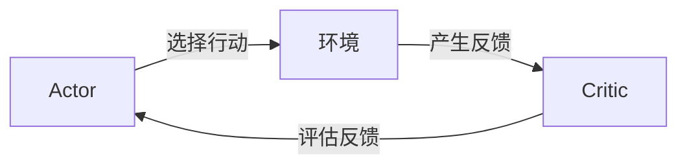

## 1.背景介绍

强化学习是机器学习的一个重要分支，它以智能体在环境中学习如何采取行动以最大化某种奖励信号为目标，其核心是学习一个策略，指导智能体如何在给定的情况下采取行动。在强化学习的众多算法中，Actor-Critic算法是一个非常重要的算法。

Actor-Critic算法是一种结合了值函数方法和策略优化方法的算法。它包含两个主要组成部分：Actor（演员）和Critic（评论家）。Actor负责根据当前的策略选择行动，Critic则负责评估Actor的行动并提供反馈，以便Actor改进其策略。

## 2.核心概念与联系

在Actor-Critic算法中，Actor和Critic有着密切的关系。Actor根据当前的策略选择行动，Critic评估这些行动并提供反馈。这个反馈是一个称为TD错误（Temporal Difference Error）的量，它衡量了Critic预测的未来奖励与实际获得的奖励之间的差距。Actor使用这个反馈来更新其策略。



## 3.核心算法原理具体操作步骤

Actor-Critic算法的具体操作步骤如下：

1. 初始化Actor和Critic。
2. 对每一步进行如下操作：
   1. Actor根据当前的策略选择一个行动。
   2. 执行这个行动并观察环境的反馈，包括下一个状态和奖励。
   3. Critic计算TD错误。
   4. Actor使用TD错误来更新其策略。
   5. Critic使用TD错误来更新其值函数。

## 4.数学模型和公式详细讲解举例说明

### 4.1 TD错误的计算

TD错误是Critic的预测值和实际值之间的差值。它的计算公式如下：

$$
TD_{error} = r_t + \gamma V(s_{t+1}) - V(s_t)
$$

其中，$r_t$是在时间$t$获得的奖励，$\gamma$是奖励的折扣因子，$V(s)$是状态$s$的值函数。

### 4.2 Actor的策略更新

Actor使用TD错误来更新其策略。策略更新的公式如下：

$$
\theta = \theta + \alpha TD_{error} \nabla_{\theta} log\pi(a_t|s_t)
$$

其中，$\theta$是策略的参数，$\alpha$是学习率，$\pi(a_t|s_t)$是在状态$s_t$下选择行动$a_t$的概率。

## 5.项目实践：代码实例和详细解释说明

以下是一个简单的Actor-Critic算法的代码实例：

```python
class ActorCritic:
    def __init__(self, env):
        self.env = env
        self.actor = Actor(env)
        self.critic = Critic(env)

    def train(self, episodes):
        for episode in range(episodes):
            state = self.env.reset()
            while True:
                action = self.actor.choose_action(state)
                next_state, reward, done = self.env.step(action)
                td_error = reward + self.critic.gamma * self.critic.value(next_state) - self.critic.value(state)
                self.actor.learn(state, action, td_error)
                self.critic.learn(state, td_error)
                state = next_state
                if done:
                    break
```

这个代码首先初始化Actor和Critic，然后在每个episode中，Actor根据当前的策略选择行动，然后获取环境的反馈，包括下一个状态和奖励。然后计算TD错误，并使用TD错误来更新Actor的策略和Critic的值函数。

## 6.实际应用场景

Actor-Critic算法在许多实际应用中都有着广泛的应用，例如：

- 游戏：Actor-Critic算法可以用于训练游戏AI，例如在星际争霸、围棋等游戏中，Actor-Critic算法都有着广泛的应用。
- 机器人：Actor-Critic算法可以用于训练机器人进行各种任务，例如抓取物体、导航等。

## 7.工具和资源推荐

以下是一些学习和使用Actor-Critic算法的工具和资源：

- OpenAI Gym：一个用于开发和比较强化学习算法的工具包。
- TensorFlow：一个用于机器学习和深度学习的开源库，可以用于实现Actor-Critic算法。
- PyTorch：另一个用于机器学习和深度学习的开源库，也可以用于实现Actor-Critic算法。

## 8.总结：未来发展趋势与挑战

Actor-Critic算法是强化学习的一个重要算法，它结合了值函数方法和策略优化方法的优点，但也面临着一些挑战，例如如何平衡探索和利用、如何处理大规模的状态和行动空间等。

随着深度学习和强化学习的发展，我们期待Actor-Critic算法能在更多的领域得到应用，并解决更多的挑战。

## 9.附录：常见问题与解答

Q: Actor-Critic算法和Q-learning有什么区别？

A: Actor-Critic算法和Q-learning都是强化学习的算法，但它们的主要区别在于，Actor-Critic算法使用了一个额外的Critic来评估Actor的行动，而Q-learning则直接使用值函数来选择行动。

---

作者：禅与计算机程序设计艺术 / Zen and the Art of Computer Programming