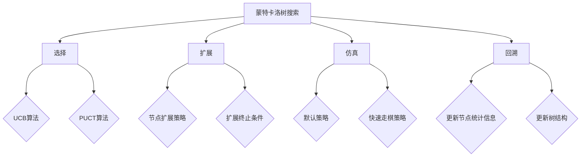

# 强化学习算法：蒙特卡洛树搜索 (Monte Carlo Tree Search) 原理与代码实例讲解

## 1. 背景介绍

强化学习(Reinforcement Learning, RL)是人工智能领域的一个重要分支,它通过智能体(Agent)与环境(Environment)的交互,从经验中学习,不断改进策略,以获得最大化的累积奖励。蒙特卡洛树搜索(Monte Carlo Tree Search, MCTS)作为一种强大的启发式搜索算法,在强化学习领域得到了广泛的应用。

MCTS算法最早由Rémi Coulom提出,并在计算机博弈领域取得了巨大的成功,尤其是在围棋领域。2016年,由DeepMind开发的AlphaGo系统结合深度学习与MCTS算法,以4:1战胜了人类顶尖围棋选手李世石,引起了全球的轰动。此后,MCTS算法也被广泛应用于其他领域,如机器人控制、自动驾驶、推荐系统等。

本文将深入探讨蒙特卡洛树搜索算法的原理,并结合代码实例进行讲解,帮助读者全面理解和掌握这一强大的算法。

### 1.1 强化学习基本概念
#### 1.1.1 智能体与环境
#### 1.1.2 状态、动作与奖励
#### 1.1.3 策略与价值函数

### 1.2 蒙特卡洛树搜索的发展历程
#### 1.2.1 蒙特卡洛方法的起源
#### 1.2.2 UCT算法的提出
#### 1.2.3 AlphaGo的突破

## 2. 核心概念与联系

### 2.1 蒙特卡洛树搜索的基本思想
#### 2.1.1 平衡探索与利用
#### 2.1.2 渐进式构建搜索树

### 2.2 MCTS算法的四个阶段
#### 2.2.1 选择(Selection)
#### 2.2.2 扩展(Expansion) 
#### 2.2.3 仿真(Simulation)
#### 2.2.4 回溯(Backpropagation)

### 2.3 MCTS与其他算法的联系
#### 2.3.1 MCTS与深度学习的结合
#### 2.3.2 MCTS与启发式搜索的区别
#### 2.3.3 MCTS与动态规划的关系

## 3. 核心算法原理具体操作步骤

### 3.1 选择阶段
#### 3.1.1 UCB算法
#### 3.1.2 PUCT算法

### 3.2 扩展阶段
#### 3.2.1 节点扩展策略
#### 3.2.2 扩展终止条件

### 3.3 仿真阶段  
#### 3.3.1 默认策略
#### 3.3.2 快速走棋策略

### 3.4 回溯阶段
#### 3.4.1 更新节点统计信息
#### 3.4.2 更新树结构

## 4. 数学模型和公式详细讲解举例说明

### 4.1 多臂老虎机问题与UCB公式
#### 4.1.1 探索与利用的权衡
#### 4.1.2 UCB公式推导

$$UCB = \overline{X}_j + \sqrt{\frac{2\ln{n}}{n_j}}$$

其中,$\overline{X}_j$是第$j$个臂的平均奖励,$n_j$是第$j$个臂被选择的次数,$n$是总的选择次数。

### 4.2 PUCT算法与价值网络
#### 4.2.1 策略与价值的权衡
#### 4.2.2 PUCT公式推导

$$PUCT = Q(s,a) + c_{puct}P(s,a)\frac{\sqrt{\sum_b N(s,b)}}{1+N(s,a)}$$

其中,$Q(s,a)$是动作价值,$P(s,a)$是先验概率,$N(s,a)$是访问次数,$c_{puct}$是控制探索的常数。

## 5. 项目实践：代码实例和详细解释说明

### 5.1 基于MCTS的井字棋AI
#### 5.1.1 游戏环境搭建
#### 5.1.2 MCTS算法实现
#### 5.1.3 AI对战与结果分析

```python
class MCTSNode:
    def __init__(self, state, parent=None):
        self.state = state
        self.parent = parent
        self.children = []
        self.wins = 0
        self.visits = 0
        
    def expand(self):
        for action in self.state.get_legal_actions():
            next_state = self.state.move(action)
            child_node = MCTSNode(next_state, parent=self)
            self.children.append(child_node)
            
    def select(self):
        best_score = -np.inf
        best_child = None
        for child in self.children:
            score = child.wins / child.visits + np.sqrt(2 * np.log(self.visits) / child.visits)
            if score > best_score:
                best_score = score
                best_child = child
        return best_child
    
    def update(self, result):
        self.visits += 1
        self.wins += result
        if self.parent:
            self.parent.update(result)
            
    def is_terminal(self):
        return self.state.is_game_over()
```

### 5.2 基于MCTS的围棋AI
#### 5.2.1 AlphaGo的网络架构
#### 5.2.2 策略网络与价值网络的训练
#### 5.2.3 蒙特卡洛树搜索的并行化

```python
def mcts_search(state, neural_net, num_simulations):
    root = MCTSNode(state, neural_net)
    
    for _ in range(num_simulations):
        node = root
        while not node.is_leaf():
            node = node.select()
        
        value = node.expand()
        node.backup(value)
        
    return max(root.children, key=lambda x: x.visits).action
```

## 6. 实际应用场景

### 6.1 游戏AI
#### 6.1.1 棋类游戏
#### 6.1.2 卡牌游戏
#### 6.1.3 电子游戏

### 6.2 机器人控制
#### 6.2.1 路径规划
#### 6.2.2 抓取操作
#### 6.2.3 多机器人协作

### 6.3 推荐系统
#### 6.3.1 探索与利用的平衡
#### 6.3.2 在线学习与更新

## 7. 工具和资源推荐

### 7.1 开源框架
#### 7.1.1 OpenAI Gym
#### 7.1.2 DeepMind Lab
#### 7.1.3 MuJoCo

### 7.2 学习资源
#### 7.2.1 《Reinforcement Learning: An Introduction》
#### 7.2.2 David Silver的强化学习课程
#### 7.2.3 《Bandit Algorithms for Website Optimization》

## 8. 总结：未来发展趋势与挑战

### 8.1 MCTS算法的优势与局限性
#### 8.1.1 采样效率与计算复杂度
#### 8.1.2 探索策略的选择
#### 8.1.3 领域知识的引入

### 8.2 与其他算法的结合
#### 8.2.1 深度强化学习
#### 8.2.2 启发式搜索
#### 8.2.3 进化算法

### 8.3 未来研究方向
#### 8.3.1 大规模并行化
#### 8.3.2 元学习与迁移学习
#### 8.3.3 安全与鲁棒性

## 9. 附录：常见问题与解答

### 9.1 MCTS算法的收敛性如何?
### 9.2 如何平衡探索与利用?
### 9.3 MCTS算法的时间复杂度是多少?
### 9.4 如何处理高维状态空间?
### 9.5 MCTS算法能否处理不完全信息博弈?

蒙特卡洛树搜索算法作为一种强大的启发式搜索算法,在强化学习领域得到了广泛的应用。它通过平衡探索与利用,渐进式地构建搜索树,并结合仿真与回溯来更新节点统计信息。MCTS算法与深度学习等其他算法的结合,进一步提升了其性能与适用范围。未来,MCTS算法在采样效率、并行化、元学习等方面还有很大的提升空间,值得学术界和工业界持续关注与研究。

作者：禅与计算机程序设计艺术 / Zen and the Art of Computer Programming

