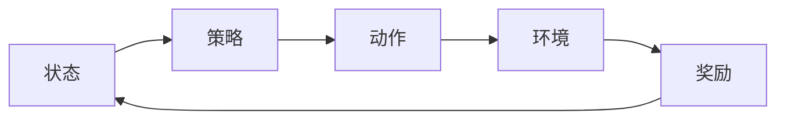

## 1.背景介绍

强化学习是人工智能的一个重要分支，主要研究如何通过与环境的交互来学习最优的决策策略。这种学习方式的灵感来源于生物学中的行为心理学，特别是动物的试错学习。强化学习的目标是发现一个策略，使得在环境中实施该策略时，能够最大化某种长期的累积奖励。

## 2.核心概念与联系

强化学习的核心概念包括状态（State）、动作（Action）、奖励（Reward）和策略（Policy）。状态是描述环境的信息，动作是智能体可以在某个状态下采取的行为，奖励是环境对智能体行为的反馈，而策略则是智能体根据当前状态选择动作的规则。这四个概念相互联系，构成了强化学习的基本框架。



## 3.核心算法原理具体操作步骤

强化学习的核心算法包括值迭代（Value Iteration）、策略迭代（Policy Iteration）和Q学习（Q-Learning）等。这些算法的基本思想是通过迭代更新值函数或Q函数，逐步逼近最优策略。这里以值迭代为例，简述其操作步骤：

1. 初始化值函数为任意值；
2. 对每一个状态，计算在所有可能动作下，执行该动作后可能获得的所有后续状态的期望回报，并选取最大的一个作为当前状态的值；
3. 重复步骤2，直到值函数收敛。

## 4.数学模型和公式详细讲解举例说明

在强化学习中，我们通常使用马尔科夫决策过程（MDP）来描述环境。MDP是一个五元组$(S, A, P, R, \gamma)$，其中$S$是状态集合，$A$是动作集合，$P$是状态转移概率，$R$是奖励函数，$\gamma$是折扣因子。

值迭代的更新公式为：

$$V(s) \leftarrow \max_{a}\sum_{s'}P(s'|s,a)[R(s,a,s')+\gamma V(s')]$$

这个公式的含义是，对于每一个状态$s$，我们考虑所有可能的动作$a$，计算执行动作$a$后可能到达的所有状态$s'$的期望回报，然后选取最大的一个作为$s$的值。

## 5.项目实践：代码实例和详细解释说明

以下是一个简单的值迭代算法的Python实现：

```python
def value_iteration(env, gamma=0.9, epsilon=1e-3):
    V = np.zeros(env.nS)  # 初始化值函数
    while True:
        delta = 0
        for s in range(env.nS):  # 对每个状态进行更新
            v = V[s]
            V[s] = max(sum(p * (r + gamma * V[s_]) for p, s_, r, _ in env.P[s][a]) for a in range(env.nA))
            delta = max(delta, abs(v - V[s]))  # 计算值函数的变化量
        if delta < epsilon:  # 如果值函数的变化量小于阈值，则停止迭代
            break
    return V
```

这段代码中，`env`是环境对象，包含了状态转移概率和奖励函数等信息。`gamma`是折扣因子，`epsilon`是停止迭代的阈值。`V`是值函数，初始化为全零。在每次迭代中，我们遍历所有的状态，对每个状态，计算在所有可能的动作下，执行该动作后可能获得的所有后续状态的期望回报，并选取最大的一个作为当前状态的值。当值函数的变化量小于阈值时，停止迭代。

## 6.实际应用场景

强化学习在许多实际应用中都有广泛的应用，如游戏AI、自动驾驶、机器人控制、资源调度等。例如，DeepMind的AlphaGo就是通过强化学习训练出的围棋AI，它在人机对弈中战胜了世界冠军。

## 7.工具和资源推荐

在强化学习的学习和研究中，有一些工具和资源是非常有用的。例如，OpenAI的Gym是一个用于开发和比较强化学习算法的工具包，它提供了许多预定义的环境，可以方便地进行算法的测试和评估。此外，Sutton和Barto的《强化学习》是一本经典的教材，对强化学习的基本概念和算法有详细的介绍。

## 8.总结：未来发展趋势与挑战

强化学习是人工智能的一个重要研究方向，它的发展前景广阔。然而，强化学习也面临着许多挑战，如样本效率低、需要大量的试错、容易受到噪声的影响等。未来的研究需要进一步提高算法的效率和稳定性，减少对环境的探索需求，使强化学习能够在更广泛的场景中应用。

## 9.附录：常见问题与解答

1. **Q: 强化学习和监督学习有什么区别？**

   A: 强化学习和监督学习的主要区别在于，强化学习是通过与环境的交互来学习最优策略，而监督学习则是通过已有的输入-输出对来学习映射关系。

2. **Q: 强化学习中的"策略"是什么意思？**

   A: 在强化学习中，"策略"是指智能体根据当前状态选择动作的规则。策略可以是确定性的，也可以是随机的。

3. **Q: 为什么要使用值迭代算法？**

   A: 值迭代算法是一种基于动态规划的方法，它可以有效地求解强化学习问题。值迭代算法的主要优点是收敛速度快，但缺点是需要对所有的状态和动作进行遍历，因此在状态和动作空间很大时，计算量会非常大。

以上就是我对强化学习：优化算法的使用的全面解析，希望对你有所帮助。

作者：禅与计算机程序设计艺术 / Zen and the Art of Computer Programming