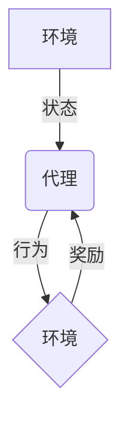

# 强化学习：在直播推荐系统中的应用

## 1. 背景介绍

### 1.1 直播推荐系统的重要性

随着移动互联网和社交媒体的快速发展,直播平台已经成为人们获取信息、娱乐和社交的重要渠道。在直播平台上,用户可以观看各种类型的直播内容,如游戏、户外活动、美食、教育等。为了吸引用户并提高他们的参与度,直播平台需要提供个性化的内容推荐,帮助用户发现感兴趣的直播间。

直播推荐系统的目标是为每个用户推荐最合适的直播间,从而提高用户体验和平台收益。然而,这是一个具有挑战性的任务,因为它需要考虑用户的兴趣、直播内容的多样性以及推荐策略的实时性和动态性。

### 1.2 传统推荐系统的局限性

传统的推荐系统通常基于协同过滤或内容过滤算法,利用用户的历史行为数据(如观看记录、点赞记录等)和内容元数据(如标签、描述等)来预测用户的兴趣。然而,这些方法存在一些局限性:

1. **冷启动问题**: 对于新用户或新直播间,由于缺乏历史数据,传统方法难以做出准确推荐。
2. **动态性不足**: 用户的兴趣和偏好是动态变化的,传统方法难以及时捕捉这种变化。
3. **实时性差**: 传统方法通常基于离线计算,无法及时响应用户的实时行为和直播内容的变化。

为了解决这些问题,强化学习(Reinforcement Learning)被引入直播推荐系统,它能够通过与环境的交互来学习最优策略,动态调整推荐策略以适应用户的实时反馈。

## 2. 核心概念与联系

### 2.1 强化学习基本概念

强化学习是一种基于环境交互的机器学习范式,其目标是通过试错来学习一系列行为,使得在给定环境下获得的长期累积奖励最大化。强化学习包含四个核心元素:

1. **环境(Environment)**: 指代理与之交互的外部世界。
2. **状态(State)**: 描述环境的当前状况。
3. **行为(Action)**: 代理在特定状态下采取的行动。
4. **奖励(Reward)**: 环境对代理行为的反馈,用于指导代理学习。

强化学习的核心思想是通过不断尝试不同的行为,观察环境的反馈(奖励或惩罚),并根据这些反馈调整策略,最终找到一个能够最大化长期累积奖励的最优策略。

### 2.2 强化学习在直播推荐中的应用

在直播推荐系统中,我们可以将推荐过程建模为一个强化学习问题:

- **环境**: 直播平台,包括用户、直播间和推荐系统。
- **状态**: 用户的特征(如年龄、地理位置、兴趣等)、直播间的特征(如类型、标签、热度等)以及推荐历史。
- **行为**: 推荐系统向用户推荐某个直播间。
- **奖励**: 用户对推荐的反馈,如观看时长、点赞、关注等正向反馈,或者关闭直播间等负向反馈。

推荐系统的目标是学习一个策略,在给定状态下选择最佳的行为(推荐哪个直播间),从而最大化长期累积奖励(用户参与度和平台收益)。

通过强化学习,推荐系统可以动态地调整推荐策略,适应用户的实时反馈和直播内容的变化,从而提高推荐的准确性和效果。

## 3. 核心算法原理具体操作步骤

### 3.1 强化学习算法概述

强化学习算法可分为基于价值函数(Value-based)和基于策略(Policy-based)两大类。前者通过估计每个状态或状态-行为对的价值函数来间接获得最优策略,后者直接学习最优策略。

常见的基于价值函数的算法包括Q-Learning、SARSA和Deep Q-Network(DQN)等。基于策略的算法包括策略梯度(Policy Gradient)、Actor-Critic等。此外,还有一些结合了价值函数和策略的算法,如Trust Region Policy Optimization(TRPO)和Proximal Policy Optimization(PPO)等。

在直播推荐系统中,由于状态和行为空间都是连续的,我们通常采用基于策略或Actor-Critic类型的算法。下面将重点介绍PPO算法在直播推荐中的应用。

### 3.2 Proximal Policy Optimization (PPO)算法

PPO是一种高效的策略梯度算法,它通过限制新旧策略之间的差异来确保稳定的策略更新,从而实现了数据高效利用和稳定训练。PPO算法包含两个主要部分:策略网络和价值网络。

1. **策略网络(Actor)**: 输入状态,输出行为的概率分布。
2. **价值网络(Critic)**: 输入状态,估计该状态下的价值函数。

PPO算法的核心思想是在每次策略更新时,通过约束新旧策略之间的差异来防止策略发生剧烈变化,从而实现稳定的训练过程。具体来说,PPO算法采用以下步骤:

1. 收集数据: 使用当前策略在环境中采样一批轨迹(状态、行为、奖励序列)。
2. 计算优势函数(Advantage): 使用蒙特卡罗估计或时序差分(TD)方法计算每个状态-行为对的优势函数,即相对于基线(价值函数)的额外收益。
3. 更新策略网络: 通过最大化以下目标函数来更新策略网络的参数:

$$J(\theta) = \hat{\mathbb{E}}_t \left[ \min\left(r_t(\theta)\hat{A}_t, \clip(r_t(\theta), 1-\epsilon, 1+\epsilon)\hat{A}_t\right) \right]$$

其中:
- $r_t(\theta)$是新旧策略之间的重要性采样比率
- $\hat{A}_t$是估计的优势函数
- $\clip(r_t(\theta), 1-\epsilon, 1+\epsilon)$是一个修剪函数,用于限制新旧策略之间的差异

4. 更新价值网络: 使用回归方法(如均方误差)来更新价值网络的参数,使其能够更好地估计状态价值。
5. 重复步骤1-4,直到策略收敛。

通过上述步骤,PPO算法可以在保证稳定性的同时,有效地学习到一个高质量的策略,从而在直播推荐系统中做出准确的推荐。

## 4. 数学模型和公式详细讲解举例说明

在直播推荐系统中应用强化学习时,我们需要构建数学模型来描述强化学习过程。下面将详细介绍相关的数学模型和公式。

### 4.1 马尔可夫决策过程(MDP)

强化学习问题通常被建模为一个马尔可夫决策过程(Markov Decision Process, MDP)。MDP由一个五元组$(S, A, P, R, \gamma)$组成,其中:

- $S$是状态空间,表示环境的所有可能状态。
- $A$是行为空间,表示代理在每个状态下可以采取的行为。
- $P(s'|s,a)$是状态转移概率,表示在状态$s$下执行行为$a$后,转移到状态$s'$的概率。
- $R(s,a)$是即时奖励函数,表示在状态$s$下执行行为$a$所获得的即时奖励。
- $\gamma \in [0, 1)$是折现因子,用于权衡即时奖励和长期奖励的重要性。

在直播推荐场景中,状态$s$可以包括用户特征、直播间特征和推荐历史等信息;行为$a$是推荐某个直播间;状态转移概率$P(s'|s,a)$表示在推荐了某个直播间后,用户转移到新状态$s'$的概率;即时奖励$R(s,a)$可以是用户对推荐的反馈,如观看时长、点赞等。

### 4.2 价值函数和贝尔曼方程

在强化学习中,我们通常使用价值函数来评估一个策略的好坏。价值函数定义为在当前状态$s$下,按照策略$\pi$执行并获得的长期累积折现奖励的期望值,即:

$$V^\pi(s) = \mathbb{E}_\pi \left[ \sum_{t=0}^\infty \gamma^t R(s_t, a_t) \mid s_0 = s \right]$$

其中,$R(s_t, a_t)$是在时刻$t$执行行为$a_t$获得的即时奖励,$\gamma$是折现因子。

价值函数满足贝尔曼方程:

$$V^\pi(s) = \sum_{a \in A} \pi(a|s) \sum_{s' \in S} P(s'|s,a) \left[ R(s,a) + \gamma V^\pi(s') \right]$$

该方程表示,在状态$s$下执行策略$\pi$的价值函数,等于在该状态下执行所有可能行为$a$的期望,其中每个行为的价值由即时奖励$R(s,a)$和折现后的下一状态价值$\gamma V^\pi(s')$组成。

类似地,我们可以定义状态-行为价值函数$Q^\pi(s,a)$,表示在状态$s$下执行行为$a$,之后按照策略$\pi$执行并获得的长期累积折现奖励的期望值。$Q^\pi(s,a)$满足以下贝尔曼方程:

$$Q^\pi(s,a) = \sum_{s' \in S} P(s'|s,a) \left[ R(s,a) + \gamma \sum_{a' \in A} \pi(a'|s')Q^\pi(s',a') \right]$$

通过估计价值函数或状态-行为价值函数,我们可以间接获得最优策略。

### 4.3 策略梯度

除了基于价值函数的方法,我们还可以直接学习最优策略。策略梯度(Policy Gradient)方法通过最大化期望的长期累积奖励来直接优化策略参数$\theta$:

$$\max_\theta J(\theta) = \max_\theta \mathbb{E}_{\tau \sim \pi_\theta} \left[ \sum_{t=0}^\infty \gamma^t R(s_t, a_t) \right]$$

其中,$\tau = (s_0, a_0, s_1, a_1, \dots)$是一个由状态和行为组成的轨迹序列,服从当前策略$\pi_\theta$的分布。

通过应用链式法则,我们可以得到策略梯度:

$$\nabla_\theta J(\theta) = \mathbb{E}_{\tau \sim \pi_\theta} \left[ \sum_{t=0}^\infty \nabla_\theta \log \pi_\theta(a_t|s_t) Q^{\pi_\theta}(s_t, a_t) \right]$$

上式表明,我们可以通过增大概率$\pi_\theta(a_t|s_t)$来提高期望累积奖励,其中$Q^{\pi_\theta}(s_t, a_t)$是状态-行为价值函数,用于衡量行为$a_t$的质量。

在实践中,我们通常使用重要性采样(Importance Sampling)和基线(Baseline)等技术来减小策略梯度估计的方差,从而提高算法的稳定性和收敛速度。

### 4.4 PPO算法的数学模型

PPO算法是一种基于策略梯度的强化学习算法,它通过约束新旧策略之间的差异来确保稳定的策略更新。PPO算法的目标函数如下:

$$J(\theta) = \hat{\mathbb{E}}_t \left[ \min\left(r_t(\theta)\hat{A}_t, \clip(r_t(\theta), 1-\epsilon, 1+\epsilon)\hat{A}_t\right) \right]$$

其中:

- $r_t(\theta) = \frac{\pi_\theta(a_t|s_t)}{\pi_{\theta_{old}}(a_t|s_t)}$是新旧策略之间的重要性采样比率
- $\hat{A}_t$是估计的优势函数(Advantage),定义为$\hat{A}_t = Q^{\pi_{\theta_{old}}}(s_t, a_t) - V^{\pi_{\theta_{old}}}(s_t)$
- $\clip