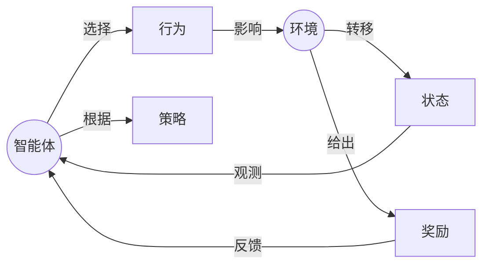

# 强化学习：基础概念解析

## 1.背景介绍

### 1.1 什么是强化学习?

强化学习(Reinforcement Learning,RL)是机器学习的一个重要分支,它研究如何基于环境反馈来学习行为策略,以最大化某种累积奖励。与监督学习不同,强化学习没有提供正确答案的标签数据,而是通过与环境的互动来学习。

强化学习的核心思想是使用一个智能体(Agent)与环境(Environment)进行交互,智能体根据当前状态选择行为,环境会根据这个行为转移到下一个状态,并给出对应的奖励信号。智能体的目标是通过不断尝试,学习到一个在长期能获得最大累积奖励的最优策略。

### 1.2 强化学习的应用场景

强化学习在许多领域有着广泛的应用,例如:

- 机器人控制
- 游戏AI
- 自动驾驶
- 资源管理
- 网络路由
- 股票交易
- ...

任何需要基于环境反馈来优化序列决策的问题,都可以使用强化学习方法来解决。

## 2.核心概念与联系

强化学习涉及以下几个核心概念:

### 2.1 智能体(Agent)

智能体是强化学习系统中的决策主体,它根据当前状态选择行为,以影响环境并获得奖励。

### 2.2 环境(Environment) 

环境是指智能体所处的外部世界,包括所有可观测的状态和智能体的行为所产生的影响。

### 2.3 状态(State)

状态是环境的一个具体情况的描述,通常用一个向量表示。

### 2.4 行为(Action)

行为是智能体在当前状态下可以采取的动作,会导致环境转移到下一个状态。

### 2.5 奖励(Reward)

奖励是环境对智能体当前行为的评价反馈,可以是正值(获得奖励)、负值(受到惩罚)或0(中性)。

### 2.6 策略(Policy)

策略是智能体在每个状态下选择行为的规则或映射函数,是强化学习要学习优化的最终目标。

这些概念之间的关系如下:



智能体根据策略在当前状态选择行为,行为会影响环境并使环境转移到下一状态,环境会给出对应的奖励反馈给智能体。智能体的目标是学习到一个最优策略,使长期累积奖励最大化。

## 3.核心算法原理具体操作步骤

强化学习算法的核心思想是让智能体通过不断与环境交互,从经验中学习到一个最优策略。主要分为以下几个步骤:

### 3.1 初始化

1. 定义状态空间、行为空间和奖励函数
2. 初始化策略,通常使用随机策略或特定启发式策略

### 3.2 交互环节

对于每个时间步:

1. 智能体根据当前状态和策略选择行为
2. 环境根据行为转移到下一状态,并给出对应奖励
3. 智能体观测到新状态和奖励

### 3.3 策略评估

根据经验更新对当前策略的评估,例如使用时间差分(TD)学习计算状态值函数。

### 3.4 策略改进

基于策略评估的结果,对策略进行改进,使其朝着最优策略的方向调整。常用方法有:

- 价值迭代(Value Iteration)
- 策略迭代(Policy Iteration)
- 深度Q网络(DQN)等

### 3.5 重复交互-评估-改进

重复3.2-3.4步骤,直到策略收敛或满足终止条件。

以上是强化学习算法的一般工作流程,不同算法在具体实现细节上会有所不同。

## 4.数学模型和公式详细讲解举例说明

### 4.1 马尔可夫决策过程(MDP)

强化学习问题通常建模为马尔可夫决策过程(Markov Decision Process, MDP),它是一个离散时间随机控制过程,可以用五元组 $(S, A, P, R, \gamma)$ 来表示:

- $S$ 是有限状态集合
- $A$ 是有限行为集合
- $P(s' | s, a)$ 是状态转移概率,表示在状态 $s$ 执行行为 $a$ 后,转移到状态 $s'$ 的概率
- $R(s, a, s')$ 是奖励函数,表示在状态 $s$ 执行行为 $a$ 后转移到状态 $s'$ 时获得的奖励
- $\gamma \in [0, 1)$ 是折现因子,用于权衡未来奖励的重要性

在 MDP 中,智能体的目标是找到一个策略 $\pi: S \rightarrow A$,使期望的累积折现奖励最大化:

$$J(\pi) = \mathbb{E}_\pi \left[ \sum_{t=0}^\infty \gamma^t R(s_t, a_t, s_{t+1}) \right]$$

其中 $s_t, a_t$ 分别表示在时间步 $t$ 的状态和行为。

### 4.2 值函数和Bellman方程

为了评估一个策略的好坏,我们引入状态值函数 $V^\pi(s)$ 和行为值函数 $Q^\pi(s, a)$:

$$V^\pi(s) = \mathbb{E}_\pi \left[ \sum_{t=0}^\infty \gamma^t R(s_t, a_t, s_{t+1}) | s_0 = s \right]$$

$$Q^\pi(s, a) = \mathbb{E}_\pi \left[ \sum_{t=0}^\infty \gamma^t R(s_t, a_t, s_{t+1}) | s_0 = s, a_0 = a \right]$$

$V^\pi(s)$ 表示在状态 $s$ 下,执行策略 $\pi$ 可获得的期望累积奖励。$Q^\pi(s, a)$ 表示在状态 $s$ 下执行行为 $a$,之后再执行策略 $\pi$ 可获得的期望累积奖励。

状态值函数和行为值函数满足著名的Bellman方程:

$$V^\pi(s) = \sum_{a \in A} \pi(a|s) \sum_{s' \in S} P(s'|s, a) \left[ R(s, a, s') + \gamma V^\pi(s') \right]$$

$$Q^\pi(s, a) = \sum_{s' \in S} P(s'|s, a) \left[ R(s, a, s') + \gamma \sum_{a' \in A} \pi(a'|s') Q^\pi(s', a') \right]$$

这些方程揭示了当前状态值函数(或行为值函数)与下一状态的值函数之间的递推关系,为求解值函数提供了理论基础。

### 4.3 最优值函数和最优策略

我们定义最优状态值函数 $V^*(s)$ 和最优行为值函数 $Q^*(s, a)$ 为所有策略中的最大值函数:

$$V^*(s) = \max_\pi V^\pi(s)$$

$$Q^*(s, a) = \max_\pi Q^\pi(s, a)$$

对应的最优策略 $\pi^*$ 满足:

$$\pi^*(s) = \arg\max_a Q^*(s, a)$$

也就是说,在每个状态下,最优策略选择能使期望累积奖励最大化的行为。

最优值函数同样满足Bellman最优性方程:

$$V^*(s) = \max_a \sum_{s' \in S} P(s'|s, a) \left[ R(s, a, s') + \gamma V^*(s') \right]$$

$$Q^*(s, a) = \sum_{s' \in S} P(s'|s, a) \left[ R(s, a, s') + \gamma \max_{a'} Q^*(s', a') \right]$$

这些方程为求解最优值函数和最优策略提供了理论基础。

## 5.项目实践:代码实例和详细解释说明

为了更好地理解强化学习的原理和实现,我们以一个简单的格子世界(GridWorld)为例,用Python编写一个基于Q-Learning的强化学习代理。

### 5.1 问题描述

考虑一个4x4的格子世界,其中有一个起点(绿色)、一个终点(红色)和两个障碍物(黑色方块)。智能体的目标是从起点到达终点,同时避免撞到障碍物。每一步行动都会获得-1的奖励,到达终点获得+10的奖励,撞到障碍物获得-10的惩罚。

```python
import numpy as np
import matplotlib.pyplot as plt

# 定义格子世界
world = np.array([
    [0, 0, 0, 1],
    [0, 9, 0, -10],
    [0, 0, 0, 0],
    [10, 0, 0, 0]
])

# 定义行为
actions = ['up', 'down', 'left', 'right']

# 定义奖励
rewards = {
    0: -1,   # 一般情况
    1: -10,  # 撞到障碍物
    9: 10,   # 到达终点
    10: -1   # 起点
}
```

### 5.2 Q-Learning算法实现

我们使用Q-Learning算法来训练智能体,Q-Learning是一种无模型的强化学习算法,它不需要事先知道环境的转移概率和奖励函数,而是通过与环境交互来学习Q值函数。

```python
import random

# 初始化Q值表
Q = np.zeros((world.shape[0], world.shape[1], len(actions)))

# 设置超参数
alpha = 0.1   # 学习率
gamma = 0.9   # 折现因子
epsilon = 0.1 # 探索率

# 定义epsilon-greedy策略
def choose_action(state, epsilon):
    if random.uniform(0, 1) < epsilon:
        # 探索
        return random.choice(actions)
    else:
        # 利用
        return actions[np.argmax(Q[state[0], state[1], :])]

# 定义Q-Learning更新规则
def update_Q(state, action, reward, next_state):
    Q[state[0], state[1], actions.index(action)] += alpha * (
        reward + gamma * np.max(Q[next_state[0], next_state[1], :]) -
        Q[state[0], state[1], actions.index(action)]
    )

# 训练智能体
for episode in range(1000):
    state = (3, 0)  # 起点
    done = False
    
    while not done:
        action = choose_action(state, epsilon)
        row, col = state
        
        # 执行行动
        if action == 'up':
            next_state = (max(row - 1, 0), col)
        elif action == 'down':
            next_state = (min(row + 1, world.shape[0] - 1), col)
        elif action == 'left':
            next_state = (row, max(col - 1, 0))
        else:
            next_state = (row, min(col + 1, world.shape[1] - 1))
        
        # 获取奖励
        reward = rewards[world[next_state[0], next_state[1]]]
        
        # 更新Q值
        update_Q(state, action, reward, next_state)
        
        # 更新状态
        state = next_state
        
        # 检查是否终止
        if world[state[0], state[1]] in [1, 9]:
            done = True

# 可视化Q值表
plt.figure(figsize=(8, 6))
for i in range(world.shape[0]):
    for j in range(world.shape[1]):
        if world[i, j] == 1:
            plt.gca().add_patch(plt.Rectangle((j-0.5, i-0.5), 1, 1, facecolor='black'))
        elif world[i, j] == 9:
            plt.gca().add_patch(plt.Rectangle((j-0.5, i-0.5), 1, 1, facecolor='red'))
        elif world[i, j] == 10:
            plt.gca().add_patch(plt.Rectangle((j-0.5, i-0.5), 1, 1, facecolor='green'))
        else:
            q_values = Q[i, j, :]
            plt.text(j, i, f"{np.round(q_values, 2)}", ha="center", va="center", fontsize=10)
plt.xticks([])
plt.yticks([])
plt.show()
```

在这个例子中,我们首先初始化Q值表,并设置相关超参数。然后定义了epsilon-greedy策略和Q-Learning更新规则。

在训练过程中,我们让智能体从起点开始,根据epsilon-greedy策略选择行动,执行行动后获得奖励并更新Q值表。重复这个过程