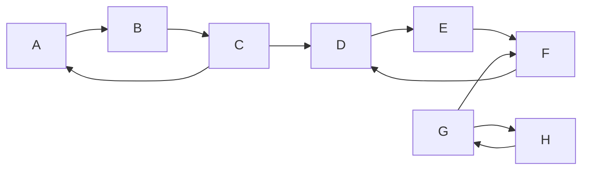

# 强连通分量算法的面试题精讲

## 1.背景介绍
在图论和算法领域中,强连通分量(Strongly Connected Components,简称SCC)是一个重要的概念。它在许多实际应用中都有着广泛的应用,例如社交网络分析、网页排名、程序控制流分析等。作为一名计算机专业的求职者,深入理解并掌握强连通分量算法,对于应对算法面试题、解决实际工程问题都大有裨益。

本文将全面深入地讲解强连通分量的基本概念、经典算法、代码实现以及在面试中的常见问题。通过学习本文,你将收获:

1. 图论基础知识和强连通分量的定义
2. Kosaraju算法和Tarjan算法的原理和实现
3. 强连通分量算法的时间复杂度分析
4. 强连通分量在实际问题中的应用
5. 常见面试题的解题思路和代码

让我们一起开启强连通分量算法的探索之旅吧!

## 2.核心概念与联系

要掌握强连通分量算法,首先需要了解一些图论的基本概念:

### 2.1 有向图和无向图
- 有向图:边有方向,用有序对(u,v)表示
- 无向图:边没有方向,用无序对(u,v)表示

### 2.2 连通性
- 无向图连通:图中任意两点之间都存在一条路径
- 有向图连通:图中任意两点之间都存在一条有向路径

### 2.3 强连通
有向图G=(V,E)中,如果对于每一对顶点u,v∈V,都存在一条从u到v和从v到u的有向路径,则称G是强连通图。

### 2.4 强连通分量
有向图G的一个强连通分量是G的一个极大强连通子图。

换句话说,将图中所有强连通的顶点划分在一起,每一组就是一个强连通分量。下图展示了一个有向图及其强连通分量:



该图共有3个强连通分量:{A,B,C},{D,E,F},{G,H}。

## 3.核心算法原理具体操作步骤

常用求解强连通分量的算法有两种:Kosaraju算法和Tarjan算法。下面详细讲解它们的原理和步骤。

### 3.1 Kosaraju算法

Kosaraju算法分为三个步骤:

1. 对原图G进行DFS遍历,并记录每个节点的完成时间f[u]
2. 构造图G的转置图G^T
3. 按照f[u]从大到小的顺序对G^T进行DFS遍历,每一次DFS遍历到的节点集合就是一个强连通分量

具体操作:
1. 对原图DFS,记录完成时间:
```
DFS(G)
    visited[u] = true
    for v in G[u] 
        if visited[v] == false
            DFS(v)
    f[u] = ++time
```

2. 构造转置图:
```
for (u,v) in G
    add (v,u) to G^T
```

3. 按f[]从大到小对G^T DFS:
```
DFS(G^T)
    visited[u] = true 
    print(u)
    for v in G^T[u]
        if visited[v] == false
            DFS(v)
```

Kosaraju算法时间复杂度为O(V+E),空间复杂度为O(V)。

### 3.2 Tarjan算法

Tarjan算法只需对原图进行一次DFS遍历,在DFS过程中用栈维护节点,并记录每个节点的DFS序号和Low值。Low值表示从该节点出发,经过一些树边和至多一条反向边,所能到达的最小DFS序号。

当一个节点u的Low值等于其DFS序号时,以u为根的子树上所有节点构成一个强连通分量。

具体步骤:
```
Tarjan(u)
    dfn[u] = low[u] = ++time
    stack.push(u)
    instack[u] = true
    
    for v in G[u]
        if dfn[v] == 0
            Tarjan(v)
            low[u] = min(low[u], low[v])
        else if instack[v] == true
            low[u] = min(low[u], dfn[v])
            
    if dfn[u] == low[u]
        repeat:
            v = stack.pop()
            instack[v] = false
            print(v)
        until v == u
```

Tarjan算法时间复杂度为O(V+E),空间复杂度为O(V)。

## 4.数学模型和公式详细讲解举例说明

为了更好地理解强连通分量,我们可以用数学语言来刻画它。设有向图 $G=(V,E)$,定义关系 $R$ 如下:

$$
uRv \Leftrightarrow 存在一条从u到v的有向路径
$$

可以证明,关系 $R$ 是 $V$ 上的一个等价关系,即满足:
1. 自反性: $\forall u \in V, uRu$
2. 对称性: $\forall u,v \in V, uRv \Rightarrow vRu$
3. 传递性: $\forall u,v,w \in V, uRv \wedge vRw \Rightarrow uRw$

$V$ 在 $R$ 关系下的等价类,就对应着图 $G$ 的强连通分量。

举例来说,对于下图:


关系 $R$ 将顶点集合划分为了三个等价类:{A,B,C},{D,E,F},{G,H},它们恰好就是图的三个强连通分量。

## 5.项目实践:代码实例和详细解释说明

下面给出C++代码实现Kosaraju算法和Tarjan算法求解强连通分量。

### 5.1 Kosaraju算法

```cpp
const int MAXN = 1e5 + 5;
vector<int> G[MAXN], GT[MAXN];
bool vis[MAXN];
int f[MAXN], scc[MAXN], tim, sc;

void dfs1(int u) {
    vis[u] = true;
    for (int v : G[u]) {
        if (!vis[v]) dfs1(v);
    }
    f[tim++] = u;
}

void dfs2(int u) {
    vis[u] = true;
    scc[u] = sc;
    for (int v : GT[u]) {
        if (!vis[v]) dfs2(v);
    }
}

void kosaraju(int n) {
    tim = 0;
    memset(vis, false, sizeof(vis));
    for (int i = 1; i <= n; i++) {
        if (!vis[i]) dfs1(i);
    }
    
    memset(vis, false, sizeof(vis));
    sc = 0;
    for (int i = n - 1; i >= 0; i--) {
        if (!vis[f[i]]) {
            sc++;
            dfs2(f[i]);
        }
    }
}
```

代码解释:
- `G`存储原图,`GT`存储转置图
- `dfs1`对原图DFS,记录完成时间到`f`数组
- `dfs2`对转置图按`f`从大到小DFS,同一个强连通分量的点会被标记相同的`sc`号
- `kosaraju`函数先调用`dfs1`,然后调用`dfs2`,求出所有的强连通分量

### 5.2 Tarjan算法

```cpp
const int MAXN = 1e5 + 5;
vector<int> G[MAXN];
int dfn[MAXN], low[MAXN], tim, sc;
bool ins[MAXN];
stack<int> st;

void tarjan(int u) {
    dfn[u] = low[u] = ++tim;
    st.push(u); ins[u] = true;
    
    for (int v : G[u]) {
        if (!dfn[v]) {
            tarjan(v);
            low[u] = min(low[u], low[v]);
        } else if (ins[v]) {
            low[u] = min(low[u], dfn[v]);
        }
    }
    
    if (dfn[u] == low[u]) {
        sc++;
        int v;
        do {
            v = st.top(); st.pop();
            ins[v] = false;
            // v belongs to the sc-th SCC
        } while (v != u);
    }
}

void solve(int n) {
    tim = sc = 0;
    memset(dfn, 0, sizeof(dfn));
    for (int i = 1; i <= n; i++) {
        if (!dfn[i]) tarjan(i);
    }
}
```

代码解释:
- `G`存储有向图
- `dfn`存储节点的DFS序,`low`存储节点的Low值
- `ins`标记节点是否在栈中
- `tarjan`函数实现Tarjan算法,当`dfn[u]==low[u]`时,栈中所有节点构成一个强连通分量
- `solve`函数初始化并调用`tarjan`,求出所有强连通分量

## 6.实际应用场景

强连通分量在很多实际问题中都有应用,下面列举几个常见的场景:

### 6.1 有向图缩点
利用强连通分量,可以将一个有向图缩点成一个DAG(有向无环图)。将每个强连通分量缩成一个点,然后保留分量之间的边,最后得到的就是一个DAG。

### 6.2 社交网络分析
在社交网络中,可以将用户之间的关注关系看作一个有向图。利用强连通分量算法,可以找出紧密联系的用户群体,这对于社区发现、社交网络演化分析等都有重要意义。

### 6.3 网页排名
Google的PageRank算法就利用了强连通分量的思想。将网页之间的链接关系看作有向图,先求出所有的强连通分量,然后在分量内部进行PageRank计算,可以加速收敛并提高排名效果。

### 6.4 程序控制流分析
将程序代码转化为控制流图,利用强连通分量可以找出程序的循环结构。这对于编译优化、程序理解都很有帮助。

### 6.5 逻辑电路设计
在逻辑电路设计中,利用强连通分量可以找出电路中的反馈回路,这对于分析电路的稳定性、振荡特性等很有帮助。

## 7.工具和资源推荐

对于强连通分量算法的学习和应用,这里推荐一些工具和资源:

1. 可视化工具:
- [VisuAlgo - Strongly Connected Components](https://visualgo.net/en/scc):在线演示Kosaraju和Tarjan算法的可视化工具
- [Graph Editor](https://csacademy.com/app/graph_editor/):在线图编辑器,可以编辑有向图并高亮强连通分量

2. OJ题库:
- [Leetcode - 强连通分量相关题目](https://leetcode.com/tag/strongly-connected-component/)
- [SPOJ - Strongly Connected Components](https://www.spoj.com/problems/tag/strongly-connected-components)
- [Codeforces - 图论与树相关题目](https://codeforces.com/problemset?tags=graphs,dfs+and+similar,trees)

3. 书籍教材:
- 算法导论(第三版) / (美)Thomas H.Cormen等 著
- 数据结构与算法分析——C语言描述 / (美)Mark Allen Weiss 著
- 图论及其算法 / 刘家骏 著

通过学习这些资源,可以深入理解强连通分量算法的原理,并锻炼实际的编程应用能力。

## 8.总结:未来发展趋势与挑战

强连通分量算法经过几十年的发展,已经相对成熟和完善。Kosaraju算法和Tarjan算法都是线性时间复杂度,在理论和工程上都得到了广泛应用。

未来,强连通分量算法在以下几个方面还有待进一步的研究和拓展:

1. 外存算法:对于超大规模的图,内存已经无法完全存储,需要设计高效的外存算法。目前已有一些针对强连通分量的外存算法,但性能还有待进一步提高。

2. 动态算法:很多实际图都是动态变化的,如何在图的动态更新过程中,快速维护强连通分量,是一个值得研究的问题。

3. 近似算法:对于某些实时性要求很高的应用场景,线性时间仍然不够快,需要设计近似算法,在牺牲一定精度的情况下换取更高的速度。

4. 并行算法:利用多核CPU、GPU等并行计算资源,设计并行化的强连通分量算法,进一步提高求解效率。

5. 领域融合:将强