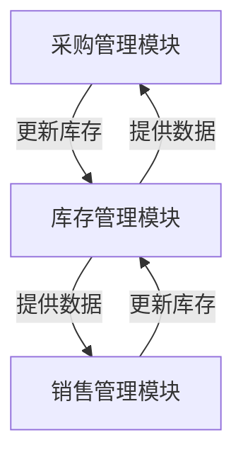
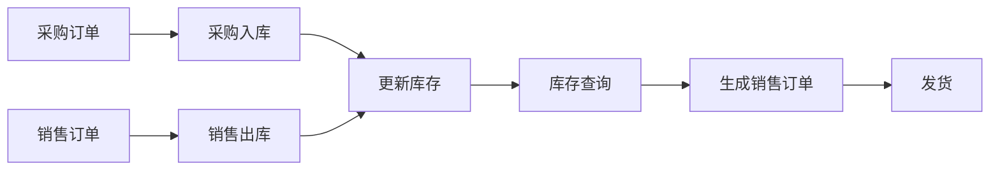

# 微信小程序微商进销存库存仓库管理系统

## 1.背景介绍

随着移动互联网和电子商务的快速发展,微商经营模式已经成为了一种新兴的商业形态。微商是指利用社交网络、即时通讯工具等渠道进行商品买卖和推广营销的一种电子商务经营模式。与传统电商不同,微商更注重人与人之间的社交关系,通过熟人社交圈层进行商品推广和销售。

对于微商来说,高效的库存管理至关重要。合理的库存管理不仅可以减少资金占用,还能提高订单处理效率,从而提升客户满意度。然而,对于大多数个体微商而言,传统的库存管理系统往往成本高昂且使用复杂。因此,一款简单实用、成本低廉的微商进销存库存管理系统就显得尤为必要。

微信小程序作为一种全新的移动应用形式,具有开发成本低、无需安装、可跨平台运行等优势,非常适合满足微商的库存管理需求。本文将介绍如何基于微信小程序开发一个微商进销存库存管理系统。

## 2.核心概念与联系

在深入探讨系统细节之前,我们有必要先了解一些核心概念:

### 2.1 微信小程序

微信小程序是一种无需下载安装即可使用的开放式小型应用。它基于微信官方提供的开发工具和接口,可以在微信内被便捷地获取和传播。小程序具有体积小、无需安装、触手可及的特点,非常适合用于构建一些简单实用的工具。

### 2.2 进销存管理

进销存管理是指对商品采购、销售和库存的全过程进行计划、组织、指导和控制,以实现商品有效流通的一种管理方式。它包括采购计划、销售计划、库存控制等多个环节。良好的进销存管理有助于降低运营成本、提高资金使用效率。

### 2.3 库存管理

库存管理是进销存管理的核心组成部分,专门负责商品库存的计划、实施和控制。它涉及库存商品的种类、数量、库存地点等多方面内容,旨在实现库存的合理化和优化。

### 2.4 微商

微商是一种新型的电子商务营销模式。微商利用社交网络、即时通讯等渠道,通过线上线下相结合的方式开展商品营销和销售。与传统电商相比,微商更加注重人际关系网络的维护和发展。

上述概念相互关联、环环相扣。微信小程序为微商提供了低成本、高效率的进销存管理工具,而合理的库存管理则是微商经营的重中之重。我们需要将这些概念有机结合,设计出一款切实可行的微商进销存库存管理系统。

## 3.核心算法原理具体操作步骤

### 3.1 系统架构

整个微商进销存库存管理系统可以分为三个主要模块:采购管理、销售管理和库存管理。其中,库存管理模块是系统的核心,与采购和销售模块紧密相连。系统架构如下图所示:



### 3.2 采购管理

采购管理模块主要负责供应商管理、采购计划制定、采购订单处理等工作。

1. **供应商管理**:维护供应商信息,包括供应商名称、联系方式、供货产品等。
2. **采购计划制定**:根据历史销售数据、市场预测等信息,制定采购计划,确定采购数量。
3. **采购订单处理**:向供应商下达采购订单,跟踪订单状态,验收入库。
4. **采购数据统计**:统计采购金额、采购频率等数据,为决策提供支持。

### 3.3 销售管理  

销售管理模块主要负责客户管理、销售订单处理、发货跟踪等工作。

1. **客户管理**:维护客户信息,包括客户姓名、联系方式、常购产品等。
2. **销售订单处理**:接收客户订单,进行库存查询,生成销售订单。
3. **发货跟踪**:将订单发往物流公司,跟踪订单发货状态。
4. **销售数据统计**:统计销售金额、销量、退货率等数据。

### 3.4 库存管理

库存管理模块是整个系统的核心,负责实时监控和维护库存数据。

1. **初始化库存**:录入商品信息,设置库存初始值。
2. **实时库存更新**:根据采购入库和销售出库情况,实时更新库存数据。
3. **库存查询**:支持按商品名称、类别等条件查询库存情况。
4. **库存预警**:当库存达到设定阈值时,发出预警提醒,方便及时补货。
5. **库存盘点**:定期或不定期进行实际库存盘点,与系统库存数据核对。
6. **库存报表**:生成多维度库存报表,如商品库存报表、库存金额报表等。

### 3.5 数据流程

上述三个模块相互协作、环环相扣,构成了系统的核心数据流程:



该流程体现了采购、销售和库存管理模块的紧密联系:

1. 采购订单入库后,需实时更新库存数据。
2. 当收到销售订单时,需先查询库存,确保库存充足。
3. 生成销售订单后,需从库存中扣减相应数量。
4. 发货完成后,再次更新库存数据。

通过高效的数据流转,确保整个系统始终维护着准确的库存信息。

## 4.数学模型和公式详细讲解举例说明

在库存管理中,我们需要建立一些数学模型来量化分析库存水平,从而制定合理的库存策略。常用的数学模型包括经济订货量模型(EOQ)、ABC分类模型等。

### 4.1 经济订货量模型(EOQ)

经济订货量模型试图找到在订货成本和库存成本之间的最佳平衡点,以最小化总成本。该模型的核心公式如下:

$$EOQ = \sqrt{\frac{2DC_o}{C_c}}$$

其中:
- $EOQ$表示经济订货量
- $D$表示年度需求量
- $C_o$表示每次订货的成本
- $C_c$表示每单位商品的库存成本

比如,某商品年度需求量为1000件,每次订货成本为50元,每件商品的库存成本为2元,则经济订货量为:

$$EOQ = \sqrt{\frac{2 \times 1000 \times 50}{2}} = 100 (件)$$

也就是说,最优的订货量是100件。过多或过少的订货量都会增加总成本。

### 4.2 ABC分类模型

ABC分类模型是根据商品的重要程度和存货价值,将商品分为A、B、C三类,以采取差异化的库存管理策略。

1. A类商品:占存货价值比重较大(如80%)的少数商品,应采取严格的库存控制。
2. B类商品:价值居中(如15%)的一般商品,可采取一般的库存管理。
3. C类商品:价值较低(如5%)的大量商品,可放宽库存管控。

假设一家企业有1000种商品,其中:

- A类商品200种,平均单价100元
- B类商品300种,平均单价50元  
- C类商品500种,平均单价10元

则各类商品的存货价值占比为:

$$
\begin{aligned}
A &= \frac{200 \times 100}{200 \times 100 + 300 \times 50 + 500 \times 10} \approx 80\% \\
B &= \frac{300 \times 50}{200 \times 100 + 300 \times 50 + 500 \times 10} \approx 15\% \\
C &= \frac{500 \times 10}{200 \times 100 + 300 \times 50 + 500 \times 10} \approx 5\%
\end{aligned}
$$

因此,企业可根据ABC分类原则,对A类商品实施严格库存控制,对B类商品采取常规管理,对C类商品适当放宽管理。

通过建立并运用这些数学模型,企业能够更加科学、高效地管理库存,从而降低成本、提高效率。

## 5.项目实践:代码实例和详细解释说明

接下来,我们通过实际的代码示例,展示如何在微信小程序中实现微商进销存库存管理系统。

### 5.1 数据库设计

我们使用微信小程序提供的云开发能力,在云环境中创建数据库。数据库主要包含以下几个集合(表):

- products: 存储商品信息
- suppliers: 存储供应商信息 
- customers: 存储客户信息
- purchase_orders: 存储采购订单
- sales_orders: 存储销售订单
- inventory: 存储实时库存数据

其中,`inventory`集合是核心,它的数据结构如下:

```javascript
{
  _id: 'xxx',     // 记录ID
  product_id: '...', // 商品ID
  name: '...', // 商品名称
  quantity: 100, // 库存数量
  ...
}
```

### 5.2 采购管理模块

#### 5.2.1 供应商管理

我们先来看供应商管理的实现:

```html
<!-- supplier.wxml -->
<view>
  <view wx:for="{{suppliers}}" wx:key="id">
    <text>{{item.name}}</text>
    <text>{{item.contact}}</text>
    <text>{{item.products}}</text>
  </view>
</view>
```

```javascript
// supplier.js
Page({
  data: {
    suppliers: []
  },

  onLoad() {
    this.getSuppliers()
  },

  getSuppliers() {
    const db = wx.cloud.database()
    db.collection('suppliers')
      .get()
      .then(res => {
        this.setData({
          suppliers: res.data
        })
      })
  }
})
```

这里我们从`suppliers`集合中读取供应商数据,并在页面上列出供应商名称、联系方式和供货产品。

#### 5.2.2 采购订单处理

接下来是采购订单处理的实现:

```html
<!-- purchase.wxml -->
<view>
  <picker bindchange="bindSupplierChange" range="{{suppliers}}">
    选择供应商
  </picker>
  
  <picker bindchange="bindProductChange" range="{{products}}">
    选择商品
  </picker>
  
  <input placeholder="输入采购数量" bindinput="bindQuantityChange"/>
  
  <button bindtap="submitOrder">提交采购订单</button>
</view>
```

```javascript
// purchase.js
Page({
  ...
  
  bindSupplierChange(e) {
    this.setData({
      supplierId: this.data.suppliers[e.detail.value]._id
    })
  },
  
  bindProductChange(e) {  
    this.setData({
      productId: this.data.products[e.detail.value]._id
    })
  },
  
  bindQuantityChange(e) {
    this.setData({
      quantity: e.detail.value
    })
  },
  
  submitOrder() {
    const db = wx.cloud.database()
    db.collection('purchase_orders').add({
      data: {
        supplier_id: this.data.supplierId,
        product_id: this.data.productId,
        quantity: this.data.quantity,
        status: 'pending'
      }
    })
    .then(res => {
      wx.showToast({
        title: '采购订单已提交'
      })
    })
  }
})
```

在这个页面中,用户可以选择供应商、商品及采购数量,然后提交采购订单。我们将订单数据存储在`purchase_orders`集合中,初始状态为`pending`(待处理)。

当采购订单到货并入库后,我们需要将订单状态更新为`received`,同时更新库存数据:

```javascript
// receive.js
Page({
  receiveOrder(e) {
    const db = wx.cloud.database()
    const order_id = e.currentTarget.dataset.id
    
    // 更新采购订单状态
    db.collection('purchase_orders')
      .doc(order_id)
      .update({
        data: {
          status: 'received'
        }
      })
    
    // 获取订单详情