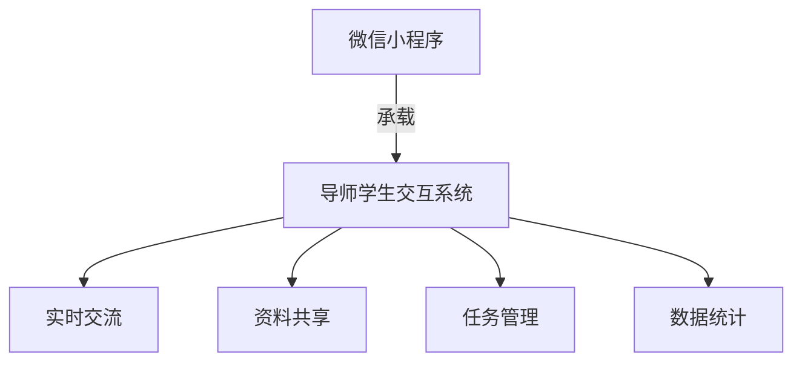
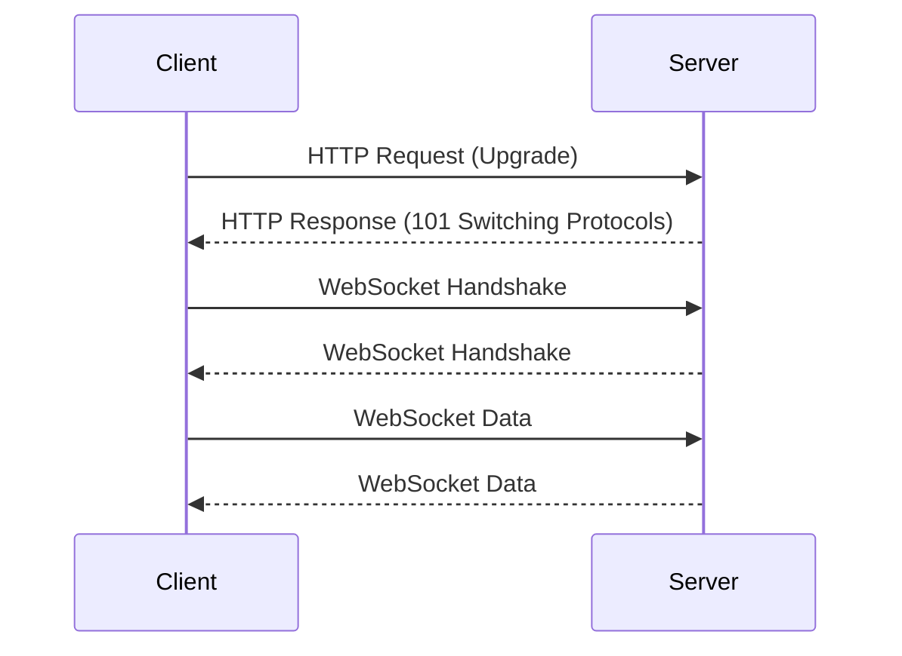
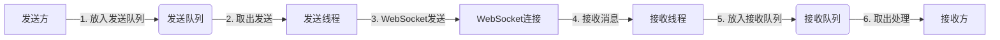
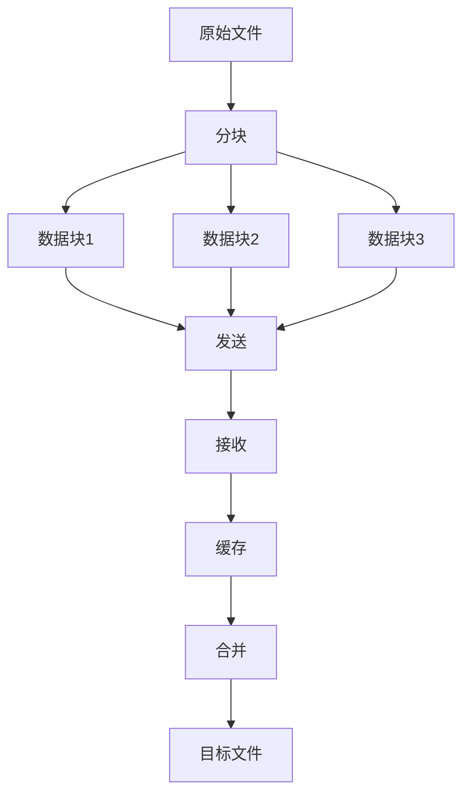
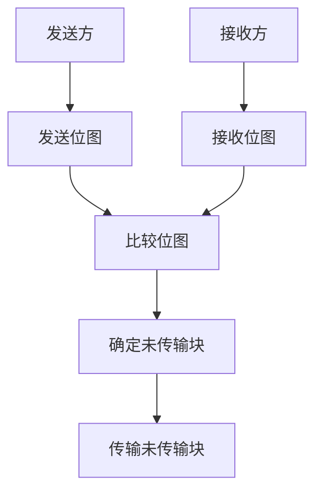
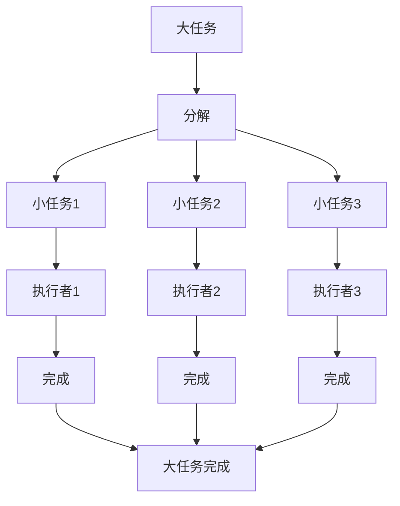
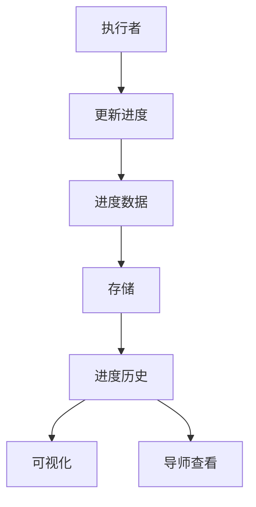

# 微信小程序研究生导师日常交互系统

## 1.背景介绍

随着移动互联网时代的到来,微信小程序作为一种全新的移动应用形式,逐渐受到广泛关注。在高等教育领域,研究生导师与学生之间的日常交互和沟通是非常重要的。然而,传统的线下交互方式存在时间和空间的限制,而线上交互则缺乏高效便捷的渠道。因此,开发一款专门面向研究生导师和学生的微信小程序,可以有效解决这一痛点。

### 1.1 现状分析

目前,高校中研究生与导师的交流主要依赖以下几种方式:

- 面对面交流:这种方式虽然直接有效,但受时间和地点的限制,灵活性较差。
- 电子邮件:不够及时,且容易被忽视。
- 即时通讯工具:功能单一,缺乏系统性。

这些传统方式都存在一定缺陷,无法满足高效便捷的交互需求。

### 1.2 需求分析 

研究生导师日常交互系统的主要需求包括:

- 实时交流:支持导师和学生之间的即时消息、语音和视频交流。
- 资料共享:导师可以发布通知、分享文件等资料。
- 任务管理:导师分配任务,学生及时反馈进度。
- 数据统计:统计师生交互数据,为教学研究提供支持。

## 2.核心概念与联系

### 2.1 微信小程序

微信小程序是一种全新的连接用户与服务的方式,可以在微信内被便捷地获取和传播,同时具有出色的体验。它介于传统网页和APP之间,可以充分利用微信庞大的用户群体。

### 2.2 导师学生交互系统

导师学生交互系统是指专门为研究生导师和学生设计的,支持多种交互形式的综合性平台。它的核心目标是提高师生交流的效率,促进科研协作,并为教学管理提供数据支持。

### 2.3 关系联系

微信小程序作为一种轻量级的应用形式,非常适合承载研究生导师学生交互系统。通过将交互系统构建为微信小程序,可以充分利用微信生态,获得更好的用户体验和传播效果。



## 3.核心算法原理具体操作步骤

### 3.1 实时通信算法

#### 3.1.1 WebSocket协议

WebSocket协议是实现实时通信的关键,它可以在客户端和服务器之间建立持久连接,实现双向通信。其工作原理如下:



1. 客户端发送HTTP请求,请求升级协议为WebSocket协议。
2. 服务器返回状态码101,表示协议切换成功。
3. 客户端和服务器进行WebSocket握手,建立连接。
4. 双方可以通过WebSocket连接进行实时数据传输。

#### 3.1.2 消息队列

为了保证消息的可靠传递,可以引入消息队列机制。具体步骤如下:

1. 发送方将消息放入发送队列。
2. 发送线程从发送队列取出消息,通过WebSocket发送。
3. 接收方收到消息后,放入接收队列。
4. 接收线程从接收队列取出消息,进行处理。



### 3.2 文件传输算法

#### 3.2.1 分块传输

为了提高传输效率,可以将大文件分块传输。具体步骤如下:

1. 发送方将文件分割为固定大小的数据块。
2. 发送方按顺序发送每个数据块。
3. 接收方接收数据块,并将其缓存到临时文件中。
4. 全部数据块传输完毕后,接收方将临时文件合并为原始文件。



#### 3.2.2 断点续传

为了解决传输中断的问题,可以引入断点续传机制。具体步骤如下:

1. 发送方维护一个已发送数据块的位图。
2. 接收方维护一个已接收数据块的位图。
3. 传输中断后,双方交换位图,确定未传输的数据块。
4. 发送方只需传输未传输的数据块即可。



### 3.3 任务管理算法

#### 3.3.1 任务分解

为了更好地管理任务,可以将大任务分解为多个小任务。具体步骤如下:

1. 导师创建一个大任务。
2. 导师将大任务分解为多个小任务,并指定执行者。
3. 学生按照分配的小任务执行。
4. 所有小任务完成后,大任务即完成。



#### 3.3.2 任务跟踪

为了掌握任务进度,可以引入任务跟踪机制。具体步骤如下:

1. 执行者定期更新任务进度。
2. 系统记录每个任务的进度变化历史。
3. 导师可以查看任务进度,了解执行情况。
4. 系统可以根据进度数据生成可视化报告。



## 4.数学模型和公式详细讲解举例说明

### 4.1 实时通信时延模型

实时通信系统的关键指标之一是时延,即消息从发送到接收所需的时间。我们可以建立一个简化的时延模型:

$$
T_{total} = T_{send} + T_{network} + T_{receive}
$$

其中:

- $T_{total}$ 表示总时延
- $T_{send}$ 表示发送延迟,包括消息入队和发送线程处理的时间
- $T_{network}$ 表示网络传输延迟
- $T_{receive}$ 表示接收延迟,包括接收线程处理和消息出队的时间

在实际系统中,我们可以通过优化算法、提高硬件性能等方式,尽量降低 $T_{send}$ 和 $T_{receive}$,从而减小总时延。

### 4.2 文件传输吞吐量模型

文件传输的另一个关键指标是吞吐量,即单位时间内传输的数据量。我们可以建立一个简化的吞吐量模型:

$$
B = \frac{S}{T_{transfer}}
$$

其中:

- $B$ 表示吞吐量,单位为bps(bits per second)
- $S$ 表示文件大小,单位为bit
- $T_{transfer}$ 表示传输时间,单位为秒

为了提高吞吐量,我们可以采用分块传输、压缩等技术,减小 $T_{transfer}$,从而增大 $B$。

### 4.3 任务管理效率模型

任务管理系统的一个重要目标是提高工作效率。我们可以建立一个简化的效率模型:

$$
E = \frac{T_{task}}{T_{total}}
$$

其中:

- $E$ 表示效率
- $T_{task}$ 表示实际用于任务执行的时间
- $T_{total}$ 表示总时间,包括任务执行、沟通协调等

我们可以通过优化流程、提高自动化程度等方式,尽量增大 $T_{task}$,从而提高效率 $E$。

## 5.项目实践：代码实例和详细解释说明

### 5.1 实时通信模块

实时通信模块的核心是 WebSocket 连接和消息队列机制。以下是一个简化的示例代码:

```javascript
// 客户端代码
const socket = new WebSocket('ws://server.com/chat');

// 连接建立后的回调
socket.onopen = () => {
  console.log('WebSocket connection established');
};

// 接收消息的回调
socket.onmessage = (event) => {
  const message = event.data;
  console.log('Received message:', message);
};

// 发送消息
const sendMessage = (message) => {
  socket.send(message);
};

// 服务器端代码
const WebSocket = require('ws');
const wss = new WebSocket.Server({ port: 8080 });

// 新连接建立的回调
wss.on('connection', (ws) => {
  console.log('New WebSocket connection');

  // 接收消息的回调
  ws.on('message', (message) => {
    console.log('Received message:', message);
    // 广播消息给所有连接
    wss.clients.forEach((client) => {
      if (client !== ws && client.readyState === WebSocket.OPEN) {
        client.send(message);
      }
    });
  });
});
```

在这个示例中,客户端通过 `new WebSocket()` 建立 WebSocket 连接,并设置相应的回调函数处理连接建立、接收消息等事件。服务器端使用 `ws` 库创建 WebSocket 服务器,并在新连接建立时设置相应的回调函数,处理接收到的消息并广播给所有连接。

### 5.2 文件传输模块

文件传输模块的核心是分块传输和断点续传算法。以下是一个简化的示例代码:

```javascript
// 客户端代码
const chunkSize = 1024 * 1024; // 1MB

const sendFile = (file, socket) => {
  const fileReader = new FileReader();
  let offset = 0;

  fileReader.onload = (event) => {
    if (event.target.readyState !== FileReader.DONE) {
      return;
    }

    const chunk = event.target.result;
    socket.send(chunk);

    offset += chunk.length;
    if (offset < file.size) {
      readNextChunk();
    } else {
      console.log('File transfer complete');
    }
  };

  const readNextChunk = () => {
    const chunk = file.slice(offset, offset + chunkSize);
    fileReader.readAsArrayBuffer(chunk);
  };

  readNextChunk();
};

// 服务器端代码
const fs = require('fs');
const path = require('path');

const receiveFile = (ws, fileName) => {
  const filePath = path.join(__dirname, 'uploads', fileName);
  const fileStream = fs.createWriteStream(filePath);

  ws.on('message', (chunk) => {
    fileStream.write(Buffer.from(chunk));
  });

  ws.on('close', () => {
    fileStream.end();
    console.log('File transfer complete');
  });
};
```

在这个示例中,客户端使用 `FileReader` API 将文件分块读取,并通过 WebSocket 连接发送每个数据块。服务器端在接收到数据块时,将其写入文件流,最终合并为完整文件。

### 5.3 任务管理模块

任务管理模块的核心是任务分解和任务跟踪算法。以下是一个简化的示例代码:

```javascript
// 任务对象