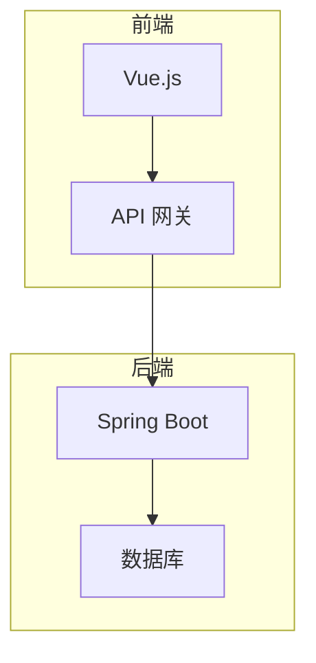
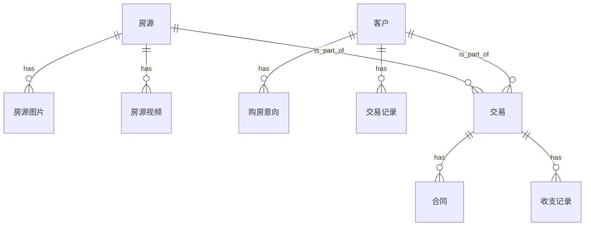
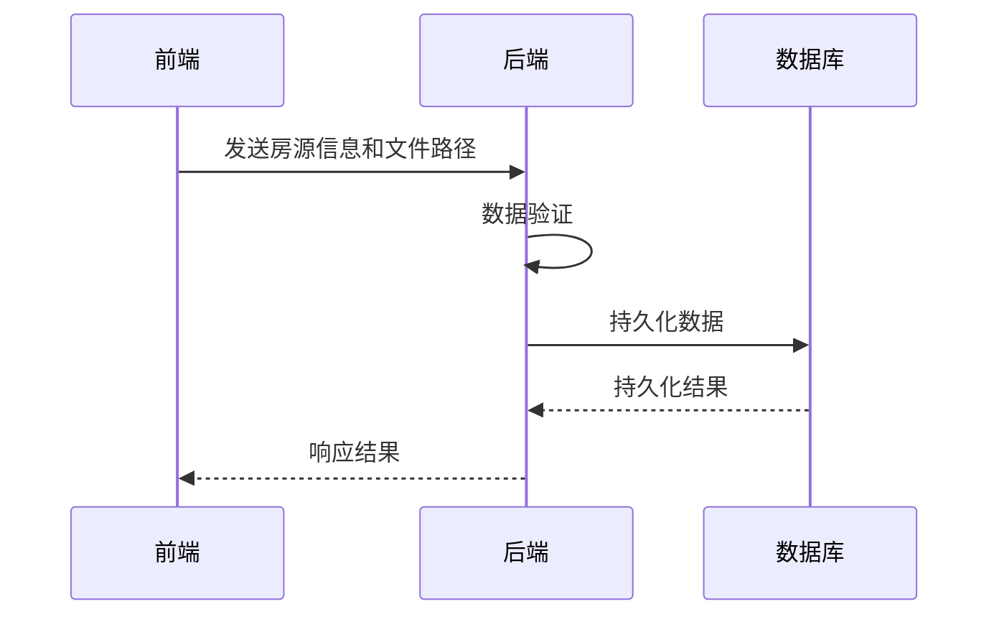
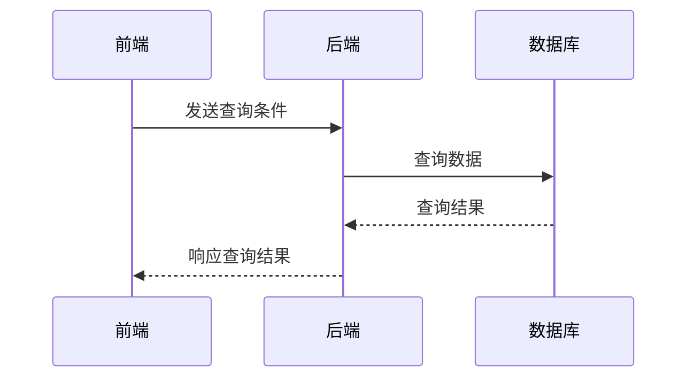
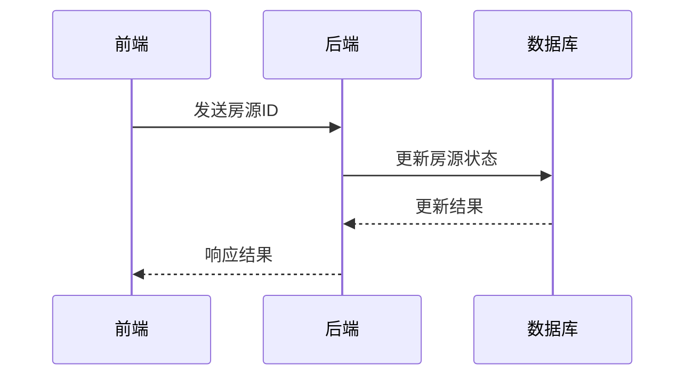
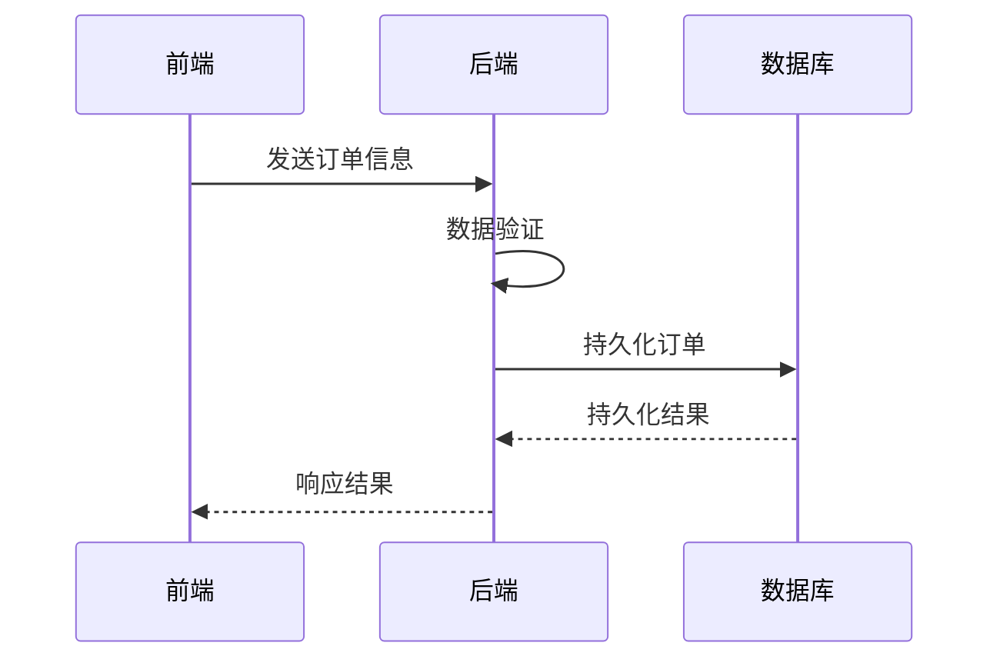
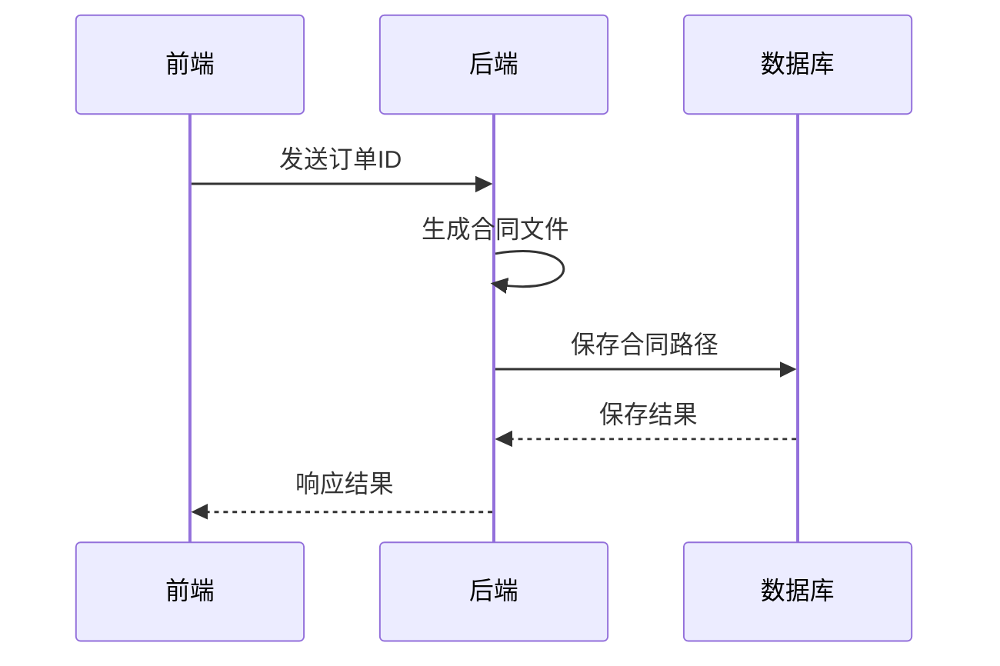

# 房地产信息管理系统详细设计与具体代码实现

## 1.背景介绍

### 1.1 房地产行业概况

房地产行业是国民经济的重要支柱产业,对国家经济发展和社会稳定具有重要影响。随着城市化进程的不断推进和人民生活水平的不断提高,房地产行业也在不断发展壮大。然而,传统的房地产信息管理方式已经无法满足行业发展的需求,迫切需要借助现代信息技术来提高管理效率。

### 1.2 信息化建设需求

房地产企业涉及房源信息、客户信息、交易信息、财务信息等多方面数据,这些数据的采集、存储、管理和分析对企业的决策至关重要。同时,房地产行业内部和外部的信息交互也需要高效的信息系统作为支撑。因此,构建一个高效、安全、可靠的房地产信息管理系统,实现房地产行业的信息化,已经成为当务之急。

### 1.3 系统应用前景

房地产信息管理系统的建设和应用,可以极大提高房地产企业的管理水平和运营效率,优化内部流程,降低运营成本,提升客户体验。同时,通过大数据分析,企业还可以洞察市场动态,制定精准营销策略,开拓新的业务增长点。因此,房地产信息管理系统在提升企业竞争力、促进行业健康发展方面,具有广阔的应用前景。

## 2.核心概念与联系

### 2.1 系统架构

房地产信息管理系统通常采用 B/S (Browser/Server) 或 C/S (Client/Server) 架构,前者以浏览器作为客户端,后者使用专用的客户端软件。考虑到跨平台性和易用性,本系统采用 B/S 架构,使用 Vue.js 作为前端框架,Spring Boot 作为后端框架。



### 2.2 核心功能模块

房地产信息管理系统的核心功能模块包括:

1. **房源信息管理**:包括房源基本信息、房源图片、房源视频等,支持房源信息的增删改查操作。
2. **客户信息管理**:包括客户基本信息、购房意向、交易记录等,支持客户信息的增删改查操作。
3. **交易管理**:包括房源挂牌、订单管理、合同管理等,支持交易流程的全生命周期管理。
4. **财务管理**:包括收支记录、应收应付、报表统计等,支持财务数据的记录和分析。
5. **系统管理**:包括用户管理、角色权限管理、系统日志等,支持系统的安全运维。

### 2.3 数据模型

系统的核心数据模型包括房源、客户、交易、财务等实体,以及它们之间的关联关系。



## 3.核心算法原理具体操作步骤

### 3.1 房源信息管理

#### 3.1.1 房源信息录入

1. 用户在前端界面输入房源基本信息,包括房源标题、地址、面积、户型、楼层等。
2. 上传房源图片和视频文件到文件服务器。
3. 前端将房源基本信息和文件路径发送到后端 API。
4. 后端对数据进行验证,然后将数据持久化到数据库。



#### 3.1.2 房源信息查询

1. 用户在前端界面输入查询条件,如地区、价格范围等。
2. 前端将查询条件发送到后端 API。
3. 后端根据查询条件从数据库中查询匹配的房源信息。
4. 后端将查询结果返回给前端。
5. 前端展示查询结果列表。



### 3.2 客户信息管理

#### 3.2.1 客户信息录入

1. 用户在前端界面输入客户基本信息,如姓名、联系方式等。
2. 前端将客户信息发送到后端 API。
3. 后端对数据进行验证,然后将数据持久化到数据库。


#### 3.2.2 客户信息查询

1. 用户在前端界面输入查询条件,如姓名、联系方式等。
2. 前端将查询条件发送到后端 API。
3. 后端根据查询条件从数据库中查询匹配的客户信息。
4. 后端将查询结果返回给前端。
5. 前端展示查询结果列表。


### 3.3 交易管理

#### 3.3.1 房源挂牌

1. 用户在前端界面选择需要挂牌的房源。
2. 前端将房源ID发送到后端API。
3. 后端更新数据库中该房源的状态为"挂牌"。



#### 3.3.2 订单管理

1. 用户在前端界面选择房源和客户,创建新订单。
2. 前端将订单信息发送到后端API。
3. 后端对订单信息进行验证,然后将订单持久化到数据库。



#### 3.3.3 合同管理

1. 用户在前端界面选择订单,生成合同。
2. 前端将订单ID发送到后端API。
3. 后端根据订单信息生成合同文件。
4. 后端将合同文件路径保存到数据库。



## 4.数学模型和公式详细讲解举例说明

在房地产信息管理系统中,数学模型和公式主要应用于以下几个方面:

### 4.1 房价预测模型

房价预测是房地产信息管理系统的一个重要功能,可以帮助房地产企业制定合理的定价策略,提高房源销售率。常用的房价预测模型包括线性回归模型、决策树模型、神经网络模型等。

以线性回归模型为例,其数学表达式为:

$$
y = \beta_0 + \beta_1 x_1 + \beta_2 x_2 + \cdots + \beta_n x_n + \epsilon
$$

其中:
- $y$ 为房价
- $x_1, x_2, \cdots, x_n$ 为影响房价的因素,如面积、房龄、地段等
- $\beta_0, \beta_1, \cdots, \beta_n$ 为回归系数
- $\epsilon$ 为随机误差项

通过对历史数据的训练,可以得到回归系数的估计值,从而构建出房价预测模型。

### 4.2 房源推荐算法

为了提高房源销售率,系统需要为客户推荐合适的房源。常用的推荐算法包括协同过滤算法、基于内容的推荐算法等。

以基于用户的协同过滤算法为例,其核心思想是:对于目标用户 $u$,找到与其兴趣相似的用户集合 $N(u)$,然后根据这些相似用户对房源 $i$ 的评分,预测目标用户 $u$ 对房源 $i$ 的评分 $r_{ui}$。

$$
r_{ui} = \overline{r_u} + \frac{\sum\limits_{v \in N(u)}(r_{vi} - \overline{r_v})w(u, v)}{\sum\limits_{v \in N(u)}|w(u, v)|}
$$

其中:
- $\overline{r_u}$ 为用户 $u$ 的平均评分
- $r_{vi}$ 为相似用户 $v$ 对房源 $i$ 的评分
- $\overline{r_v}$ 为相似用户 $v$ 的平均评分
- $w(u, v)$ 为用户 $u$ 和 $v$ 之间的相似度

根据预测的评分,系统可以为目标用户推荐评分较高的房源。

### 4.3 财务数据分析

房地产信息管理系统中的财务模块,需要对企业的收支数据进行统计和分析,以支持决策。常用的数据分析方法包括描述性统计分析、相关性分析、回归分析等。

以相关性分析为例,可以计算两个变量之间的相关系数,判断它们是否存在线性相关关系。假设有两个变量 $X$ 和 $Y$,样本数据为 $(x_1, y_1), (x_2, y_2), \cdots, (x_n, y_n)$,则两个变量的相关系数 $r$ 可以计算如下:

$$
r = \frac{\sum\limits_{i=1}^{n}(x_i - \overline{x})(y_i - \overline{y})}{\sqrt{\sum\limits_{i=1}^{n}(x_i - \overline{x})^2} \sqrt{\sum\limits_{i=1}^{n}(y_i - \overline{y})^2}}
$$

其中:
- $\overline{x}$ 和 $\overline{y}$ 分别为 $X$ 和 $Y$ 的样本均值
- $r$ 的取值范围为 $[-1, 1]$,绝对值越大,表示两个变量的线性相关性越强

通过相关性分析,企业可以发现影响收支的关键因素,从而制定相应的调控策略。

## 5.项目实践:代码实例和详细解释说明

### 5.1 房源信息管理模块

#### 5.1.1 房源实体类

```java
@Entity
@Table(name = "house")
public class House {
    @Id
    @GeneratedValue(strategy = GenerationType.IDENTITY)
    private Long id;

    @Column(nullable = false)
    private String title;

    @Column(nullable = false)
    private String address;

    @Column(nullable = false)
    private Double area;

    @Column(nullable = false)
    private Integer roomNum;

    @Column(nullable = false)
    private Integer floor;

    // 其他属性和getter/setter方法
}
```

`House`类是房源信息的实体类,使用JPA注解映射到数据库表。主要属性包括标题、地址、面积、房间数、楼层等。

#### 5.1.2 房源Repository接口

```