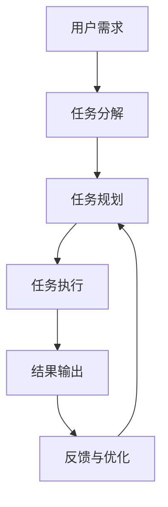

# 打造智能助手:LLMAgentOS如何简化日常任务

## 1. 背景介绍

### 1.1 人工智能助手的兴起

近年来,人工智能技术的快速发展推动了智能助手的崛起。智能助手是一种基于人工智能技术的虚拟助理,能够通过自然语言交互为用户提供各种服务和支持。从智能音箱到手机应用程序,从网页聊天机器人到企业办公助手,智能助手已经渗透到我们生活和工作的方方面面。

随着大型语言模型(LLM)等先进人工智能技术的不断突破,智能助手的能力也在不断提升。它们不仅能够回答简单的查询,还能够进行复杂的任务规划和执行,为用户提供更加智能化和个性化的服务体验。

### 1.2 LLMAgentOS: 一种新型智能助手操作系统

在这种背景下,LLMAgentOS应运而生。它是一种新型的智能助手操作系统,旨在利用大型语言模型的强大能力,为用户提供全方位的智能服务。LLMAgentOS将语言模型视为一种通用的智能代理,能够根据用户的需求动态生成和执行各种任务代理程序。

LLMAgentOS的核心思想是将复杂的任务分解为一系列可由语言模型驱动的子任务,并通过有效的协调和组合,实现高效、灵活的任务执行。这种设计赋予了LLMAgentOS极大的灵活性和可扩展性,使其能够适应各种场景和需求。

## 2. 核心概念与联系

### 2.1 LLMAgentOS的核心概念

为了理解LLMAgentOS的工作原理,我们需要先了解几个核心概念:

1. **语言模型代理(LLM Agent)**: 一种基于大型语言模型构建的通用智能代理,能够理解和执行各种任务。

2. **任务分解**: 将复杂的任务分解为一系列可由语言模型代理执行的子任务。

3. **任务规划**: 根据任务目标和约束条件,生成一系列有序的子任务序列。

4. **任务执行**: 由语言模型代理按照规划好的子任务序列依次执行每个子任务。

5. **反馈与优化**: 根据任务执行的结果和用户反馈,优化任务规划和执行策略。

### 2.2 LLMAgentOS的工作流程

LLMAgentOS的工作流程可以概括为以下几个步骤:

1. 用户提出一个需求或目标。

2. LLMAgentOS将这个需求分解为一系列可执行的子任务。

3. 系统根据任务目标和约束条件,规划出一个合理的子任务执行序列。

4. 语言模型代理按照规划好的序列依次执行每个子任务。

5. 系统将最终结果输出给用户。

6. 根据用户反馈,LLMAgentOS优化任务规划和执行策略,以提高未来的服务质量。

这种基于任务分解和规划的架构,使得LLMAgentOS能够灵活应对各种复杂场景,充分发挥语言模型的泛化能力。

## 3. 核心算法原理具体操作步骤  

### 3.1 任务分解算法

任务分解是LLMAgentOS的核心环节之一。它将一个复杂的任务分解为一系列可由语言模型代理执行的子任务。常见的任务分解算法包括:

1. **基于模板的分解**: 根据预定义的任务模板,将任务拆分为多个子任务。这种方法简单直观,但需要预先定义大量模板,缺乏灵活性。

2. **基于语义分析的分解**: 利用自然语言处理技术对任务进行语义理解,根据语义信息进行分解。这种方法更加灵活,但需要强大的语义理解能力。

3. **基于规划的分解**: 将任务分解视为一个规划问题,利用自动规划算法生成子任务序列。这种方法能够处理复杂的约束条件,但计算代价较高。

4. **基于语言模型的分解**: 直接利用大型语言模型生成子任务序列,利用语言模型的泛化能力进行分解。这是LLMAgentOS所采用的核心方法。

无论采用何种具体算法,任务分解的关键在于将原始任务转化为一个清晰、可执行的子任务序列,为后续的任务规划和执行奠定基础。

### 3.2 任务规划算法

任务规划是LLMAgentOS的另一个核心环节。它根据任务目标和约束条件,生成一个合理的子任务执行序列。常见的任务规划算法包括:

1. **启发式搜索算法**: 利用各种启发式函数(如估价函数)对搜索空间进行剪枝,快速找到一个可行的解。这类算法计算效率较高,但可能无法找到最优解。

2. **图搜索算法**: 将任务规划问题建模为一个状态空间图,利用图搜索算法(如A*算法)找到最优路径。这类算法能够保证找到最优解,但计算代价较高。

3. **约束规划算法**: 将任务规划视为一个约束满足问题,利用约束规划算法生成满足所有约束的最优解。这类算法能够处理复杂的约束条件,但需要专门的求解器支持。

4. **基于语言模型的规划**: 直接利用大型语言模型生成子任务执行序列,充分利用语言模型的泛化能力进行规划。这是LLMAgentOS所采用的核心方法。

任务规划的目标是生成一个满足任务目标和约束条件的高质量子任务序列,为后续的任务执行提供指导。在LLMAgentOS中,任务规划主要依赖于语言模型的生成能力,通过反复优化和迭代,不断提高规划质量。

### 3.3 任务执行与反馈优化

任务执行是LLMAgentOS的最后一个核心环节。语言模型代理根据规划好的子任务序列,依次执行每个子任务,直至完成整个任务。

在执行过程中,LLMAgentOS会持续监控任务进度,并根据实际情况动态调整执行策略。如果某个子任务执行失败或者产生了意外结果,系统会自动重新规划后续的子任务序列,以尽量完成整体目标。

任务执行完成后,LLMAgentOS会收集用户反馈,并基于反馈对任务分解、规划和执行策略进行优化,以提高未来的服务质量。这种持续优化的机制是LLMAgentOS不断进化的关键所在。

总的来说,LLMAgentOS的核心算法原理包括了任务分解、任务规划和任务执行三个主要环节,并通过持续的反馈优化来不断提升系统性能。这种基于语言模型的智能化方法,赋予了LLMAgentOS极大的灵活性和适应性,使其能够应对各种复杂场景。

## 4. 数学模型和公式详细讲解举例说明

在LLMAgentOS的设计和实现中,数学模型和公式扮演着重要的角色。它们为系统的核心算法提供了理论基础和量化支撑。本节将详细介绍几个关键的数学模型和公式。

### 4.1 语言模型生成概率

语言模型是LLMAgentOS的核心驱动力,它能够根据上下文生成连贯的自然语言序列。生成概率是衡量语言模型生成质量的关键指标。

对于一个长度为 $n$ 的序列 $X = (x_1, x_2, \dots, x_n)$,语言模型的生成概率可以表示为:

$$P(X) = \prod_{i=1}^n P(x_i | x_1, x_2, \dots, x_{i-1})$$

其中 $P(x_i | x_1, x_2, \dots, x_{i-1})$ 表示在给定前 $i-1$ 个词的条件下,生成第 $i$ 个词的概率。

在实践中,我们通常使用对数似然作为优化目标:

$$\mathcal{L}(X) = \log P(X) = \sum_{i=1}^n \log P(x_i | x_1, x_2, \dots, x_{i-1})$$

通过最大化对数似然,我们可以训练出一个能够生成高质量序列的语言模型。

### 4.2 任务规划的马尔可夫决策过程建模

在LLMAgentOS中,任务规划可以建模为一个马尔可夫决策过程(MDP)。MDP由一个五元组 $(S, A, P, R, \gamma)$ 表示,其中:

- $S$ 是状态集合,表示任务可能处于的不同状态。
- $A$ 是动作集合,表示可执行的子任务。
- $P(s' | s, a)$ 是状态转移概率,表示在状态 $s$ 执行动作 $a$ 后,转移到状态 $s'$ 的概率。
- $R(s, a)$ 是即时奖励函数,表示在状态 $s$ 执行动作 $a$ 所获得的奖励。
- $\gamma \in [0, 1)$ 是折现因子,用于权衡即时奖励和长期累积奖励。

我们的目标是找到一个策略 $\pi: S \rightarrow A$,使得期望的累积折现奖励最大化:

$$\max_\pi \mathbb{E}_\pi \left[ \sum_{t=0}^\infty \gamma^t R(s_t, a_t) \right]$$

其中 $s_t$ 和 $a_t$ 分别表示第 $t$ 个时间步的状态和动作。

通过建模为MDP,我们可以将任务规划问题转化为一个强化学习问题,并利用各种强化学习算法(如Q-Learning、策略梯度等)来求解最优策略。

### 4.3 反馈优化的在线学习模型

为了持续优化LLMAgentOS的性能,我们需要一个在线学习模型,能够基于用户反馈不断调整系统参数。

假设我们有一个参数化的模型 $f(x; \theta)$,其中 $x$ 是输入,而 $\theta$ 是需要学习的参数。我们的目标是最小化一个损失函数 $\mathcal{L}(y, f(x; \theta))$,其中 $y$ 是期望的输出。

在传统的离线学习中,我们通常在固定的训练集上优化参数 $\theta$。但在LLMAgentOS的场景下,我们需要一种在线学习的方法,能够基于用户反馈持续更新参数。

一种常见的在线学习算法是随机梯度下降(SGD):

$$\theta_{t+1} = \theta_t - \eta_t \nabla_\theta \mathcal{L}(y_t, f(x_t; \theta_t))$$

其中 $\eta_t$ 是学习率,而 $(x_t, y_t)$ 是第 $t$ 个时间步的输入-输出对。

通过不断地基于新的反馈数据更新参数 $\theta$,我们可以使模型 $f$ 持续适应新的环境和需求,从而提高LLMAgentOS的整体性能。

以上是LLMAgentOS中几个关键的数学模型和公式。通过将这些理论模型与实际算法相结合,LLMAgentOS能够实现高效、智能的任务执行和持续优化。

## 5. 项目实践:代码实例和详细解释说明

为了更好地理解LLMAgentOS的工作原理,我们将通过一个简单的示例项目来演示其核心功能。本节将介绍该项目的代码实现,并对关键部分进行详细说明。

### 5.1 项目概述

我们将构建一个基于LLMAgentOS的智能助手,它能够根据用户的需求自动规划和执行一系列子任务。具体来说,我们将实现以下功能:

1. 任务分解: 将用户需求分解为一系列可执行的子任务。
2. 任务规划: 根据任务目标和约束条件,生成一个合理的子任务执行序列。
3. 任务执行: 按照规划好的序列依次执行每个子任务。
4. 反馈优化: 根据任务执行结果和用户反馈,