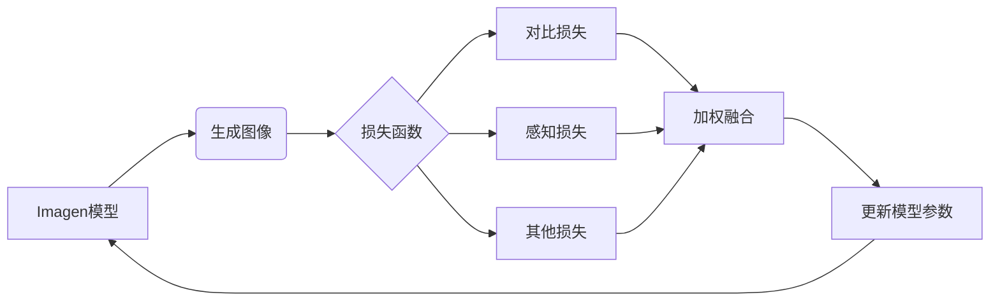

# 损失函数剖析:优化Imagen的生成质量

## 1.背景介绍

### 1.1 生成式人工智能的兴起

近年来,生成式人工智能(Generative AI)技术取得了长足进步,催生了一系列令人惊艳的应用,如文本生成(GPT)、图像生成(Stable Diffusion、DALL-E)、音频生成(AudioCraft)等。其中,Imagen是谷歌于2022年5月推出的一款大型视觉语言模型,能够根据自然语言描述生成逼真的图像。

### 1.2 Imagen的工作原理

Imagen的工作原理是将文本描述编码为一个语义向量,然后将这个向量解码为一个图像。这个过程由一个编码器-解码器架构的transformer模型完成。该模型在大规模文本-图像数据对上进行预训练,学会将文本和图像之间的语义关联映射到一个联合的潜在空间中。

### 1.3 生成质量的重要性

虽然Imagen展现出惊人的图像生成能力,但其生成质量仍有待提高。图像细节、纹理、贴合度等方面还存在一些缺陷,这给最终的视觉体验带来一定影响。因此,提高Imagen生成质量是一个亟待解决的重要课题。

## 2.核心概念与联系

### 2.1 损失函数

在机器学习中,损失函数(Loss Function)用于衡量模型预测与真实值之间的差异。通过最小化损失函数,模型可以学习到最优参数,从而提高预测精度。

对于Imagen这样的生成模型,损失函数的设计尤为关键,因为它直接决定了生成图像的质量。合理的损失函数有助于模型捕捉图像的细节特征,提高图像的真实感。

### 2.2 对比损失

对比损失(Contrastive Loss)是一种常用的损失函数形式,通过最大化正样本对的相似度,最小化负样本对的相似度,来学习样本的语义表示。

在Imagen中,对比损失被用于图文对的对比学习,使得生成的图像与文本描述具有较高的语义一致性。

### 2.3 感知损失

感知损失(Perceptual Loss)是一种基于深度特征的损失函数,通过最小化真实图像与生成图像在深度特征空间的距离,来提高生成图像的感知质量。

Imagen引入了感知损失,以期生成的图像不仅在像素级别逼真,而且在语义和感知层面也更加自然、符合人类视觉体验。

### 2.4 多损失函数融合

由于单一损失函数难以全面捕捉图像质量,Imagen采用了多损失函数融合的策略,将对比损失、感知损失等多种损失函数进行加权融合,以期获得更全面、更优化的生成质量。



## 3.核心算法原理具体操作步骤  

Imagen的损失函数优化过程可以概括为以下几个核心步骤:

### 3.1 文本编码

首先,使用Imagen的文本编码器将输入的自然语言描述编码为一个语义向量。

### 3.2 图像生成  

然后,使用Imagen的图像解码器根据语义向量生成一个初始图像。

### 3.3 计算损失函数

接下来,将生成的图像与真实图像/目标进行对比,计算各种损失函数的值,包括:

1. **对比损失**: 衡量生成图像与文本描述的语义一致性。
2. **感知损失**: 衡量生成图像与真实图像在深度特征层面的差异。
3. **像素损失**: 衡量生成图像与真实图像在像素层面的差异。
4. **其他损失**: 例如平滑损失、多样性损失等,用于约束生成图像的质量。

### 3.4 损失函数加权融合

由于单一损失函数难以全面捕捉图像质量,因此需要对多个损失函数进行加权融合:

$$
\mathcal{L}_{total} = \alpha \mathcal{L}_{contrast} + \beta \mathcal{L}_{perceptual} + \gamma \mathcal{L}_{pixel} + \ldots
$$

其中$\alpha$、$\beta$、$\gamma$等是各损失函数的权重系数,可通过验证集调优获得。

### 3.5 反向传播和参数更新

根据总损失函数$\mathcal{L}_{total}$,使用反向传播算法计算模型参数的梯度,并通过优化器(如Adam)更新模型参数。

### 3.6 迭代优化

重复上述3.2~3.5步骤,使模型在训练数据上不断迭代优化,直至损失函数收敛或达到预期的生成质量。

## 4.数学模型和公式详细讲解举例说明

在Imagen的损失函数优化过程中,涉及到多种损失函数的计算,下面将对其中几种核心损失函数的数学模型进行详细讲解。

### 4.1 对比损失

对比损失旨在最大化正样本对的相似度,最小化负样本对的相似度,从而学习出区分样本语义的表示。具体来说,对于一个文本-图像对$(t, x)$,我们希望它们的表示$f(t)$和$g(x)$在向量空间中尽可能接近;而对于一个文本$t$和一个无关图像$x^{-}$,我们希望$f(t)$和$g(x^{-})$尽可能远离。

对比损失的公式可以表示为:

$$
\mathcal{L}_{contrast}(t, x) = -\log \frac{e^{sim(f(t),g(x))/\tau}}{\sum_{x^{-}}e^{sim(f(t),g(x^{-}))/\tau}}
$$

其中$sim(\cdot,\cdot)$是相似度函数(如余弦相似度),$\tau$是一个温度超参数。分母部分对所有负样本$x^{-}$求和,目的是使正样本对的相似度最大化,同时使负样本对的相似度最小化。

在Imagen中,对比损失被用于约束生成图像与文本描述之间的语义一致性。

### 4.2 感知损失 

感知损失是基于深度特征的损失函数,通过最小化真实图像与生成图像在深度特征空间的距离,来提高生成图像的感知质量。

设$\phi$为一个预训练的特征提取网络(如VGG、InceptionNet等),对于真实图像$x$和生成图像$\hat{x}$,感知损失可以定义为:

$$
\mathcal{L}_{perceptual}(x, \hat{x}) = \sum_{i=1}^{L}\lambda_i\|\phi_i(x) - \phi_i(\hat{x})\|_1
$$

其中$\phi_i$表示网络$\phi$的第$i$层特征映射,$\lambda_i$是对应层的权重系数。通过最小化真实图像和生成图像在多个特征层的$L_1$距离之和,感知损失可以使生成图像在语义和感知层面更加自然。

Imagen综合了多个预训练网络的感知损失,以期获得更全面的感知质量优化。

### 4.3 像素损失

像素损失是最基本的损失函数形式,直接度量真实图像与生成图像在像素层面的差异,常用的有均方误差(MSE)和绝对误差(MAE)等。

对于真实图像$x$和生成图像$\hat{x}$,像素损失可表示为:

$$
\mathcal{L}_{pixel}(x, \hat{x}) = \|x - \hat{x}\|_p
$$

其中$\|\cdot\|_p$表示$L_p$范数,当$p=2$时就是MSE,当$p=1$时就是MAE。

像素损失虽然简单直观,但仅优化像素层面的差异往往难以确保生成图像在语义和感知层面的质量,因此Imagen中像素损失只作为辅助损失函数使用。

### 4.4 其他损失函数

除了上述几种核心损失函数外,Imagen还引入了其他一些损失函数,用于约束和优化生成图像的其他质量指标,例如:

- **平滑损失(Smoothness Loss)**:通过惩罚相邻像素的差异,来增强生成图像的平滑性。
- **多样性损失(Diversity Loss)**: 通过最大化生成图像与训练集图像的差异,来增强生成图像的多样性。
- **注意力一致性损失(Attention Consistency Loss)**: 在transformer架构中,通过约束注意力分布的一致性,来提高模型的泛化能力。

这些损失函数与上述核心损失函数一起,共同构成了Imagen的复合损失函数优化目标。

## 5.项目实践:代码实例和详细解释说明

为了更好地理解Imagen的损失函数优化过程,我们将通过一个简化的代码示例来演示其中的关键步骤。

### 5.1 导入所需库

```python
import torch
import torch.nn as nn
import torch.nn.functional as F
from torchvision import models
```

### 5.2 定义模型

我们使用一个简单的编码器-解码器架构作为Imagen模型。

```python
class Imagen(nn.Module):
    def __init__(self):
        super().__init__()
        # 文本编码器
        self.text_encoder = ...  
        # 图像解码器
        self.image_decoder = ...

    def forward(self, text, image=None):
        # 编码文本
        text_emb = self.text_encoder(text)
        # 生成或重构图像
        image_pred = self.image_decoder(text_emb)
        
        return image_pred
```

### 5.3 定义损失函数

我们定义对比损失、感知损失和像素损失三种核心损失函数。

```python
class ContrastiveLoss(nn.Module):
    def __init__(self, temp=0.1):
        super().__init__()
        self.temp = temp

    def forward(self, text_emb, image_emb, negative_embs):
        ...

class PerceptualLoss(nn.Module):
    def __init__(self):
        super().__init__()
        self.vgg = models.vgg16(pretrained=True).features[:16]
        self.vgg.eval()

    def forward(self, image, image_pred):
        ...
        
def pixel_loss(image, image_pred):
    return F.mse_loss(image_pred, image)
```

### 5.4 损失函数融合与优化

我们将三种损失函数进行加权融合,并使用Adam优化器进行模型参数更新。

```python
imagen = Imagen()
contrast_loss = ContrastiveLoss()
perceptual_loss = PerceptualLoss()
optimizer = torch.optim.Adam(imagen.parameters(), lr=1e-4)

for text, image in dataset:
    image_pred = imagen(text)
    
    # 计算损失函数
    l_contrast = contrast_loss(text_emb, image_emb, negative_embs)
    l_perceptual = perceptual_loss(image, image_pred)
    l_pixel = pixel_loss(image, image_pred)
    loss = l_contrast + 0.1 * l_perceptual + 0.01 * l_pixel
    
    # 反向传播和优化
    optimizer.zero_grad()
    loss.backward()
    optimizer.step()
```

通过上述代码示例,我们可以直观地了解Imagen损失函数优化的核心流程。在实际应用中,代码实现会更加复杂和完备,但基本思路是一致的。

## 6.实际应用场景

Imagen及其损失函数优化策略在以下场景中具有广泛的应用前景:

### 6.1 内容创作

通过输入自然语言描述,Imagen可以生成高质量的图像内容,为创意设计、视觉艺术、营销广告等领域提供强大的辅助工具。

### 6.2 视觉辅助

Imagen可以根据文字描述生成所需的图像,为视觉障碍人士提供有力的辅助,帮助他们更好地理解和感知外部世界。

### 6.3 教育和培训

通过生成逼真的图像示例,Imagen可以应用于教学辅助、技能培训等场景,提高学习效率和体验。

### 6.4 虚拟现实和游戏

Imagen可以根据场景描述实时生成高保真的虚拟环境,为虚拟现实、游戏等领域带来全新的体验。

### 6.5 科研应用

在计算机视觉、自然语言处理等研究领域,Imagen可以用于数据增强、模型评估等任务,