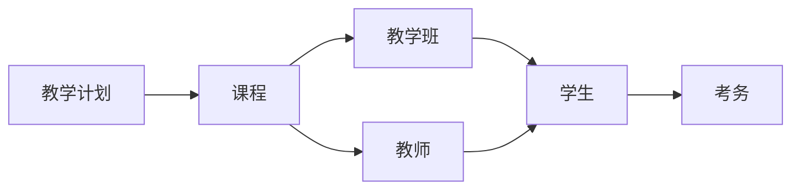

# 教务管理系统设计与实现

## 1.背景介绍

随着教育信息化进程的不断推进,教务管理系统作为学校教学管理工作的核心支撑系统,其重要性日益凸显。教务管理系统集教学计划、课程管理、考务管理、成绩管理等多种功能于一体,是学校教学活动的"神经中枢"。设计并实现一套高效、安全、可扩展的教务管理系统,对于规范教学秩序、提高教学质量、优化教学资源配置等具有重要意义。

### 1.1 教务管理系统的作用

教务管理系统的主要作用包括:

- 规范教学流程,实现教学计划与实际教学活动的高效对接
- 集中管理教学资源,实现合理分配与共享利用
- 自动化处理大量教务事务,减轻教师的工作负担
- 实时监控教学进度,及时发现并解决教学问题
- 为教学质量评估和教学决策提供数据支持

### 1.2 教务管理系统的发展历程

教务管理系统的发展大致经历了三个阶段:

1. **手工作业阶段**: 教务工作完全依赖人工处理,工作量大、效率低下。

2. **单机软件阶段**: 开发专用的教务管理软件,但系统封闭、数据难共享。

3. **网络化阶段**: 基于Web和数据库技术,实现跨校区、跨系统的数据共享和协同办公。

当前,教务管理系统正向云化、移动化、智能化方向发展。

## 2.核心概念与联系

### 2.1 核心概念

教务管理系统涉及以下几个核心概念:

- **教学计划**: 包括专业培养方案、课程设置、教学进程安排等。
- **课程**: 包括课程基本信息、任课教师、上课时间地点、考核方式等。
- **教学班**: 按专业年级或其他方式组织的学生班级。
- **教师**: 承担课程教学任务的教师,包括基本信息、教学任务等。
- **学生**: 参加课程学习的对象,包括基本信息、选课情况、成绩等。
- **考务**: 包括考试安排、阅卷评分、成绩登记等。

### 2.2 核心概念关系

上述核心概念之间存在着紧密的关联关系,如下图所示:



- 教学计划决定开设哪些课程
- 课程面向教学班授课,由教师执教
- 学生按教学班分组,修读相应课程
- 学生成绩通过考务环节产生

## 3.核心算法原理具体操作步骤

教务管理系统的核心算法主要包括以下几个方面:

### 3.1 课程排课算法

课程排课是教务管理的一个关键环节,需要在有限的教室资源条件下,为所有课程安排合理的上课时间和教室,避免时间和教室的冲突。这是一个典型的约束满足问题(Constraint Satisfaction Problem,CSP),可以使用启发式搜索算法来求解。

常用的课程排课算法包括:

1. **图着色算法**: 将课程看作图的顶点,时间冲突的课程之间连一条边,则排课问题转化为图的节点着色问题。

2. **遗传算法**: 以一种可行的排课方案为一个个体,通过选择、交叉、变异等遗传操作,逐代进化出更优的排课方案。

3. **蚁群算法**: 模拟蚂蚁在寻找食物路径时释放信息素的行为,逐步找到满足约束条件的最优排课方案。

无论采用何种算法,一般都需要先对课程、教师、教室等实体建模,明确各种硬性约束(如不能同时占用同一教室)和软性约束(如尽量避免教师课程连排),然后在满足约束条件的前提下,优化一些目标函数(如教室利用率、教师满意度等)。

### 3.2 学生选课算法

对于非必修课程,允许学生在规定时间内自主选择修读课程。此时需要一种选课算法,根据学生的选课意愿、课程容量、选课规则等,自动或辅助手动安排每个学生的选课结果。

常见的学生选课算法有:

1. **先到先得算法**: 根据学生选课时间的先后顺序,依次满足学生的选课要求。简单直观,但可能导致后选的学生无法选到心仪课程。

2. **智能优化算法**: 将选课过程建模为一个约束优化问题,利用遗传算法、模拟退火等智能算法,在满足诸如课程容量、先修课程等约束条件的前提下,优化学生的整体选课满意度。

3. **拍卖机制算法**: 将有限的课程资源看作商品,学生用一定的"虚拟货币"竞价选课,根据拍卖结果分配课程资源。这种机制具有较强的策略鲁棒性。

### 3.3 自动阅卷算法

在线上或纸质考试结束后,需要对学生的答卷进行评阅,并给出最终的分数。当答卷数量较多时,自动阅卷算法可以大幅提高阅卷效率。

常见的自动阅卷算法包括:

1. **智能图像识别**: 对手写的试卷图像进行预处理、字符切分、特征提取,再将提取的特征输入机器学习模型,识别出答案内容。

2. **信息抽取技术**: 针对非选择题的主观题,使用自然语言处理技术抽取出答案中的关键信息,再与标准答案进行对比,给出分数。

3. **相似度计算**: 将学生答案与标准答案进行分词、向量化,计算两者之间的相似度分数,相似度越高,分数越高。

此外,自动阅卷算法还需要具备防作弊功能,如检测答案复制、引用非法资源等行为。

上述算法均需要大量标注数据进行模型训练,并对特殊情况如图像、公式等进行专门处理,因此实现一个高精度的自动阅卷系统仍是一个挑战。

## 4.数学模型和公式详细讲解举例说明

在教务管理系统中,需要使用数学模型对一些核心问题进行形式化描述,为算法设计和系统优化提供理论支撑。

### 4.1 课程排课模型

课程排课问题可以用一个四元组 $\langle C,R,P,S\rangle$ 来表示:

- $C = \{c_1,c_2,...,c_n\}$ 是待排课程集合
- $R = \{r_1,r_2,...,r_m\}$ 是可用教室集合  
- $P = \{p_1,p_2,...,p_k\}$ 是可用时间段集合
- $S$ 是排课方案的集合

排课算法的目标是找到一个 $s^* \in S$,使得一定的目标函数 $f(s^*)$ 达到极值(如最大化教室利用率),同时满足以下约束条件:

$$
\begin{align*}
&\forall c_i,c_j \in C, i \neq j\\
&\begin{cases}
s(c_i).r \neq s(c_j).r \quad \text{或} \\
s(c_i).p \cap s(c_j).p = \emptyset
\end{cases}
\end{align*}
$$

上式表示任意两门不同课程,要么被安排在不同教室,要么上课时间不冲突。此外,还需考虑教师的时间冲突、学生的课程冲突等其他约束条件。

### 4.2 学生选课模型

设有 $n$ 名学生 $U=\{u_1,u_2,...,u_n\}$, $m$ 门可选课程 $C=\{c_1,c_2,...,c_m\}$。对每门课程 $c_j$,规定了课程容量 $q_j$。

定义学生 $u_i$ 对课程 $c_j$ 的喜好程度为 $w_{ij}$,则学生的整体选课满意度可以用效用函数 $U(x)$ 来表达:

$$
U(x) = \sum_{i=1}^n\sum_{j=1}^m w_{ij}x_{ij}
$$

其中,若学生 $u_i$ 被分配到课程 $c_j$,则 $x_{ij}=1$;否则 $x_{ij}=0$。

在满足以下约束条件的前提下,选课算法需要最大化效用函数 $U(x)$:

$$
\begin{align*}
& \sum_{i=1}^nx_{ij} \leq q_j,\quad \forall j=1,2,...,m \\
& \sum_{j=1}^mx_{ij} \leq \overline{q}_i, \quad \forall i=1,2,...,n\\
& x_{ij} \in \{0,1\}, \quad \forall i=1,2,...,n; j=1,2,...,m
\end{align*}
$$

第一个约束条件保证每门课程的选课人数不超过课程容量;第二个约束条件规定每个学生选课门数的上限;第三个约束条件要求 $x_{ij}$ 为0-1变量。

### 4.3 自动阅卷模型

自动阅卷的核心是计算学生答案与标准答案之间的相似度分数。常用的相似度计算模型有:

1. **词袋模型(Bag of Words)**

   将答案拆分为单词序列,分别统计每个单词在答案中出现的次数,得到答案的词频向量。则两个答案的相似度可以用它们词频向量的余弦相似度来计算:

   $$sim(A,B) = \frac{\vec{A} \cdot \vec{B}}{|\vec{A}||\vec{B}|}$$

2. **主题模型(Topic Model)** 

   基于主题模型(如LDA)提取答案的关键主题分布,计算两个答案主题分布之间的相似度,如KL散度:

   $$D_{KL}(P||Q) = \sum_x P(x)\log\frac{P(x)}{Q(x)}$$

3. **序列匹配模型**

   将答案看作一个序列,采用序列匹配模型(如编辑距离、序列到序列模型等)直接计算两个答案序列之间的相似度。

除相似度计算外,自动阅卷模型还需要考虑答案长度、关键词命中、上下文语义等多种因素,并对异常答案进行识别,因此实现一个高精度的自动阅卷系统是一个具有挑战的任务。

## 5.项目实践: 代码实例和详细解释说明

为了更好地理解教务管理系统的设计与实现,我们基于Python语言和Django Web框架,开发了一个简单的教务管理系统示例项目。该项目的代码结构如下:

```
project/
├── courses/
│   ├── models.py
│   ├── views.py
│   └── ...
├── students/
│   ├── models.py
│   ├── views.py
│   └── ...
├── teachers/
│   ├── models.py
│   ├── views.py
│   └── ...
├── project/
│   ├── settings.py
│   ├── urls.py
│   └── ...
├── templates/
└── manage.py
```

### 5.1 Models

我们首先在 `models.py` 文件中定义了系统的核心模型:

```python
# courses/models.py
from django.db import models

class Course(models.Model):
    name = models.CharField(max_length=100)
    code = models.CharField(max_length=10, unique=True)
    credits = models.IntegerField()
    # 其他字段...

class Section(models.Model):
    course = models.ForeignKey(Course, on_delete=models.CASCADE)
    teacher = models.ForeignKey('teachers.Teacher', on_delete=models.CASCADE)
    room = models.CharField(max_length=20)
    time_slot = models.CharField(max_length=50)
    # 其他字段...

# students/models.py 
from django.contrib.auth.models import User

class Student(models.Model):
    user = models.OneToOneField(User, on_delete=models.CASCADE)
    student_id = models.CharField(max_length=20, unique=True)
    major = models.CharField(max_length=100)
    # 其他字段...

class Enrollment(models.Model):
    student = models.ForeignKey(Student, on_delete=models.CASCADE)
    section = models.ForeignKey('courses.Section', on_delete=models.CASCADE)
    grade = models.IntegerField(null=True, blank=True)
    # 其他字段...
```

这些