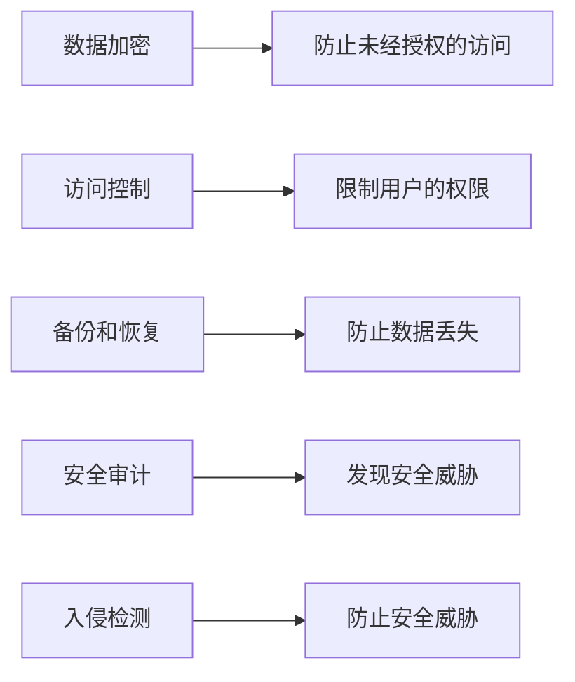

## 1.背景介绍

在当今的信息化社会，数据已经成为一种重要的资产，而数据安全则是我们需要严肃对待的问题。无论是个人还是企业，都需要对数据进行保护，防止数据的丢失、泄露或篡改。这就需要我们构建一套坚不可摧的数据安全堡垒。

## 2.核心概念与联系

在构建数据安全堡垒的过程中，我们需要理解以下几个核心概念：数据加密、访问控制、备份和恢复、安全审计，以及入侵检测。

数据加密是通过算法将数据转化为密文，只有拥有密钥的人才能解密。访问控制是通过设置权限，控制用户对数据的访问。备份和恢复是为了防止数据丢失，定期将数据备份，并在需要时恢复。安全审计是通过记录和分析系统的活动，以检测可能的安全威胁。入侵检测是通过分析系统的异常行为，以检测可能的入侵。

这些概念之间的联系是：数据加密可以防止未经授权的访问，访问控制可以进一步限制用户的权限，备份和恢复可以防止数据丢失，安全审计和入侵检测可以及时发现和防止安全威胁。



## 3.核心算法原理具体操作步骤

为了实现数据安全，我们需要采取一系列的操作步骤。

首先，我们需要使用加密算法对数据进行加密。常用的加密算法有AES、RSA等。加密的过程可以分为密钥生成、加密和解密三个步骤。在密钥生成步骤中，我们需要生成一对密钥，一个用于加密，一个用于解密。在加密步骤中，我们使用加密密钥将数据转化为密文。在解密步骤中，我们使用解密密钥将密文转化为原始数据。

然后，我们需要设置访问控制策略，限制用户对数据的访问。这可以通过设置用户的权限，例如读权限、写权限和执行权限等。我们还可以设置访问控制列表，明确指定哪些用户可以访问哪些数据。

接下来，我们需要定期备份数据，并在数据丢失时进行恢复。备份可以通过复制数据到另一个存储介质实现。恢复则是将备份的数据复制回原来的位置。

最后，我们需要进行安全审计和入侵检测。安全审计可以通过记录和分析系统的活动实现。入侵检测则是通过分析系统的异常行为，例如突然的流量增加、未知的登录尝试等。

## 4.数学模型和公式详细讲解举例说明

在数据加密过程中，我们常常使用到的是公钥加密算法，例如RSA算法。RSA算法是基于数论的一种加密算法，其安全性依赖于大数分解的困难性。在RSA算法中，我们首先需要选择两个大的质数$p$和$q$，然后计算他们的乘积$n=pq$，以及欧拉函数$\phi(n)=(p-1)(q-1)$。然后，我们需要选择一个公钥$e$，满足$1<e<\phi(n)$，且$e$和$\phi(n)$互质。最后，我们需要计算私钥$d$，满足$ed\equiv 1 \pmod{\phi(n)}$。

在RSA算法中，加密和解密的过程可以用以下的公式表示：

加密：$c\equiv m^e \pmod{n}$

解密：$m\equiv c^d \pmod{n}$

其中，$m$是明文，$c$是密文。

## 5.项目实践：代码实例和详细解释说明

在Python中，我们可以使用`rsa`库来实现RSA加密。以下是一个简单的示例：

```python
import rsa

# 生成密钥
(public_key, private_key) = rsa.newkeys(512)

# 加密
message = 'Hello, world!'
encrypted_message = rsa.encrypt(message.encode(), public_key)

# 解密
decrypted_message = rsa.decrypt(encrypted_message, private_key).decode()

print(decrypted_message)  # 输出：Hello, world!
```

在这个示例中，我们首先使用`rsa.newkeys`函数生成一对密钥。然后，我们使用`rsa.encrypt`函数对消息进行加密。最后，我们使用`rsa.decrypt`函数对密文进行解密。

## 6.实际应用场景

数据安全的实践可以广泛应用于各个领域，例如金融、医疗、教育等。在金融领域，银行和支付公司需要保护用户的账户信息和交易记录。在医疗领域，医院和保健机构需要保护病人的医疗记录。在教育领域，学校和教育机构需要保护学生的成绩和个人信息。

## 7.工具和资源推荐

在实践数据安全时，我们可以使用以下的工具和资源：

1. 加密库：例如Python的`rsa`库、Java的`javax.crypto`库等。
2. 访问控制工具：例如Linux的`chmod`命令、Windows的权限管理等。
3. 备份工具：例如`rsync`、`tar`等。
4. 安全审计工具：例如`auditd`、`osquery`等。
5. 入侵检测系统：例如`Snort`、`Suricata`等。

## 8.总结：未来发展趋势与挑战

随着技术的发展，数据安全面临着新的挑战。一方面，随着大数据和云计算的发展，数据量正在呈现爆炸性增长，这使得数据安全更加复杂和困难。另一方面，随着网络攻击手段的日益狡猾和多样，数据安全也需要不断提高防御能力。

在未来，我们需要继续研究和开发新的数据安全技术，例如同态加密、量子加密等。同时，我们也需要提高数据安全的意识，将数据安全融入到每一个人、每一个组织的日常生活和工作中。

## 9.附录：常见问题与解答

1. 问：为什么需要数据加密？
   答：数据加密可以防止未经授权的访问，只有拥有密钥的人才能解密。

2. 问：什么是访问控制？
   答：访问控制是通过设置权限，控制用户对数据的访问。

3. 问：如何备份和恢复数据？
   答：备份可以通过复制数据到另一个存储介质实现。恢复则是将备份的数据复制回原来的位置。

4. 问：什么是安全审计和入侵检测？
   答：安全审计是通过记录和分析系统的活动，以检测可能的安全威胁。入侵检测是通过分析系统的异常行为，以检测可能的入侵。

作者：禅与计算机程序设计艺术 / Zen and the Art of Computer Programming