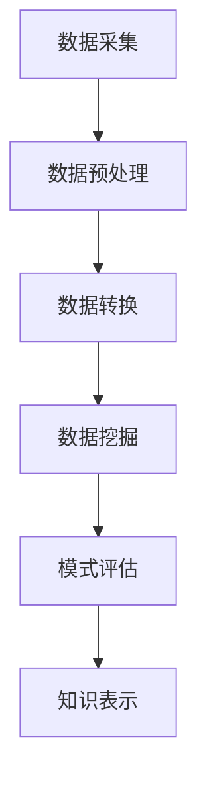
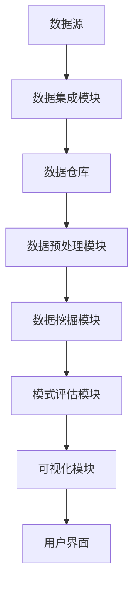

# 数据挖掘 原理与代码实例讲解

## 1.背景介绍

### 1.1 数据时代的来临

在当今时代，数据已经成为了一种新型的战略资源。随着互联网、物联网、移动互联网等新兴技术的快速发展,大量的数据不断产生和积累。这些海量的数据蕴含着巨大的价值,但同时也给数据的存储、处理和分析带来了巨大的挑战。如何从这些庞大的数据中发现有价值的信息和知识,成为了企业和组织面临的一个重大课题。

数据挖掘(Data Mining)作为一门新兴的跨学科技术,应运而生。它集成了数据库技术、统计学、机器学习、模式识别、人工智能等多个领域的理论与方法,旨在从大规模的数据中发现隐藏的、人类事先未知的有趣模式和知识。

### 1.2 数据挖掘的重要性

数据挖掘在当今社会有着广泛的应用前景,例如:

- **电子商务**:通过分析用户的购买行为,发现潜在的消费模式,从而进行个性化推荐和营销策略制定。
- **金融行业**:利用数据挖掘技术发现欺诈行为,评估贷款风险,优化投资组合等。
- **医疗健康**:通过分析患者的症状、检查结果等数据,发现疾病的潜在规律,提高诊断准确率。
- **网络安全**:检测网络入侵行为,识别垃圾邮件,发现网络攻击模式等。
- **科学研究**:从大量观测数据中发现新的理论和规律,推动科学进步。

总的来说,数据挖掘技术能够帮助我们更好地理解数据背后的信息,从而制定出更加科学、合理的决策,提高工作效率和生活质量。

## 2.核心概念与联系

在深入探讨数据挖掘的原理和算法之前,我们需要先了解一些基本概念。

### 2.1 数据挖掘的任务类型

数据挖掘的主要任务可以分为以下几类:

1. **关联分析(Association Analysis)**: 发现事物之间存在的关联关系,常用于购物篮分析和网页关联推荐。
2. **分类(Classification)**: 根据已有的训练数据,构建分类模型,对新的数据进行分类。广泛应用于疾病诊断、信用评估等领域。
3. **聚类(Clustering)**: 根据数据对象之间的相似性,将数据划分为多个簇,发现数据的内在结构。
4. **异常检测(Anomaly Detection)**: 识别数据集中与绝大多数模式不符的异常对象,如欺诈行为、网络入侵等。
5. **回归分析(Regression Analysis)**: 建立自变量与因变量之间的数学模型,用于预测连续型变量的值。

### 2.2 数据挖掘的过程

一个完整的数据挖掘过程通常包括以下几个主要步骤:

1. **数据采集**: 从各种数据源(如数据库、文件、网络等)中收集所需的数据。
2. **数据预处理**: 对原始数据进行清洗、集成、转换等操作,以提高数据质量。
3. **数据转换**: 将预处理后的数据转换为适合数据挖掘算法的格式。
4. **数据挖掘**: 应用特定的算法,从数据中发现有趣的模式和知识。
5. **模式评估**: 评估挖掘出的模式的质量和可靠性,必要时返回上一步进行优化。
6. **知识表示**: 将挖掘出的知识用可视化的方式呈现,便于理解和应用。

### 2.3 数据挖掘的系统架构

一个完整的数据挖掘系统通常由以下几个主要模块组成:

1. **数据源**: 各种异构的数据源,如关系数据库、文件、网络流数据等。
2. **数据集成模块**: 从多个数据源中提取相关数据,进行清洗、转换和集成。
3. **数据仓库**: 存储经过集成的数据,为数据挖掘提供数据支持。
4. **数据预处理模块**: 对数据进行过滤、缺失值处理、规范化等预处理操作。
5. **数据挖掘模块**: 包含各种数据挖掘算法,用于发现隐藏的模式和知识。
6. **模式评估模块**: 评估挖掘出的模式的质量和可靠性,对模式进行解释和可视化。
7. **可视化模块**: 将挖掘出的知识以图形、报表等形式呈现。
8. **用户界面**: 提供友好的交互界面,方便用户操作和查看结果。

## 3.核心算法原理具体操作步骤

数据挖掘涉及多种算法,这些算法根据不同的任务类型和数据特征而有所区别。下面我们将介绍几种常用的数据挖掘算法及其原理和具体操作步骤。

### 3.1 关联规则挖掘算法

#### 3.1.1 Apriori算法

Apriori算法是关联规则挖掘中最经典的算法之一,它通过迭代的方式发现频繁项集,然后从频繁项集中产生关联规则。算法的基本思想是:如果一个项集是频繁的,那么它的所有子集也必须是频繁的。算法具体步骤如下:

1. 设定最小支持度阈值minsup。
2. 扫描数据集,统计每个项的支持度,构建频繁1项集。
3. 利用频繁k项集构建候选(k+1)项集。
4. 扫描数据集,计算候选(k+1)项集的支持度,构建频繁(k+1)项集。
5. 重复步骤3和4,直到无法找到更大的频繁项集为止。
6. 从频繁项集中产生关联规则,并计算规则的置信度。

Apriori算法的优点是思路简单,容易实现;缺点是当数据集较大时,需要大量的候选集测试,效率较低。

#### 3.1.2 FP-Growth算法

FP-Growth(Frequent Pattern Growth)算法是另一种高效的关联规则挖掘算法。它通过构建FP树(Frequent Pattern Tree)来存储数据集的频繁信息,从而避免了大量的候选集测试,提高了算法效率。算法步骤如下:

1. 扫描数据集,统计每个项的支持度,构建头指针表。
2. 按照支持度从大到小的顺序,对每条交易重排序。
3. 构建FP树,每个节点存储项名和计数值。
4. 从FP树中挖掘频繁模式:
   a. 从头指针表中获取每个项的条件模式基。
   b. 构建该项的条件FP树。
   c. 从条件FP树中递归挖掘频繁模式。
5. 根据频繁模式生成关联规则。

FP-Growth算法通过压缩数据结构和划分搜索空间的策略,大大减少了搜索次数,因此在处理大数据集时效率更高。

### 3.2 决策树算法

决策树是一种常用的分类和回归算法,它通过构建决策树模型对数据进行预测。决策树算法的基本思想是:根据训练数据集属性值,递归地构建决策树,使得每个叶节点具有相同的类别标记。常用的决策树算法包括ID3、C4.5和CART等。以ID3算法为例,其基本步骤如下:

1. 计算数据集的熵值,作为无序度量。
2. 对于每个属性,计算其信息增益,选择信息增益最大的属性作为根节点。
3. 根据选定的属性,将数据集划分为若干子集。
4. 对于每个子集,重复步骤1~3,构建子树。
5. 当子集的所有实例属于同一类别或没有剩余属性时,生成叶节点。

决策树算法的优点是模型可解释性强,可视化效果好;缺点是容易过拟合,对数据的质量要求较高。

### 3.3 聚类算法

聚类是一种无监督学习算法,其目标是将数据对象划分为多个簇,使得簇内对象相似度高,簇间对象相似度低。常用的聚类算法包括K-Means、层次聚类等。以K-Means算法为例,其基本步骤如下:

1. 随机选取k个初始质心。
2. 计算每个数据对象到各个质心的距离,将其分配到最近的簇。
3. 重新计算每个簇的质心。
4. 重复步骤2~3,直到质心不再发生变化或达到最大迭代次数。

K-Means算法的优点是算法简单、高效;缺点是对初始质心的选取敏感,需要事先指定簇的数量。

### 3.4 神经网络算法

神经网络是一种模拟生物神经网络的算法,广泛应用于分类、回归和聚类等任务。常用的神经网络算法包括BP神经网络、卷积神经网络等。以BP神经网络为例,其基本原理是通过误差反向传播算法对网络进行训练,使得网络输出值与期望输出值之间的误差最小化。算法步骤如下:

1. 初始化网络权值和阈值。
2. 输入训练样本,计算网络输出。
3. 计算输出层节点的误差。
4. 反向传播误差,计算隐层节点的误差。
5. 调整网络权值和阈值,使误差最小化。
6. 重复步骤2~5,直到网络收敛或达到最大迭代次数。

神经网络算法的优点是对非线性问题有很强的拟合能力;缺点是训练时间较长,容易陷入局部最小值。

## 4.数学模型和公式详细讲解举例说明

数据挖掘中涉及许多数学概念和模型,下面我们将详细讲解其中一些重要的公式和模型。

### 4.1 熵和信息增益

熵(Entropy)是信息论中的一个重要概念,用于度量数据的无序程度。在决策树算法中,熵被用于选择最优特征进行数据划分。给定数据集D,其熵的计算公式为:

$$
Ent(D) = -\sum_{i=1}^{n}p_ilog_2p_i
$$

其中,n是类别的个数,$p_i$是D中属于第i类的比例。

信息增益(Information Gain)则表示由于特征A的引入而使得数据集D的无序程度降低的程度。其计算公式为:

$$
Gain(D,A) = Ent(D) - \sum_{v=1}^{V}\frac{|D^v|}{|D|}Ent(D^v)
$$

其中,V是特征A的可取值个数,$D^v$是D中特征A取值为v的子集,$|D^v|/|D|$是$D^v$的权重。

以一个简单的例子说明:假设有一个数据集包含6条记录,其中3条为"是"类,3条为"否"类。则数据集D的熵为:

$$
Ent(D) = -\frac{3}{6}log_2\frac{3}{6} - \frac{3}{6}log_2\frac{3}{6} = 1
$$

如果根据特征"年龄"将数据集划分为两个子集,其中一个子集包含2条"是"类记录和1条"否"类记录,另一个子集包含1条"是"类记录和2条"否"类记录,则信息增益为:

$$
Gain(D, \text{年龄}) = 1 - \frac{3}{6}\left(-\frac{2}{3}log_2\frac{2}{3} - \frac{1}{3}log_2\frac{1}{3}\right) - \frac{3}{6}\left(-\frac{1}{3}log_2\frac{1}{3} - \frac{2}{3}