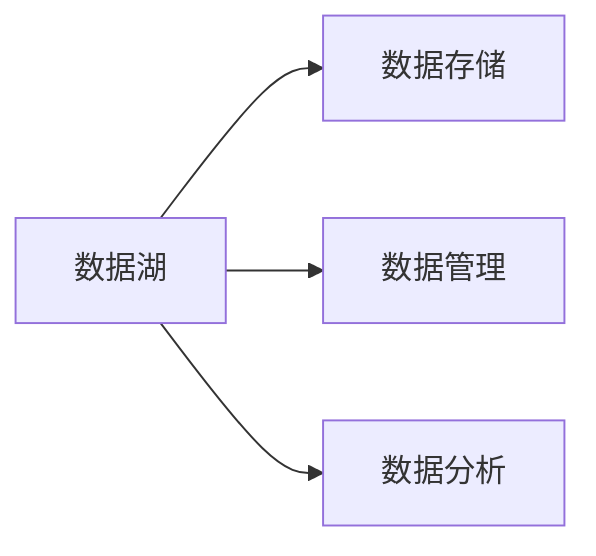

## 1. 背景介绍
在我们进入大数据时代，企业和组织正在寻找更有效的方法来存储、管理和分析庞大的数据集。数据湖作为一种新型的数据存储和管理策略，正在逐渐受到越来越多企业的青睐。数据湖可以存储所有类型的数据，包括结构化、半结构化和非结构化数据，并且可以在需要的时候进行灵活的分析。这种灵活性和广泛的应用范围使得数据湖成为了解决大数据问题的一种重要工具。

## 2. 核心概念与联系
数据湖是一个集中存储企业所有数据的系统，无论这些数据是结构化的还是非结构化的，都可以存储在数据湖中。这个系统可以扩展到存储大量的数据，并且可以快速地进行数据查询和分析。数据湖的核心概念包括数据存储、数据管理和数据分析。



## 3. 核心算法原理具体操作步骤
数据湖的核心算法原理包括数据存储、数据清洗、数据查询和数据分析。首先，数据湖需要将来自不同源的数据存储在一个集中的地方。然后，需要对这些数据进行清洗，以删除重复的数据、修正错误的数据和填充缺失的数据。接下来，可以使用SQL或者其他查询语言来查询数据湖中的数据。最后，可以使用各种数据分析工具和算法来分析数据，以得到有价值的信息和知识。

## 4. 数学模型和公式详细讲解举例说明
在数据湖中，我们通常会使用一些数学模型来描述和分析数据。例如，我们可以使用统计模型来描述数据的分布情况，使用机器学习模型来预测未来的数据，或者使用图模型来描述数据之间的关系。这些模型通常会涉及到一些数学公式。例如，线性回归模型的公式为：

$$y = ax + b$$

其中，$y$是因变量，$x$是自变量，$a$和$b$是模型的参数。我们可以通过最小化预测值和真实值之间的差异来求解$a$和$b$。

## 5. 项目实践：代码实例和详细解释说明
在实际的项目中，我们可以使用各种工具和语言来操作数据湖。例如，我们可以使用Python的pandas库来清洗和分析数据，使用SQL来查询数据，使用Apache Hadoop和Apache Spark来处理大规模的数据。

以下是一个使用Python和pandas进行数据清洗的例子：

```python
import pandas as pd

# 读取数据
df = pd.read_csv('data.csv')

# 删除重复的数据
df = df.drop_duplicates()

# 修正错误的数据
df['age'] = df['age'].apply(lambda x: x if x >= 0 else 0)

# 填充缺失的数据
df['name'] = df['name'].fillna('Unknown')
```

## 6. 实际应用场景
数据湖在许多领域都有广泛的应用，例如金融、电子商务、医疗、教育等。在金融领域，银行和保险公司可以使用数据湖来存储和分析交易数据、客户数据和风险数据。在电子商务领域，电商平台可以使用数据湖来存储和分析用户行为数据、商品数据和销售数据。在医疗领域，医院和研究机构可以使用数据湖来存储和分析病人数据、疾病数据和医疗资源数据。

## 7. 工具和资源推荐
在操作数据湖时，有许多优秀的工具和资源可以帮助我们。例如，Apache Hadoop和Apache Spark是处理大规模数据的优秀工具，Python和R是进行数据分析的优秀语言，SQL是查询数据的优秀语言，Tableau和Power BI是进行数据可视化的优秀工具。

## 8. 总结：未来发展趋势与挑战
随着大数据的发展，数据湖的重要性将越来越高。未来的数据湖将更加强大，能够存储更多的数据，支持更多的数据类型，提供更快的查询和分析能力。同时，数据湖也面临着一些挑战，例如数据安全、数据质量和数据治理等。

## 9. 附录：常见问题与解答
Q: 数据湖和数据仓库有什么区别？
A: 数据湖和数据仓库都是存储数据的系统，但是它们的目标和方式有所不同。数据湖存储所有类型的原始数据，适合进行探索性的分析。数据仓库存储经过清洗和整理的数据，适合进行业务报告和决策支持。

Q: 数据湖的数据安全如何保证？
A: 数据湖的数据安全可以通过多种方式来保证，例如使用访问控制来限制谁可以访问哪些数据，使用加密来保护数据的隐私，使用备份和恢复来防止数据丢失。

作者：禅与计算机程序设计艺术 / Zen and the Art of Computer Programming
