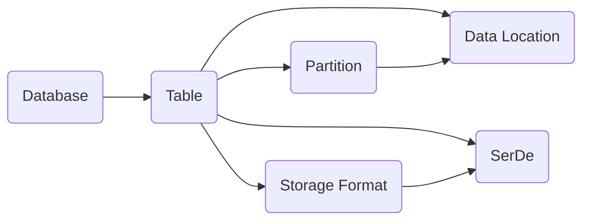

# 数据源配置：连接Hive的第一步

## 1. 背景介绍

在大数据时代,数据已经成为企业的核心资产之一。企业需要高效地存储、管理和分析海量数据,以支持业务决策和创新。Apache Hive作为Hadoop生态系统中的重要组件,为我们提供了一种简单方便的方式来管理和查询海量数据。

要使用Hive处理数据,首先需要配置数据源,建立Hive与数据存储系统之间的连接。数据源配置是Hive使用的第一步,也是至关重要的一步。本文将深入探讨Hive数据源配置的方方面面,帮助读者掌握这一关键技能。

### 1.1 Hive简介

Apache Hive是一个构建在Hadoop之上的数据仓库工具,可以将结构化的数据文件映射为一张数据库表,并提供SQL查询功能,允许用户通过类SQL语句查询分析存储在HDFS或者HBase等Hadoop存储中的数据。

Hive的特点包括:

- 提供了一系列数据ETL工具,可用来对数据进行清洗、转换、加载
- 可以存储和分析TB、PB级别的海量数据
- 支持用户自定义函数(UDF),扩展数据处理能力
- 支持多种不同的数据存储系统,如HDFS、HBase、Amazon S3等
- 使用类SQL语言HiveQL进行数据查询,降低学习门槛

### 1.2 为什么需要配置数据源

Hive本身并不存储数据,它依赖于外部的数据存储系统。因此,要使用Hive处理数据,必须事先配置好数据源,告诉Hive去哪里访问数据。

配置数据源主要有以下几个目的:

1. 建立Hive表与实际数据文件的映射关系,使Hive可以找到并解析数据
2. 指定数据文件的存储格式、列分隔符等信息,使Hive能够正确读取数据
3. 优化Hive表的存储方式,提高查询性能,如采用ORC、Parquet列式存储格式
4. 支持数据跨集群访问,实现数据共享,如使用HCatalog

总之,没有配置数据源,Hive就无法访问数据,也就无法发挥其数据仓库的功能。可以说,数据源配置是Hive使用的基础。

## 2. 核心概念与关联

要配置Hive数据源,需要理解一些核心概念,它们相互关联,共同定义了数据源的属性。

### 2.1 数据库(Database)

在Hive中,数据库类似于关系型数据库中的命名空间(namespace),用于组织和隔离不同的表。一个Hive实例可以创建多个数据库。

数据库的元数据信息通常存储在关系型数据库中,如MySQL、Derby。创建数据库时,需要指定元数据的存储位置。

### 2.2 表(Table)

Hive将结构化数据映射为数据库表,一个表对应一个数据文件目录。表中定义了数据的schema,包括:

- 列(Column):数据由多个列组成,列名和数据类型决定了表的结构
- 分区(Partition):数据可按照某些列的值进行分区,提高查询性能
- 存储格式:如TextFile、SequenceFile、ORC、Parquet等,决定了数据文件的内部组织方式
- 数据所在位置:数据文件在HDFS、S3等文件系统中的路径

### 2.3 外部表(External Table)

外部表指向已经存在于HDFS等文件系统中的数据,数据由外部系统管理。删除外部表不会删除实际数据。适用于共享数据的场景。

### 2.4 分区(Partition)

Hive表可以根据一个或多个列的值进行分区,每个分区对应数据目录下的一个子目录。分区可以加快查询速度,减少全表扫描。

### 2.5 存储格式

Hive支持多种数据文件存储格式,主要有:

- TextFile:默认格式,数据以纯文本形式存储,可指定列分隔符
- SequenceFile:二进制键值对序列文件,可分块压缩
- ORC:优化的行列存储,可按列读取,压缩率高
- Parquet:列式存储,可按列读取,压缩率高

### 2.6 SerDe

SerDe(Serializer and Deserializer的缩写)用于数据的序列化与反序列化。Hive使用SerDe从文件中读取数据,将其转换为内部行对象,也可将查询结果写回文件。

常用的SerDe有:

- LazySimpleSerDe:默认的SerDe,可以处理大多数基于行的文本数据文件
- OpenCSVSerDe:处理CSV格式文件
- AvroSerDe:处理Avro格式文件
- ParquetHiveSerDe:处理Parquet格式文件

### 2.7 概念关联

下图展示了上述核心概念之间的关系:



从图中可以看出:

- 一个Database包含多个Table
- 一个Table可以分为多个Partition
- 一个Table有特定的Storage Format
- Storage Format和SerDe相互关联
- Partition和Data Location相互关联

理解了这些概念和关系,就可以进一步学习数据源的配置流程和方法了。

## 3. 数据源配置流程

Hive数据源配置通常包括以下几个步骤:

### 3.1 创建数据库

在Hive中创建一个数据库,指定元数据存储的位置。例如:

```sql
CREATE DATABASE IF NOT EXISTS mydb
  COMMENT 'My first Hive database'
  LOCATION '/user/hive/mydb'
  WITH DBPROPERTIES ('creator'='John', 'date'='2023-05-31');
```

这里创建了一个名为`mydb`的数据库,元数据存储在HDFS的`/user/hive/mydb`目录下,并指定了一些数据库属性。

### 3.2 创建表

在数据库中创建表,指定表的列结构、数据存储格式、数据所在位置等信息。例如:

```sql
CREATE EXTERNAL TABLE IF NOT EXISTS mydb.users(
  id INT,
  name STRING,
  age INT
)
COMMENT 'User profile data'
PARTITIONED BY (dt STRING)
ROW FORMAT DELIMITED
  FIELDS TERMINATED BY ','
STORED AS TEXTFILE
LOCATION '/data/users';
```

这里在`mydb`数据库中创建了一个名为`users`的外部表,表中有`id`、`name`、`age`三列,以及一个`dt`分区列。数据以逗号分隔的文本格式存储,数据文件位于HDFS的`/data/users`目录下。

### 3.3 导入数据

将数据文件上传到表的数据目录下,可以使用HDFS命令或Hive的LOAD DATA语句。例如:

```sql
LOAD DATA INPATH '/user/john/data/users.txt' 
OVERWRITE INTO TABLE mydb.users
PARTITION (dt='2023-05-31');
```

这里将`/user/john/data/users.txt`文件导入到`users`表的`dt='2023-05-31'`分区下,如果分区已存在则覆盖。

### 3.4 修改表属性

可以使用ALTER TABLE语句修改表的某些属性,如添加分区、更改存储格式、修改SerDe等。例如:

```sql
ALTER TABLE mydb.users ADD PARTITION (dt='2023-06-01');

ALTER TABLE mydb.users SET FILEFORMAT ORC;

ALTER TABLE mydb.users SET SERDE 'org.apache.hadoop.hive.ql.io.orc.OrcSerde';
```

这里为`users`表添加了一个新分区,并将存储格式改为ORC,SerDe改为OrcSerde。

### 3.5 删除表或数据库

使用DROP TABLE或DROP DATABASE语句可以删除表或数据库。例如:

```sql
DROP TABLE IF EXISTS mydb.users;

DROP DATABASE IF EXISTS mydb CASCADE;
```

注意删除数据库时要使用CASCADE关键字,否则需要先删除库中的表。

## 4. 数据源配置的最佳实践

### 4.1 使用外部表

对于数据量很大、需要共享的数据集,建议使用外部表。删除外部表不会删除实际数据,可以避免误操作。

### 4.2 按需分区

对于经常按某些列过滤查询的大表,可以考虑按这些列进行分区。分区可以大幅提高查询速度。但是分区也不宜过多,否则会产生大量的小文件。

### 4.3 选择合适的存储格式

对于结构化程度高、访问频繁的表,建议采用ORC或Parquet列式存储格式。列式存储可以跳过不需要的列,压缩率也更高。

对于结构化程度低的数据,可以使用TextFile或SequenceFile格式。

### 4.4 使用压缩

数据压缩可以减少存储空间和I/O开销,提高查询性能。Hive支持多种压缩格式,如Gzip、Snappy、Lzo等。

在创建表时可以指定压缩格式,例如:

```sql
CREATE TABLE mydb.users(...)
STORED AS ORC
TBLPROPERTIES ("orc.compress"="SNAPPY");
```

这里将`users`表存储为ORC格式,并采用Snappy压缩。

### 4.5 定期优化表

对于频繁更新的表,可以定期运行`MSCK REPAIR TABLE`命令修复分区元数据。

对于有很多小文件的表,可以定期运行`ALTER TABLE CONCATENATE`命令合并小文件。

## 5. 数据源配置的示例代码

下面是一些使用Hive DDL和DML语句配置和管理数据源的示例代码:

```sql
-- 创建数据库
CREATE DATABASE IF NOT EXISTS mydb;

-- 创建外部分区表
CREATE EXTERNAL TABLE IF NOT EXISTS mydb.users(
  id INT,
  name STRING,
  age INT
)
PARTITIONED BY (dt STRING)
ROW FORMAT DELIMITED
  FIELDS TERMINATED BY ','
STORED AS TEXTFILE
LOCATION '/data/users';

-- 添加分区
ALTER TABLE mydb.users ADD PARTITION (dt='2023-05-31');

-- 导入数据
LOAD DATA INPATH '/user/john/data/users.txt' 
OVERWRITE INTO TABLE mydb.users
PARTITION (dt='2023-05-31');

-- 修改表存储格式
ALTER TABLE mydb.users SET FILEFORMAT ORC;

-- 修改表SerDe
ALTER TABLE mydb.users SET SERDE 'org.apache.hadoop.hive.ql.io.orc.OrcSerde';

-- 删除分区
ALTER TABLE mydb.users DROP PARTITION (dt='2023-05-31');

-- 删除表
DROP TABLE IF EXISTS mydb.users;

-- 删除数据库
DROP DATABASE IF EXISTS mydb CASCADE;
```

这些代码涵盖了数据源配置的常见操作,可以作为参考。

## 6. 数据源配置在实际项目中的应用

在实际的数据仓库和数据分析项目中,Hive数据源配置发挥着重要作用。下面是一些典型的应用场景:

### 6.1 数据ETL

在ETL(Extract-Transform-Load)过程中,需要将原始数据从各种来源抽取到Hive表中,再进行清洗、转换和集成。Hive外部表可以很方便地接入不同格式和来源的数据文件。

### 6.2 数据分析

数据分析师和数据科学家可以使用Hive SQL对数据进行即席查询和分析。通过合理的表设计和分区,可以优化查询性能,加速分析过程。

### 6.3 数据归档

对于需要长期保存的历史数据,可以定期将其从在线系统中卸载到Hive表中归档。Hive的列式存储和压缩功能可以大幅节省归档数据的存储空间。

### 6.4 数据共享

Hive表可以跨集群共享,不同的应用和用户可以访问同一份数据。外部表和HCatalog工具可以方便地实现跨平台的数据共享。

## 7. 数据源配置工具和资源

除了手写DDL和DML语句,还有一些工具和资源可以帮助我们更高效地进行Hive数据源配置:

### 7.1 Hive Beeline

Beeline是Hive的命令行客户端,支持交互式执行Hive SQL语句。它提供了自动补全、历史命令、多行编辑等方便的功能。

### 7.2 Hue

Hue是一个开源的Hadoop UI系统,提供了友好的Web界面,可以在浏览器中执行Hive查询,管理Hive数据库和表。

### 7.3 Ambari Hive View

Ambari是Hadoop管理平台,它的Hive View提供了可视化的Hive