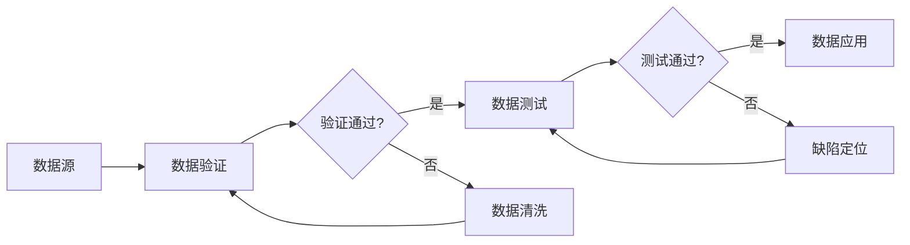

# 数据验证与数据测试原理与代码实战案例讲解

## 1. 背景介绍

在软件开发和数据处理过程中,数据验证和数据测试是两个不可或缺的重要环节。数据验证主要关注数据的正确性、完整性和一致性,而数据测试则侧重于检验数据在实际应用场景中的可用性和性能表现。随着大数据时代的到来,海量、多源异构数据给数据验证和测试带来了新的挑战。本文将深入探讨数据验证与测试的原理,并结合实际代码案例进行讲解。

### 1.1 数据质量的重要性

#### 1.1.1 数据驱动决策的基石

#### 1.1.2 提升业务运营效率

#### 1.1.3 保障系统稳定运行

### 1.2 数据验证与测试面临的挑战

#### 1.2.1 数据量急剧增长

#### 1.2.2 数据类型日益多样

#### 1.2.3 数据实时性要求提高

## 2. 核心概念与联系

### 2.1 数据验证

#### 2.1.1 定义与目的

#### 2.1.2 数据有效性验证

#### 2.1.3 数据完整性验证 

#### 2.1.4 数据一致性验证

### 2.2 数据测试

#### 2.2.1 定义与目的

#### 2.2.2 功能测试

#### 2.2.3 性能测试

#### 2.2.4 安全测试

### 2.3 两者的关系与区别

#### 2.3.1 验证与测试的联系

#### 2.3.2 侧重点不同

#### 2.3.3 实施阶段有别

## 3. 核心算法原理具体操作步骤

### 3.1 数据探索分析(EDA)

#### 3.1.1 数据类型识别

#### 3.1.2 缺失值检测

#### 3.1.3 异常值检测

### 3.2 数据清洗

#### 3.2.1 缺失值处理

#### 3.2.2 异常值处理

#### 3.2.3 不一致数据修正

### 3.3 数据转换

#### 3.3.1 数据归一化

#### 3.3.2 数据离散化

#### 3.3.3 数据编码

## 4. 数学模型和公式详细讲解举例说明

### 4.1 统计学检验方法

#### 4.1.1 假设检验

$H_0: \mu=\mu_0 \quad vs. \quad H_1: \mu \neq \mu_0$

#### 4.1.2 相关性分析

$$r=\frac{\sum_{i=1}^n(x_i-\bar{x})(y_i-\bar{y})}{\sqrt{\sum_{i=1}^n(x_i-\bar{x})^2}\sqrt{\sum_{i=1}^n(y_i-\bar{y})^2}}$$

#### 4.1.3 回归分析

$$y=\beta_0+\beta_1x_1+\beta_2x_2+...+\beta_px_p+\epsilon$$

### 4.2 数据挖掘算法

#### 4.2.1 关联规则

$Support(A \Rightarrow B) = \frac{A \cup B}{N}$

$Confidence(A \Rightarrow B) = \frac{Support(A \cup B)}{Support(A)}$ 

#### 4.2.2 聚类分析

$$J=\sum_{j=1}^k\sum_{i=1}^{n_j}||x_i^{(j)}-c_j||^2$$

#### 4.2.3 异常检测

$$p(x)=\frac{1}{(2\pi)^{n/2}|\Sigma|^{1/2}}exp(-\frac{1}{2}(x-\mu)^T\Sigma^{-1}(x-\mu))$$

## 5. 项目实践:代码实例和详细解释说明

### 5.1 数据探索分析

```python
import pandas as pd

# 读取数据
df = pd.read_csv('data.csv')

# 查看数据基本信息
print(df.info())

# 描述性统计
print(df.describe())

# 检查缺失值
print(df.isnull().sum())
```

### 5.2 数据清洗

```python
# 删除缺失值过多的列
df.drop(['column_name'], axis=1, inplace=True)

# 填充缺失值
df.fillna(df.mean(), inplace=True)

# 移除重复记录
df.drop_duplicates(inplace=True) 

# 处理异常值
Q1 = df.quantile(0.25)
Q3 = df.quantile(0.75)
IQR = Q3 - Q1
df = df[~((df < (Q1 - 1.5 * IQR)) | (df > (Q3 + 1.5 * IQR))).any(axis=1)]
```

### 5.3 数据转换

```python
from sklearn.preprocessing import MinMaxScaler, LabelEncoder

# 归一化
scaler = MinMaxScaler()
df_scaled = pd.DataFrame(scaler.fit_transform(df), columns=df.columns)

# 类别编码
le = LabelEncoder()
df['category'] = le.fit_transform(df['category'])
```

## 6. 实际应用场景

### 6.1 金融风控

#### 6.1.1 反欺诈模型

#### 6.1.2 信用评分

### 6.2 电商推荐

#### 6.2.1 用户画像

#### 6.2.2 个性化推荐

### 6.3 工业制造

#### 6.3.1 设备异常检测

#### 6.3.2 产品质量预测

## 7. 工具和资源推荐

### 7.1 数据探索分析工具

#### 7.1.1 Pandas

#### 7.1.2 Matplotlib/Seaborn

### 7.2 数据质量检测平台

#### 7.2.1 Apache Griffin

#### 7.2.2 Deequ

### 7.3 数据合成测试工具

#### 7.3.1 Faker

#### 7.3.2 DataFactory

## 8. 总结:未来发展趋势与挑战

### 8.1 趋势展望

#### 8.1.1 智能化自动化测试

#### 8.1.2 数据治理体系建设

### 8.2 亟待解决的问题

#### 8.2.1 数据安全与隐私保护

#### 8.2.2 复杂场景下的数据验证

#### 8.2.3 模型可解释性

## 9. 附录:常见问题与解答

### Q1: 如何选择数据测试工具?

### A1: 需要考虑数据量大小、实时性需求、集成难易程度等因素,建议多做调研对比。

### Q2: 数据探索分析的关键步骤有哪些?

### A2: 关键步骤包括识别数据类型、检测缺失值和异常值、分析变量间关系等。

### Q3: 异常检测常用哪些算法?

### A3: 常用算法有统计学方法(如3-Sigma)、基于距离的方法(如KNN)、基于密度的方法(如LOF)等。

作者:禅与计算机程序设计艺术 / Zen and the Art of Computer Programming



以上是一篇关于数据验证与测试的技术博客文章。文章首先介绍了数据质量的重要性以及面临的挑战,然后阐述了数据验证和测试的核心概念与区别联系。接着重点讲解了数据探索分析、清洗、转换等关键步骤的算法原理,并辅以数学公式加以说明。同时给出了Python代码实例,演示了如何利用Pandas等工具库进行数据预处理。文章还列举了几个数据验证与测试的实际应用场景,提供了一些主流工具和学习资源供读者参考。最后总结了该领域的未来发展趋势和亟待解决的问题,并解答了几个常见问题。

希望这篇文章能够帮助读者系统全面地了解数据验证与测试的相关知识,并能在实际工作中灵活运用。数据质量是一切数据应用的基石,只有建立在高质量数据之上,后续的数据分析、数据挖掘等工作才能取得令人满意的结果。因此,及早在数据生命周期的早期阶段引入验证和测试机制,对保障数据质量、提高数据价值具有重要意义。